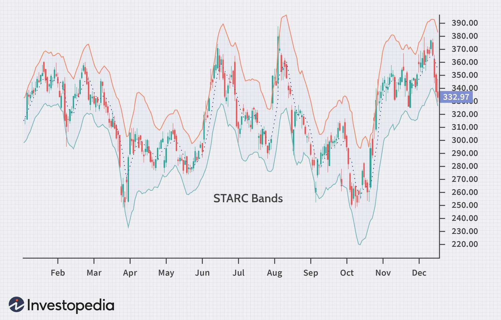

The world of trading is intricate and multifaceted, encompassing a wide array of strategies and tools aimed at optimizing the investment process. Among these tools, STARC Bands hold a prominent position as a technical analysis indicator that aids traders in pinpointing potential buy and sell opportunities. Developed to function effectively in various market conditions, STARC Bands offer insights into market volatility and potential trend reversals, making them a valuable component in a trader's analytical toolkit.

STARC Bands are particularly significant in algorithmic trading, where automated systems rely on robust indicators to make precise trading decisions. Their ability to adapt to both trending and ranging markets endows them with a versatility that enhances trading strategies. By including STARC Bands as part of a well-rounded analytical approach, traders can refine their decision-making processes and manage risks more effectively.



In this article, we will explore the nuances of STARC Bands, examining how they function within trading systems and how they stack up against other widely-used indicators. By gaining a comprehensive understanding of STARC Bands, traders can equip themselves with strategies that improve their investment outcomes, offering a path to better navigating the volatile and ever-changing financial markets.

## Table of Contents

## What Are STARC Bands?

Developed by Manning Stoller, STARC (Stoller Average Range Channel) Bands are a technical analysis tool used to identify potential buy and sell opportunities in financial markets. STARC Bands involve two bands that are placed around a simple moving average (SMA) of an asset's price. These bands are designed to reflect the price's volatility over a set period.

The upper and lower STARC Bands are constructed using the Average True Range (ATR), a measure that evaluates market volatility. The formulas for calculating the bands are as follows:

- **Upper STARC Band**: $\text{SMA} + (\text{Multiplier} \times \text{ATR})$
- **Lower STARC Band**: $\text{SMA} - (\text{Multiplier} \times \text{ATR})$

Typically, a trader will choose an SMA length, often between five to ten periods, and a multiplier for the ATR, commonly set at two, but adjustable according to the strategy pursued. The SMA provides a smoothed average price over the selected time frame, while the ATR quantifies the degree of price movement, providing insight into the level of [volatility](/wiki/volatility-trading-strategies).

STARC Bands serve a critical function by aiding traders in identifying potential entry and [exit](/wiki/exit-strategy) points in both trending and ranging markets. When assessing price movements in relation to the bands, traders can gain insights into market conditions. For instance, if the price approaches or breaches the upper band, it could indicate overbought conditions or a potential trend reversal downward. Conversely, if the price nears or surpasses the lower band, it might signal oversold conditions or a possible upward trend reversal.

By analyzing price actions concerning the STARC Bands, traders can gauge market volatility and discern potential trend reversals, thereby enhancing their decision-making ability in dynamic market environments. This helps in constructing more informed and strategically sound trading plans.

## How to Calculate STARC Bands

To calculate STARC (Stoller Average Range Channel) Bands, follow these steps:

1. **Select a Simple Moving Average (SMA) Length**: Choose the length for your simple moving average. A common range for this is between five to ten periods. The SMA is used as the central line around which the STARC Bands are plotted.

2. **Determine an Average True Range (ATR) Multiple**: Select a multiplier for the Average True Range, typically set at two. However, this multiplier can be adjusted to fit specific trading strategies, altering the sensitivity and width of the bands.

3. **Calculate the SMA and ATR**: 
   - For the SMA, sum the closing prices of the asset over the selected number of periods and divide by the number of periods.
   - For the ATR, which measures market volatility, calculate it over the same number of periods. The ATR is the average of the true ranges over a specific period. The true range is the largest of the following: 
     - Current high minus the current low
     - Absolute value of the current high minus the previous close
     - Absolute value of the current low minus the previous close

4. **Compute the Upper and Lower STARC Bands**:
   - **Upper STARC Band**: Add the product of the ATR and the multiplier to the SMA:
$$
     \text{Upper STARC Band} = \text{SMA} + (\text{Multiplier} \times \text{ATR})

$$
   - **Lower STARC Band**: Subtract the product of the ATR and the multiplier from the SMA:
$$
     \text{Lower STARC Band} = \text{SMA} - (\text{Multiplier} \times \text{ATR})

$$

5. **Adjust the Calculations with New Data**: As new price data becomes available, recalibrate the SMA and ATR to update the STARC Bands. This ensures that the bands remain relevant to the current market conditions.

These calculations can be efficiently performed using programming tools like Python. Here's a basic example in Python:

```python
import pandas as pd

def calculate_starc_bands(prices, sma_length=5, atr_multiplier=2):
    # Calculate SMA
    sma = prices.rolling(window=sma_length).mean()

    # Calculate True Range
    high_low = prices['High'] - prices['Low']
    high_close = abs(prices['High'] - prices['Close'].shift())
    low_close = abs(prices['Low'] - prices['Close'].shift())
    true_range = pd.DataFrame({'HL': high_low, 'HC': high_close, 'LC': low_close}).max(axis=1)

    # Calculate ATR
    atr = true_range.rolling(window=sma_length).mean()

    # Calculate Upper and Lower STARC Bands
    upper_starc_band = sma + (atr * atr_multiplier)
    lower_starc_band = sma - (atr * atr_multiplier)

    return upper_starc_band, lower_starc_band

# Assuming `data` is a DataFrame containing columns 'Close', 'High', 'Low'
# upper_band, lower_band = calculate_starc_bands(data)
```

This approach allows traders to integrate STARC Bands into their trading systems, providing critical insights into potential support and resistance levels.

## STARC Bands vs. Other Indicators

STARC Bands and Bollinger Bands are both well-regarded tools in technical analysis, each providing unique insights into market dynamics through the use of price bands around a moving average. Despite their similarities in structure, the methods used to calculate these bands differ significantly, offering traders a choice depending on their analytical preferences and trading styles.

Bollinger Bands utilize a moving average along with bands above and below the average at a specified standard deviation level. The mathematical representation of Bollinger Bands can be expressed as:

- Upper Band: $\text{SMA}(n) + k \times \sigma$
- Lower Band: $\text{SMA}(n) - k \times \sigma$

Where:
- $\text{SMA}(n)$ is the simple moving average of the last $n$ periods.
- $k$ is the number of standard deviations, commonly set at two.
- $\sigma$ is the standard deviation of the asset's price over the same $n$ periods.

This method uses the standard deviation as a measure of volatility, allowing the bands to expand and contract with price fluctuations, providing insights into both volatility and potential overbought or oversold conditions.

In contrast, STARC Bands revolve around the concept of the average true range (ATR) to determine the width of the bands. The STARC Band formula is as follows:

- Upper Band: $\text{SMA}(n) + ( \text{Multiplier} \times \text{ATR}(n) )$
- Lower Band: $\text{SMA}(n) - ( \text{Multiplier} \times \text{ATR}(n) )$

Here, the ATR is used to accommodate volatility differently by capturing the true range of price movements, which can be more reflective of drastic price changes than standard deviation.

The differences in calculations mean that Bollinger Bands focus more on statistical [dispersion](/wiki/dispersion-trading) around a mean price, making them suitable for identifying extreme price conditions. Meanwhile, STARC Bands, by using the ATR, are adept at indicating more typical price channels and potential reversals based on broader market movements.

Understanding these distinctions allows traders to select the most appropriate tool according to their strategy. While Bollinger Bands may serve those looking to react to statistical anomalies, STARC Bands might appeal to traders focusing on [trend following](/wiki/trend-following) and mean reversion based on typical price ranges.

Interestingly, both STARC and Bollinger Bands can complement each other when used together. By combining these indicators, traders can gather a more comprehensive view of market conditions, leveraging the strengths of both standard deviation and ATR-based analyses to refine their trading decisions. Integrating these tools enables a multifaceted approach, allowing for more tailored trading strategies that harness the unique insights each provides.

## Limitations of STARC Bands

The continual movement of STARC Bands, a technical analysis tool designed to help traders identify potential market entry and exit points, can lead to false signals, particularly in highly volatile markets. This is because the price of an asset can frequently touch or even exceed the bands without indicating a definitive trend reversal or continuation, leading traders to make premature trading decisions. 

Relying solely on STARC Bands for trading decisions carries inherent risks due to their susceptibility to false signals. It is advisable for traders to incorporate supplementary analysis to enhance the reliability of trading signals generated by STARC Bands. For example, they can be combined with other technical indicators such as the Moving Average Convergence Divergence (MACD) or Relative Strength Index (RSI) to cross-verify signals and improve trading decision accuracy. 

Furthermore, the use of proper risk management tools, such as stop-loss orders, can help mitigate potential losses resulting from false signals. Stop-loss orders act as a protective mechanism, automatically closing a position when the price reaches a predetermined level, thus limiting a trader's exposure to unfavorable market movements. The combination of multiple indicators and strategic use of stop-loss measures can effectively reduce the risk associated with false signals from STARC Bands in trading.

## STARC Bands in Algorithmic Trading

STARC Bands can be effectively incorporated into [algorithmic trading](/wiki/algorithmic-trading) systems, serving as a robust tool for automating buy and sell decisions. These algorithms apply the defined rules of trading consistently, which can lead to increased efficiency and reduced emotional biases typically associated with manual trading.

Algorithmic systems using STARC Bands assess the position of asset prices relative to the upper and lower bands. When prices move near the upper band, algorithms might trigger sell signals, while prices approaching the lower band could initiate buy signals. These automated responses allow for swift execution, often unachievable through manual trading.

A critical aspect of employing STARC Bands within algorithmic trading is [backtesting](/wiki/backtesting). Backtesting involves simulating a trading strategy using historical price data to determine its potential effectiveness. For STARC-based strategies, backtesting helps assess how well the STARC Bands can predict market behaviors under various conditions. Using historical data, the strategy can be optimized to enhance performance by adjusting parameters such as the moving average length or the ATR multiplier.

Here's a simple Python example to illustrate the concept of backtesting a STARC Bands strategy:

```python
import pandas as pd
import numpy as np

# Example historical price data
data = {'Price': [100, 102, 101, 105, 107, 106, 108, 110, 112, 111]}
df = pd.DataFrame(data)

# Parameters for STARC Bands
sma_length = 5
atr_multiplier = 2

# Calculate SMA
df['SMA'] = df['Price'].rolling(window=sma_length).mean()

# Calculate ATR
df['TR'] = df['Price'].diff().abs()
df['ATR'] = df['TR'].rolling(window=sma_length).mean()

# Calculate upper and lower STARC Bands
df['Upper_STARC'] = df['SMA'] + (atr_multiplier * df['ATR'])
df['Lower_STARC'] = df['SMA'] - (atr_multiplier * df['ATR'])

# Determine buy/sell signals
df['Signal'] = np.where(df['Price'] >= df['Upper_STARC'], 'Sell', 
                        np.where(df['Price'] <= df['Lower_STARC'], 'Buy', 'Hold'))

print(df)
```

This code outlines a simplified backtesting approach. It calculates the simple moving average (SMA) and the average true range (ATR), and subsequently computes the upper and lower STARC Bands to generate buy, sell, or hold signals.

Overall, integrating STARC Bands in algorithmic trading systems allows for systematic and disciplined investment approaches. By applying backtested and optimized strategies, traders can gain insights into probable market behaviors, which contributes to better-informed decision-making and potentially enhanced trading performance.

## Conclusion: Enhancing Trading Strategies

STARC Bands are a versatile tool for observing market volatility and identifying potential trend reversals. By integrating these bands into broader trading strategies, traders can enhance their decision-making processes and manage risks more effectively. The ability of STARC Bands to provide visual cues about overbought or oversold conditions makes them particularly valuable in both trending and range-bound markets.

For traders looking to optimize their strategies, dynamically adjusting the parameters of STARC Bands, such as the simple moving average (SMA) length and the average true range (ATR) multiplier, can be beneficial. For example, selecting a shorter SMA might be suitable for highly volatile markets, whereas a longer SMA could work better in stable markets. 

Moreover, combining STARC Bands with other technical indicators or [fundamental analysis](/wiki/fundamental-analysis) can provide a more comprehensive market perspective. The use of supplemental analysis helps minimize the risk of false signals, which can occur due to constant fluctuations in market prices.

Incorporating STARC Bands into algorithmic trading systems also holds potential. With their straightforward calculation, they can be coded easily into algorithms to automate buy and sell decisions, ensuring consistent application of trading rules. Here is a simple Python script for calculating STARC Bands:

```python
def calculate_starc_bands(prices, sma_length=5, atr_multiplier=2):
    import pandas as pd

    data = pd.DataFrame(prices, columns=['Price'])
    data['SMA'] = data['Price'].rolling(window=sma_length).mean()
    data['ATR'] = data['Price'].diff().rolling(window=sma_length).apply(lambda x: x.abs().mean())

    data['Upper Band'] = data['SMA'] + (atr_multiplier * data['ATR'])
    data['Lower Band'] = data['SMA'] - (atr_multiplier * data['ATR'])

    return data[['Upper Band', 'Lower Band']]

prices = [24, 25, 23, 26, 28, 27, 30, 32, 31]
starc_bands = calculate_starc_bands(prices)
print(starc_bands)
```

Backtesting such strategies can provide insights into probable market behaviors, aiding in strategy refinement and optimization. This underscores the importance of continuous learning and adaptation in trading to navigate the dynamic market environment effectively. By staying informed and flexible, traders can harness the full potential of STARC Bands to enhance their trading strategies.

## References & Further Reading

[1]: Aronson, D. R. (2007). ["Evidence-Based Technical Analysis: Applying the Scientific Method and Statistical Inference to Trading Signals."](https://onlinelibrary.wiley.com/doi/book/10.1002/9781118268315) Wiley.

[2]: Pring, M. J. (2002). ["Technical Analysis Explained: The Successful Investor's Guide to Spotting Investment Trends and Turning Points."](https://www.amazon.com/Technical-Analysis-Explained-Fifth-Successful/dp/0071825177) McGraw-Hill.

[3]: Murphy, J. J. (1999). ["Technical Analysis of the Financial Markets: A Comprehensive Guide to Trading Methods and Applications."](https://archive.org/details/technicalanalysi0000murp) New York Institute of Finance.

[4]: de Prado, M. L. (2018). ["Advances in Financial Machine Learning."](https://www.amazon.com/Advances-Financial-Machine-Learning-Marcos/dp/1119482089) Wiley.

[5]: Eldridge, S., & Gifford, D. (2014). ["Mastering Algorithmic Trading."](https://www.jstor.org/stable/43612951) Lincoln Bay.