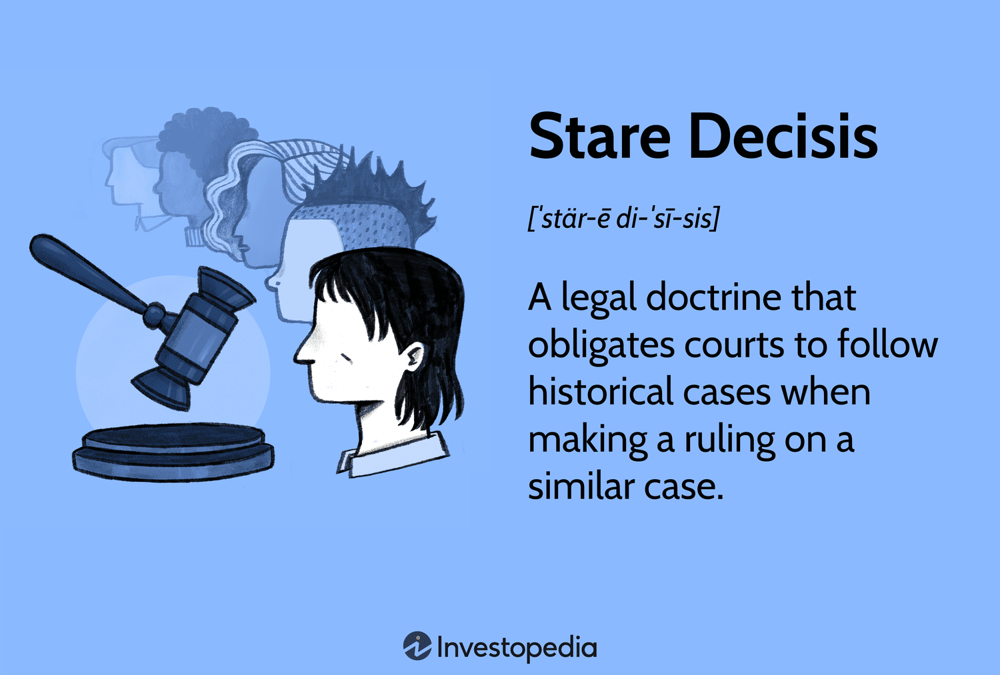

Stare decisis is a fundamental principle in common law legal systems, signifying the doctrine to "stand by things decided." It mandates that courts adhere to previously established legal precedents when making decisions in new cases. This doctrine is crucial for maintaining consistency and predictability in the legal system. By obliging courts to follow earlier rulings, stare decisis ensures that similar facts yield similar legal outcomes, fostering a stable and coherent body of law. In this way, individuals and businesses can make informed decisions, confident in the stability of legal interpretations over time.

Legal precedent, a byproduct of stare decisis, is indispensable not only for coherence but also for shaping the evolution of law. Through precedents, judicial rulings contribute to a cumulative body of law that evolves as courts interpret and apply past decisions to new situations. This dynamic allows the law to adapt while preserving a crucial balance between change and stability. Notably, precedents can be overturned in response to societal shifts or advances in understanding, allowing the judiciary to correct prior misjudgments or adapt to new contexts, albeit in a controlled and predictable manner.

Algorithmic trading represents a significant aspect of modern financial markets, leveraging computer algorithms to execute trading decisions. This method has revolutionized financial markets by increasing efficiency and speed. However, it also presents unique challenges in terms of regulation. As financial technologies rapidly evolve, legal systems must ensure that regulations keep pace to prevent misuse and maintain fair market practices. Here, legal precedent plays a pivotal role. Precedents established through landmark cases form the basis for regulatory frameworks governing algorithmic trading, providing guidance to financial institutions and legal authorities in interpreting and applying existing laws to new trading strategies.

In summary, stare decisis underpins the common law legal tradition, supporting a legal system that is both resilient and adaptive. It protects the integrity of the judiciary while allowing for necessary legal development in the face of technological advances like algorithmic trading, ensuring the legal framework remains relevant and effective in a rapidly changing world.

## Table of Contents

## Understanding Stare Decisis

Stare decisis, a fundamental principle of common law, translates to "to stand by things decided". It mandates that courts adhere to previously established rulings, ensuring consistency and predictability in judicial proceedings. This doctrine is essential for maintaining a stable legal environment, as it ensures that similar cases yield similar outcomes unless there is a compelling reason for deviation.

Under stare decisis, courts are generally obliged to follow precedents set by higher courts. This creates a hierarchical structure of legal authority where lower courts are bound by the decisions of superior courts. This obligation is known as vertical stare decisis. A U.S. District Court, for example, must follow the precedents set by the U.S. Court of Appeals and the U.S. Supreme Court when adjudicating relevant cases.

Conversely, horizontal stare decisis refers to a court adhering to its own prior rulings. This approach emphasizes self-consistency within a court’s jurisprudence. For instance, the U.S. Supreme Court may choose to follow its own past decisions in order to maintain consistency over time. However, it also possesses the autonomy to overturn its precedents when there is a strong justification, such as a significant shift in social norms or a recognition of previous judicial errors.

In sum, the doctrine of stare decisis acts as a cornerstone for common law systems, striking a critical balance between the predictability provided by legal precedents and the necessity for legal evolution to meet contemporary needs. This balance is facilitated through the interplay of horizontal and vertical stare decisis, ensuring both consistency and adaptability in the legal system.

## Stare Decisis in the U.S. Legal System

Stare decisis, which translates to "to stand by things decided," is a foundational principle in the U.S. legal framework, mandating that courts honor and adhere to precedents set by prior rulings. This doctrine ensures that the law is applied consistently across cases, providing predictability and stability in the legal system. Within the U.S., stare decisis is manifested both horizontally, where a court follows its own past decisions, and vertically, where lower courts follow the decisions of higher courts.

A quintessential example of stare decisis at work is the landmark Supreme Court case of "Brown v. Board of Education" (1954). This case overturned the precedent set by "Plessy v. Ferguson" (1896), which had established the doctrine of "separate but equal," thus enforcing racial segregation. The "Brown" decision demonstrated the Court's willingness to depart from precedent when it is deemed incompatible with contemporary understandings of justice and equality.

Another case illustrating the role of stare decisis is "Roe v. Wade" (1973), where the Supreme Court relied on precedent to establish a woman's right to choose. This decision was later upheld in "Planned Parenthood v. Casey" (1992), reinforcing the principle that considerable weight must be given to established legal tenets.

However, the Supreme Court retains the capacity to overturn its precedents under certain circumstances. This can occur when prior decisions are deemed unworkable, when subsequent legal developments have eroded the underpinnings of the original ruling, or when the precedent is inconsistent with fundamental principles of justice. For example, in "Citizens United v. Federal Election Commission" (2010), the Court overturned the precedent set by "Austin v. Michigan Chamber of Commerce" (1990) and parts of "McConnell v. FEC" (2003), reflecting an evolving interpretation of free speech in the context of campaign finance.

The principle of stare decisis ensures a balance between legal consistency and evolvement, allowing the U.S. legal system to adapt to new realities and moral understandings while maintaining a predictable legal structure.

## Legal Precedent and Algorithmic Trading

Algorithmic trading, also known as automated trading, uses computer algorithms to execute trading decisions at high speeds and volumes that are typically impossible for human traders. By leveraging mathematical models and statistical analyses, algorithms can identify trading opportunities based on predefined criteria, ultimately bringing efficiency and precision to financial markets. This form of trading has become a dominant force in modern finance due to its ability to process large datasets and execute trades at optimal times, ultimately maximizing profitability and reducing transaction costs.

Legal precedents play a critical role in framing the regulatory environment for [algorithmic trading](/wiki/algorithmic-trading). These precedents shape enforcement actions, interpret regulatory standards, and influence the development of new rules. As the financial industry continues to innovate and incorporate technology, there is an increasing reliance on established legal precedents to guide and constrain the regulatory oversight of algorithmic trading.

One pertinent example of legal precedent in algorithmic trading is the case of "United States v. Michael Coscia." In this landmark case, high-frequency trader Michael Coscia was convicted for "spoofing" — a practice where large volumes of orders are placed with the intention of canceling them before execution, creating false market activity. The case set a crucial precedent as it was the first criminal conviction under the anti-spoofing provision of the Dodd-Frank Act. The decision reinforced the notion that deceptive trading practices using algorithms could be regulated and penalized under existing financial laws[1].

Another significant case is "Commodity Futures Trading Commission v. Navinder Singh Sarao." Sarao was implicated in contributing to the 2010 "Flash Crash," where the Dow Jones Industrial Average temporarily lost nearly 1,000 points. This incident raised concerns about systemic risks introduced by algorithmic trading. Legal action against Sarao underscored the regulatory commitment to addressing abusive algorithmic strategies and highlighted the need for effective surveillance and compliance in monitoring trading activities[2].

These cases illustrate how legal precedents establish guidelines for acceptable and ethical practices in algorithmic trading, ensuring fairness and stability in financial markets. As technology and trading strategies evolve, continued reliance on and adaptation of legal precedents will be essential to address new challenges and prevent market manipulation.

---

[1] U.S. Government, United States v. Michael J. Coscia, 2015.  
[2] U.S. Commodity Futures Trading Commission, CFTC v. Navinder Singh Sarao, 2016.

## Real-World Examples of Legal Precedents in Finance

## Real-World Examples of Legal Precedents in Finance

### Dirks v. SEC

Dirks v. SEC, 463 U.S. 646 (1983), is a landmark case in the area of insider trading, which has significantly influenced the legal landscape regarding how insider information is shared and acted upon. The case arose when Raymond L. Dirks, a securities analyst, received insider information from a former employee of Equity Funding of America about corporate fraud. Dirks investigated and disclosed this information to investors, leading to a drop in the company's stock price. The Securities and Exchange Commission (SEC) charged Dirks with aiding and abetting securities law violations by relaying this insider information to investors.

The U.S. Supreme Court ruled in Dirks' favor, determining that for insider trading liability to be established, the insider must breach a fiduciary duty by disclosing information for personal gain. This decision set a significant precedent by clarifying that a tippee (like Dirks) is liable only when the insider has breached their fiduciary duty, and the tippee knows of this breach. The ruling distinguished between the intent to defraud shareholders and an intent to expose fraud, shaping how courts assess the motivations behind the disclosure of insider information.

### Salman v. United States

In Salman v. United States, 580 U.S. ___ (2016), the Supreme Court addressed the parameters of personal benefit in insider trading cases. Bassam Salman was convicted of insider trading after receiving confidential information from his brother-in-law, who worked at Citigroup. Salman argued that the lack of pecuniary benefit to the insider weakened the case against him. However, the Court held that an insider breaches their fiduciary duty by making a gift of confidential information to a trading relative or friend, reaffirming the precedent set in Dirks v. SEC.

The Salman case was pivotal because it reinforced the personal benefit standard established in Dirks, clarifying that insiders do not need a tangible, pecuniary benefit for liability to be imposed. This decision emphasized that relationships and the intent behind sharing information remain crucial factors in determining insider trading violations.

### Other Cases Influencing Financial Jurisprudence

Numerous other cases have helped shape financial legal precedents. For instance, the case of United States v. O'Hagan, 521 U.S. 642 (1997), addressed the "misappropriation theory" in insider trading. The misappropriation theory expands liability to individuals who trade on confidential information in breach of duty owed to the source of information, beyond those directly tied to the company whose securities are traded. This broadened the scope of what constitutes insider trading beyond the classical theory, where the breach is tied directly to a company's insider.

In another notable case, Basic Inc. v. Levinson, 485 U.S. 224 (1988), the Supreme Court provided guidance on materiality and the standard for determining how information influences investor decisions. This case established the "fraud on the market" theory, which assumes that market prices of securities reflect all publicly available information, affecting courts' evaluation of whether misleading statements affect market valuation.

These cases collectively showcase how legal precedents continue to evolve, guiding judicial decision-making in financial matters. They illustrate the importance of maintaining a balance between regulatory oversight and protecting market integrity while ensuring that legal interpretations adapt to the complexities of financial markets.

## Challenges and Limitations of Stare Decisis

Stare decisis, the legal doctrine which compels courts to follow precedents set in previous rulings, is fundamental to maintaining a consistent legal framework. However, its rigid adherence can have potential downsides. One significant drawback is the possibility of perpetuating outdated or unjust decisions. Legal systems evolve over time, and societal values can shift, making certain precedents obsolete or inappropriate in modern contexts. When courts strictly adhere to these outdated precedents, it can hinder progress and justice.

Moreover, there is a critical need to balance stability and flexibility within the legal system. On one hand, stare decisis provides predictability, allowing individuals and businesses to rely on established legal principles when making decisions. On the other hand, flexibility is essential to accommodate new developments and correct previous errors. Striking a balance between these competing needs can be challenging, as excessive rigidity may stifle legal innovation, while too much flexibility can undermine legal certainty and consistency.

The question of judicial activism versus legal stability further highlights this tension. Judicial activism refers to the willingness of judges to reinterpret the Constitution or existing laws, potentially leading to the overturning of precedents. This approach can be beneficial in addressing contemporary issues that the original drafters of the law could not have anticipated. However, it also risks creating legal instability if precedents are overturned too freely, leading to unpredictability in the legal system.

An ongoing debate exists over when it is appropriate for courts to overturn precedent. Critics of judicial activism argue that it undermines the rule of law by allowing judges to impose their personal views rather than adhere to established legal norms. Proponents counter that legal systems must evolve responsively to social changes and technological advancements.

In summary, while stare decisis is a cornerstone of legal consistency, it requires a careful balance with flexibility to ensure that justice remains relevant and fair. Courts must navigate the complex interplay between adhering to precedent and adapting to a changing world, acknowledging that both stability and evolution are vital to the integrity of the legal system.

## The Future of Legal Precedents in the Context of Technology

Advancements in technology pose significant challenges to existing legal precedents, necessitating a re-evaluation of traditional legal frameworks. As emerging technologies such as blockchain, cryptocurrencies, and [artificial intelligence](/wiki/ai-artificial-intelligence) (AI) in trading evolve, the legal system faces the imperative to develop new precedents that adequately address these innovations' unique characteristics and implications.

Blockchain technology, with its decentralized and immutable ledger system, challenges the traditional paradigms of record-keeping and transaction verification. Existing legal frameworks often rely on centralized authorities or intermediaries for validation, which contrasts sharply with blockchain's decentralized nature. This discrepancy raises questions about liability, data privacy, and fraud prevention, requiring the legal system to establish precedents that address these issues in a context where no single entity is accountable.

Cryptocurrencies further complicate the legal landscape with their borderless nature and the difficulties they present in regulation and taxation. The pseudonymous transactions enabled by cryptocurrencies challenge existing anti-money laundering (AML) laws and tax regulations. Legal precedents need to account for these challenges, requiring countries to cooperate internationally and possibly develop a global standard for [cryptocurrency](/wiki/cryptocurrency) regulation.

AI in trading introduces complexities related to accountability and transparency. Algorithmic trading, driven by AI, operates at speeds and complexities that human traders cannot match, sometimes leading to unforeseen market fluctuations. Incidents like the "Flash Crash" of 2010 illustrate the challenges in attributing responsibility when algorithms interact in unpredictable ways. Legal precedents must evolve to determine liability in such scenarios, possibly introducing mechanisms for pre-emptive oversight and post-incident accountability.

The adaptability of legal systems is crucial in managing these rapid technological changes. An agile legal framework may involve the creation of dedicated regulatory bodies with the expertise to evaluate and respond to technological advancements. Lawmakers might integrate technology experts into the legislative process to craft informed regulations and precedents. Furthermore, flexible legal standards that accommodate innovation without compromising security and fairness are essential.

To stay relevant, legal systems might also employ technology itself, using AI to predict the implications of new technologies and inform decision-makers. Incorporating data analysis and [machine learning](/wiki/machine-learning) could enable lawmakers to simulate potential regulatory outcomes, offering insights into the effectiveness of proposed legal changes.

In summary, the intersection of technology and law calls for new legal precedents that reflect the transformative nature of technologies like blockchain, cryptocurrencies, and AI-driven trading. An adaptive legal system, equipped with technological tools and knowledge, is essential for crafting regulations that foster innovation while ensuring accountability and fairness in an increasingly digital world.

## Conclusion

Stare decisis serves as a foundational principle in both legal systems and trading environments by providing a framework grounded in established precedents. This principle not only ensures consistency and predictability but also builds trust in the systems that rely on historical decisions to guide future actions. In the context of legal systems, stare decisis underpins judicial decisions by requiring courts to follow established precedents, thereby fostering a stable legal environment. Similarly, in trading, particularly with the advent of algorithmic trading, legal precedents shape the contours of regulation and compliance, influencing how trading strategies are developed and executed.

However, the strength of stare decisis lies not only in its ability to maintain continuity but also in its adaptability. The challenge is to balance respect for historical precedents with the necessity for legal evolution. As societies progress and new situations arise, it becomes crucial for the legal framework to reflect current realities while considering past judgments. This balance ensures that legal and regulatory systems remain relevant and resilient.

As we look to the future, technological innovation will undoubtedly pose significant challenges to existing legal precedents. Emerging technologies such as blockchain, cryptocurrency, and artificial intelligence are reshaping industries at an unprecedented pace, necessitating the development of new legal precedents. The legal system must be agile, capable of adapting quickly to these changes while maintaining the stability that stare decisis provides. Therefore, the trajectory of legal precedents is likely to involve an ongoing interplay between tradition and transformation, striving to integrate past wisdom with future needs. This evolution will be crucial in crafting a robust legal framework that can meet the demands of a rapidly changing world.

## References & Further Reading

[1]: ["United States v. Michael J. Coscia"](https://caselaw.findlaw.com/court/us-7th-circuit/2138012.html) - U.S. Department of Justice.

[2]: ["CFTC v. Navinder Singh Sarao"](https://www.cftc.gov/PressRoom/PressReleases/7486-16) - U.S. Commodity Futures Trading Commission.

[3]: "Dirks v. SEC, 463 U.S. 646 (1983)" - A landmark case on insider trading and the disclosure of insider information.

[4]: "Salman v. United States, 580 U.S. ___ (2016)" - Supreme Court decision clarifying personal benefit in insider trading cases.

[5]: "United States v. O'Hagan, 521 U.S. 642 (1997)" - Addressed the misappropriation theory in insider trading.

[6]: "Basic Inc. v. Levinson, 485 U.S. 224 (1988)" - Established the "fraud on the market" theory concerning securities trading.

[7]: ["Stare Decisis Overview"](https://www.americanbar.org/groups/public_education/publications/preview_home/understand-stare-decisis/) - Cornell Law School's Legal Information Institute.

[8]: ["Brown v. Board of Education of Topeka, 347 U.S. 483 (1954)"](https://supreme.justia.com/cases/federal/us/347/483/) - A case illustrating the overturning of precedent for justice advances.