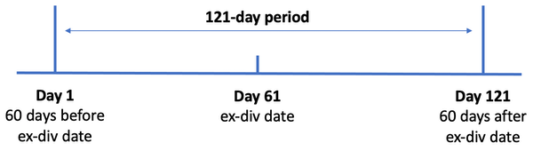

## Table of Contents

## What is a stock dividend?

A stock dividend is when a company gives its shareholders more shares instead of cash. Instead of getting money, you get extra pieces of the company. This happens when the company wants to keep its cash but still wants to reward its shareholders. For example, if you own 100 shares and the company gives a 10% stock dividend, you will get 10 more shares.

Stock dividends can make your total number of shares go up, but it doesn't change the value of your investment right away. If the stock price stays the same, the price of each share will go down a bit because there are more shares now. But, the total value of all your shares should stay the same. Over time, if the company does well, the value of your shares might go up.

## How does receiving a stock dividend affect my investment?

When you get a stock dividend, you receive more shares of the company instead of cash. This means the total number of shares you own goes up. For example, if you have 100 shares and the company gives a 10% stock dividend, you will get 10 more shares, making your total 110 shares. Even though you have more shares, the value of your investment doesn't change right away. This is because when a company issues more shares, the price of each share usually goes down a little bit. So, if the stock price was $10 before the dividend, it might drop to about $9.09 after the dividend to keep the total value the same.

Over time, the effect of a stock dividend on your investment can be positive if the company continues to do well. More shares mean you own a bigger piece of the company. If the company grows and the stock price goes up, the value of your total investment could increase. However, if the company doesn't do well, the value of your shares might go down. So, getting a stock dividend doesn't guarantee that your investment will grow, but it gives you more shares that could be valuable in the future if the company performs well.

## What is the holding period for stock dividends?

The holding period for stock dividends starts from the day you get the new shares. If you already owned the stock before getting the dividend, the holding period for those original shares stays the same. But for the new shares you get from the dividend, the holding period begins on the date they are given to you.

This is important because the holding period can affect how much tax you pay if you sell your shares. In many places, if you hold a stock for more than a year, you might pay less tax on any profit you make when you sell it. So, if you sell the new shares from the dividend soon after getting them, they might be taxed at a higher rate than your original shares if you've held those for a long time.

## When does the holding period for stock dividends start?

The holding period for stock dividends starts on the day you get the new shares. If you already owned the stock before the dividend, the holding period for your original shares doesn't change. But for the new shares you receive from the dividend, the holding period begins on the date they are given to you.

This is important because the holding period can affect how much tax you pay if you sell your shares. In many places, if you hold a stock for more than a year, you might pay less tax on any profit you make when you sell it. So, if you sell the new shares from the dividend soon after getting them, they might be taxed at a higher rate than your original shares if you've held those for a long time.

## How is the holding period for stock dividends different from regular stock purchases?

The holding period for stock dividends is different from regular stock purchases because it starts on the day you receive the new shares from the dividend. When you buy stocks normally, the holding period starts on the day you buy them. So, if you already own some shares and then get more shares from a dividend, the holding period for your original shares stays the same, but the new shares from the dividend have a new holding period that starts when you get them.

This difference matters a lot for taxes. In many countries, if you hold a stock for more than a year, you might pay less tax on any profit you make when you sell it. This is called a long-term capital gain. But if you sell shares soon after getting them, like the new shares from a dividend, you might have to pay more tax because they are considered a short-term capital gain. So, it's important to know when the holding period starts for both your original shares and the new shares from dividends.

## What are the tax implications of the holding period for stock dividends?

The tax implications of the holding period for stock dividends can be important. When you get stock dividends, the holding period for these new shares starts on the day you receive them. This is different from the shares you bought before, which have their own holding period starting from when you bought them. The holding period matters because it can affect how much tax you pay if you sell your shares.

In many countries, if you hold a stock for more than a year, any profit you make when you sell it might be taxed at a lower rate. This is called a long-term capital gain. But if you sell the shares soon after getting them, like the new shares from a dividend, you might have to pay more tax because they are considered a short-term capital gain. So, knowing when the holding period starts for your stock dividends can help you plan when to sell your shares to maybe pay less tax.

## Can the holding period for stock dividends impact long-term vs. short-term capital gains?

Yes, the holding period for stock dividends can affect whether you pay taxes on long-term or short-term capital gains. When you get stock dividends, the holding period for these new shares starts on the day you receive them. This is different from the shares you bought before, which have their own holding period starting from when you bought them.

If you sell the new shares from the dividend soon after getting them, they might be taxed as short-term capital gains. Short-term capital gains are usually taxed at a higher rate than long-term capital gains. Long-term capital gains apply if you hold the shares for more than a year. So, knowing when the holding period starts for your stock dividends can help you decide when to sell your shares to maybe pay less tax.

## How do you calculate the cost basis of stock dividends for tax purposes?

When you get stock dividends, you need to figure out the cost basis of the new shares for tax purposes. The cost basis is what you consider as the cost of your shares when you sell them. To find the cost basis of the new shares from a stock dividend, you take the total cost basis of your original shares and spread it out over all your shares, including the new ones. For example, if you had 100 shares with a total cost basis of $1,000 and you got a 10% stock dividend, you would now have 110 shares. You would divide the $1,000 by 110 to find the new cost basis per share, which would be about $9.09.

This method of calculating the cost basis is called the "average cost method." It makes sure that your total investment stays the same, but it's spread out over more shares. When you sell any of these shares, you use this new cost basis to figure out if you made a profit or a loss. If you sell the new shares from the dividend soon after getting them, they might be taxed as short-term capital gains, which can be at a higher rate. But if you hold onto them for more than a year, they could be taxed as long-term capital gains, which are usually at a lower rate.

## What documentation is required to prove the start of the holding period for stock dividends?

To prove the start of the holding period for stock dividends, you need to keep records from your broker or the company that gave you the dividends. These records will show the date when you got the new shares. This date is important because it's when the holding period for those new shares starts. You might get a statement or a confirmation from your broker that shows this date.

It's a good idea to save these documents because they can help you when you do your taxes. If you sell the new shares, you need to know how long you held them to figure out if you owe taxes on short-term or long-term capital gains. The IRS or other tax agencies might ask to see these documents to check your tax return. So, keeping good records will make things easier when you need to show proof.

## Are there any special rules for foreign stocks regarding the holding period of dividends?

The rules for the holding period of dividends from foreign stocks can be a bit different depending on where the company is from and where you live. If you live in the U.S., you still have to follow the IRS rules for the holding period, which means the holding period for new shares from a dividend starts on the day you get them. But, some countries might have their own rules about how long you need to hold stocks to get certain tax benefits, so you might need to check the rules of the country where the company is based too.

For example, if you get dividends from a company in Canada, you would follow the U.S. rules for your U.S. taxes, but you might also need to know Canada's rules if you have to pay taxes there too. It's a good idea to talk to a tax advisor who knows about international taxes to make sure you're following all the right rules. They can help you understand how the holding period for your foreign stock dividends might affect your taxes in different countries.

## How do corporate actions like stock splits affect the holding period of stock dividends?

When a company does a stock split, it doesn't change the holding period of your original shares or the new shares you got from stock dividends. If you owned shares before the split and got more shares from a dividend, the holding period for your original shares stays the same, starting from when you bought them. The holding period for the new shares from the dividend also stays the same, starting from when you got them. A stock split just means you get more shares, but the value of your investment stays the same, and it doesn't affect when you started holding those shares.

For example, if you had 100 shares and got a 10% stock dividend, making your total 110 shares, and then the company did a 2-for-1 stock split, you would end up with 220 shares. But the holding period for the original 100 shares would still start from when you bought them, the holding period for the 10 shares from the dividend would start from when you got them, and the holding period for the new shares from the split would be the same as the shares they came from. So, even though you have more shares after a stock split, it doesn't change the holding period for tax purposes.

## What are the best practices for tracking the holding period of stock dividends for portfolio management?

To keep track of the holding period for stock dividends, it's important to save all the records you get from your broker or the company. These records will tell you the date when you got the new shares from the dividend. That date is when the holding period for those new shares starts. It's a good idea to keep these documents in a safe place, like a folder or a computer file, so you can find them easily when you need to do your taxes or check how long you've held your shares.

Using a portfolio management tool or app can also help you keep track of the holding period for your stock dividends. Many of these tools let you enter the date you got the new shares and will show you how long you've held them. This can make it easier to know if you're looking at short-term or long-term capital gains when you sell your shares. Keeping good records and using the right tools will help you manage your portfolio better and make sure you're ready for tax time.

## How do you calculate the holding period?

To calculate the holding period, start counting from the day after the asset is purchased. This period determines whether the investment is classified as short-term or long-term, a distinction that affects the taxation rate on the capital gains realized upon sale. 

For measuring investment performance during this period, it is important to consider the total return, which includes both dividends received and changes in the asset's value. The holding period return (HPR) formula provides a straightforward method for calculating this performance:

$$
\text{HPR} = \left(\frac{\text{Ending Value} - \text{Beginning Value} + \text{Dividends}}{\text{Beginning Value}}\right) \times 100\%
$$

In this formula, the ending value represents the asset's value at the end of the holding period, the beginning value is the value at the start, and dividends include any income received during the period from holding the asset.

The HPR offers a percentage that reflects the total return gained or lost over the holding period. This calculation is useful for evaluating the investment over specific durations, enabling comparisons against other asset performances or market indices.

When considering the impact of dividends on the holding period return, it is crucial to identify whether the dividends are reinvested or taken as cash, as this decision can influence the overall return calculation. If dividends are reinvested, the ending value should encompass any additional shares purchased with the dividends, further promoting the compounding effect over the holding period.

Investors seeking to optimize their strategies must pay attention to how holding periods interact with dividends and changes in market value, ensuring their calculations accurately reflect the total performance over the desired timeframe.

## References & Further Reading

Internal Revenue Service. Topic No. 409 Capital Gains and Losses. This resource from the IRS provides detailed information on the tax regulations concerning capital gains, which are critical for understanding the tax implications of different holding periods. Accessing this can help investors grasp the differentiation between short-term and long-term capital gains and the associated tax rates on these gains.

Bergstra, J., Bardenet, R., Bengio, Y., & Kégl, B. (2011). Algorithms for Hyper-Parameter Optimization. This paper explores the algorithms used for optimizing hyper-parameters, an essential aspect for those involved in algorithmic trading. The techniques discussed can be leveraged to fine-tune trading models, especially in predicting optimal holding periods.

Lopez de Prado, M. (2018). Advances in Financial Machine Learning. This book offers insights into how machine learning can be applied to financial data, introducing sophisticated techniques for developing trading strategies. Such methods are vital for enhancing the predictive power and efficiency of algo-trading models, particularly in optimizing holding periods.

Aronson, D. (2006). Evidence-Based Technical Analysis. In this publication, Aronson presents a scientific approach to technical analysis, questioning traditional methods and advocating for evidence-based techniques. It provides foundational knowledge for traders looking to justify holding period decisions based on statistical analysis rather than intuition.

Chan, E.P. (2008). Quantitative Trading: How to Build Your Own Algorithmic Trading Business. Chan's book is a guide for those looking to construct and run an algorithmic trading business, with practical advice on developing [quantitative trading](/wiki/quantitative-trading) models. Understanding the implementation of these models can directly impact decisions regarding holding periods and the integration of dividends into overall strategy. 

These readings collectively offer a comprehensive understanding of the factors affecting investment holding periods, the influence of dividends, and the strategic application in algorithmic trading. They are recommended for investors and algorithmic traders seeking to enhance their strategies and improve decision-making processes.

