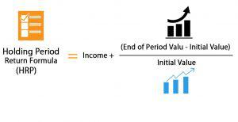

The modern investment landscape is marked by a diverse array of strategies, ranging from traditional approaches like buy-and-hold to more advanced techniques such as algorithmic trading. These strategies cater to varying investor preferences and risk appetites, reflecting the complexity of today's financial markets. A core aspect of successful investing within this landscape involves understanding key variables such as holding periods and dividends. These factors play vital roles in optimizing returns while managing risks and tax implications effectively.

Holding periods, defined as the duration an asset is owned by an investor, are crucial in determining the classification of capital gains as either short-term or long-term. This classification significantly affects the tax rates applied to the realized gains, with long-term capital gains typically being taxed at more favorable rates. Additionally, the comprehensive evaluation of an investment's performance requires consideration of total returns over the holding period, including dividends and changes in asset value.



Dividends, a form of periodic return on investment, can considerably influence the holding period, especially when assessing their tax treatment. In particular, qualified dividends, which meet specific holding period criteria, are subject to lower tax rates, mirroring the advantages of long-term capital gains. These considerations underscore the importance of timing in dividend reception and reinvestment strategies, which can impact the overall return and extend the holding period.

The integration of holding periods and dividends becomes particularly strategic within algorithmic trading systems, where data-driven decision-making is paramount. Algorithmic trading exploits varied holding periods to optimize trading frequency and manage exposure to market risks. For instance, high-frequency trading strategies employ extremely brief holding periods to capitalize on transient market inefficiencies, while trend-following algorithms may opt for longer durations to capture sustained market movements.

In this article, we examine the integration of holding periods and dividends into investment strategies, highlighting their implications for risk management and tax efficiency. By comprehensively understanding these elements, investors can tailor their strategies to align with both personal financial goals and prevailing market conditions, leveraging a nuanced approach to maximize returns while mitigating risks.

## Table of Contents

## Understanding Holding Periods

A holding period is the duration over which an asset is owned by an investor prior to being sold. This period begins the day after the acquisition of the asset and concludes on the sale date. The length of the holding period is crucial for determining the classification of gains as either short-term or long-term, which in turn significantly affects the tax treatment of these gains. 

Short-term capital gains, arising from the sale of assets held for one year or less, are typically taxed at the investor's ordinary income tax rates. Conversely, long-term capital gains, which are gains from assets held for more than one year, benefit from reduced tax rates, offering potential tax savings to investors. The differential treatment is designed to incentivize longer-term investment and stability in financial markets.

Understanding how to calculate the holding period is fundamental for investors aiming to optimize their tax liabilities. The process involves starting the count from the day after the asset is acquired. For instance, if an asset is purchased on January 1, the holding period commences on January 2. If the asset is then sold on January 1 of the following year, the holding period is considered one year, qualifying potentially for long-term capital gains treatment.

This classification not only reflects tax implications but also influences strategic investment decisions. Investors often weigh the benefits of lower long-term capital gains tax rates against their immediate financial goals and market conditions. By holding assets longer, investors could enhance their after-tax returns, provided the assets appreciate over time.

Additionally, it's important for investors to consider the specific dates and rules that might impact the holding period determination. For instance, special tax rules can apply to different types of securities, and various forms of property might have distinct holding period requirements. Therefore, maintaining accurate records and understanding the nuances of tax regulations is essential for any investor aiming to manage their portfolio efficiently. 

Overall, a thorough comprehension of holding periods aids investors not only in optimizing their tax obligations but also in aligning their investment strategies with their broader financial objectives.

## Calculating the Holding Period

To calculate the holding period, start counting from the day after the asset is purchased. This period determines whether the investment is classified as short-term or long-term, a distinction that affects the taxation rate on the capital gains realized upon sale. 

For measuring investment performance during this period, it is important to consider the total return, which includes both dividends received and changes in the asset's value. The holding period return (HPR) formula provides a straightforward method for calculating this performance:

$$
\text{HPR} = \left(\frac{\text{Ending Value} - \text{Beginning Value} + \text{Dividends}}{\text{Beginning Value}}\right) \times 100\%
$$

In this formula, the ending value represents the asset's value at the end of the holding period, the beginning value is the value at the start, and dividends include any income received during the period from holding the asset.

The HPR offers a percentage that reflects the total return gained or lost over the holding period. This calculation is useful for evaluating the investment over specific durations, enabling comparisons against other asset performances or market indices.

When considering the impact of dividends on the holding period return, it is crucial to identify whether the dividends are reinvested or taken as cash, as this decision can influence the overall return calculation. If dividends are reinvested, the ending value should encompass any additional shares purchased with the dividends, further promoting the compounding effect over the holding period.

Investors seeking to optimize their strategies must pay attention to how holding periods interact with dividends and changes in market value, ensuring their calculations accurately reflect the total performance over the desired timeframe.

## The Role of Dividends in Holding Periods

Dividends play a significant role in defining holding periods, especially within the context of qualified dividends and their tax treatments. Qualified dividends are taxed at lower capital gains rates rather than the higher ordinary income tax rates provided specific conditions are met. One of the primary conditions for a dividend to be considered qualified is the holding period requirement. An investor must hold the stock for more than 60 days within a 121-day period that begins 60 days before the ex-dividend date. The ex-dividend date is crucial, as it determines dividend eligibility for shareholders, influencing strategic timing decisions related to buying and selling shares.

Beyond tax implications, the timing and reinvestment of dividends can lengthen an asset's holding period, impacting an investor's overall return. Dividend reinvestment plans (DRIPs) automatically reinvest dividends to purchase more shares of the company, effectively compounding returns over time. While this strategy can enhance total returns, it also introduces complexity to holding period calculations. Each reinvestment corresponds to a new purchase with its own holding period, potentially resulting in varied tax treatments for different share lots if and when they are sold.

The interplay between dividends and holding periods illustrates the need for investors to meticulously track their holdings and dividend transactions. This meticulous tracking can be facilitated through automated portfolio management tools or using programming languages like Python, as demonstrated below:

```python
from datetime import datetime, timedelta

def is_qualified_dividend(ex_dividend_date, purchase_date):
    # Define the start and end of the 121-day period
    start_period = ex_dividend_date - timedelta(days=60)
    end_period = ex_dividend_date + timedelta(days=60)

    # Holding period calculation
    holding_period = (ex_dividend_date - purchase_date).days

    # Check if the stock is held for more than 60 days in the defined period
    return start_period <= purchase_date < end_period and holding_period > 60

# Example usage
ex_dividend_date = datetime(2023, 11, 15)
purchase_date = datetime(2023, 9, 1)
print(is_qualified_dividend(ex_dividend_date, purchase_date))  # Output: True or False
```

This Python snippet highlights how an investor can determine the qualified status of dividends based on holding period criteria. Understanding the interaction between dividends and holding periods allows investors to optimize both their returns and tax liabilities, providing a strategic edge in managing investment portfolios.

## Algorithmic Trading and Holding Periods

In [algorithmic trading](/wiki/algorithmic-trading), holding periods are crucial in shaping trading strategies, as they directly influence trading frequency and market exposure. The selection of a holding period largely depends on the trading strategy employed and the market conditions targeted.

Short-term algorithmic strategies, such as high-frequency trading ([HFT](/wiki/high-frequency-trading-strategies)), focus on capturing small price discrepancies over minimal time frames. These strategies exploit ephemeral market inefficiencies and require holding periods that often last only seconds or even milliseconds. The success of HFT is highly reliant on advanced technology infrastructure that reduces latency and enables rapid order execution. As a result, the financial outcomes of these trades typically depend on a high number of transactions executed with precision. The returns from such strategies are usually derived from algorithms programmed to recognize patterns and execute trades based on minuscule price differences.

In contrast, longer holding periods are characteristic of trend-following strategies, which aim to capitalize on sustained market movements. These strategies are based on the principle that prices tend to move in persistent trends, and they involve holding positions for longer durations to ride significant market movements. When implementing such strategies, traders analyze market trends and indicators to determine potential directional movements. The algorithms developed for trend-following focus on maintaining positions as long as the trend persists, which can range from several days to even months. This approach allows traders to capture larger price shifts, reducing the need for frequent transactions and mitigating transaction costs.

The choice between high-frequency and trend-following strategies, or any other holding period length, depends on multiple factors such as transaction costs, market [volatility](/wiki/volatility-trading-strategies), and individual risk tolerance. Algorithmic trading systems must be carefully calibrated to optimize the balance between trading frequency and market exposure while minimizing risks associated with rapid market fluctuations. As such, holding periods play a pivotal role in defining the mechanics and potential success of algorithmic trading strategies.

## Factors Influencing Holding Period Choice

Factors influencing holding period choices are diverse, impacting how investors strategize their portfolio management. Key determinants include market volatility, investor risk tolerance, transaction costs, the nature of the trading strategy, and tax considerations.

Market volatility plays a critical role, as it affects price movements and potential returns on investments. In environments with high volatility, traders may prefer shorter holding periods to minimize exposure to rapid price fluctuations, thereby reducing potential losses. Conversely, in stable markets, investors might opt for longer holding periods, aiming to capitalize on steady growth trends.

Investor risk tolerance is another significant [factor](/wiki/factor-investing). Risk-averse investors might choose longer holding periods to mitigate the impact of short-term market volatility, focusing on the potential for stable, long-term capital appreciation. Conversely, risk-tolerant investors might prefer shorter holding periods, engaging in trading strategies that exploit short-term price movements.

Transaction costs, including brokerage fees and taxes, directly impact the profitability of trades. Frequent trading associated with shorter holding periods can accrue significant transaction costs, eroding overall gains. Therefore, investors might lengthen holding periods to reduce transaction frequency and associated costs, thereby enhancing net returns.

The nature of the trading strategy is also pivotal. High-frequency trading strategies, characterized by very brief holding periods, capitalize on small market inefficiencies but require sophisticated technology and incur higher transaction costs. For such strategies, the ability to execute trades with minimal latency is crucial. In contrast, trend-following strategies, which typically involve longer holding periods, aim to capture larger market movements and may benefit from reduced trading costs and lower tax rates on long-term capital gains.

Tax considerations, particularly capital gains tax, influence holding period decisions significantly. In many jurisdictions, long-term capital gains are taxed at a lower rate compared to short-term gains, providing an incentive for investors to maintain longer holding periods. Understanding the tax implications of holding periods can lead to more tax-efficient investment strategies, thereby enhancing after-tax returns.

Ultimately, the choice of holding period is a balance among these factors, requiring investors to consider their individual financial goals, risk appetite, and the specific characteristics of their chosen trading strategies. Adjustments to holding period strategies are often necessary in response to changing market conditions and regulatory environments, underscoring the importance of flexibility in investment planning.

## Challenges in Optimizing Holding Periods

Balancing transaction costs against market exposure is a fundamental challenge in optimizing holding periods. Transaction costs, such as brokerage fees, bid-ask spreads, and other expenses, can significantly erode returns, especially for strategies with higher trading frequency. Consequently, determining the optimal holding period involves calculating the point at which transaction costs no longer outweigh the benefits of increased market exposure.

Predictive accuracy in market behavior further complicates the optimization of holding periods. The ability to accurately forecast market movements is essential for determining the ideal time to enter or [exit](/wiki/exit-strategy) a trade. However, market sentiment and external factors can lead to unpredictable volatility, making accurate predictions challenging. Moreover, latency issues in execution, which refer to the delay between when a trading signal is generated and when the order is executed, can lead to slippage—where trades are executed at a less favorable price than intended—thus impacting performance, particularly for high-frequency trading strategies.

Advanced analytics and [machine learning](/wiki/machine-learning) have become indispensable tools for navigating these challenges. By analyzing large datasets, machine learning models can identify patterns and make more precise predictions about market behavior. Techniques such as [deep learning](/wiki/deep-learning) and [reinforcement learning](/wiki/reinforcement-learning) are particularly promising, as they allow models to adapt to new market conditions over time. For example, using Python's libraries such as `scikit-learn` or `TensorFlow`, traders can build predictive models that enhance accuracy and improve decision-making processes.

Real-time data integration is also critical in optimizing holding periods. Real-time data provides up-to-date information on market trends, allowing traders to make informed decisions quickly. By integrating real-time analytics, traders can adjust their strategies dynamically, optimizing the timing of buy and sell decisions to improve overall performance. This requires sophisticated data processing systems that can handle continuous data flows, ensuring that traders are responding to the most current information available.

In summary, the optimization of holding periods entails a delicate balance of mitigating transaction costs, enhancing predictive accuracy, and harnessing the power of advanced technologies to process real-time data effectively. These elements are crucial for refining investment strategies and achieving favorable investment outcomes.

## Conclusion

Holding periods and investment strategies are deeply interconnected, with significant implications for tax treatment and market risk management. An investor's choice of holding period can dictate how gains are taxed, with long-term holdings usually benefiting from lower tax rates on capital gains compared to short-term positions. This tax consideration is a primary concern for many investors, as it directly impacts net returns. Furthermore, the holding period influences an investor’s exposure to market risk. Shorter holding periods may involve greater transaction costs and the potential for higher volatility, while longer periods can smooth out short-term market fluctuations but may expose the investor to other systematic risks over time.

A thorough understanding of these elements allows investors and traders to optimize their financial strategies, aligning them with both personal and market goals. By carefully considering the desired risk tolerance and tax implications, investors can tailor their approaches to better meet individual financial objectives. Moreover, different market participants, from retail traders to institutional investors, frequently adjust their strategies based on their unique circumstances and outlooks. For instance, algorithmic traders may prioritize short-term efficiencies, whereas long-term investors might focus on growth and value retention over several years.

Continual assessment and adaptation to market conditions are essential to synchronize holding periods with strategic objectives. This dynamic adjustment process is crucial as markets evolve, influenced by external factors such as economic indicators, geopolitical events, and technological advancements. Investors and traders must remain vigilant and flexible, employing advanced analytics and integrating real-time data to refine their strategies continuously. This enables them to navigate challenges effectively, optimizing holding periods to balance potential returns against expected risks. Ultimately, the ability to adapt strategies in response to changing circumstances supports the pursuit of sustained financial success.

## References & Further Reading

Internal Revenue Service. Topic No. 409 Capital Gains and Losses. This resource from the IRS provides detailed information on the tax regulations concerning capital gains, which are critical for understanding the tax implications of different holding periods. Accessing this can help investors grasp the differentiation between short-term and long-term capital gains and the associated tax rates on these gains.

Bergstra, J., Bardenet, R., Bengio, Y., & Kégl, B. (2011). Algorithms for Hyper-Parameter Optimization. This paper explores the algorithms used for optimizing hyper-parameters, an essential aspect for those involved in algorithmic trading. The techniques discussed can be leveraged to fine-tune trading models, especially in predicting optimal holding periods.

Lopez de Prado, M. (2018). Advances in Financial Machine Learning. This book offers insights into how machine learning can be applied to financial data, introducing sophisticated techniques for developing trading strategies. Such methods are vital for enhancing the predictive power and efficiency of algo-trading models, particularly in optimizing holding periods.

Aronson, D. (2006). Evidence-Based Technical Analysis. In this publication, Aronson presents a scientific approach to technical analysis, questioning traditional methods and advocating for evidence-based techniques. It provides foundational knowledge for traders looking to justify holding period decisions based on statistical analysis rather than intuition.

Chan, E.P. (2008). Quantitative Trading: How to Build Your Own Algorithmic Trading Business. Chan's book is a guide for those looking to construct and run an algorithmic trading business, with practical advice on developing [quantitative trading](/wiki/quantitative-trading) models. Understanding the implementation of these models can directly impact decisions regarding holding periods and the integration of dividends into overall strategy. 

These readings collectively offer a comprehensive understanding of the factors affecting investment holding periods, the influence of dividends, and the strategic application in algorithmic trading. They are recommended for investors and algorithmic traders seeking to enhance their strategies and improve decision-making processes.

