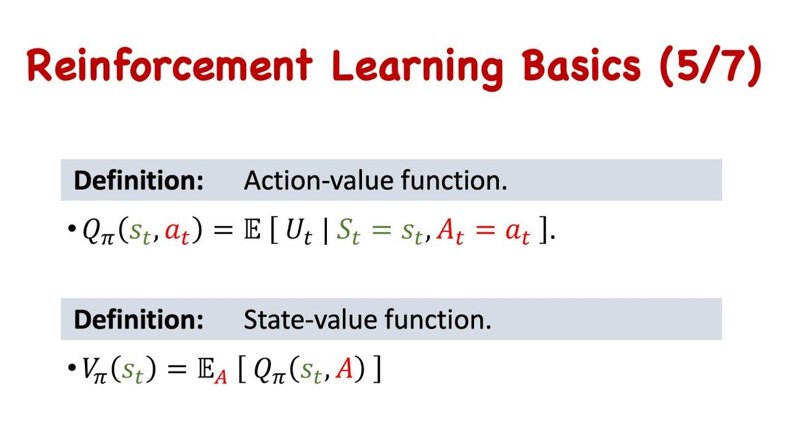

## Table of Contents

## What is a State-Action Value Function in machine learning?

A State-Action Value Function, often called Q-function, is a key concept in reinforcement learning, a type of machine learning. It estimates the expected future reward an agent can get by taking a specific action in a particular state. In other words, it tells you how good it is to take a certain action when you're in a certain situation. This function is represented as $$Q(s, a)$$, where $$s$$ is the state and $$a$$ is the action. By using the Q-function, an agent can decide the best action to take in any given state to maximize its total reward over time.

To understand the Q-function better, imagine you're playing a game where you need to navigate a maze. At each junction (state), you can choose to go left, right, up, or down (actions). The Q-function would help you figure out which direction to go to reach the exit (reward) fastest. As you explore the maze, you update your Q-function based on the rewards you get, learning which actions are better in which states. This learning process helps the agent improve its strategy over time, eventually finding the most efficient path through the maze.

## How does the State-Action Value Function differ from the State Value Function?

The State-Action Value Function, or Q-function, and the State Value Function are both important in reinforcement learning, but they focus on different aspects of the learning process. The State Value Function, denoted as $$V(s)$$, tells you how good it is to be in a certain state. It estimates the total expected reward you can get starting from that state and following a policy (a set of rules for choosing actions) from then on. Essentially, it's about the value of the state itself, regardless of the immediate action you take.

On the other hand, the State-Action Value Function, or $$Q(s, a)$$, goes a step further by considering the immediate action you take in a state. It estimates the total expected reward you can get by taking a specific action in a specific state and then following a policy. So, while the State Value Function helps you understand the value of being in a state, the State-Action Value Function helps you decide which action to take in that state to maximize your future rewards. This makes the Q-function very useful for choosing the best actions in real-time scenarios.

To illustrate the difference, think of a game where you're trying to reach a goal. The State Value Function would tell you how good it is to be at any particular position on the game board. If you're close to the goal, the value would be high. However, it doesn't tell you which move to make next. That's where the State-Action Value Function comes in. It would tell you, for example, that moving right from your current position is better than moving left because it leads to a higher expected reward. By using the Q-function, you can make informed decisions about which actions to take at each step of the game.

## What is the mathematical representation of the State-Action Value Function?

The State-Action Value Function, often called the Q-function, is represented mathematically as $$Q(s, a)$$. This function estimates the total expected reward an agent can get by taking a specific action $$a$$ in a specific state $$s$$ and then following a policy. The policy is a set of rules that the agent uses to decide which action to take in any given state. The Q-function is crucial because it helps the agent choose the best action to maximize its future rewards.

The Q-function can be updated using the Q-learning algorithm, which is a type of [reinforcement learning](/wiki/reinforcement-learning). The update rule for Q-learning is given by the formula: $$Q(s, a) \leftarrow Q(s, a) + \alpha \left[ r + \gamma \max_{a'} Q(s', a') - Q(s, a) \right]$$. In this formula, $$r$$ is the immediate reward received after taking action $$a$$ in state $$s$$, $$\alpha$$ is the learning rate, $$\gamma$$ is the discount [factor](/wiki/factor-investing) that determines the importance of future rewards, and $$s'$$ is the next state after taking action $$a$$. The term $$\max_{a'} Q(s', a')$$ represents the maximum expected future reward from the next state $$s'$$. This update rule allows the agent to learn from its experiences and improve its Q-function estimates over time.

## Why is the State-Action Value Function important in reinforcement learning?

The State-Action Value Function, or Q-function, is really important in reinforcement learning because it helps the agent decide what to do next. Imagine you're playing a game and you need to choose your next move. The Q-function tells you how good each move is, based on how much reward you can expect to get in the future. By using the Q-function, the agent can pick the best action to take in any situation, which helps it learn to play the game better over time. This is crucial because the goal of reinforcement learning is to find the best way to act to get the most reward.

The Q-function is also important because it can be updated as the agent learns. The update rule for the Q-function is $$Q(s, a) \leftarrow Q(s, a) + \alpha \left[ r + \gamma \max_{a'} Q(s', a') - Q(s, a) \right]$$. This formula helps the agent learn from its experiences. Every time the agent takes an action and gets a reward, it can use this information to make its Q-function more accurate. Over many tries, the Q-function gets better and better at predicting which actions will lead to the most reward. This makes the agent smarter and better at making decisions, which is the whole point of reinforcement learning.

## How is the State-Action Value Function estimated in Q-learning?

In Q-learning, the State-Action Value Function, or Q-function, is estimated by updating its values based on the rewards the agent receives while interacting with its environment. The agent starts with an initial guess for the Q-function, which might be random or zero for all state-action pairs. As the agent takes actions and observes the outcomes, it uses these experiences to refine its estimates. The key idea is to learn from the difference between the expected future rewards and the actual rewards received, adjusting the Q-function accordingly to better predict the best actions to take in each state.

The update rule for the Q-function in Q-learning is given by the formula: $$Q(s, a) \leftarrow Q(s, a) + \alpha \left[ r + \gamma \max_{a'} Q(s', a') - Q(s, a) \right]$$. Here, $$Q(s, a)$$ is the current estimate of the Q-function for state $$s$$ and action $$a$$. The term $$r$$ is the immediate reward received after taking action $$a$$ in state $$s$$. The learning rate $$\alpha$$ determines how much the Q-function is updated with each new experience. The discount factor $$\gamma$$ decides how much future rewards matter compared to immediate rewards. The term $$\max_{a'} Q(s', a')$$ is the highest expected future reward from the next state $$s'$$ after taking action $$a$$. By continuously updating the Q-function using this rule, the agent learns to make better decisions over time, leading to improved performance in achieving its goals.

## What is the role of the State-Action Value Function in the SARSA algorithm?

In the SARSA algorithm, the State-Action Value Function, or Q-function, helps the agent decide which actions to take by estimating the future rewards it can expect from taking a specific action in a specific state. Unlike Q-learning, which looks for the best possible action in the next state, SARSA uses the action that the agent will actually take next. This means SARSA is more about learning from the actual experiences and policies the agent follows. The Q-function in SARSA is updated using the formula $$Q(s, a) \leftarrow Q(s, a) + \alpha \left[ r + \gamma Q(s', a') - Q(s, a) \right]$$, where $$r$$ is the reward, $$\alpha$$ is the learning rate, $$\gamma$$ is the discount factor, and $$Q(s', a')$$ is the Q-value of the next state-action pair the agent will encounter.

The role of the Q-function in SARSA is to help the agent improve its policy, which is the set of rules it uses to choose actions. By updating the Q-function based on the actual actions taken and the rewards received, the agent can learn to make better decisions over time. This makes SARSA particularly useful in scenarios where the agent needs to follow a specific policy or when it's important to learn from the consequences of the actions the agent actually takes, rather than always looking for the best possible action.

## How does the exploration-exploitation trade-off affect the State-Action Value Function?

The exploration-exploitation trade-off is a big deal in reinforcement learning because it decides how the agent learns and updates its State-Action Value Function, or Q-function. Exploration means trying out new actions to learn more about the environment. Exploitation means sticking with the actions that have given good rewards before. When an agent explores a lot, it might find better actions that lead to higher rewards, but it also risks getting less reward in the short term. On the other hand, if the agent exploits too much, it might miss out on finding even better actions because it's not trying new things.

This trade-off affects the Q-function because the way the agent balances exploration and exploitation changes how it updates the Q-values. If the agent explores more, it will have more chances to update the Q-function with new experiences, which can lead to a more accurate Q-function over time. But, if the agent exploits more, it might update the Q-function less often because it's sticking to what it already knows works well. The goal is to find a good balance so the Q-function can be updated in a way that helps the agent learn the best actions to take in each state, leading to the highest total reward.

## What are the challenges in accurately estimating the State-Action Value Function?

Estimating the State-Action Value Function, or Q-function, accurately can be tough because there are a lot of things that can go wrong. One big challenge is the exploration-exploitation trade-off. If the agent doesn't explore enough, it might miss out on finding the best actions because it's not trying new things. But if it explores too much, it might not get enough rewards in the short term. This can make the Q-function less accurate because the agent might not have enough data to make good estimates. Another challenge is dealing with large state and action spaces. When there are a lot of states and actions, it's hard to visit them all enough times to get good Q-value estimates for each one. This can lead to some Q-values being based on very little data, which makes them less reliable.

Another issue is the problem of delayed rewards. In many situations, the reward for an action might not come right away but after a series of actions. This makes it hard to figure out which action was really responsible for the reward. The Q-function has to predict the total future reward, which can be tricky if rewards are far in the future. The choice of the discount factor $$\gamma$$ also affects this. If $$\gamma$$ is too low, the agent might not care enough about future rewards, and if it's too high, it might focus too much on future rewards and not enough on immediate ones. Finally, noise and uncertainty in the environment can make it hard to estimate the Q-function accurately. If the rewards or the next states are unpredictable, it's tough for the agent to learn reliable Q-values.

## How can function approximation be used to represent the State-Action Value Function?

Function approximation is a way to represent the State-Action Value Function, or Q-function, when there are too many states and actions to keep track of them all separately. Instead of having a Q-value for every single state-action pair, you use a function that can guess the Q-value for any state and action. This function can be something simple like a linear equation or something more complex like a [neural network](/wiki/neural-network). The idea is to train this function to give good estimates of the Q-values based on the experiences the agent has. By using function approximation, the agent can handle big, complicated environments more easily because it doesn't need to remember every single state and action.

To train the function approximation, you use the same kind of learning rule as in Q-learning, but you update the parameters of the function instead of individual Q-values. For example, if you're using a neural network, you would update the weights of the network to minimize the difference between the predicted Q-values and the actual rewards the agent gets. The update rule might look something like this: $$Q(s, a) \leftarrow Q(s, a) + \alpha \left[ r + \gamma \max_{a'} Q(s', a') - Q(s, a) \right]$$. By adjusting the function's parameters over time, the function gets better at predicting the Q-values, helping the agent make better decisions in the environment.

## What are the differences between on-policy and off-policy methods in updating the State-Action Value Function?

On-policy methods and off-policy methods are two different ways to update the State-Action Value Function, or Q-function, in reinforcement learning. On-policy methods update the Q-function based on the policy the agent is currently using. This means the agent learns from the actions it actually takes and the rewards it gets while following its current policy. A common on-policy method is SARSA, which updates the Q-function using the formula $$Q(s, a) \leftarrow Q(s, a) + \alpha \left[ r + \gamma Q(s', a') - Q(s, a) \right]$$. In this formula, $$Q(s', a')$$ is the Q-value of the next state-action pair that the agent will actually take, according to its current policy.

Off-policy methods, on the other hand, update the Q-function using a different policy from the one the agent is currently using. These methods allow the agent to learn from experiences that might not follow its current policy. A well-known off-policy method is Q-learning, which updates the Q-function using the formula $$Q(s, a) \leftarrow Q(s, a) + \alpha \left[ r + \gamma \max_{a'} Q(s', a') - Q(s, a) \right]$$. Here, $$\max_{a'} Q(s', a')$$ represents the maximum expected future reward from the next state, regardless of the action the agent actually takes. This allows the agent to learn the optimal policy even if it's not following it yet.

## How does the use of experience replay impact the learning of the State-Action Value Function?

Experience replay is a technique that helps the agent learn the State-Action Value Function, or Q-function, better. It works by storing the agent's experiences in a memory buffer. Instead of learning from each experience right away, the agent can revisit these experiences later. This means the agent can learn from the same experience multiple times, which helps it understand the environment better. By using experience replay, the agent can see a wider variety of situations and learn more about which actions lead to the best rewards.

When the agent uses experience replay to update the Q-function, it randomly samples experiences from the memory buffer. This randomness helps break the correlation between consecutive experiences, which can make learning more stable. The Q-function is updated using the same formula as in Q-learning, $$Q(s, a) \leftarrow Q(s, a) + \alpha \left[ r + \gamma \max_{a'} Q(s', a') - Q(s, a) \right]$$. By learning from a diverse set of experiences, the agent can get a more accurate estimate of the Q-values for different state-action pairs. This leads to better decision-making and a more effective learning process overall.

## What advanced techniques can be applied to improve the estimation of the State-Action Value Function in complex environments?

In complex environments, one advanced technique to improve the estimation of the State-Action Value Function, or Q-function, is using deep neural networks. This approach, known as Deep Q-Networks (DQN), uses a neural network to approximate the Q-function. The neural network takes the state as input and outputs Q-values for each possible action. By training the network with a large number of experiences, it can learn to predict Q-values accurately even in environments with many states and actions. The update rule for DQN is similar to Q-learning, but it updates the weights of the neural network instead of individual Q-values. This allows the agent to handle high-dimensional state spaces and learn complex patterns in the environment.

Another technique is using Double Deep Q-Networks (Double DQN), which addresses the overestimation problem that can occur in standard DQN. In Double DQN, two separate neural networks are used: one to select the action and another to evaluate it. This helps reduce the bias in Q-value estimates by separating the action selection from the action evaluation. The update rule for Double DQN is $$Q(s, a) \leftarrow Q(s, a) + \alpha \left[ r + \gamma Q_{\text{target}}(s', \arg\max_{a'} Q(s', a')) - Q(s, a) \right]$$, where $$Q_{\text{target}}$$ is the target network used for evaluation. By using this method, the agent can get more accurate Q-value estimates, leading to better performance in complex environments.

A third technique is Prioritized Experience Replay, which improves upon the standard experience replay by giving more importance to experiences that have a larger impact on learning. Instead of sampling experiences randomly, this method samples them based on their priority, which is often measured by the magnitude of the temporal difference error. This means the agent focuses more on experiences that it didn't predict well, helping it learn faster and more effectively. By using Prioritized Experience Replay, the agent can improve its Q-function estimates by learning more from the most informative experiences, making it better suited for complex environments where some experiences are more valuable than others.