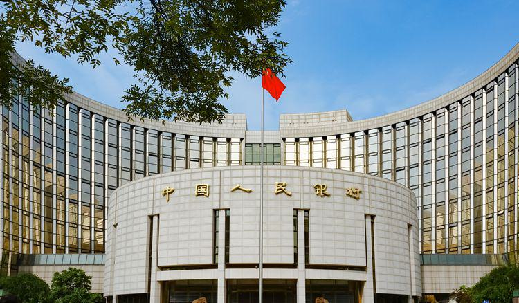

The landscape of global finance is continuously evolving, and China is a pivotal player, largely through its State Administration of Foreign Exchange (SAFE). As the world becomes increasingly interconnected, China's influence on financial systems is profound, particularly in the foreign exchange markets where SAFE plays a central role. This institution is not only responsible for overseeing China's foreign exchange reserves but also for implementing extensive control mechanisms designed to maintain economic stability. 

An essential aspect of this financial landscape is the emergence of algorithmic trading within China's markets. The sophistication and speed of algorithmic trading have introduced new dynamics by utilizing mathematical models and high-speed data analysis to execute trades more efficiently than traditional methods. This advancement has brought about significant implications for market stability and growth, as it necessitates robust regulatory frameworks to manage the associated risks.

In this article, we explore how these elements - SAFE's oversight and the integration of algorithmic trading - interact to shape China's financial markets and the wider global economic environment. Understanding these dynamics is crucial for global traders and investors who navigate this complex financial ecosystem. The juxtaposition of advanced technology and stringent regulations reflects a dynamic approach to maintaining market integrity, setting a precedence for other global financial institutions.

As stakeholders strive to effectively engage with China's ever-evolving financial markets, a thorough comprehension of these interactions and regulatory measures is indispensable. The confluence of regulatory oversight and technological innovation presents both challenges and opportunities, requiring strategic adaptation to leverage market opportunities within China's unique financial landscape.

## Table of Contents

## Understanding China's State Administration of Foreign Exchange (SAFE)

The State Administration of Foreign Exchange (SAFE) serves as a pivotal institution in China's economic and financial management landscape, prominently tasked with administering the nation's foreign exchange (forex) activities. Established in 1979, SAFE functions as a vital appendage to the People's Bank of China, collectively working to bolster China's financial robustness. It holds the primary responsibility for managing the country's significant forex reserves, which are among the largest globally, ensuring that these reserves contribute effectively to China's economic stability.

SAFE plays a critical role in formulating and enforcing regulations governing the forex markets to ensure financial stability and mitigate risks associated with market volatility. These regulations cover a range of activities, including currency exchange, capital flows, and cross-border transactions, thereby fostering an environment that facilitates both domestic and foreign investor engagement.

In managing China's external economic interactions, SAFE acts as a central authority ensuring that [forex](/wiki/forex-system) market operations align with the country's broader economic policies and goals. This includes supporting China's strategic objectives of internationalizing its currency, the renminbi (RMB), by promoting its use in global trade and finance. Part of this strategic endeavor involves crafting policies that encourage RMB internationalization, thereby influencing both regional and global financial ecosystems.

SAFE's mandate extends to ensuring compliance with the regulatory frameworks it sets forth. This includes rigorous monitoring and reporting requirements for financial institutions operating within China's forex markets. By doing so, SAFE fosters an environment of transparency and accountability, which is crucial for maintaining confidence among global market participants.

Overall, SAFE's regulatory oversight is crucial in shaping the dynamics of China's forex market, influencing interactions between domestic market players and their international counterparts. Its efforts are geared not only towards stabilizing the national economic landscape but also towards asserting China's influence in the global financial arena, with the renminbi playing a central part in these endeavors.

## The Role of Algorithm Trading in China

Algorithmic trading has become a focal point of technological innovation in China's financial markets, enabling transactions that are both high-frequency and efficient. This method leverages complex algorithms to execute orders at rapid speeds, significantly enhancing market operations. Algorithm trading is particularly beneficial as it reduces the time between decision-making and execution, mitigates human error, and optimizes trading strategies through automated processes.

China's regulatory bodies have recognized the potential systemic risks posed by unregulated [algorithmic trading](/wiki/algorithmic-trading), such as market [volatility](/wiki/volatility-trading-strategies) and manipulation. In response, the Chinese authorities have tightened regulations surrounding this practice to ensure a stable market environment. These new rules are designed to promote transparency, requiring traders to report their algorithmic trading strategies and activities comprehensively. This level of oversight is vital for maintaining market integrity, as it allows regulators to scrutinize trading patterns and detect any irregular activity that might disrupt market equilibrium.

The regulations extend to both Qualified Foreign Institutional Investors (QFII) and domestic investors. By doing so, China maintains a consistent regulatory framework that aligns with its broader strategy of controlling market environments. Aligning regulatory requirements for both international and domestic players promotes a level playing field and reinforces China’s cautious approach to financial liberalization.

Despite the stringent oversight, the advantages of algorithmic trading cannot be understated. The ability to execute trades at lightning speed and with precision offers unparalleled efficiency. However, regulators are keenly aware that with increased speed and automation comes the potential for market manipulation and unintended consequences. As such, the monitoring mechanisms in place are crucial to prevent any misuse of market power and to safeguard the integrity of the financial system.

In summary, China's approach to regulating algorithmic trading strikes a balance between fostering technological advancement and protecting market stability. This dual focus ensures that while the financial markets benefit from the efficiencies of automated trading, they are also kept free from the threats posed by unregulated algorithmic activities.

## SAFE's Influence on Forex Markets and Regulatory Practices

SAFE's policies are foundational in organizing China's forex market, ensuring efficient and secure operations. As China's primary regulatory authority for foreign exchange, SAFE mandates comprehensive reporting and compliance measures for financial institutions participating in international currency trades. This requirement ensures transparency and accountability, allowing SAFE to monitor currency flows effectively and mitigate any potential threats to financial stability.

Recent regulatory developments, particularly regarding cryptocurrencies, highlight SAFE's proactive approach to managing high-risk financial activities. In response to the volatile nature of cryptocurrencies, SAFE has introduced stringent regulations to limit speculative trading and non-compliant exchanges. These measures are intended to protect the Chinese economy from the potential destabilizing effects of rapid and unregulated [cryptocurrency](/wiki/cryptocurrency) trades. For instance, in 2021, China banned all cryptocurrency transactions and mining, reinforcing SAFE's commitment to maintaining financial stability and limiting exposure to speculative risks.[^1]

SAFE's efforts are characterized by a strategic balance between facilitating efficient forex transactions and safeguarding national economic interests. This equilibrium is vital in ensuring that China's forex market remains robust while preventing financial threats that could undermine economic stability. By enforcing strict policies on forex activities and speculative trading, SAFE aims to create a controlled environment conducive to sustainable economic growth.

The evolving regulatory practices led by SAFE offer insights into China's broader financial strategy and its engagement with global economic forces. These practices underscore the importance of tight regulatory oversight in reinforcing China's economic objectives on the world stage. As global financial markets continue to adapt to emerging technologies and investment vehicles, SAFE's policies demonstrate the necessity of maintaining a vigilant and responsive regulatory framework.

In summary, SAFE's influence on China's forex market is profound, shaping its operations through meticulous regulation and strategic foresight. The agency's regulatory initiatives, particularly concerning cryptocurrencies and international currency dealings, are crucial in stabilizing the market environment and aligning with China's overarching economic strategies.

[^1]: "China bans all cryptocurrency transactions and mining," BBC News, 2021.

## Implications for Global Finance and Investment

SAFE's rigorous exchange market governance plays a crucial role in shaping the landscape of global finance and investment, providing pivotal insights into risk management and compliance for financial institutions worldwide. As financial markets continue to evolve with technological advancements, the frameworks put forth by SAFE can be seen as a benchmark for enhancing market integrity and stability, reflective of a growing trend worldwide where increased oversight, particularly in algorithmic trading, is prioritized.

Algorithmic trading, characterized by its use of complex algorithms and high-frequency trade execution, carries inherent risks of exacerbating market volatility and manipulation. China's recent regulatory developments, enhancing transparency and accountability in algorithmic trading, underscore the significance of maintaining robust oversight mechanisms. These measures not only aim to mitigate systemic risks within local markets but also signal to international stakeholders the importance of aligning with comprehensive regulatory standards to preserve financial stability.

For international investors, understanding China's regulatory infrastructure is imperative when exploring forex and other financial investments in the region. China's approach to forex market regulation has broader implications for global currency stability. As China continues to enforce stringent controls while encouraging legitimate and efficient trading practices, these regulations can influence cross-border capital flows and impact investment decisions globally. Investors must thus carefully evaluate these regulatory dynamics to anticipate shifts in market trends and currency valuations.

Moreover, China's strategic positioning within global forex markets underscores the need for a nuanced appreciation of SAFE's policies and algorithmic trading regulations. The capability to navigate these regulatory waters effectively can open significant opportunities for global investors. By focusing on the intersection of these regulations and trading strategies, stakeholders can better align their operations with the expectations set forth by SAFE, thus maximizing potential benefits while minimizing exposure to regulatory pitfalls.

In conclusion, SAFE's exchange governance model offers valuable lessons and sets a high standard for financial market regulation worldwide. As investors and financial entities engage with China's evolving financial landscape, a deep understanding of SAFE's regulatory approach and its implications for algorithmic trading becomes indispensable. This understanding not only informs strategic decision-making but also ensures adherence to a regulatory framework poised to influence global financial stability.

## Conclusion

China's State Administration of Foreign Exchange (SAFE) holds a vital position in the global forex markets, reinforcing China's economic strength through comprehensive regulation and strategic policy development. By integrating technological advancements such as algorithmic trading with stringent national standards, China showcases a progressive and controlled market environment. This approach not only strengthens the domestic financial system but also influences global financial dynamics.

Given the rapid evolution of China's regulatory frameworks, global investors and financial institutions must closely monitor these developments to effectively tailor their investment strategies. The ability to adapt and exhibit strategic foresight will be critical for navigating China's intricate financial landscape successfully. As regulatory practices continue to transform, stakeholders need to align their operations with China's policies to capitalize on emerging market opportunities.

Ultimately, the intersection of China's internal regulations and international market forces reveals a complex interplay between control, innovation, and market engagement. This dynamic underscores the significance of understanding China's domestic policies, as they increasingly influence global financial ecosystems and determine the trajectory of international economic interactions.

## References & Further Reading

[1]: Xie, Y., Pang, L., & Wang, J. (2020). ["Algorithmic Trading in China’s Stock Markets: Mechanisms, Regulations, and Risk Management."](https://link.springer.com/article/10.1007/s11664-024-11670-0) Pacific-Basin Finance Journal.

[2]: Wong, John. (2007). ["China's Economy: Hu-Wen Leadership and the Development of China's Foreign Exchange Market."](https://www.academia.edu/126665097/Understanding_Chinese_Economy_Accurately_John_Wong_and_His_China_Research) World Scientific Publishing Co. Pte. Ltd.

[3]: Lopez de Prado, M. (2018). ["Advances in Financial Machine Learning."](https://www.amazon.com/Advances-Financial-Machine-Learning-Marcos/dp/1119482089) John Wiley & Sons.

[4]: BBC News. (2021). ["China bans all cryptocurrency transactions and mining."](https://www.bbc.com/news/technology-58678907)

[5]: Chan, E. P. (2008). ["Quantitative Trading: How to Build Your Own Algorithmic Trading Business."](https://github.com/ftvision/quant_trading_echan_book) Wiley Trading.