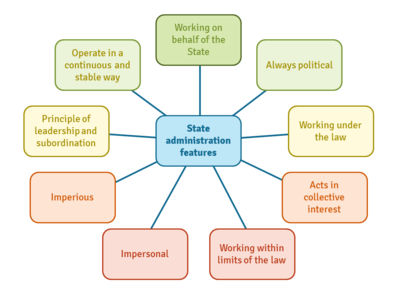

## Table of Contents

## What is a state administrator?

A state administrator is a person who helps run a state government. They work in different parts of the government, like health, education, or transportation. Their job is to make sure that the state's rules and programs work well. They also help make new rules and plans for the future.

State administrators often work closely with the governor and other leaders. They need to know a lot about their area of work and be good at managing people and money. Their goal is to make life better for people in the state by running things smoothly and solving problems.

## What are the primary functions of a state administrator?

A state administrator's main job is to help run the state government smoothly. They work in different departments like health, education, or transportation. Their job is to make sure that the state's rules and programs are working well. They also need to manage money and people in their department to make sure everything is done correctly and on time.

Another important part of their job is to help make new rules and plans for the future. They work closely with the governor and other leaders to figure out what the state needs and how to make things better. They need to understand a lot about their area of work and be good at solving problems.

Overall, state administrators aim to make life better for people in the state. They do this by running things smoothly and making sure that the state's services are working well for everyone.

## How does a state administrator interact with other government officials?

A state administrator works closely with other government officials to make sure everything runs smoothly. They often meet with the governor to talk about new plans and ideas. The governor might ask them for advice on how to solve big problems in the state. They also work with other department heads, like the head of education or health, to make sure everyone is working together. This teamwork helps them create better rules and services for the people in the state.

Sometimes, a state administrator needs to talk to lawmakers, like members of the state legislature. They might explain why a new rule is needed or how much money their department needs. This helps lawmakers make good decisions about new laws and budgets. State administrators also work with local government officials, like mayors and city managers, to make sure state and local plans match up. By working together, they can solve problems and make life better for everyone in the state.

## What qualifications are necessary to become a state administrator?

To become a state administrator, you usually need a good education. Most state administrators have at least a bachelor's degree. Many have a master's degree or even a doctorate, especially in fields like public administration, business, law, or the specific area they want to work in, like health or education. Besides education, experience is very important. Many state administrators start in lower-level government jobs and work their way up. They need to show they can manage people, money, and projects well.

Another important qualification is understanding how government works. State administrators need to know about laws, budgets, and how different parts of the government work together. They also need good communication skills because they will be working with many different people, like the governor, lawmakers, and other department heads. Being able to solve problems and make good decisions is also key. Overall, becoming a state administrator takes a mix of education, experience, and skills in managing and working with others.

## What are the typical daily responsibilities of a state administrator?

A state administrator starts their day by checking emails and messages. They need to stay updated on what's happening in their department and the whole state. They might have meetings with their team to talk about ongoing projects and plans. They also spend time managing the budget, making sure there's enough money for everything that needs to be done. They might have to make tough choices about where to spend money and where to save it.

During the day, a state administrator often meets with other government leaders, like the governor or other department heads. They discuss new ideas and ways to solve problems in the state. They might also need to talk to lawmakers about new rules or laws that are needed. Sometimes, they have to give presentations or reports to explain what their department is doing and why it's important. At the end of the day, they might review their work and plan for the next day, making sure everything is on track.

## How does a state administrator influence state policy?

A state administrator has a big role in shaping state policy. They work closely with the governor and other leaders to come up with new ideas and plans. They know a lot about their part of the government, like health or education, so they can suggest good changes. They might see a problem and think of a new rule that could help fix it. They then talk to lawmakers and explain why the new rule is needed. This helps lawmakers make good decisions about new laws.

State administrators also help decide how money is spent. They look at the budget and see where money is needed most. If they think more money should go to schools or hospitals, they can make a strong case for it. They might write reports or give speeches to show why their ideas are important. By doing this, they help guide what the state does and how it spends its money. This way, they have a big impact on state policy and how it helps people in the state.

## What challenges do state administrators commonly face?

State administrators often face many challenges. One big challenge is managing money. They have to make sure there is enough money for everything their department needs to do. Sometimes, they have to make hard choices about where to spend money and where to save it. If there is not enough money, they might have to find new ways to get it or cut back on some things. This can be tough and sometimes people get upset if they think important things are not getting enough money.

Another challenge is working with different people. State administrators need to work with the governor, other department heads, lawmakers, and local officials. Everyone has their own ideas and goals, and it can be hard to get everyone to agree. Sometimes, they have to explain their ideas over and over to make sure everyone understands. They also need to solve problems that come up, like when a new rule does not work as planned. This can take a lot of time and effort.

Dealing with changes is another common challenge. Things in the state can change quickly, like new laws or emergencies. State administrators need to be ready to change their plans and adapt to new situations. This can be stressful because they have to make quick decisions and make sure their department keeps running smoothly. Keeping up with all these challenges while trying to make life better for people in the state is a big job.

## How is the performance of a state administrator evaluated?

The performance of a state administrator is evaluated by looking at how well they manage their department. This includes checking if they are good at handling money and making sure there is enough for everything that needs to be done. They are also judged on how well they run projects and programs. If things are going smoothly and people are happy with the services, it shows that the state administrator is doing a good job. They might also be evaluated on how well they work with other people, like the governor and lawmakers, to make new rules and solve problems.

Another way to evaluate a state administrator is by looking at the results of their work. For example, if they are in charge of education, they might be judged on how well students are doing in school. If they are in charge of health, they might be evaluated on how healthy people in the state are. Reports and data help show if the state administrator is making a positive difference. Feedback from the people who use the services, like teachers or doctors, can also be important. If everyone is saying good things, it's a sign that the state administrator is doing well.

## What role does a state administrator play in budget management?

A state administrator has a big job when it comes to managing the budget. They need to make sure there is enough money for everything their department needs to do. This means they have to look at how much money they have and decide where it should go. Sometimes, they have to make hard choices about what to spend money on and where to save it. If there is not enough money, they might have to find new ways to get more or cut back on some things. This can be tough because everyone wants enough money for their part of the work.

State administrators also need to explain the budget to other people, like the governor and lawmakers. They might write reports or give speeches to show why their department needs the money it is asking for. They have to make a strong case for why certain things are important and need funding. By doing this, they help decide how the state's money is spent. It's a big responsibility because the choices they make can affect how well the state can help its people.

## How do state administrators ensure compliance with state laws and regulations?

State administrators make sure everyone follows the state's laws and rules by keeping a close watch on what's happening in their department. They set up systems to check that people are doing things the right way. For example, they might have regular meetings or reports to see if everyone is following the rules. If they find a problem, they work to fix it quickly. They might need to train people or change how things are done to make sure the rules are followed.

They also work with other parts of the government to make sure the laws are clear and fair. State administrators might talk to lawmakers to explain what rules are needed and why. They help write new rules and make sure they fit with what the state needs. By working together, they can make sure everyone understands the laws and follows them. This helps keep things running smoothly and makes life better for people in the state.

## What strategies can state administrators use to improve public services?

State administrators can improve public services by listening to what people need. They can talk to the people who use the services, like students or patients, to find out what is working and what is not. By understanding these needs, they can make better plans and changes. For example, if schools need more teachers, the state administrator can work on hiring more. They can also use data and reports to see where things can be better. This helps them make smart choices about where to spend money and what new rules to make.

Another way state administrators can improve public services is by working well with others. They need to work closely with the governor, lawmakers, and other department heads to make sure everyone is on the same page. By working together, they can create new ideas and solve problems faster. They can also learn from other states or countries that are doing a good job with their services. By trying out new ideas and seeing what works, state administrators can make big improvements to public services and help people in the state live better lives.

## How do state administrators adapt to changes in political leadership and policy priorities?

State administrators have to be ready to change when new leaders come into power or when the state's goals change. When a new governor or lawmakers take over, they might want to do things differently. State administrators need to learn about these new ideas and figure out how to make them work. They might have to change their plans or start new projects. They also need to talk to the new leaders and explain what their department is doing and why it's important. By working together, they can make sure the new ideas fit well with what the state needs.

Another way state administrators adapt is by keeping up with new laws and rules. When the state's priorities change, new laws might be made to match these new goals. State administrators need to understand these new laws and make sure their department follows them. They might have to train their team or change how they do things to meet the new rules. By staying flexible and ready to change, state administrators can help the state keep moving forward and make life better for people, even when things are different.

## References & Further Reading

[1]: US Securities and Exchange Commission. ["The Impact of Recent Technological Advances in Financial Markets"](https://www.sec.gov/news/studies/techrp97.htm)

[2]: Gomber, P., Arndt, B., Lutat, M., & Uhle, T. (2011). ["High-Frequency Trading."](https://papers.ssrn.com/sol3/papers.cfm?abstract_id=1858626) SSRN Electronic Journal.

[3]: Harris, L. (2003). ["Trading and Exchanges: Market Microstructure for Practitioners."](https://www.amazon.com/Trading-Exchanges-Market-Microstructure-Practitioners/dp/0195144708) Oxford University Press.

[4]: Securities Industry and Financial Markets Association. ["Algorithmic Trading: A Primer."](https://www.sifma.org/wp-content/uploads/2017/08/ch01.pdf)

[5]: Malkiel, B. G. (2007). ["A Random Walk Down Wall Street: The Time-tested Strategy for Successful Investing."](https://yourknowledgedigest.org/wp-content/uploads/2020/04/a-random-walk-down-wall-street.pdf) W. W. Norton & Company.

[6]: Giancarlo, C. (2020). ["Data-Driven Regulation: New Models for Banks and Financial Technologies."](https://www.nature.com/articles/s41599-023-02122-x) Brookings Institution.

[7]: Zervoudi, E., Chatzikokolakis, K., Vutsinas, S., & Mellas, N. (2020). ["Algorithmic Trading and Regulation: A Literature Review."](https://www.researchgate.net/publication/339056507_Fourth_Industrial_Revolution_Opportunities_Challenges_and_Proposed_Policies) European Financial Management Association.