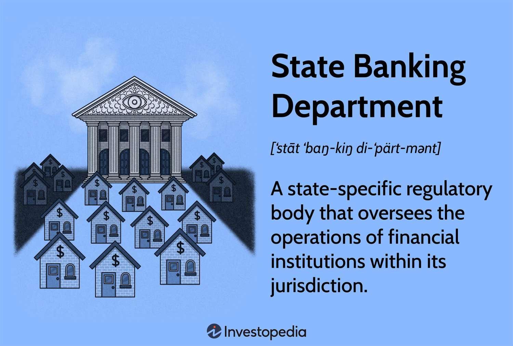

The financial system is a cornerstone of modern economies, enabling the flow of capital, managing risk, and facilitating economic growth. It encompasses a diverse array of institutions and markets that collectively contribute to the overall welfare of consumers and businesses. At the heart of this system lies an intricate framework of financial regulation and banking oversight, which serve as critical mechanisms for maintaining stability and integrity.

Financial regulation is instrumental in ensuring transparency within the markets, safeguarding against fraud, and managing systemic risks that could potentially destabilize the economy. It comprises a set of laws, guidelines, and measures designed to supervise financial institutions and manage their operations. This regulatory framework aims to build trust among stakeholders by fostering an environment where financial activities can be conducted securely and efficiently.

Central to financial regulation and oversight are state banking departments. These entities hold the responsibility for chartering, licensing, and supervising financial institutions within their jurisdictions. Beyond mere oversight, they also protect consumers and foster financial innovation, ensuring that institutions operate in a manner that aligns with the public interest. The dual banking system, characterized by the collaboration between state and federal regulators, provides a balanced approach to governance, offering comprehensive checks and balances that are essential for a resilient financial architecture.

Emerging technologies have introduced new paradigms in financial systems, most notably through algorithmic trading. This advancement has revolutionized financial markets by enhancing the speed and efficiency of transactions. Despite the opportunities it presents, algorithmic trading also introduces challenges, including increased market volatility and the risk of technological failures. Regulatory bodies such as the Securities and Exchange Commission (SEC) and the Commodity Futures Trading Commission (CFTC) are pivotal in crafting frameworks to mitigate these risks.

As innovations like artificial intelligence and blockchain continue to reshape the banking landscape, regulators globally are faced with the task of adapting to these changes. Institutions like the Basel Committee on Banking Supervision play a crucial role in ensuring a harmonized approach to incorporating technological advancements, thereby maintaining a stable financial environment.

Understanding how these elements—financial regulation, state banking oversight, and technological innovations like algorithmic trading—interact is vital for stakeholders aiming to navigate the intricate financial landscape. This article provides insights into their dynamic interplay and underscores the importance of effective regulation in fostering an environment where innovation and stability coexist, ultimately contributing to consumer welfare and economic stability.

## Table of Contents

## Understanding Financial Regulation in Banking

Financial regulation is a cornerstone in upholding the stability and integrity of financial systems globally. It encompasses a set of laws and rules designed to ensure that financial institutions operate fairly and transparently. The primary objectives of financial regulation include ensuring transparency, preventing fraud, and managing systemic risks that could destabilize the financial system.

Transparency in financial operations allows stakeholders, including consumers, investors, and regulatory bodies, to make informed decisions based on clear and accurate information. This transparency is facilitated by regulations mandating the disclosure of financial statements, risk exposures, and other pertinent data. Regulatory frameworks like the Sarbanes-Oxley Act in the United States exemplify such requirements, aiming to enhance corporate governance and financial disclosures.

Preventing fraud is another critical objective of financial regulation. Fraud, whether through misrepresentation, insider trading, or embezzlement, undermines the trust in financial institutions. Regulatory mechanisms such as the establishment of anti-money laundering (AML) laws and the enforcement of the Know Your Customer (KYC) standards aim to deter fraudulent activities and ensure that banking institutions do not become conduits for illegal operations.

Systemic risk management is also fundamental to financial regulation. The financial crisis of 2007–2008 highlighted the interconnectedness of financial institutions and the cascading effects of risk mismanagement. Regulations such as the Dodd-Frank Wall Street Reform and Consumer Protection Act were enacted to address these systemic risks by imposing stricter capital requirements and leveraging limits on banks. These measures are intended to reduce the probability of financial institutions collapsing and triggering a broader economic crisis.

Financial regulations significantly influence banking activities, notably in compliance and risk management domains. Compliance refers to the processes by which banks ensure adherence to all relevant laws, standards, and ethical practices. This involves constant monitoring and reporting, often aided by compliance departments within banks and advanced software solutions designed to flag irregularities.

Risk management within banking is intrinsically tied to regulatory requirements. Banks must assess their risk exposures, including credit, market, operational, and [liquidity](/wiki/liquidity-risk-premium) risks, and maintain adequate capital buffers to absorb potential losses. The Basel III framework, developed by the Basel Committee on Banking Supervision, outlines comprehensive measures for banks to improve their risk management capabilities, including enhanced capital adequacy ratios and the introduction of a new liquidity framework.

In summary, financial regulation is vital for maintaining system stability and credibility. By ensuring transparency, deterring fraud, and managing systemic risks, regulatory systems enable a robust framework that banks must navigate, influencing both compliance practices and risk mitigation strategies. Through these measures, regulation serves as a protective barrier, safeguarding the interests of consumers and fostering a resilient financial system capable of withstanding potential economic shocks.

## State Banking Departments and Oversight

State banking departments function as primary regulatory bodies that oversee the operations and compliance of financial institutions within their specific jurisdictions. These departments are crucial in maintaining a robust financial ecosystem, ensuring that banks and other financial entities operate within defined legal parameters. Their roles are multifaceted, encompassing several key responsibilities essential for the health and stability of the financial sector.

One of the primary responsibilities of state banking departments is the chartering and licensing of financial institutions. By granting charters, these departments authorize the creation and operation of banks, ensuring they meet stringent legal and financial criteria. Licensing involves the approval of various financial entities, allowing them to offer services like lending, savings, and investment products.

Supervision of financial institutions is another critical function of state banking departments. This involves regular examinations and audits to assess the financial health, operational integrity, and risk management practices of these entities. Through these supervisory activities, state regulators can detect potential issues early, mitigating risks that could lead to financial instability or consumer harm.

Protecting consumers is a fundamental aspect of the oversight provided by state banking departments. By ensuring that financial institutions adhere to consumer protection laws, these departments safeguard the public from unfair practices, fraud, or excessive risk-taking. This protection fosters trust in the financial system, encouraging consumer engagement and economic growth.

In fostering financial innovation, state banking departments play a supportive role by adapting regulatory frameworks to accommodate new financial technologies. This involves balancing the need for rigorous oversight with the flexibility to encourage innovation, ensuring that new products and services can enter the market without compromising consumer safety or financial stability.

The collaboration between state and federal oversight is embodied in the dual banking system of the United States. This system provides a mechanism of checks and balances, where both state and federal entities, such as the Federal Reserve and the Office of the Comptroller of the Currency (OCC), work in tandem to regulate financial institutions. This collaboration ensures that there is a comprehensive oversight framework, capable of addressing both broad national issues and specific local concerns.

The dual system allows for tailored regulatory approaches, where state-specific economic factors and risks can be more effectively managed. Simultaneously, it ensures that there is a uniform standard across the country, promoting consistency and reliability in banking practices.

In summary, state banking departments are indispensable to the stability and integrity of the financial sector. By chartering, supervising, protecting consumers, and encouraging innovation, they contribute significantly to a balanced and secure financial system. Their cooperative efforts with federal counterparts in a dual banking system further strengthen this regulatory framework, ensuring a stable economic environment conducive to growth and innovation.

## Algorithmic Trading: Opportunities and Challenges

Algorithmic trading has dramatically reshaped financial markets by enabling trades to be executed with unprecedented speed and efficiency. Utilizing complex algorithms, traders can analyze vast amounts of data and execute orders based on predefined criteria, often within milliseconds. This capability to swiftly process information and act on it has created opportunities for traders to optimize their strategies and maximize profits.

One of the significant benefits of [algorithmic trading](/wiki/algorithmic-trading) is its ability to reduce transaction costs through minimized market impact. As algorithms execute trades in smaller, strategically-timed batches, they can avoid large movements that would otherwise influence prices unfavorably. Additionally, the automated nature of algorithmic systems facilitates round-the-clock trading, providing continuous market presence and liquidity.

However, these advantages do not come without challenges. Algorithmic trading has been associated with increased market [volatility](/wiki/volatility-trading-strategies). The 2010 Flash Crash, where the Dow Jones Industrial Average plummeted nearly 1,000 points in minutes, is often cited as an example of the potential downside of automated trading systems. Such incidents highlight the role of algorithmic trading in amplifying rapid price swings, potentially leading to systemic risk.

Technological failures represent another challenge. The reliance on complex algorithms and systems means that any malfunction, whether due to faulty coding or hardware failure, can lead to significant financial losses. Furthermore, as algorithms become more sophisticated, they also become harder to supervise, posing challenges for ensuring compliance and managing risk.

In response to these challenges, regulatory frameworks by entities like the U.S. Securities and Exchange Commission (SEC) and the Commodity Futures Trading Commission (CFTC) have been established. These agencies have implemented rules to promote market stability and prevent abuses associated with high-frequency trading. For instance, the SEC's Market Access Rule requires brokers to implement risk management controls, while the CFTC's regulations necessitate the registration of high-frequency traders.

Overall, the transformative impact of algorithmic trading necessitates robust regulatory oversight to balance innovation with market integrity. By emphasizing transparency and risk management, regulatory bodies aim to harness the benefits of algorithmic trading while safeguarding the financial ecosystem.

## Modern Regulation and Technological Innovations

Recent technological advancements, particularly in [artificial intelligence](/wiki/ai-artificial-intelligence) (AI) and blockchain, have significantly transformed the landscape of traditional banking. These technologies promise to enhance efficiency, security, and transparency within the financial sector but also present new challenges that require careful regulation.

AI in banking is primarily used for automating processes, improving customer service through chatbots, enhancing fraud detection systems, and personalizing financial products. Machine learning algorithms, a subset of AI, are employed to analyze vast datasets, identifying patterns and predicting market behaviors. However, these AI systems can potentially introduce biases, which may result from the data they are trained on or from flawed algorithmic designs. Such biases can lead to unfair lending practices or discriminatory customer targeting, necessitating robust regulatory frameworks to ensure AI systems are used responsibly.

Blockchain technology, known for its decentralized, secure, and transparent ledger systems, is another innovation affecting the financial industry. It facilitates the creation of cryptocurrencies and smart contracts, streamlining processes, reducing transaction costs, and lowering the risk of fraud. Despite these advantages, blockchain raises regulatory concerns regarding security, privacy, and the potential for misuse in illicit activities such as money laundering. Regulators worldwide are working to establish guidelines that ensure the legitimate use of blockchain while preventing its application in illegal operations.

In response to these technological innovations, financial regulators have intensified their efforts to create comprehensive regulatory frameworks. The Basel Committee on Banking Supervision (BCBS) has been instrumental in these efforts, advocating for international regulatory cooperation to address the cross-border nature of financial technologies. The BCBS's work focuses on establishing standards that enhance the resilience and stability of the global banking system in the face of technological upheavals.

One of the primary challenges regulators face is balancing the need for innovation with the imperatives of risk management and consumer protection. Regulatory sandboxes have emerged as a popular approach, allowing FinTech companies to test their products in a controlled environment under the supervision of regulatory bodies. This practice enables regulators to observe the impact of new technologies and adjust regulatory frameworks accordingly, fostering innovation while ensuring compliance with essential regulatory standards.

Efforts to regulate these technological advancements are also seen in data protection laws, such as the European Union's General Data Protection Regulation (GDPR), which sets guidelines to safeguard consumers' personal information. The GDPR’s principles ensure that AI systems handle data responsibly, emphasizing transparency, fairness, and accountability.

To summarize, technological innovations such as AI and blockchain are transforming the banking sector, offering numerous benefits but also posing significant regulatory challenges. Global regulatory efforts, particularly by bodies like the Basel Committee, are crucial to establishing harmonized standards that address these challenges, ensuring that technological progress within the financial sector is both secure and sustainable.

## Conclusion

The interaction between financial regulation, state banking oversight, and algorithmic trading is pivotal in ensuring the robustness and adaptability of modern financial systems. Each component plays an essential role in both mitigating risks and seizing opportunities within the financial landscape. Financial regulation offers the framework to maintain transparency and manage systemic risks, crucial for safeguarding economic stability and consumer confidence. State banking oversight ensures localized financial institutions operate within established legal parameters, providing additional safeguards and facilitating healthy competition.

Algorithmic trading, hallmark of modern financial markets, exemplifies the dual nature of technological advancement. It brings unparalleled efficiency and speed but also introduces unique challenges such as increased market volatility and susceptibility to technological failures. Regulatory bodies like the Securities and Exchange Commission (SEC) and the Commodity Futures Trading Commission (CFTC) are essential in crafting and enforcing regulations that address these complexities, maintaining market discipline while encouraging innovation.

Understanding both historical precedents and contemporary challenges is vital for stakeholders navigating this dynamic environment. Historical insights provide a backdrop against which current challenges and innovations can be measured and assessed. As financial technology continues to evolve, effective regulation must adapt to foster an environment where innovation and stability coexist. 

Future regulatory frameworks must strive for a balance that promotes technological advancements while safeguarding the interests of consumers and maintaining overall economic health. This involves harmonized efforts from both national and international regulatory bodies to formulate policies that can flexibly respond to technological transformations such as artificial intelligence and blockchain. Only through such adaptive and forward-looking regulation can the financial sector sustainably thrive amidst continuous innovation and change.

## References & Further Reading

[1]: Hendricks, D., & Hirtle, B. (1997). ["Bank Capital Requirements for Market Risk: The Internal Models Approach."](https://www.newyorkfed.org/medialibrary/media/research/epr/97v03n4/9712hend.pdf) National Bureau of Economic Research.

[2]: Basel Committee on Banking Supervision. (2011). ["Basel III: A Global Regulatory Framework for More Resilient Banks and Banking Systems."](https://www.bis.org/publ/bcbs189.htm) Bank for International Settlements.

[3]: Madan, D. B., & Schoutens, W. (2012). ["Market Risk Management: Practical Applications and Considerations."](https://www.semanticscholar.org/paper/Conic-coconuts%3A-the-pricing-of-contingent-capital-Madan-Schoutens/71b4b16a80e3387fdcd27849f6a0df3d42b5b8d1) Wiley Finance.

[4]: Securities and Exchange Commission. (2014). ["Market Access Rule."](https://www.ecfr.gov/current/title-17/chapter-II/part-240/subpart-A/subject-group-ECFR541343e5c1fa459/section-240.15c3-5) SEC Final Rule Release No. 34-73639.

[5]: Brown, E. H. (2018). ["State Banking Regulation and the Dual Banking System."](https://www.jstor.org/stable/pdf/1228174.pdf) International Monetary Fund.

[6]: Lopez de Prado, M. (2018). ["Advances in Financial Machine Learning."](https://www.amazon.com/Advances-Financial-Machine-Learning-Marcos/dp/1119482089) Wiley.

[7]: Biais, B., Foucault, T., & Moinas, S. (2015). ["Equilibrium Fast Trading."](https://www.sciencedirect.com/science/article/pii/S0304405X15000288) Journal of Financial Economics.

[8]: European Union. (2018). ["General Data Protection Regulation (GDPR)."](https://gdpr-info.eu/).

[9]: Financial Stability Board. (2017). ["Artificial intelligence and machine learning in financial services: Market developments and financial stability implications."](https://www.fsb.org/2017/11/artificial-intelligence-and-machine-learning-in-financial-service/) 

[10]: Title, Federal Reserve. (2020). ["The Roles of the Federal Reserve System and State Banking Departments."](https://www.federalreserve.gov/publications/2020-ar-overview.htm)