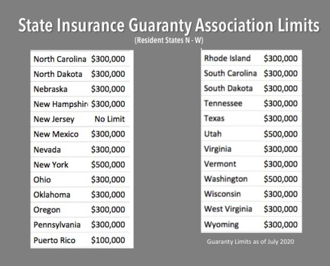

## Table of Contents

## What is a State Guaranty Fund?

A State Guaranty Fund is a type of insurance protection that helps people who have insurance policies with companies that go bankrupt. If an insurance company fails, the State Guaranty Fund steps in to make sure that policyholders still get the money they are owed. This fund is managed by each state and is funded by small assessments on insurance companies operating within that state.

The main goal of the State Guaranty Fund is to protect consumers from losing their insurance coverage or benefits due to an insurance company's failure. For example, if you have a life insurance policy and the insurance company goes bankrupt, the State Guaranty Fund will help ensure that your beneficiaries still receive the death benefit. This gives people peace of mind knowing that their insurance policies are backed by a safety net, even if the insurance company itself runs into financial trouble.

## Why was the State Guaranty Fund established?

The State Guaranty Fund was established to protect people who buy insurance. Insurance companies can sometimes go bankrupt, just like any other business. When this happens, people who have insurance policies with that company might not get the money they were promised. The State Guaranty Fund helps make sure that these people still get their insurance benefits, even if the company fails.

Each state runs its own State Guaranty Fund. The money for the fund comes from small fees that insurance companies have to pay. This way, if an insurance company goes bankrupt, the fund can step in and help pay out claims. This gives people more confidence in buying insurance because they know there is a safety net if something goes wrong with their insurance company.

## Which types of financial institutions are typically covered by the State Guaranty Fund?

The State Guaranty Fund mainly covers insurance companies. This means if you have life insurance, health insurance, or property insurance and the company goes bankrupt, the fund can help make sure you still get what you're owed. It's like a safety net for people who buy insurance, so they don't lose out if their insurance company fails.

Not all financial institutions are covered by the State Guaranty Fund. For example, banks and credit unions have a different kind of protection called the Federal Deposit Insurance Corporation (FDIC) or the National Credit Union Administration (NCUA). These organizations protect your money if a bank or credit union fails, but they don't cover insurance companies. So, the State Guaranty Fund is specifically for insurance, helping to keep your insurance benefits safe.

## How does the State Guaranty Fund protect consumers?

The State Guaranty Fund helps keep people safe if their insurance company goes bankrupt. If an insurance company fails, the fund steps in to make sure people still get the money they are supposed to get from their insurance policies. This means if you have life insurance, health insurance, or home insurance, and the company goes out of business, the State Guaranty Fund will help pay out your claims.

Each state runs its own State Guaranty Fund. The money for the fund comes from small fees that insurance companies pay. This setup makes sure there's always money available to help people if their insurance company fails. By having this safety net, people can feel more secure when they buy insurance, knowing that there's a backup plan in place to protect their benefits.

## What are the funding sources for the State Guaranty Fund?

The State Guaranty Fund gets its money from small fees that insurance companies have to pay. These fees are called assessments, and they are collected by each state. When an insurance company goes bankrupt, the fund uses this money to help pay out claims to people who had policies with that company.

This system makes sure there's always money available to help people if their insurance company fails. By collecting these small fees from insurance companies, the State Guaranty Fund can act as a safety net for policyholders. This helps people feel more secure when they buy insurance, knowing that there's a backup plan to protect their benefits if something goes wrong with their insurance company.

## How is the State Guaranty Fund managed and operated?

The State Guaranty Fund is managed by each state's insurance department or a special organization set up for this purpose. They make sure the fund has enough money to help people if their insurance company goes bankrupt. The people who run the fund keep track of the money coming in from insurance companies and use it to pay out claims when needed. They also make rules about how the fund works and how much money insurance companies need to pay in fees.

The operation of the State Guaranty Fund involves collecting small fees, called assessments, from insurance companies that do business in the state. These fees go into the fund, and when an insurance company fails, the fund uses this money to help pay the claims of people who had policies with that company. This way, the fund acts as a safety net, making sure that people don't lose their insurance benefits if their insurance company goes out of business.

## What are the eligibility criteria for claims against the State Guaranty Fund?

To be eligible for a claim against the State Guaranty Fund, you need to have an insurance policy with a company that has gone bankrupt. This means the insurance company is no longer able to pay out claims, so the fund steps in to help. You must have been a policyholder at the time the company went bankrupt, and your claim must be for a type of insurance that the fund covers, like life insurance, health insurance, or property insurance.

The State Guaranty Fund has limits on how much it can pay out. Each state sets its own limits, so it's important to check what your state's rules are. For example, there might be a cap on how much the fund will pay for a life insurance claim. If your claim is more than the limit, you might not get the full amount you were expecting. But the fund will still help you get as much money as it can within those limits.

## What is the maximum coverage amount provided by the State Guaranty Fund?

The maximum coverage amount provided by the State Guaranty Fund can vary from one state to another. Each state sets its own limits on how much the fund will pay out for different types of insurance claims. For example, some states might have a limit of $300,000 for life insurance claims, while others might have a different amount.

These limits are important because they tell you the most money you can get from the fund if your insurance company goes bankrupt. If your claim is more than the limit set by your state, you might not get the full amount you were expecting. But the fund will still help you get as much money as it can within those limits, making sure you're not left without any help at all.

## How does the State Guaranty Fund handle claims and disburse payments?

When an insurance company goes bankrupt, the State Guaranty Fund steps in to handle claims. If you had a policy with the bankrupt company, you need to file a claim with the fund. The fund will review your claim to make sure it's valid and falls within the types of insurance they cover, like life, health, or property insurance. They will also check if your claim is within the state's coverage limits.

Once your claim is approved, the State Guaranty Fund will work to pay out the money you're owed. They use the money collected from insurance companies to make these payments. If your claim is more than the state's limit, you'll get the maximum amount allowed by the fund. This process helps make sure you still get some of your insurance benefits even if the company that sold you the policy goes out of business.

## What are the differences between the State Guaranty Fund and federal insurance programs like FDIC?

The State Guaranty Fund and the Federal Deposit Insurance Corporation (FDIC) are two different kinds of safety nets for people, but they protect different things. The State Guaranty Fund is run by each state and helps people who have insurance policies, like life, health, or property insurance. If an insurance company goes bankrupt, the State Guaranty Fund steps in to make sure policyholders still get their money. On the other hand, the FDIC is a federal program that protects money people have in banks. If a bank fails, the FDIC makes sure people can still get their money back up to a certain amount.

The main difference between these two is what they cover. The State Guaranty Fund is all about insurance, and each state has its own rules and limits on how much they will pay out. The FDIC, however, is about protecting bank deposits, and it has a standard limit of $250,000 per depositor, per account type. Both programs are there to help people feel safe, but they work in different areas of finance and are managed by different levels of government.

## How do state regulations impact the operation of the State Guaranty Fund?

State regulations have a big impact on how the State Guaranty Fund works. Each state has its own rules about what kinds of insurance the fund will cover, like life insurance, health insurance, or property insurance. The state also decides how much money the fund can pay out for each claim. This means that if you have a claim, you might get a different amount of money depending on which state you live in. The state's rules also say how the fund gets its money, which usually comes from small fees that insurance companies have to pay.

These regulations help make sure the State Guaranty Fund is run fairly and has enough money to help people when their insurance company goes bankrupt. The state keeps an eye on the fund to make sure it follows all the rules and can pay out claims when needed. This way, people can feel more secure knowing that there's a safety net in place if something goes wrong with their insurance company.

## What are the challenges and limitations faced by the State Guaranty Fund in ensuring financial stability?

The State Guaranty Fund faces several challenges in ensuring financial stability. One big challenge is making sure there's enough money in the fund to cover all the claims when an insurance company goes bankrupt. The fund gets its money from small fees that insurance companies pay, but if too many companies fail at once, the fund might run out of money. Another challenge is that each state has its own rules and limits on how much the fund can pay out. This means that if your claim is more than the state's limit, you might not get all the money you were expecting.

There are also limitations to what the State Guaranty Fund can do. For example, the fund can only help with certain types of insurance, like life, health, or property insurance. If you have a different kind of insurance, the fund might not be able to help you. Also, the fund can't stop insurance companies from going bankrupt in the first place. It can only help after a company has failed. This means that even with the fund in place, there's still a risk that you might not get all your money back if your insurance company goes out of business.

## References & Further Reading

[1]: Dwight M. Jaffee. (2009). ["The Role of the State Guaranty Fund in the U.S. Insurance Industry"](https://faculty.haas.berkeley.edu/jaffee/papers/9612.pdf). Annual Review of Financial Economics.

[2]: ["Algorithmic Trading: Winning Strategies and Their Rationale"](https://books.google.com/books/about/Algorithmic_Trading.html?id=WAlFDwAAQBAJ) by Ernie Chan

[3]: Emmanual Derman and Paul Wilmott. ["The Financial Modelers' Manifesto,"](https://en.wikipedia.org/wiki/Financial_Modelers%27_Manifesto) which discusses the ethical and functional aspects of financial models and trading systems.

[4]: ["Financial Insurance and State Guaranty Funds: How Well Do They Work?"](https://www.investopedia.com/terms/s/stateguarantyfund.asp) RAND Corporation.

[5]: John Hull. ["Options, Futures, and Other Derivatives"](https://www.amazon.com/Options-Futures-Other-Derivatives-9th/dp/0133456315), which includes discussions on risk management tools and derivatives used in algorithmic trading.

[6]: ["Systemic Risk, Deposit Insurance, and The State Guaranty Fund"](https://www.chicagofed.org/publications/economic-perspectives/2024/3) Journal of Banking & Finance.

[7]: [Investopedia’s Guide to State Guaranty Associations](https://www.investopedia.com/terms/i/insurance-guaranty-association.asp) explaining how state-based guaranty associations backstop insurance policies when insurers fail.