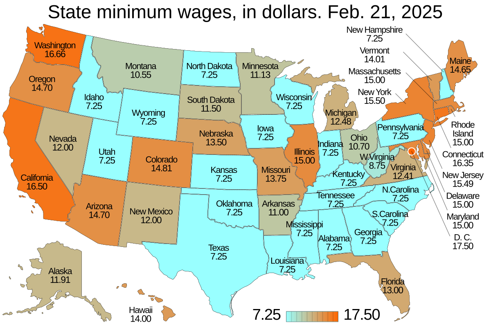

## Table of Contents

## What is the minimum wage?

The minimum wage is the lowest amount of money that employers are allowed to pay their workers. It is set by the government to make sure that workers earn enough to live on. Different countries have different minimum wages, and sometimes it can change from one year to the next. In the United States, for example, the federal minimum wage is $7.25 per hour, but some states have their own higher minimum wages.

Minimum wage laws help to protect workers from being paid too little. They are important because they help to reduce poverty and make sure that everyone can afford basic needs like food and housing. However, some people argue that minimum wage laws can make it harder for businesses to hire new workers, because they have to pay more. This can lead to debates about whether the minimum wage should be raised or kept the same.

## Why do states have different minimum wage rates?

States have different minimum wage rates because each state can make its own rules about how much workers should be paid. The federal government sets a minimum wage that applies to the whole country, but states can choose to set a higher minimum wage if they want to. This means that in some states, workers might earn more than the federal minimum wage, while in other states, they might earn the federal minimum wage or even less if they are in certain job categories that are exempt from the federal minimum wage.

The reason states choose different minimum wages can depend on things like the cost of living in that state, how much money people need to live comfortably, and what the state government thinks is fair. For example, in states where it costs more to live, like California or New York, the minimum wage might be higher to help workers afford things like rent and food. On the other hand, in states where the cost of living is lower, the minimum wage might not need to be as high. This way, states can try to make sure their workers are paid enough to meet their needs.

## How often do state minimum wage rates change?

State minimum wage rates can change at different times. Some states change their minimum wage every year, while others might change it every few years or not at all. It depends on the laws in each state. Sometimes, the state government decides to raise the minimum wage to help workers earn more money, especially if the cost of living goes up.

The changes can happen because of new laws passed by the state government or because of automatic increases that were set up earlier. For example, some states have laws that say the minimum wage will go up a little bit every year without needing a new vote. This helps make sure that workers' pay keeps up with inflation and other changes in the economy.

## Which state currently has the highest minimum wage?

Washington D.C. has the highest minimum wage in the United States. As of now, the minimum wage in Washington D.C. is $17.00 per hour. This is higher than any state's minimum wage.

The reason Washington D.C. has such a high minimum wage is because the cost of living there is very high. Things like rent, food, and other basic needs cost a lot of money in Washington D.C., so the government decided to set a higher minimum wage to help workers afford these things.

## Which state currently has the lowest minimum wage?

Georgia and Wyoming have the lowest minimum wage in the United States. Both states have a minimum wage of $5.15 per hour. This is lower than the federal minimum wage of $7.25 per hour. But, workers in these states still get at least the federal minimum wage because the federal law says employers must pay at least that amount if the state minimum wage is lower.

The reason some states have a lower minimum wage is because the cost of living in those states is not as high as in other places. In Georgia and Wyoming, things like rent and food might cost less than in bigger cities. So, the state government might think that workers do not need as much money to live comfortably. But, even with a lower state minimum wage, the federal minimum wage makes sure that workers still earn enough to meet their basic needs.

## How does the federal minimum wage compare to state minimum wages?

The federal minimum wage is the lowest amount of money that workers can be paid across the whole country. Right now, it is set at $7.25 per hour. But, states can choose to have their own minimum wage that is higher than the federal one. If a state has a higher minimum wage, then workers in that state get paid the state's rate instead of the federal one. For example, Washington D.C. has the highest minimum wage at $17.00 per hour, which is much higher than the federal minimum wage.

Some states, like Georgia and Wyoming, have a minimum wage that is lower than the federal one. Their state minimum wage is $5.15 per hour. But, because of the federal law, workers in these states still get paid at least the federal minimum wage of $7.25 per hour. This means that no matter where you work in the U.S., you will earn at least $7.25 per hour, but you might earn more if your state has a higher minimum wage.

## What are the arguments for increasing the minimum wage?

People who want to increase the minimum wage say it helps workers earn enough money to live on. They argue that the cost of living goes up over time, and if the minimum wage stays the same, workers can't afford things like rent, food, and healthcare. By raising the minimum wage, workers would have more money to spend on their needs, which would make their lives better. This could also help reduce poverty because more people would be able to earn enough to support themselves and their families.

Another argument is that increasing the minimum wage can be good for the economy. When workers earn more money, they can spend more on goods and services. This can help businesses grow because more people are buying things. It can also lead to less need for government help programs because workers are [earning](/wiki/earning-announcement) more on their own. Some studies show that raising the minimum wage doesn't always lead to fewer jobs, as businesses might find other ways to save money or increase prices a little bit to cover the higher wages.

## What are the arguments against increasing the minimum wage?

People who are against raising the minimum wage say it could make it harder for businesses to hire new workers. If businesses have to pay more money to their employees, they might not be able to hire as many people. This could lead to higher unemployment, especially for young people or those with less experience who are just starting out. Businesses might also have to raise prices to cover the higher wages, which could make things more expensive for everyone.

Another argument is that raising the minimum wage might hurt small businesses the most. Small businesses often don't have a lot of extra money, so paying higher wages could be really hard for them. They might have to cut back on other things or even close down if they can't afford to pay their workers more. Some people also think that the minimum wage should be left alone because it's already hard enough for businesses to make a profit without making it even harder by raising wages.

## How do state minimum wage laws affect small businesses?

State minimum wage laws can make things harder for small businesses. When the minimum wage goes up, small businesses have to pay their workers more money. This can be tough because small businesses usually don't have a lot of extra money to spend. They might have to raise the prices of their products or services to cover the higher wages. If they can't do that, they might have to cut back on other things, like hiring new workers or buying new equipment. In some cases, a small business might even have to close down if it can't afford to pay the higher wages.

On the other hand, some small businesses might find ways to handle the higher minimum wage. They might look for ways to save money in other areas, like using technology to do some jobs instead of hiring more people. Or they might find that their workers are happier and work harder because they are earning more money. This could help the business in the long run. But it's still a big challenge for small businesses to deal with higher minimum wages, and it can be different for each business depending on where they are and what they do.

## What is the impact of minimum wage increases on employment rates?

When the minimum wage goes up, it can affect how many people are working. Some people think that if businesses have to pay more money to their workers, they might not be able to hire as many people. This could mean that fewer people have jobs, especially young people or those who are just starting out. Businesses might also have to raise prices to cover the higher wages, which could make things more expensive and might lead to even fewer jobs if people can't afford to buy as much.

On the other hand, some studies show that raising the minimum wage doesn't always lead to fewer jobs. When workers earn more money, they can spend more on things they need, which can help businesses grow. This might mean that businesses can hire more people because they are making more money. Also, if workers are paid more, they might be happier and work harder, which could be good for businesses in the long run. So, the impact of minimum wage increases on employment rates can be different depending on the situation.

## How do tipped employees' wages differ from the standard minimum wage?

Tipped employees, like servers in restaurants or bartenders, can be paid a lower base wage than the standard minimum wage. In the United States, the federal tipped minimum wage is $2.13 per hour. This is much less than the federal standard minimum wage of $7.25 per hour. The idea is that these workers will make up the difference with tips from customers. If their tips plus the base wage don't add up to at least the standard minimum wage, the employer has to make up the difference to make sure the worker earns at least $7.25 per hour.

Some states have their own rules about tipped wages. In some states, the tipped minimum wage is higher than the federal one, but it's still less than the standard minimum wage. Other states don't allow a lower tipped minimum wage at all, so tipped workers get the same minimum wage as everyone else. The rules can be different in each state, so it's important for tipped workers to know what the law says where they work. This helps make sure they are paid fairly and get at least the minimum wage when their tips are included.

## What future trends can we expect in state minimum wage policies?

In the future, more states might choose to raise their minimum wages. This could happen because the cost of living keeps going up, and people need more money to afford things like rent and food. Some states already have laws that say the minimum wage will go up a little bit every year without needing a new vote. This helps make sure that workers' pay keeps up with inflation and other changes in the economy. As more people learn about how important the minimum wage is, more states might decide to make changes to help their workers earn enough to live on.

Another trend we might see is more debates about the minimum wage. People have different ideas about whether the minimum wage should go up or stay the same. Some think raising the minimum wage is good because it helps workers and the economy. Others worry that it could make it harder for businesses to hire new workers. These debates could lead to more states trying new ideas, like setting different minimum wages for different parts of the state or for different types of jobs. As these discussions continue, we might see more changes in how states handle their minimum wage policies.

## References & Further Reading

[1]: {"State Minimum Wages." U.S. Department of Labor.](https://www.dol.gov/agencies/whd/minimum-wage/state) An official resource that provides information on the current minimum wage laws across different states in the U.S.

[2]: Card, D., & Krueger, A. B. (1995). ["Myth and Measurement: The New Economics of the Minimum Wage."](https://www.jstor.org/stable/j.ctv7h0s52) Princeton University Press. A seminal book examining the impact of minimum wage increases on employment.

[3]: Engle, R. F., & Rangan, T. (1999). "Understanding the Financial Market Dynamics: Exchange Rates, Interest Rates, and Volatility." *NBER Reporter.* Discusses financial market dynamics relevant to algorithmic trading.

[4]: ["Algorithmic Trading: Winning Strategies and Their Rationale"](https://www.amazon.com/Algorithmic-Trading-Winning-Strategies-Rationale-ebook/dp/B00CY5HC0U) by Ernest P. Chan. A practical guide to the essentials of algorithmic trading.

[5]: Perry, M. J., & Earle, J. S. (2001). ["The Wage-Labor Market in Transition Economies."](https://www.nature.com/articles/nature04451) Journal of Economic Perspectives, 15(3), 7-30. A research article exploring labor market dynamics, useful for understanding economic impacts of wage changes.

[6]: ["The Impact of Minimum Wages on Employment"](https://usafacts.org/articles/what-happens-to-employment-when-the-minimum-wage-is-increased/) by David Neumark. An article assessing the employment effects of minimum wage policies, relevant to understanding economic fluctuations impacting algorithmic trading.