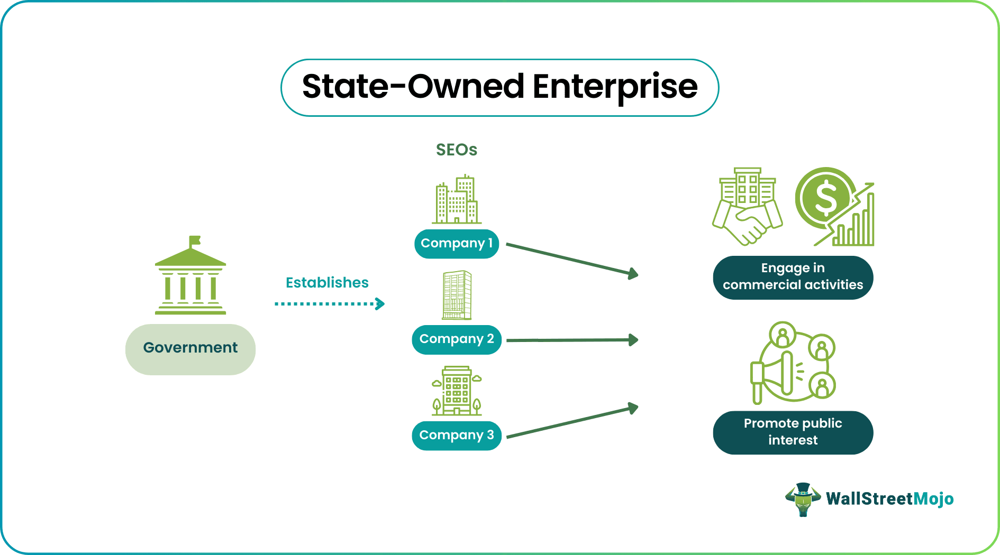

## Table of Contents

## What is a state-owned enterprise (SOE)?

A state-owned enterprise (SOE) is a business that is owned and operated by the government of a country. This means that the government has control over the company's decisions and operations. SOEs can be found in many different industries, like energy, transportation, and telecommunications. They are often created to provide important services to the public or to help the government control key parts of the economy.

SOEs can have both advantages and disadvantages. On one hand, they can help ensure that essential services are available to everyone, even in areas where private companies might not want to operate. They can also be used to support national goals, like developing new industries or protecting jobs. On the other hand, SOEs can sometimes be less efficient than private companies because they might not face the same competition. They can also be influenced by political decisions, which might not always be the best for the business or the economy.

## What are the common types of state-owned enterprises?

State-owned enterprises come in different forms. Some are fully owned by the government, which means the government has complete control over them. These can include big companies like national airlines or postal services. Other SOEs are partly owned by the government, where the government owns a majority of the shares but private investors can also own some shares. This type of SOE can be found in industries like banking or energy.

Another common type of SOE is the public corporation. These are set up by the government to run services that are important for the public, like water supply or electricity. Public corporations usually have some independence from the government in their day-to-day operations, but the government still sets the overall goals and policies. Lastly, there are also SOEs that operate as commercial companies but with a social mission, like providing affordable housing or healthcare. These companies aim to make a profit but also focus on serving the public good.

## How are state-owned enterprises typically funded?

State-owned enterprises are usually funded by the government. This means the government gives them money from taxes or other sources like selling bonds. Sometimes, SOEs can also get money by borrowing from banks or other financial institutions. The government might guarantee these loans, which makes it easier for the SOE to borrow money because lenders know the government will help if the SOE can't pay back the loan.

In some cases, SOEs can also make money by selling goods or services. For example, a state-owned oil company can sell oil and use the profits to fund its operations. If an SOE is partly owned by private investors, it might also get money from selling shares to these investors. This mix of funding helps SOEs to keep running and to grow, even though they are controlled by the government.

## What is the role of state-owned enterprises in the economy?

State-owned enterprises play an important role in the economy. They help the government control important parts of the economy, like energy, transportation, and communication. This can be good because it makes sure that everyone can use these services, even if they live in places where private companies don't want to go. SOEs can also help the government reach big goals, like building new industries or keeping jobs safe for people.

But SOEs can also have some problems. Sometimes, they might not work as well as private companies because they don't have to compete as much. They might also be influenced by politics, which can make them do things that are not good for the business or the economy. Even with these challenges, SOEs are still very important in many countries because they help the government take care of the public and keep the economy running smoothly.

## How do state-owned enterprises differ from private companies?

State-owned enterprises (SOEs) and private companies are different in who owns them and how they are run. SOEs are owned by the government, which means the government makes the big decisions about what the company does. Private companies, on the other hand, are owned by people or other companies that are not part of the government. These owners, called shareholders, decide what the company should do to make money.

Another big difference is how they get money and what they do with it. SOEs often get money from the government, like from taxes or loans that the government helps with. They might also make money by selling things, but their main goal is often to help the public or reach big goals set by the government. Private companies mostly get money by selling things or services, and their main goal is to make a profit for their owners. This focus on making money can make private companies work differently than SOEs, which might care more about helping people than making a profit.

## What are the advantages of state-owned enterprises?

State-owned enterprises have some big advantages. One of them is that they can make sure important services are available to everyone. For example, a state-owned company might run the trains or buses in a country, making sure people can get around even if they live far away from big cities. This is good because private companies might not want to go to these places if they can't make enough money. Another advantage is that SOEs can help the government reach big goals. They can be used to start new industries, like making electric cars, or to keep jobs safe for people. This can help the whole country grow and do well.

Another good thing about SOEs is that they can focus on helping people instead of just making money. For example, a state-owned hospital might work to give good healthcare to everyone, not just to people who can pay a lot. This can make life better for many people. Also, because the government owns them, SOEs can be used to make sure important parts of the economy, like energy or water, are controlled in a way that helps everyone, not just a few people. This can make the country more stable and fair.

## What are the challenges and criticisms faced by state-owned enterprises?

One big challenge for state-owned enterprises is that they might not work as well as private companies. This is because they don't have to compete as much. When a company doesn't have to fight for customers, it might not try as hard to be good at what it does. Also, SOEs can be slow to make changes because they have to follow a lot of government rules. This can make it hard for them to keep up with new ideas and technology.

Another problem is that SOEs can be influenced by politics. Sometimes, the government might make the SOE do things that are good for politicians but not good for the business or the people it serves. This can lead to bad decisions and waste money. Critics also say that SOEs can be unfair to private companies. Because the government owns them, SOEs might get special help, like money or laws that make it easier for them to do business. This can make it hard for private companies to compete and can hurt the economy.

Overall, while state-owned enterprises can do a lot of good, like making sure everyone has access to important services, they also face big challenges. They need to find a balance between helping the public and working well as a business. If they can't do this, they might not be as helpful as they could be.

## How is governance structured in state-owned enterprises?

In state-owned enterprises, the government usually has the biggest say in how things are run. The government might pick a board of directors to make big decisions for the company. This board works to make sure the company follows the government's goals, like helping people or growing the economy. The board also watches over the company's leaders, like the CEO, to make sure they are doing a good job. Sometimes, the government might also have special departments or people who keep an eye on the SOE to make sure it is doing what it should.

Even though the government is in charge, SOEs often have their own way of running things day-to-day. They might have managers and teams that work like any other company, making plans and decisions to keep the business going. But these managers still have to follow the rules and goals set by the government. This can sometimes make things tricky because the SOE has to balance what the government wants with what is best for the business. It's important for SOEs to have clear rules and good communication between the government and the company to make sure everyone knows what to do and how to do it.

## What are some examples of successful state-owned enterprises globally?

One example of a successful state-owned enterprise is Singapore Airlines. It is owned by the Singapore government and is known around the world for being one of the best airlines. Singapore Airlines focuses on giving great service to its customers and has won many awards for this. The government's support has helped the airline grow and do well, even when times are tough. This shows how a state-owned enterprise can be run like a business and still help the country's goals, like making Singapore a big place for travel.

Another example is Petrobras, the Brazilian state-owned oil company. Petrobras is one of the biggest oil companies in the world and plays a big role in Brazil's economy. The company has been good at finding and using oil resources, which has helped Brazil grow. Petrobras also works on new ways to use energy, like making biofuels. Even though it has had some problems, Petrobras shows how a state-owned enterprise can be important for a country's economy and help it move forward.

These examples show that state-owned enterprises can do well when they are run the right way. They can help the government reach big goals while also being good at what they do. It's important for these companies to balance helping people and making money, which can be hard but is possible with good planning and leadership.

## How do state-owned enterprises impact competition and market dynamics?

State-owned enterprises can affect how other companies compete and how markets work. When the government owns a company, it might give that company special help, like money or laws that make it easier for them to do business. This can make it hard for other companies to compete because the state-owned enterprise has an advantage. For example, a state-owned bank might get money from the government to give out loans at lower rates than private banks can offer. This can make it tough for private banks to keep up, and it can change how the whole market works.

On the other hand, state-owned enterprises can also help markets in some ways. They can make sure that important services, like electricity or water, are available to everyone, even in places where private companies might not want to go. This can help keep the market stable and fair. But it's a tricky balance. If state-owned enterprises have too much power, they might stop other companies from competing fairly. This can lead to less choice for customers and might make the whole market less lively and innovative.

## What are the international regulations and standards affecting state-owned enterprises?

State-owned enterprises have to follow rules set by different countries and international groups. One big set of rules comes from the World Trade Organization (WTO). The WTO wants to make sure that all countries can trade fairly with each other. They have rules that say state-owned enterprises should not get special help from their governments that makes it hard for companies from other countries to compete. This is to keep the playing field fair for everyone. Another important set of rules comes from the Organisation for Economic Co-operation and Development (OECD). The OECD has guidelines that help countries make sure their state-owned enterprises are run well and fairly. These guidelines talk about things like how to pick the people who run the company and how to make sure the company is doing a good job.

These international rules and standards are important because they help make sure that state-owned enterprises do not cause problems in the global market. They try to stop governments from giving their own companies too much help, which could hurt companies from other countries. By following these rules, countries can work together better and make sure that everyone has a fair chance to compete. This can lead to a healthier and more balanced global economy where state-owned enterprises can still play an important role without causing unfair competition.

## How can state-owned enterprises be reformed to improve efficiency and performance?

To make state-owned enterprises work better and do a good job, one important step is to make them more like private companies. This means letting them compete with other companies and giving them more freedom to make their own decisions. When state-owned enterprises have to fight for customers, they might work harder to be good at what they do. Also, having a board of directors that knows a lot about business can help. These people can make sure the company is run well and is focused on doing a good job, not just on what the government wants.

Another way to improve state-owned enterprises is to make them more open and honest. This means they should tell everyone what they are doing and how they are doing it. By being clear about their plans and results, state-owned enterprises can be watched more closely by the public and the government. This can help stop bad decisions and make sure the company is working in a way that helps everyone. Also, giving managers and workers good reasons to do a great job, like bonuses or other rewards, can make the company more efficient and successful.

## References & Further Reading

[1]: Lopez de Prado, M. (2018). ["Advances in Financial Machine Learning."](https://www.amazon.com/Advances-Financial-Machine-Learning-Marcos/dp/1119482089) John Wiley & Sons.

[2]: Chan, E. (2009). ["Quantitative Trading: How to Build Your Own Algorithmic Trading Business."](https://github.com/ftvision/quant_trading_echan_book) John Wiley & Sons.

[3]: Aronson, D. R. (2006). ["Evidence-Based Technical Analysis: Applying the Scientific Method and Statistical Inference to Trading Signals."](https://www.amazon.com/Evidence-Based-Technical-Analysis-Scientific-Statistical/dp/0470008741) John Wiley & Sons.

[4]: Jansen, S. (2020). ["Machine Learning for Algorithmic Trading: Predictive models to extract signals from market and alternative data for systematic trading strategies with Python."](https://github.com/stefan-jansen/machine-learning-for-trading) Packt Publishing.

[5]: Bergstra, J., Bardenet, R., Bengio, Y., & Kégl, B. (2011). ["Algorithms for Hyper-Parameter Optimization."](https://dl.acm.org/doi/10.5555/2986459.2986743) Advances in Neural Information Processing Systems 24.