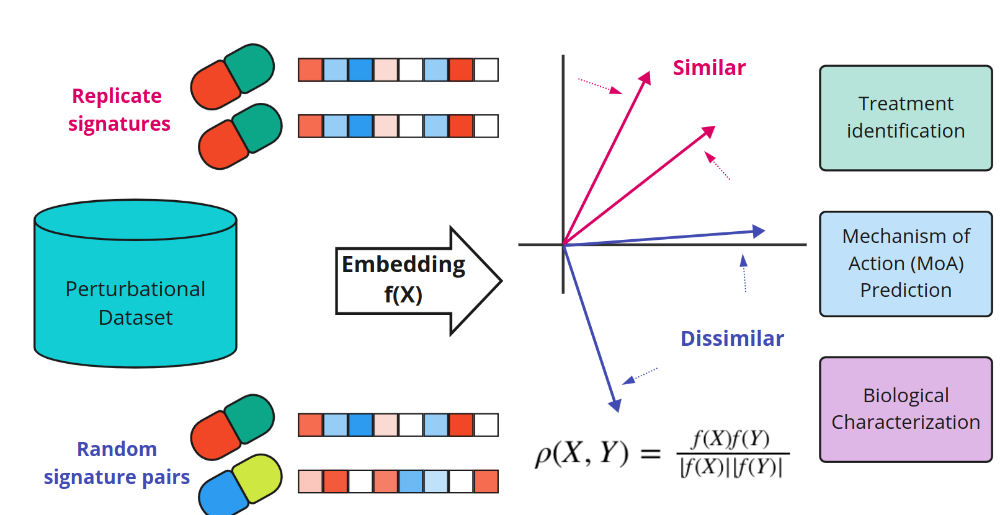

## Table of Contents

## What are State Similarity Metrics in the context of machine learning?

State Similarity Metrics are tools used in machine learning to measure how similar two states or data points are. Imagine you have a bunch of pictures, and you want to know which ones look alike. State Similarity Metrics help you do that by calculating a number that shows how close two pictures are in terms of their features, like color, shape, or texture. This is very useful in tasks like clustering, where you group similar items together, or in recommendation systems, where you suggest items based on similarity to what someone has liked before.

In more technical terms, these metrics often involve calculating a distance or similarity score between two vectors that represent the states. Common metrics include Euclidean distance, cosine similarity, and others. For example, if you use Euclidean distance, you're measuring the straight-line distance between two points in a multi-dimensional space. The formula for Euclidean distance between two points $$x$$ and $$y$$ in an n-dimensional space is $$d(x, y) = \sqrt{\sum_{i=1}^{n} (x_i - y_i)^2}$$. By using such metrics, machine learning algorithms can better understand and process data, making more accurate predictions or classifications.

## Why are State Similarity Metrics important in machine learning?

State Similarity Metrics are important in machine learning because they help computers understand how similar or different pieces of data are. Imagine you're trying to sort a bunch of toys into groups. You'd look at their shapes, colors, and sizes to decide which ones go together. In machine learning, these metrics do the same thing but with data. They measure how close or far apart data points are, which is crucial for tasks like clustering, where you want to group similar items, or in recommendation systems, where you suggest things based on what someone has liked before.

These metrics also play a key role in improving the accuracy of [machine learning](/wiki/machine-learning) models. For example, when training a model to recognize images, the model needs to know how similar one image is to another. By using a State Similarity Metric like Euclidean distance, $$d(x, y) = \sqrt{\sum_{i=1}^{n} (x_i - y_i)^2}$$, the model can better understand the relationships between images. This understanding helps the model make better predictions or classifications, making it more useful and reliable in real-world applications.

## What is the basic concept behind Playstyle Distance?

Playstyle Distance is a way to measure how different two players' styles of playing a game are. Imagine you and your friend are playing a video game. You might like to run around and attack quickly, while your friend prefers to hide and plan their moves carefully. Playstyle Distance helps us see how different these ways of playing are by looking at things like how fast you move, how often you attack, and what strategies you use.

To calculate Playstyle Distance, we can use different methods, like the Euclidean distance. If we think of each player's style as a point in a space where each direction represents a different aspect of their play, we can measure the straight-line distance between these points. The formula for Euclidean distance between two points $$x$$ and $$y$$ in an n-dimensional space is $$d(x, y) = \sqrt{\sum_{i=1}^{n} (x_i - y_i)^2}$$. This helps us understand how similar or different players are, which can be useful for matching players in games or for studying how people play games.

## How is Playstyle Distance calculated?

Playstyle Distance is a way to figure out how different two players' ways of playing a game are. Imagine you and your friend are playing a video game. You might like to run around and attack quickly, while your friend prefers to hide and plan their moves carefully. Playstyle Distance helps us see how different these ways of playing are by looking at things like how fast you move, how often you attack, and what strategies you use.

To calculate Playstyle Distance, we can use something called Euclidean distance. Think of each player's style as a point in a space where each direction represents a different aspect of their play. The Euclidean distance formula helps us measure the straight-line distance between these points. The formula for Euclidean distance between two points $$x$$ and $$y$$ in an n-dimensional space is $$d(x, y) = \sqrt{\sum_{i=1}^{n} (x_i - y_i)^2}$$. This helps us understand how similar or different players are, which can be useful for matching players in games or for studying how people play games.

## What are the applications of Playstyle Distance in machine learning?

Playstyle Distance can be used in machine learning to help match players in online games. Imagine you're playing a game and want to have fun with someone who plays like you. By using Playstyle Distance, the game can find another player whose style is similar to yours. This makes the game more enjoyable because you're playing with someone who likes to play in a similar way. The distance can be calculated using the Euclidean distance formula, $$d(x, y) = \sqrt{\sum_{i=1}^{n} (x_i - y_i)^2}$$, where each aspect of the playstyle, like speed or strategy, is a dimension in the space.

Another use of Playstyle Distance in machine learning is to help game developers understand how players are playing their games. By studying the distances between different playstyles, developers can see patterns and trends. This can help them make the game better by adding features that players like or fixing parts of the game that players find difficult. Understanding these playstyle differences can lead to more personalized gaming experiences, making the game more fun for everyone.

## What is the Policy Similarity Metric and how does it differ from Playstyle Distance?

The Policy Similarity Metric is a way to measure how similar two strategies or policies are in a game or a decision-making process. Imagine you and your friend are playing a game where you need to decide what to do next. Your strategy might be to always attack, while your friend's strategy might be to defend and wait for the right moment. The Policy Similarity Metric helps us see how close these strategies are by looking at the choices each player makes. It's like comparing two recipes to see how similar they are by looking at the ingredients and steps. This metric can be calculated using different methods, like the Euclidean distance, where the formula is $$d(x, y) = \sqrt{\sum_{i=1}^{n} (x_i - y_i)^2}$$.

Playstyle Distance and Policy Similarity Metric are similar because they both measure how different two things are, but they focus on different aspects. Playstyle Distance looks at how players actually play the game, like how fast they move or how often they attack. It's about the actions and behaviors during the game. On the other hand, the Policy Similarity Metric focuses on the strategies or policies that players follow, which are the plans or rules they use to decide what to do. So, while Playstyle Distance might tell you that two players run around a lot, the Policy Similarity Metric would tell you if they are following the same strategy, like always attacking or always defending. Both metrics help in understanding and improving games, but they give different kinds of information.

## How can the Policy Similarity Metric be used to improve machine learning models?

The Policy Similarity Metric can help improve machine learning models by showing how similar different strategies are. Imagine you're teaching a computer to play a game. You might have different ways for the computer to decide what to do next. By using the Policy Similarity Metric, you can see how close these different ways are to each other. If two strategies are very similar, you might not need both. This can help make your model simpler and work better because it focuses on the most important strategies. The metric can be calculated using the Euclidean distance formula, $$d(x, y) = \sqrt{\sum_{i=1}^{n} (x_i - y_i)^2}$$, where each aspect of the strategy is a dimension in the space.

Another way the Policy Similarity Metric can help is by making the model more accurate. When you're training a machine learning model, you want it to learn the best way to do things. By comparing different strategies using the Policy Similarity Metric, you can find the best one or even mix the good parts of different strategies together. This can lead to a model that makes better choices and performs better in the game or task it's working on. Understanding how similar or different strategies are helps the model learn and improve faster.

## What are the mathematical foundations of the Policy Similarity Metric?

The mathematical foundation of the Policy Similarity Metric lies in measuring how close two strategies or policies are to each other. This is often done using distance metrics, like the Euclidean distance. Imagine you have two strategies, each represented as a point in a space where each direction represents a different part of the strategy. The Euclidean distance between these points can be calculated using the formula $$d(x, y) = \sqrt{\sum_{i=1}^{n} (x_i - y_i)^2}$$. This formula calculates the straight-line distance between the two points, helping you see how similar or different the strategies are.

Another way to measure policy similarity is through other distance or similarity measures, like cosine similarity or Manhattan distance. Cosine similarity looks at the angle between two vectors representing the strategies, which can be useful when the magnitude of the strategies isn't as important as their direction. The formula for cosine similarity is $$ \text{similarity} = \frac{\sum_{i=1}^{n} x_i y_i}{\sqrt{\sum_{i=1}^{n} x_i^2} \sqrt{\sum_{i=1}^{n} y_i^2}} $$. On the other hand, Manhattan distance, also known as L1 distance, sums up the absolute differences between the coordinates of the two points, which can be useful in certain scenarios. The formula for Manhattan distance is $$d(x, y) = \sum_{i=1}^{n} |x_i - y_i|$$. By using these mathematical tools, the Policy Similarity Metric helps in understanding and comparing different strategies effectively.

## Can you explain a case study where State Similarity Metrics were effectively used?

In a case study, State Similarity Metrics were effectively used in a recommendation system for a music streaming service. The service wanted to suggest new songs to users based on what they had listened to before. To do this, they used the Euclidean distance as a State Similarity Metric to measure how similar the features of different songs were. Each song was represented as a point in a space where each direction represented a different feature like tempo, genre, and popularity. By calculating the distance between these points using the formula $$d(x, y) = \sqrt{\sum_{i=1}^{n} (x_i - y_i)^2}$$, the service could find songs that were close to what the user liked. This made the recommendations more accurate and helped users discover new music they enjoyed.

The results of using State Similarity Metrics in this case were very positive. Users reported that the recommendations felt more personalized and relevant to their tastes. The service saw an increase in user engagement because people were spending more time exploring the suggested songs. This case study showed how powerful State Similarity Metrics can be in making machine learning systems more useful and enjoyable for users. By understanding how similar or different things are, the system could better match what users wanted to hear.

## What are the challenges and limitations of using State Similarity Metrics?

Using State Similarity Metrics can be tricky because they depend a lot on how you measure things. If you pick the wrong way to measure how similar two things are, you might get results that don't make sense. For example, if you use the Euclidean distance formula, $$d(x, y) = \sqrt{\sum_{i=1}^{n} (x_i - y_i)^2}$$, to compare songs, you might think two songs are very different just because they have different tempos, even if they sound very similar in other ways. This can lead to bad recommendations or wrong groupings in machine learning models. Also, State Similarity Metrics can be hard to use when you have a lot of data because calculating distances between many points takes a long time and a lot of computer power.

Another challenge is that State Similarity Metrics can be sensitive to the scale of the data. If one feature, like the [volume](/wiki/volume-trading-strategy) of a song, is much bigger than others, it can make that feature seem more important than it really is. This can mess up your results. To fix this, you might need to change the scale of your data, but that can be hard to do right. Plus, different metrics might work better for different kinds of data. For example, cosine similarity might be better for text data, but Euclidean distance might be better for numbers. Choosing the right metric can be hard and can affect how well your machine learning model works.

## How can advanced techniques enhance the accuracy of State Similarity Metrics?

Advanced techniques can make State Similarity Metrics more accurate by using smarter ways to measure how similar things are. One way is to use machine learning to learn what makes things similar instead of just using a simple formula like $$d(x, y) = \sqrt{\sum_{i=1}^{n} (x_i - y_i)^2}$$. For example, you can use neural networks to find patterns in the data that a simple distance measure might miss. These networks can learn what features are most important for saying if two things are similar, which can make the metrics more accurate. Also, techniques like dimensionality reduction can help by making the data easier to work with. By turning high-dimensional data into something simpler, you can see the important differences more clearly and make better similarity measurements.

Another way to improve State Similarity Metrics is by using ensemble methods, where you combine different metrics to get a better overall measure. For example, you might use both Euclidean distance and cosine similarity and then combine their results to get a more accurate picture of how similar two things are. This can help because different metrics might be good at catching different kinds of similarities. Also, you can use adaptive scaling to make sure all the features are treated fairly. If one feature is much bigger than others, it can mess up the results. By adjusting the scale of each feature, you can make sure that the similarity metric works well no matter what the data looks like. These advanced techniques can make State Similarity Metrics much more powerful and useful in machine learning.

## What future developments are expected in the field of State Similarity Metrics?

In the future, State Similarity Metrics are expected to become even smarter and more accurate. One big change might be using more advanced machine learning techniques, like [deep learning](/wiki/deep-learning), to figure out how similar things are. Instead of just using simple formulas like $$d(x, y) = \sqrt{\sum_{i=1}^{n} (x_i - y_i)^2}$$, these new methods could learn from lots of data to find the best way to measure similarity. This could make things like recommendation systems and clustering much better because they would understand the data in a more detailed way. Also, we might see more use of real-time data to make these metrics even more up-to-date and useful.

Another expected development is the use of more personalized State Similarity Metrics. Right now, the same metric is used for everyone, but in the future, these metrics might change based on who is using them. For example, if you're using a music app, the app might learn what you think makes songs similar and use that to make better recommendations just for you. This could make things like games and apps feel more personal and fun. Plus, as computers get faster and better, we might be able to use these metrics on much bigger sets of data, making them even more powerful and useful in all kinds of machine learning tasks.

## References & Further Reading

[1]: Watkins, C. J. C. H., & Dayan, P. (1992). ["Q-Learning."](https://link.springer.com/article/10.1007/BF00992698) Machine Learning.

[2]: Goodfellow, I., Bengio, Y., & Courville, A. (2016). ["Deep Learning."](https://link.springer.com/article/10.1007/s10710-017-9314-z) MIT Press.

[3]: Manning, C. D., Raghavan, P., & Schütze, H. (2008). ["Introduction to Information Retrieval."](https://nlp.stanford.edu/IR-book/information-retrieval-book.html) Cambridge University Press.

[4]: Bishop, C. M. (2006). ["Pattern Recognition and Machine Learning."](https://www.cs.uoi.gr/~arly/courses/ml/tmp/Bishop_book.pdf) Springer.

[5]: Sutton, R. S., & Barto, A. G. (2018). ["Reinforcement Learning: An Introduction."](https://web.stanford.edu/class/psych209/Readings/SuttonBartoIPRLBook2ndEd.pdf) MIT Press.