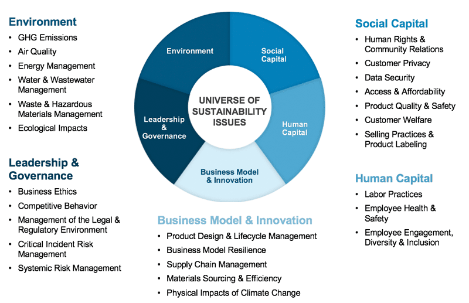

## Table of Contents

## What is the State Street R-Factor?

The State Street R-Factor is a tool that helps investors understand how well a company is doing in terms of environmental, social, and governance (ESG) issues. It gives a single score, called the R-Factor score, which shows how a company's ESG performance compares to other companies in the same industry. This score is based on data from many different sources and is updated regularly to keep up with changes in the company's practices.

Investors use the R-Factor score to make better choices about where to put their money. If a company has a high R-Factor score, it means they are doing a good job with things like reducing pollution, treating employees fairly, and having good management practices. This can help investors pick companies that not only make money but also help make the world a better place.

## How does the R-Factor score companies?

The R-Factor score looks at how well a company is doing with environmental, social, and governance (ESG) issues. It uses information from many different places to give each company a score. This score shows how the company is doing compared to other companies in the same type of business. The score is updated often to make sure it shows the latest information about the company's actions.

Investors use the R-Factor score to help them decide where to put their money. A high R-Factor score means the company is doing a good job with things like protecting the environment, treating workers well, and having good leaders. This helps investors choose companies that are not only making money but also doing good things for the world.

## What are the key components of the R-Factor?

The R-Factor score is made up of three main parts: environmental, social, and governance (ESG) factors. Each part looks at different things about a company. The environmental part checks if the company is good at protecting the environment, like reducing pollution and using less energy. The social part looks at how the company treats its workers, customers, and the community. It checks things like fair pay, safe working conditions, and helping the community. The governance part looks at how the company is run, like if it has good leaders and follows the rules.

To come up with the R-Factor score, the tool uses information from many different sources. It looks at reports from the company, data from other groups, and what people say about the company. All this information is put together to give each company a score. This score shows how well the company is doing with ESG compared to other companies in the same industry. The score is updated often to make sure it shows the latest information about the company's actions.

## How is the R-Factor calculated?

The R-Factor score is calculated by looking at a company's performance in three main areas: environmental, social, and governance (ESG). For the environmental part, the score checks if the company is doing things to help the planet, like reducing pollution and using energy wisely. The social part looks at how the company treats people, including its workers, customers, and the community. It checks for things like fair pay and safe working conditions. The governance part looks at how the company is managed, making sure it has good leaders and follows the rules.

To calculate the R-Factor score, the tool uses information from many different sources. This includes reports from the company itself, data from other organizations, and what people say about the company. All this information is combined to give the company a score that shows how well it is doing with ESG compared to other companies in the same industry. The score is updated regularly to make sure it reflects the most recent information about the company's actions.

## What data sources are used in the R-Factor methodology?

The R-Factor score uses information from many different places to figure out how well a company is doing with environmental, social, and governance (ESG) issues. This includes reports that the company itself puts out, which tell about their efforts to be green, treat people well, and run the business the right way. The score also looks at data from other groups, like non-profits and research organizations, that study how companies affect the world.

In addition to these reports and data, the R-Factor score takes into account what people say about the company. This can include feedback from employees, customers, and the community. All this information is put together to give each company a score that shows how they compare to other companies in the same type of business. The score is updated often to make sure it always shows the latest information about the company's actions.

## How does the R-Factor help in investment decision-making?

The R-Factor helps investors make better choices by giving them a clear score that shows how well a company is doing with environmental, social, and governance (ESG) issues. This score makes it easy for investors to see which companies are doing a good job at things like protecting the environment, treating workers fairly, and having good leaders. By looking at the R-Factor score, investors can pick companies that not only make money but also help make the world a better place.

Using the R-Factor score, investors can compare companies in the same industry to see which ones are doing better with ESG. This helps them decide where to put their money in a way that matches their values. For example, if an investor cares a lot about the environment, they might choose to invest in companies with high R-Factor scores because those companies are doing more to help the planet. This way, the R-Factor score helps investors make choices that are good for both their wallets and the world.

## Can the R-Factor be integrated with other investment tools?

Yes, the R-Factor can be used with other tools that help people make choices about where to put their money. It gives a score that shows how well a company is doing with things like taking care of the environment, treating people well, and having good leaders. This score can be added to other tools that look at how much money a company might make or how risky it is to invest in it. By combining the R-Factor score with these other tools, investors can get a fuller picture of a company.

For example, someone might use a tool that looks at a company's financial numbers and then add the R-Factor score to see if the company is also doing good things for the world. This way, they can choose to invest in companies that are not only likely to make money but also care about important issues. Using the R-Factor with other tools helps investors make smarter choices that match what they care about.

## What are the limitations of the R-Factor?

The R-Factor is a helpful tool, but it has some limitations. One big problem is that it depends on the information it gets from different places. If the information is not complete or correct, the R-Factor score might not be right. Also, the score looks at a lot of different things about a company, but it might not catch everything. Some important issues might be missed, which can make the score less useful.

Another limitation is that the R-Factor score can change over time. Companies can improve or get worse at taking care of the environment, treating people well, and having good leaders. This means the score needs to be updated often to stay accurate. But even with updates, the score might not show the full story of a company's actions. Investors need to remember that the R-Factor is just one tool and should use it with other information to make the best choices about where to put their money.

## How does the R-Factor compare to other ESG scoring systems?

The R-Factor is one of many tools that look at how well companies are doing with environmental, social, and governance (ESG) issues. It gives a single score that shows how a company compares to others in the same industry. This score is based on information from many places, like company reports and what people say about the company. Other ESG scoring systems, like the MSCI ESG Ratings or the Sustainalytics ESG Risk Ratings, also look at similar things but might use different ways to calculate their scores. For example, MSCI might focus more on certain environmental factors, while Sustainalytics might put more weight on governance issues.

One big difference between the R-Factor and other ESG scoring systems is how they use their data. The R-Factor tries to combine lots of different information into one easy-to-understand score. This can be helpful for investors who want a quick way to see how a company is doing with ESG. On the other hand, other systems might give more detailed breakdowns of different ESG areas, which can be useful for investors who want to dive deeper into specific issues. No matter which system is used, it's important to remember that all these tools have their own strengths and weaknesses, and they might not always agree on how to score a company.

## What updates or changes have been made to the R-Factor since its inception?

Since it started, the R-Factor has been updated to make it better at showing how companies are doing with environmental, social, and governance (ESG) issues. One big change is that it now uses more data from different places. This means the score can be more accurate because it looks at more information about what companies are doing. The R-Factor also updates its scoring method to keep up with new ways of measuring ESG performance. This helps make sure the score stays useful for investors who want to know about a company's actions.

Another change to the R-Factor is how often it updates its scores. Now, the scores are updated more often to reflect the latest information about companies. This is important because companies can change how they treat the environment, their workers, and their leaders over time. By updating more often, the R-Factor can give investors a better idea of how companies are doing right now. These changes help make the R-Factor a more helpful tool for people making choices about where to put their money.

## How can investors access and utilize R-Factor scores?

Investors can access R-Factor scores through various financial platforms and services that integrate ESG data. Many investment firms and financial advisors use tools that include R-Factor scores, so investors can ask their advisors for this information. Some websites and databases also provide direct access to R-Factor scores, making it easier for investors to look up scores on their own. By having this information, investors can see how well companies are doing with environmental, social, and governance issues.

Once investors have the R-Factor scores, they can use them to make better choices about where to put their money. If an investor cares a lot about the environment or how companies treat their workers, they can look for companies with high R-Factor scores. This helps them pick investments that match their values. By combining R-Factor scores with other financial information, investors can get a fuller picture of a company's performance and make smarter investment decisions.

## What future developments are expected for the R-Factor?

In the future, the R-Factor is expected to keep getting better at showing how companies are doing with environmental, social, and governance issues. One big change might be using even more types of data to make the scores more accurate. This could include new ways of measuring things like how companies affect the environment or how they treat their workers. By using more and better data, the R-Factor can give investors a clearer picture of which companies are doing a good job with these important issues.

Another expected development is making the R-Factor easier to use for more people. This might mean creating simpler tools or apps that let investors quickly see R-Factor scores and understand what they mean. The R-Factor might also work better with other investment tools, so investors can use it along with other information to make the best choices about where to put their money. These changes will help more people use the R-Factor to pick companies that not only make money but also help make the world a better place.

## References & Further Reading

[1]: State Street Global Advisors. ["R-Factor: Measuring ESG."](https://www.ssga.com/library-content/products/esg/reinventing-esg-through-scoring-system.pdf) Accessed September 2023.

[2]: Khan, M., Serafeim, G., & Yoon, A. (2016). ["Corporate Sustainability: First Evidence on Materiality."](https://www.jstor.org/stable/24907173) The Accounting Review.

[3]: Eccles, R.G., & Krzus, M.P. (2010). ["One Report: Integrated Reporting for a Sustainable Strategy."](https://onlinelibrary.wiley.com/doi/book/10.1002/9781119199960) John Wiley & Sons.

[4]: BlackRock. ["Sustainable investing: Resilience amid uncertainty."](https://nordsip.com/wp-content/uploads/2020/07/BlackRock_sustainable-investing-resilience_May2020.pdf) April 2020.

[5]: Sustainability Accounting Standards Board (SASB). ["SASB Standards."](https://sasb.ifrs.org/standards/download/) Accessed September 2023.

[6]: Edmans, A. (2012). ["The Link Between Job Satisfaction and Firm Value, with Implications for Corporate Social Responsibility."](https://papers.ssrn.com/sol3/papers.cfm?abstract_id=2054066) Academy of Management Perspectives.