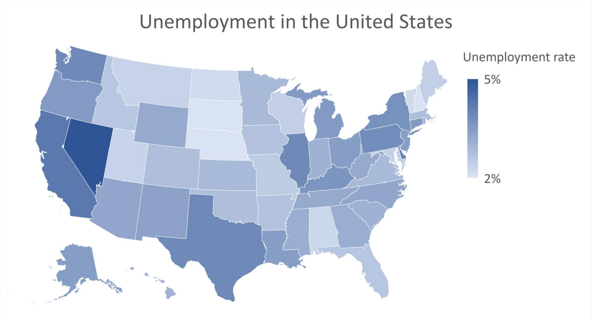

## Table of Contents

## What is unemployment?

Unemployment is when people who want to work cannot find a job. It happens when there are more people looking for work than there are jobs available. This can be because of many reasons, like the economy slowing down, businesses closing, or new technology replacing jobs that people used to do.

When someone is unemployed, it can be hard for them. They might not have enough money to pay for things they need, like food and a place to live. It can also make them feel sad or worried about the future. Governments and communities often try to help by creating programs to train people for new jobs or by giving them money to help them get by until they find work.

## How is the unemployment rate calculated?

The unemployment rate is calculated by counting the number of people who are unemployed and dividing that number by the total number of people in the labor force. The labor force includes everyone who is either working or actively looking for work. After doing the division, you multiply the result by 100 to get a percentage. This percentage is the unemployment rate.

To be counted as unemployed, a person must not have a job, be available to work, and have looked for work in the past four weeks. People who are not looking for work, like students or retirees, are not included in the labor force and do not affect the unemployment rate. This method helps give a clear picture of how many people want to work but cannot find a job.

## What is the current national unemployment rate in the United States?

The current national unemployment rate in the United States is 3.8% as of March 2024. This number tells us that out of all the people who want to work, about 3.8% of them are not able to find a job.

This rate is considered pretty low compared to many other times in the past. When the unemployment rate is low, it usually means that the economy is doing well, and most people who want to work can find a job.

## Which states currently have the highest unemployment rates?

Some states in the United States have higher unemployment rates than others. As of early 2024, the states with the highest unemployment rates are Nevada, California, and Illinois. In Nevada, the unemployment rate is around 5.5%, which is higher than the national average. This is partly because Nevada's economy relies a lot on tourism and hospitality, which can be up and down.

California has an unemployment rate of about 5.3%. Even though California has a big and diverse economy, it still has many people looking for work. In Illinois, the unemployment rate is around 5.2%. Illinois has faced some economic challenges in recent years, which has made it harder for people to find jobs. These states are working on different plans to help lower their unemployment rates and help more people find work.

## Which states currently have the lowest unemployment rates?

Some states in the United States have very low unemployment rates. As of early 2024, the states with the lowest unemployment rates are South Dakota, Nebraska, and New Hampshire. In South Dakota, the unemployment rate is around 2.0%, which is much lower than the national average. This is because South Dakota has a strong economy with lots of jobs in farming, manufacturing, and tourism. Nebraska has an unemployment rate of about 2.3%. Nebraska's economy is also strong, with many jobs in agriculture and food processing. New Hampshire's unemployment rate is around 2.4%. New Hampshire has a diverse economy with many jobs in technology, health care, and tourism.

These low unemployment rates mean that most people who want to work in these states can find a job. When unemployment is low, it's good for the economy because people have money to spend on things they need and want. It also means that businesses in these states are doing well and can hire more workers. These states work hard to keep their economies strong and help people find good jobs.

## How have state unemployment rates changed over the past year?

Over the past year, unemployment rates in many states have gone down a bit. This is good news because it means more people are finding jobs. For example, states like South Dakota and Nebraska have kept their unemployment rates really low, around 2.0% to 2.3%. These states have strong economies with lots of jobs in farming and other industries. Even states with higher unemployment rates, like Nevada and California, have seen their rates drop. Nevada's rate went from about 6.0% last year to around 5.5% now, and California's rate dropped from around 5.8% to about 5.3%. This shows that more people are getting back to work across the country.

However, not all states have seen big improvements. Some states like Illinois have had a harder time lowering their unemployment rates. Illinois' rate has stayed pretty high, around 5.2%, which is still above the national average. This can be because of different reasons like businesses closing or the economy not growing as fast in those areas. Overall, the trend is positive with many states doing better than last year, but there is still work to be done to help everyone find a job.

## What factors contribute to differences in unemployment rates among states?

Differences in unemployment rates among states can come from many things. One big reason is the kind of jobs that are common in each state. Some states have lots of jobs in farming or making things, while others have more jobs in places like hotels or stores. If a state's main jobs are in an industry that is doing well, then more people can find work and the unemployment rate goes down. But if the main jobs are in an industry that is struggling, then it can be harder for people to find work, and the unemployment rate goes up.

Another reason for different unemployment rates is how the economy is doing in each state. Some states might have new businesses starting up, which means more jobs. Other states might be losing businesses, which means fewer jobs. Also, things like how easy it is to get to work or how much education people have can make a difference. If it's hard to get to work because there's no good public transport, or if people don't have the skills needed for the jobs that are available, then the unemployment rate can be higher.

Lastly, government policies and programs can affect unemployment rates too. Some states have programs to help people learn new skills or start their own businesses. These programs can help lower unemployment. Other states might not have as many of these programs, so it can be harder for people to find jobs. All these things together make unemployment rates different from one state to another.

## How do seasonal adjustments affect state unemployment rates?

Seasonal adjustments help make unemployment rates more accurate by taking out changes that happen at certain times of the year. For example, in some states, there might be more jobs in the summer because of tourism, like at beaches or national parks. When these seasonal jobs end in the fall, the unemployment rate might go up, but it's not because the economy is doing worse. It's just because the season changed. Seasonal adjustments fix this by looking at the numbers and figuring out what part of the change is just because of the time of year.

After making these adjustments, we can see a clearer picture of how the unemployment rate is really doing in each state. Without these adjustments, it might look like the unemployment rate is going up and down a lot, but really it's just following the same pattern every year. By smoothing out these seasonal ups and downs, we can better understand if the economy is getting better or worse over time. This helps people who make decisions about jobs and money to plan better for the future.

## What are the long-term trends in state unemployment rates over the past decade?

Over the past decade, state unemployment rates in the United States have gone through a lot of changes. After the big economic downturn in 2008, many states had really high unemployment rates. Slowly, as the economy got better, these rates started to go down. By the middle of the 2010s, most states had unemployment rates that were much lower than right after the downturn. But then, in 2020, the COVID-19 pandemic hit, and unemployment rates shot up again in almost every state. A lot of businesses had to close or let people go, which made it hard for people to find jobs. After the first shock of the pandemic, things started to get better again, and by 2023 and 2024, many states were back to having low unemployment rates.

Looking at specific states, some places like South Dakota and Nebraska have had consistently low unemployment rates over the decade. These states have strong economies with lots of jobs in farming and other industries that have stayed steady. On the other hand, states like Nevada and California have had higher unemployment rates, especially during the downturns. Nevada, for example, relies a lot on tourism, which can go up and down a lot. Over the years, though, even these states have seen their unemployment rates go down as the economy has gotten better. Overall, the trend over the past decade shows that while there have been big ups and downs because of events like the economic downturn and the pandemic, most states have been working to lower their unemployment rates and help more people find jobs.

## How do state unemployment rates correlate with other economic indicators like GDP?

State unemployment rates and GDP are closely connected. When a state's GDP, which is the total value of all the goods and services made in that state, goes up, it usually means more jobs are being created. This is because businesses are doing well and need more workers to keep up with demand. So, when GDP grows, unemployment rates often go down because more people can find work. For example, states like South Dakota and Nebraska have strong economies with high GDP growth, and they also have very low unemployment rates.

On the other hand, when a state's GDP goes down, it can mean fewer jobs are available. This happens when businesses are not doing well and might need to let people go to save money. So, when GDP falls, unemployment rates often go up because it's harder for people to find work. For instance, during the economic downturn in 2008 and the COVID-19 pandemic in 2020, many states saw their GDP drop, and their unemployment rates went up a lot. Over time, as these states worked to improve their economies, their GDP started to grow again, and unemployment rates came down.

## What policies have been effective in reducing unemployment in specific states?

Some states have used special programs to help people find jobs and lower unemployment. For example, in South Dakota, they have programs that help people learn new skills for jobs that are in demand, like in farming and technology. They also make it easier for businesses to start up and grow, which creates more jobs. By focusing on these areas, South Dakota has kept its unemployment rate very low, around 2.0%. Another state, Nebraska, has done well by supporting its strong farming and food processing industries. They help farmers with new technology and ways to grow more food, which means more jobs in these areas. Nebraska's unemployment rate is about 2.3%, which is also very low.

In other states, like Nevada and California, different policies have helped lower unemployment rates. Nevada has worked on bringing in more tourists by improving its attractions and making it easier for people to visit. This has helped create jobs in hotels, restaurants, and entertainment. Even though Nevada's unemployment rate is still higher than the national average at around 5.5%, it's better than it was before. California has focused on growing its technology and health care industries. They have programs to train people for these high-demand jobs, and they also help new tech companies start up. These efforts have brought California's unemployment rate down to about 5.3%. By using these kinds of policies, states can help more people find work and keep their economies strong.

## How do demographic factors influence unemployment rates at the state level?

Demographic factors like age, education, and race can affect unemployment rates in different states. For example, if a state has a lot of young people who are just starting their careers, the unemployment rate might be higher because it can be harder for young people to find jobs right away. Also, if many people in a state don't have a lot of education, they might not have the skills needed for the jobs that are available. This can make it harder for them to find work, so the unemployment rate can be higher. In some states, certain racial or ethnic groups might have a harder time finding jobs because of discrimination or other barriers, which can also raise the unemployment rate.

On the other hand, states with a lot of older workers who have been in their jobs for a long time might have lower unemployment rates. If many people in a state have gone to college or have special training, they might be able to find jobs more easily, which can lower the unemployment rate. Also, if a state has good programs to help different groups find jobs, like training programs or support for new immigrants, it can help keep unemployment low. By understanding these demographic factors, states can work on policies that help everyone find work and keep the unemployment rate down.

## What is the understanding of unemployment in the U.S.?

Unemployment is a critical economic indicator representing the percentage of the labor force that is jobless and actively seeking employment. It has far-reaching implications for the economy, influencing everything from monetary policy to individual financial stability. High unemployment signifies underutilized labor resources, leading to reduced economic output, whereas low unemployment is associated with increased production and consumer spending, reflecting a robust economy.

### Calculation Methodology for Unemployment Rates

The unemployment rate is calculated using data from labor force surveys. The formula is expressed as:

$$
\text{Unemployment Rate} = \left( \frac{\text{Number of Unemployed People}}{\text{Labor Force}} \right) \times 100
$$

The labor force includes all individuals aged 16 and above who are either employed or actively looking for work. The U.S. Bureau of Labor Statistics (BLS) conducts the Current Population Survey (CPS) monthly, sampling about 60,000 households to estimate national and state unemployment rates.

For state unemployment figures, the BLS uses similar survey data, but adjustments account for differing state economies and workforce sizes. Seasonal adjustments are also applied to account for variations due to predictable seasonal changes in employment, such as holiday hiring.

### Historical Trends in U.S. Unemployment

Historically, U.S. unemployment has shown significant variability, often reflecting broader economic cycles. During periods of economic expansion, the unemployment rate typically drops as businesses increase hiring to meet growing demand. Conversely, recessions usually see a rise in unemployment as companies reduce workforces in response to declining consumer spending.

Notable historical trends include the Great Depression of the 1930s, where unemployment exceeded 20%, and the financial crisis of 2007-2008, with rates peaking around 10%. More recently, the COVID-19 pandemic in 2020 saw unprecedented spikes in unemployment figures, though recovery efforts led to improvements in subsequent years. 

These fluctuations underscore the dynamic nature of the labor market and the myriad factors that can impact it, from technological advances and policy changes to global economic conditions. Historically, periods of high unemployment have driven significant economic policy responses, aiming to stimulate job creation and reduce joblessness.

## References & Further Reading

1. **U.S. Bureau of Labor Statistics (BLS)**: The BLS provides comprehensive data on national and state unemployment rates, methodologies for calculating these statistics, and historical trends. Access their resources at [bls.gov](https://www.bls.gov).

2. **Federal Reserve Economic Data (FRED)**: Hosted by the Federal Reserve Bank of St. Louis, FRED offers an extensive database of economic indicators, including unemployment rates. They provide tools to analyze and visualize data trends. Visit [fred.stlouisfed.org](https://fred.stlouisfed.org) for more information.

3. **International Monetary Fund (IMF) Publications**: The IMF publishes papers on labor markets and economic impacts globally, with specific focus on unemployment's effects on macroeconomic factors. These papers are available at [imf.org](https://www.imf.org).

4. **National Bureau of Economic Research (NBER)**: NBER provides working papers and publications analyzing economic issues like unemployment, its causes, and effects on the broader economy. Their research can be found at [nber.org](https://www.nber.org).

5. **Algorithmic Trading and Economic Data** by Robert Kissell: This book explores the role of economic indicators, including unemployment rates, in algorithmic trading and offers insights into integrating these datasets into trading strategies.

6. **Quantitative Finance for Practitioners** by Janette Rutterford: This book covers financial models and quantitative techniques useful for implementing economic data in trading systems, with specific examples related to unemployment data.

7. **Python for Finance** by Yves Hilpisch: For traders interested in using Python to analyze unemployment data, this book provides tools and techniques for backtesting and refining trading algorithms using economic indicators.

8. **Research Articles and Journals**:
   - Explore articles in academic journals such as the *Journal of Economic Perspectives* and the *Journal of Finance* for empirical studies on unemployment's influence on market behavior.
   - Access databases like JSTOR or ScienceDirect to find peer-reviewed papers related to economic indicators and their impact on financial markets.

9. **Online Forums and Community Resources**:
   - Platforms such as QuantConnect and Quantopian provide community-driven resources to explore how others are utilizing unemployment data in algorithmic trading.
   - Websites like Stack Exchange offer discussions and collaborative problem-solving for integrating economic data into trading systems.

These resources will enhance understanding and application of unemployment data in both economic analysis and trading strategies, encouraging informed decision-making and continuous learning.

