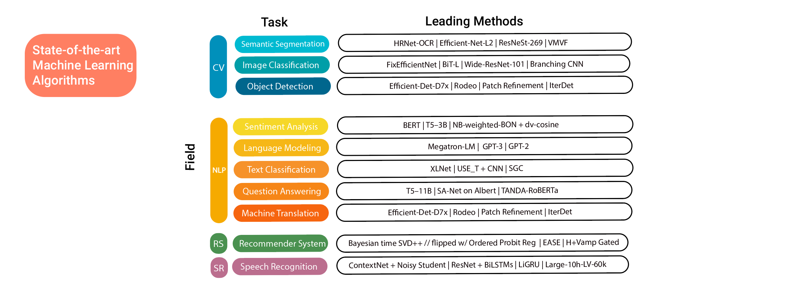

## Table of Contents

## What is a state in the context of machine learning?

In machine learning, a state refers to a specific configuration or condition of a system at a particular moment. Think of it like a snapshot that captures all the relevant information needed to describe what's happening right then. For example, in a game of chess, a state would include the positions of all the pieces on the board, whose turn it is, and any other relevant game rules or conditions at that time.

States are crucial in many machine learning algorithms, especially in reinforcement learning and sequence modeling. In reinforcement learning, an agent interacts with an environment, and the state helps the agent decide what action to take next. The state provides the context that the agent uses to learn from its experiences and improve its decision-making over time. In sequence models like those used in natural language processing, the state can represent the current word or phrase being processed, helping the model understand and generate text based on the context of previous states.

## How does the concept of state relate to different types of machine learning models?

In supervised learning, the concept of state is less explicit but still present. For example, in a model that predicts house prices, the state could be thought of as the current set of input features like the number of bedrooms, square footage, and location. These features represent the state of the house at the time of prediction. The model uses this state to make a prediction, but it doesn't change or evolve over time like in other types of learning. The state here is static and used to train the model to recognize patterns and make accurate predictions based on historical data.

In reinforcement learning, the concept of state is central and dynamic. Here, the state represents the current situation in an environment, which the agent uses to decide its next action. For example, in a game like Pac-Man, the state would include the positions of Pac-Man, the ghosts, and the remaining pellets. As the game progresses, the state changes with each move, and the agent learns to make better decisions based on these changing states. The agent's goal is to maximize a reward over time, and understanding and navigating through different states is key to achieving this.

In unsupervised learning, the concept of state can be seen in clustering algorithms where data points are grouped based on their similarity. Here, the state might be thought of as the current configuration of the clusters. As the algorithm iterates, the state evolves as clusters are formed and refined. For example, in k-means clustering, the state at any step would include the current centroids of the clusters and the assignment of data points to these clusters. The algorithm updates this state until it converges to a final set of clusters that best represent the data's underlying structure.

## Can you explain the difference between stateless and stateful models in machine learning?

In machine learning, a stateless model does not keep track of any information from previous inputs. Each prediction or decision is made independently, based only on the current input. For example, in a simple linear regression model, the prediction for a house price is made using only the features of that house, without considering any previous predictions or data. This makes stateless models simpler and often faster to train and use, but they can miss out on patterns or trends that develop over time.

On the other hand, a stateful model remembers information from previous inputs and uses this to influence future predictions or decisions. This is common in models like recurrent neural networks (RNNs), where the state can represent the context of a sequence of data. For example, in language translation, a stateful model can remember the context of previous words to better predict the next word. While stateful models can capture more complex patterns and dependencies, they are often more complex to train and can be harder to interpret.

In summary, the choice between stateless and stateful models depends on the nature of the problem. Stateless models are suitable for tasks where each input is independent, while stateful models are better for tasks involving sequences or time-series data where past inputs are relevant to future predictions.

## What role does state play in recurrent neural networks (RNNs)?

In recurrent neural networks (RNNs), the state is like the memory of the network. It helps the RNN remember what it saw before, so it can use that information to understand and predict the next part of a sequence. Imagine you're reading a book. The state in an RNN is like keeping track of the story so far, which helps you understand the next sentence better. This memory is important because it allows the network to see patterns over time, not just at one moment.

The state in an RNN is updated at each time step. If you have a sequence of inputs $$ x_1, x_2, x_3, ... $$, the state at time step $$ t $$ is influenced by the input at that time $$ x_t $$ and the state from the previous time step $$ h_{t-1} $$. This can be shown with a simple formula: $$ h_t = f(W \cdot x_t + U \cdot h_{t-1} + b) $$, where $$ f $$ is an activation function, $$ W $$ and $$ U $$ are weight matrices, and $$ b $$ is a bias vector. By keeping and updating this state, the RNN can handle tasks like language translation, where understanding the whole sentence is important, not just individual words.

## How is state management handled in reinforcement learning?

In reinforcement learning, state management is crucial because it helps the agent know where it is and what to do next. The state is like a map that shows the agent the current situation in the environment. For example, if the agent is playing a video game, the state might include where the player's character is, where the enemies are, and what items are around. The agent uses this state to decide its next move, like moving left or right, or picking up an item. As the agent takes actions, the state changes, and the agent learns from these changes to get better at the game.

To manage states, reinforcement learning algorithms often use a function called the state transition function. This function helps the agent predict what the next state will be after it takes an action. For example, if the agent is in state $$ S_t $$ and takes action $$ A_t $$, the next state $$ S_{t+1} $$ can be calculated using a function like $$ S_{t+1} = f(S_t, A_t) $$. The agent also gets a reward based on the new state, which helps it learn which actions are good or bad. Over time, by exploring different states and actions, the agent can learn the best way to navigate through the environment to achieve its goals.

## What are stateful LSTM networks and how do they differ from stateless ones?

Stateful LSTM networks, or Long Short-Term Memory networks, keep track of what happened before and use that information for the next steps. Imagine you're reading a long story. A stateful LSTM remembers the story so far, which helps it understand the next part better. In a stateful LSTM, the state from the end of one sequence is passed on to the start of the next sequence. This is useful when you're dealing with long sequences that are broken into smaller parts, like a series of sentences in a book.

On the other hand, stateless LSTM networks don't remember anything from before. Each time you give it a new piece of the sequence, it starts fresh, like reading a new book without knowing what happened in the last one. In a stateless LSTM, the state is reset at the beginning of each new sequence. This is simpler and faster but can miss out on understanding the bigger picture if the sequences are related. For example, if you're predicting the next word in a sentence, a stateless LSTM might not do as well as a stateful one because it doesn't remember the context from earlier parts of the sentence.

## How can state be used to improve the performance of machine learning models?

Using state in machine learning can make models better at understanding and predicting things. When a model keeps track of what happened before, it can see patterns over time. For example, in a game, knowing where the player was and what they did before can help decide the next move. In language translation, remembering the words that came before helps guess the next word better. This is like having a memory that helps the model learn and do its job more accurately.

In reinforcement learning, state is really important. It helps the agent know where it is and what to do next. The state is like a map that shows the current situation, and the agent uses this map to decide its next action. By keeping and updating this state, the agent can learn from its experiences and get better at achieving its goals. For example, if the agent is playing a game, it uses the state to figure out where to move next and how to score points. This way, the model can improve its performance by learning from the changing states over time.

## What are the challenges associated with managing state in distributed machine learning systems?

Managing state in distributed machine learning systems can be tricky because the data and computations are spread across many different computers or nodes. When a model needs to remember what happened before, like in stateful LSTM networks or reinforcement learning, it can be hard to keep all these computers on the same page. If one computer updates its state but doesn't tell the others quickly enough, the model might make wrong predictions or decisions. This is called a synchronization problem, and it can slow down the learning process or make the model less accurate.

Another challenge is dealing with failures. In a distributed system, one or more computers might stop working or get disconnected. If a computer that was holding important state information fails, the model might lose track of what it was doing. To handle this, the system needs to have backup plans, like saving the state in multiple places or quickly moving the work to another computer. This adds complexity and can make the system slower, but it's necessary to keep the model working correctly even when things go wrong.

## How does the concept of state impact the training and inference phases of machine learning models?

During the training phase of machine learning models, the concept of state plays a big role in helping the model learn from past data. For example, in recurrent neural networks (RNNs) like LSTMs, the state keeps track of what the model saw before. This helps the model understand patterns over time, not just at one moment. Imagine you're learning to play a game. If you remember where you were and what you did last time, you can make better decisions next time. The state in an RNN works the same way, helping the model improve by remembering previous inputs. This can be shown with a simple formula: $$ h_t = f(W \cdot x_t + U \cdot h_{t-1} + b) $$, where $$ h_t $$ is the current state, $$ x_t $$ is the current input, and $$ h_{t-1} $$ is the previous state.

In the inference phase, the state helps the model make better predictions by using what it learned during training. For instance, in a stateful LSTM used for language translation, the model remembers the context of the sentence it's translating. This means it can predict the next word more accurately because it knows what came before. On the other hand, a stateless model would start fresh with each new input, which can lead to less accurate predictions if the context is important. By keeping and updating the state, the model can use the full context to make smarter decisions, improving its performance during inference.

## Can you discuss any advanced techniques for state representation in deep learning?

In deep learning, one advanced technique for state representation is using attention mechanisms. Imagine you're reading a long story and need to remember important parts to understand the whole thing. Attention helps the model focus on different parts of the input sequence, like words in a sentence, and use them to update the state more effectively. This is especially useful in tasks like machine translation, where understanding the context of previous words is crucial for predicting the next word correctly. By weighing the importance of different parts of the input, the model can create a more detailed and useful state representation, leading to better performance.

Another technique is using memory-augmented neural networks. These networks have a special part that acts like a memory bank, where the model can store and retrieve information as needed. For example, in a neural Turing machine, the state can be updated by reading from and writing to this memory. This allows the model to keep track of more complex and longer-term dependencies in the data. The state update in such a model might look like $$ h_t = f(W \cdot x_t + U \cdot h_{t-1} + M_t) $$, where $$ M_t $$ represents the memory at time step $$ t $$. This approach helps the model handle tasks that require remembering and using information from far back in the sequence, improving its ability to learn and predict accurately.

## What are some common pitfalls when dealing with state in machine learning models?

One common pitfall when dealing with state in machine learning models is the risk of overfitting. When a model remembers too much from the training data, it might not work well on new data. This is like memorizing a book instead of understanding its story. For example, in an RNN, if the model focuses too much on the state from previous steps, it might not generalize well to new sequences. To avoid this, techniques like regularization and using validation data can help keep the model from overfitting and make it better at understanding the bigger picture.

Another issue is dealing with long-term dependencies. In some models, like RNNs, it can be hard to remember information from far back in the sequence. This is like trying to remember the beginning of a long story by the end. For example, if an RNN is processing a long sentence, it might forget the first few words by the time it reaches the end. Techniques like using LSTMs or attention mechanisms can help. LSTMs have special gates that help them remember or forget information as needed, and attention helps the model focus on important parts of the input. These methods make it easier for the model to keep track of what's important over time.

## How do state-of-the-art models like transformers handle state, and what innovations have they introduced?

Transformers handle state differently from traditional models like RNNs. Instead of using a single state that gets updated step by step, transformers use a mechanism called attention. Imagine you're reading a book and you want to understand a sentence. Attention helps the transformer focus on different words in the sentence, not just the ones that came before. This way, the model can see the whole sentence at once and figure out which parts are important for understanding it. This is like looking at a map to find the best route, instead of following a single path. By using attention, transformers can handle state more effectively and understand long sequences better.

One big innovation in transformers is the self-attention mechanism. Self-attention lets the model compare every word in a sentence to every other word. For example, if you're translating a sentence, self-attention helps the model see how each word relates to all the others, not just the ones that came before. This is shown in the formula $$ \text{Attention}(Q, K, V) = \text{softmax}\left(\frac{QK^T}{\sqrt{d_k}}\right)V $$, where $$ Q, K, $$ and $$ V $$ are the query, key, and value matrices. This approach makes the model better at understanding the context of a whole sequence, which is really helpful for tasks like language translation or text generation. Transformers have changed how we think about state in machine learning, making it easier to handle complex patterns in data.