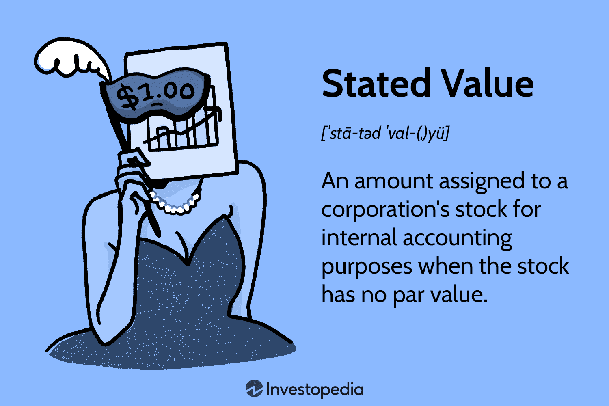

In the ever-evolving landscape of finance, understanding complex financial terms is crucial for investors and professionals alike. This article examines several essential financial concepts: stated value, asset valuation, and algorithmic trading. Our goal is to provide a comprehensive overview that interconnects these terms, illuminating their interplay in modern finance. From fundamental definitions to real-world applications, this article aims to enhance financial literacy and strategic decision-making. Whether you are a seasoned investor or a curious newcomer, grasping these concepts will improve your financial acumen.

## Table of Contents



## What is Stated Value in Finance?

Stated value in finance pertains to the monetary amount assigned by a company to its stock without a predetermined par value. It is primarily used for internal accounting purposes rather than affecting the stock's market price. The stated value is typically a nominal figure and serves to comply with legal capital requirements imposed by certain jurisdictions. This concept helps to define the minimum capital a company must retain from the issuance of its shares.

For example, if a corporation issues 1,000,000 shares and assigns a stated value of $0.01 per share, its legal capital on the balance sheet reflects $10,000. This amount represents the aggregate stated value of its outstanding shares. While the stated value does not directly impact the stock’s buying or selling price in the financial markets, it aids corporate accountants and financial analysts in understanding the nuances of a company's capital structure.

The role of stated value is nuanced, primarily impacting legal and accounting practices within corporate finance. Its significance extends to providing insight into a company's foundational financial health and compliance stance with specific state regulations requiring designated capital thresholds. For investors and corporate accountants, comprehending stated value is essential for evaluating the underlying financial robustness and obligations of a company.

## Understanding Asset Valuation

Asset valuation is the essential process of determining the fair market value of an asset, which plays a critical role in various financial decisions, such as mergers and acquisitions, portfolio management, taxation, and financial reporting. Several methods exist to evaluate assets, each with distinct applications, benefits, and limitations.

One common approach is the **cost approach**, which assesses an asset's value based on the cost to replace or reproduce it, minus accumulated depreciation. This method is particularly useful for tangible assets such as buildings or machinery. The formula used in this approach can be expressed as:

$$
\text{Value of Asset} = \text{Replacement Cost} - \text{Accumulated Depreciation}
$$

The cost approach is beneficial in scenarios where the physical characteristics of the asset offer a reliable basis for comparison.

The **market approach**, also known as the sales comparison approach, estimates an asset's value by comparing it to similar assets that have been sold recently in the market. This method is often employed in real estate appraisals and is useful when there is a sufficient number of comparable transactions. It relies on the principle that the value of an asset should be comparable to the price of similar assets available in the market. The mathematical expression for this approach is not precise, as it often involves adjustments based on factors like size, location, and condition, but can be generally described as:

$$
\text{Value of Asset} = \text{Comparable Sales Price} \pm \text{Adjustments for Differences}
$$

The **income approach** evaluates an asset based on its potential to generate future income, considering the time value of money. It is commonly used for business valuations and income-producing properties. The Discounted Cash Flow (DCF) analysis is a primary method within the income approach, where future cash flows are estimated and discounted to present value using an appropriate discount rate. The formula for DCF is:

$$
\text{Value of Asset} = \sum_{t=1}^{n} \frac{CF_t}{(1 + r)^t}
$$

where $CF_t$ is the cash flow in period $t$, $r$ is the discount rate, and $n$ is the number of periods.

Each of these methods offers different insights and is chosen based on the specific characteristics of the asset and the available data. The cost approach provides a clear indication for assets with available replacement cost information, the market approach is preferred when there is an active market with comparable transactions, and the income approach is ideal for assets with predictable cash flow patterns. Balancing these methods allows for a comprehensive and informed valuation, crucial for making sound financial decisions.

## Role of Algorithmic Trading

Algorithmic trading employs automated systems that execute trades according to pre-defined strategies, significantly enhancing trading efficiency. By using complex algorithms, these systems process real-time market data to execute trades swiftly, thereby capitalizing on market inefficiencies, such as pricing anomalies or [arbitrage](/wiki/arbitrage) opportunities that a manual trader might miss. These algorithms react to market conditions almost instantaneously, providing a distinct advantage in high-frequency trading environments.

Integrating valuation models into [algorithmic trading](/wiki/algorithmic-trading) strategies is essential for making informed pricing and timing decisions. These models assess an asset's value, ensuring that trades are executed when conditions align with the predefined strategy parameters. For instance, relative valuation models might inform algorithms about undervalued or overvalued securities, triggering buy or sell orders based on comparative metrics.

The integration of [machine learning](/wiki/machine-learning) and predictive analytics has further enhanced the accuracy and effectiveness of trading algorithms. Machine learning models can analyze vast datasets to identify patterns or trends that traditional methods may overlook. These algorithms can adapt over time, continuously refining their performance as they are exposed to new data. For example, predictive models might anticipate stock price movements based on historical data, economic indicators, or sentiment analysis derived from news feeds or social media platforms.

The prevalence of algorithmic trading is expanding, driven by advancements in technology and increased computational capabilities. Modern traders leverage powerful computing resources to run complex models across global financial markets, often employing languages such as Python for their flexibility and extensive libraries. The increasing computational power of modern systems allows for the execution of highly sophisticated strategies that incorporate real-time data feeds and high-frequency data updates.

Overall, the strategic application of algorithmic trading is transforming financial markets, making them more efficient and competitive while posing new challenges related to oversight and regulation. As technology continues to evolve, the role of algorithmic trading in financial markets is expected to grow further, offering new opportunities and challenges for traders worldwide.

## Integration of Asset Valuation and Algo Trading

Valuation methods are integral to the efficacy of algorithmic trading systems, serving as essential tools in the crafting and refinement of sophisticated trading strategies. These methodologies are primarily grouped into absolute and relative valuation models, each offering nuanced insights into asset value that algorithms utilize to optimize trading decisions.

Absolute valuation models, such as discounted cash flow (DCF) analysis, calculate an asset's intrinsic value by predicting future cash flows and discounting them to the present value. Algorithms can seamlessly integrate DCF alongside financial modeling to provide robust predictive valuations. In Python, this process might involve libraries such as NumPy or Pandas for numerical calculations and data manipulation:

```python
import numpy as np

def discounted_cash_flow(cash_flows, discount_rate):
    return sum(cf / (1 + discount_rate) ** i for i, cf in enumerate(cash_flows, start=1))

cash_flows = [1000, 1100, 1210]  # example cash flows
discount_rate = 0.05  # 5% discount rate
intrinsic_value = discounted_cash_flow(cash_flows, discount_rate)
```

Relative valuation models, in contrast, assess an asset by comparing it with similar assets, often using multiples such as price-to-earnings (P/E) ratios. This approach is particularly valuable in market-oriented trading strategies, offering algorithms comparative metrics to gauge asset performance within the market context.

The synergy between these valuation techniques and algorithmic trading is significant. Algorithms equipped with real-time data integration capabilities can dynamically adjust asset valuations based on fluctuating market conditions. This adaptability is facilitated by modern programming environments and data science tools, enabling traders to respond to market changes with unprecedented speed and accuracy.

Python libraries such as Scikit-learn can also be employed to implement machine learning models that predict asset prices and refine trading strategies further. Machine learning models ingest a vast array of market data, learning complex patterns that might elude traditional analysis.

This integration marks a significant advancement in the financial landscape, optimizing investment returns while simultaneously reducing associated risks. The use of valuation models within algorithmic frameworks allows for more precise asset assessments and ensures that trading strategies are both informed and adaptive. As algorithmic trading evolves, the fusion of asset valuation methods within these systems is likely to become increasingly sophisticated, underpinning the development of more effective and resilient trading practices.

## Challenges and Considerations

Valuation and algorithmic trading offer significant potential for enhancing financial decision-making, but they also present several challenges that must be carefully navigated to ensure effective application. One of the primary challenges is market [volatility](/wiki/volatility-trading-strategies), which can significantly influence the accuracy of asset valuations. During periods of economic fluctuation, asset values can change rapidly, necessitating constant updates and adjustments to valuation models. These fluctuations can undermine the reliability of valuations if the models are not frequently recalibrated to reflect current market conditions.

Furthermore, algorithmic trading systems, while efficient, may struggle with the interpretation of qualitative market factors such as geopolitical events, policy changes, or shifts in consumer sentiment. These factors can significantly impact trading outcomes, but their qualitative nature makes them difficult for algorithms to process and quantify. Algorithms predominantly rely on quantitative data and may require sophisticated machine learning techniques to handle these qualitative variables effectively.

Ethical and regulatory considerations also play a crucial role in the deployment of algorithmic trading systems. Poor regulation or oversight can lead to market disruptions, as seen in instances like the 2010 Flash Crash. Algorithms can execute large volumes of trades at high speed, which, if not properly managed, can exacerbate market volatility or lead to unintended consequences. Regulators and market participants must therefore collaborate to ensure that robust frameworks are in place to monitor and manage the influence of algorithmic trading.

To mitigate these challenges, a comprehensive understanding of both the requirements and limitations of valuation techniques and algorithmic trading systems is essential. By recognizing and addressing these challenges, financial professionals can enhance the reliability and effectiveness of these tools. Implementing adaptive algorithms that can learn from new data and integrating risk management protocols can further help in navigating the complexities that arise from using these advanced financial technologies. Regular updates to both the technological systems and the underlying models they rely on can help mitigate risks and foster a more resilient application of these powerful financial tools.

## Conclusion

Understanding financial terms such as stated value, asset valuation, and their role in algorithmic trading is vital for financial success. These concepts are fundamentally woven into the structure of modern finance, directly influencing the strategic decisions made in various domains like trading, business, and investments. As these financial concepts evolve, it is crucial for professionals and investors to adopt an adaptive approach, staying informed about technological advancements and regulatory changes. 

Staying current with technological trends and regulatory developments ensures that strategies remain relevant and effective, given the dynamic nature of financial markets. By thoroughly understanding these financial principles, stakeholders can make informed and strategic decisions that not only foster growth but also enhance resilience in unpredictable financial environments. This strategic acumen is especially important in enhancing returns and mitigating risks in a world increasingly driven by data and automation.

Furthermore, a commitment to continuous learning and application of these financial insights is essential for successfully navigating the complexities of today's finance world. As financial landscapes continue to shift, the persistent pursuit of knowledge will equip investors and professionals with the tools necessary to adapt and thrive. This engagement with ongoing learning facilitates a proactive stance rather than a reactive one, positioning individuals and organizations for sustained success amidst evolving challenges and opportunities.

## References & Further Reading

[1]: ["Financial Management: Theory and Practice"](https://www.amazon.com/Financial-Management-Practice-Eugene-Brigham/dp/130563229X) by Eugene F. Brigham and Michael C. Ehrhardt

[2]: ["Corporate Finance"](https://www.investopedia.com/terms/c/corporatefinance.asp) by Jonathan Berk and Peter DeMarzo

[3]: ["Valuation: Measuring and Managing the Value of Companies"](https://www.amazon.com/Valuation-Measuring-Managing-Companies-Finance/dp/1119610885) by McKinsey & Company Inc.

[4]: Algert, C., & Satchell, S. (2011). ["Algorithmic Trading and DMA: An Introduction to Direct Access Trading Strategies."](https://archive.org/details/algorithmictradi0000john) 

[5]: ["Principles of Valuation: An Integrated Approach"](https://www.amazon.com/Principles-Cash-Flow-Valuation-Market-Based/dp/1493302043) by David T. Larrabee and Jason A. Voss

[6]: ["High-Frequency Trading: A Practical Guide to Algorithmic Strategies and Trading Systems"](https://www.ahmetbeyefendi.com/wp-content/uploads/2020/07/High-Frequency-Trading-Irene-Aldridge.pdf) by Irene Aldridge

[7]: ["Algorithmic and High-Frequency Trading"](https://assets.cambridge.org/97811070/91146/frontmatter/9781107091146_frontmatter.pdf) by Álvaro Cartea, Sebastian Jaimungal, and José Penalva