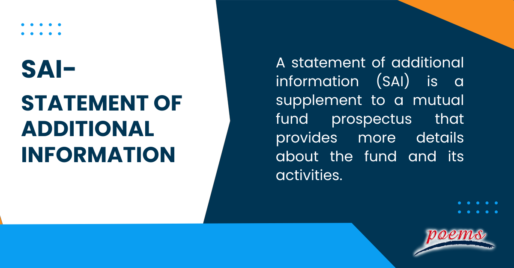

## Table of Contents

## What is a Statement of Additional Information (SAI)?

A Statement of Additional Information (SAI) is a document that provides more detailed information about a mutual fund or other investment product. It is meant to give investors a deeper understanding of the fund's operations, risks, and policies beyond what is included in the fund's prospectus.

The SAI includes information about the fund's management team, investment strategies, and financial statements. It also covers topics like how the fund handles shareholder transactions, its policies on borrowing and lending, and any potential conflicts of interest. While the prospectus gives you the basic information you need to decide whether to invest, the SAI offers a more comprehensive look at the fund for those who want to know more.

## Why is the SAI important for investors?

The SAI is important for investors because it gives them more details about a mutual fund or investment product. While the prospectus gives you the basic information you need to decide if you want to invest, the SAI goes deeper. It tells you about the people who manage the fund, how they make investment decisions, and how the fund makes money. This can help you understand if the fund is a good fit for your investment goals.

The SAI also explains important things like how the fund handles your money when you buy or sell shares, and any risks you should know about. It covers the fund's policies on borrowing and lending, and any potential conflicts of interest. By reading the SAI, you can get a clearer picture of what you're investing in and make a more informed decision.

## What kind of information is typically included in an SAI?

An SAI usually includes detailed information about the people who manage the fund, like their experience and background. It also talks about the fund's investment strategies, explaining how the managers choose what to invest in. The document covers how the fund makes money, including any fees or expenses that investors have to pay. It also goes over the fund's financial statements, which show how well the fund has been doing.

The SAI explains how the fund handles buying and selling shares, including any rules or restrictions. It covers the fund's policies on borrowing and lending money, and any potential conflicts of interest that could affect the fund's decisions. The SAI also discusses any risks that investors should be aware of, helping them understand what could go wrong with their investment. By reading the SAI, investors can get a better idea of whether the fund is right for them.

## How does the SAI differ from a prospectus?

The SAI and the prospectus are both important documents for investors, but they serve different purposes. The prospectus is like a summary that gives you the basic information you need to decide if you want to invest in a mutual fund or other investment product. It tells you about the fund's goals, risks, fees, and how to buy or sell shares. The prospectus is shorter and easier to read, making it a good starting point for understanding the fund.

On the other hand, the SAI goes into much more detail about the fund. It's like a deeper dive that gives you all the nitty-gritty information that the prospectus doesn't cover. The SAI talks about the fund managers, how they make investment choices, and the fund's financial statements. It also explains the fund's policies on things like borrowing and lending, and any potential conflicts of interest. While the prospectus helps you decide if you want to invest, the SAI helps you understand everything about the fund if you want to know more.

## Where can one find the SAI for a mutual fund or ETF?

You can find the SAI for a mutual fund or [ETF](/wiki/etf-trading-strategies) on the website of the company that manages the fund. Most fund companies have a section on their website where they list all their important documents, like the prospectus and the SAI. You can usually find these documents by searching for the name of the fund and looking for a link that says something like "Documents" or "Reports."

If you can't find the SAI on the fund company's website, you can also look on the website of the U.S. Securities and Exchange Commission (SEC). The SEC has a database called EDGAR where you can search for documents related to any mutual fund or ETF. Just type in the name of the fund, and you should be able to find the SAI along with other important documents.

## Who is required to provide an SAI?

The company that manages a mutual fund or ETF is required to provide an SAI. This is a rule set by the U.S. Securities and Exchange Commission (SEC) to make sure investors have all the information they need before they decide to invest.

The SAI is like a detailed report that goes beyond the basic information in the prospectus. It tells investors more about how the fund works, who manages it, and any risks involved. By providing this document, the fund company helps investors make informed decisions about their investments.

## How often is the SAI updated and why?

The SAI is updated at least once a year. This is because the information in the SAI can change over time, like who manages the fund or how the fund makes investment choices. By updating it every year, the fund company makes sure that the information is current and accurate for investors.

Sometimes, the SAI might be updated more often than once a year. This can happen if there are big changes to the fund, like a new manager or a change in how the fund invests. When these changes happen, the fund company has to update the SAI quickly to keep investors informed about what's going on with their investment.

## What are the regulatory requirements for an SAI?

The SAI must follow rules set by the U.S. Securities and Exchange Commission (SEC). These rules say that the SAI has to give detailed information about the mutual fund or ETF. This includes things like who manages the fund, how they make investment choices, and the fund's financial statements. The SAI also needs to explain the fund's policies on things like borrowing and lending, and any potential conflicts of interest. By having these rules, the SEC makes sure that investors get all the information they need to make good choices about their investments.

The SAI must be updated at least once a year to keep the information current. If there are big changes to the fund, like a new manager or a change in how the fund invests, the SAI has to be updated more often. This helps investors stay informed about what's happening with their investment. The SAI is usually available on the fund company's website or on the SEC's website, making it easy for investors to find and read.

## How can investors use the information in an SAI to make better investment decisions?

Investors can use the information in an SAI to make better investment decisions by learning more about the people who manage the fund. The SAI tells you about the managers' experience and how they make investment choices. This can help you decide if you trust them to handle your money well. It also explains the fund's investment strategies in detail, so you can see if they match your own goals and how much risk you're comfortable with.

The SAI also gives you a clear picture of the fund's fees and expenses. By understanding these costs, you can figure out if the fund is a good value for your money. The document also talks about any risks that come with the fund, so you know what could go wrong. With this information, you can make a smarter choice about whether the fund is right for you.

## What are some common misconceptions about the SAI?

Some people think that the SAI is just a boring document that they don't need to read. They might believe that the prospectus gives them all the information they need to make an investment decision. But the SAI is really important because it gives you a lot more details about the fund. It tells you about the people who manage the fund, how they make investment choices, and any risks you should know about. By reading the SAI, you can get a better understanding of what you're investing in.

Another common misconception is that the SAI is too hard to understand. Some people might think it's full of complicated financial terms and numbers. While it's true that the SAI has a lot of detailed information, it's written to help investors. If you take the time to read it, you can learn a lot about the fund. You don't need to be a financial expert to understand it. If you find something confusing, you can always ask for help from a financial advisor or look up terms you don't know.

## How does the SAI impact the transparency of investment products?

The SAI helps make investment products more transparent by giving investors a lot more information about the fund. It tells you about the people who manage the fund, how they make investment choices, and any risks you should know about. This means you can see exactly what you're investing in and understand how the fund works. By having all this information, you can make better decisions about whether the fund is right for you.

The SAI also explains the fund's fees and expenses in detail. This helps you see how much it will cost you to invest in the fund. Knowing these costs can help you decide if the fund is a good value for your money. Overall, the SAI makes it easier for you to understand everything about the fund, which makes the whole investment process more open and clear.

## What advanced strategies can financial analysts employ using data from the SAI?

Financial analysts can use the data from the SAI to look at how the fund's managers make their investment choices. By understanding the strategies and the people behind them, analysts can predict how the fund might perform in different market conditions. They can also compare the fund's strategies with other funds to see if it's doing something unique or if it's following the same path as others. This helps them decide if the fund is a good pick for their clients or if there might be better options out there.

Another way analysts can use the SAI is by looking at the fund's fees and expenses. They can see if the fund is charging more than similar funds and if those fees are worth it based on the fund's performance. By understanding the costs, analysts can help their clients find funds that offer good value for money. They can also use the risk information in the SAI to help clients understand what could go wrong with their investment and plan accordingly.

## References & Further Reading

[1]: Bergstra, J., Bardenet, R., Bengio, Y., & Kégl, B. (2011). ["Algorithms for Hyper-Parameter Optimization."](https://dl.acm.org/doi/10.5555/2986459.2986743) Advances in Neural Information Processing Systems 24.

[2]: ["Advances in Financial Machine Learning"](https://www.amazon.com/Advances-Financial-Machine-Learning-Marcos/dp/1119482089) by Marcos Lopez de Prado

[3]: ["Evidence-Based Technical Analysis: Applying the Scientific Method and Statistical Inference to Trading Signals"](https://www.amazon.com/Evidence-Based-Technical-Analysis-Scientific-Statistical/dp/0470008741) by David Aronson

[4]: ["Machine Learning for Algorithmic Trading"](https://github.com/stefan-jansen/machine-learning-for-trading) by Stefan Jansen

[5]: ["Quantitative Trading: How to Build Your Own Algorithmic Trading Business"](https://www.amazon.com/Quantitative-Trading-Build-Algorithmic-Business/dp/1119800064) by Ernest P. Chan