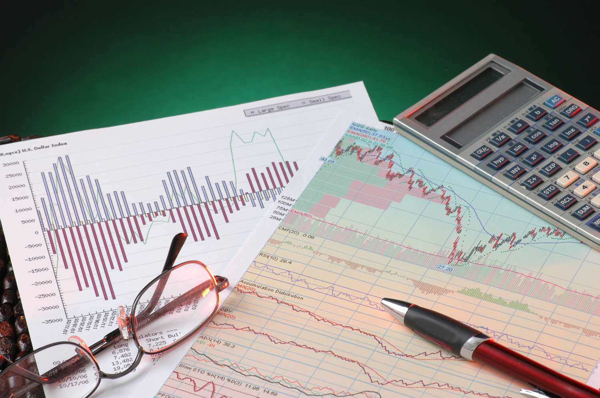

Investment strategies and financial management tools have experienced significant evolution due to technological advancements. This transformation is notably evident in the integration of algorithmic trading and AI-driven solutions within modern finance. Algorithmic trading, or algo trading, utilizes computer algorithms for executing trades based on predetermined criteria, allowing for precision and efficiency in financial markets. These algorithms are adept at navigating high-frequency trading environments, where the velocity and volume of trades are crucial to capitalize on fleeting market opportunities.

AI-driven solutions further complement these strategies by enhancing the analysis of complex financial documents. One such document is the Statement of Additional Information (SAI), which offers intricate insights into mutual fund operations, management, and strategies. The collaborative synergy of algorithmic trading and AI analysis of documents like the SAI provides investors with a profound understanding, enabling them to refine their investment portfolios strategically.



This article highlights the transformative impact of algorithmic trading, exploring its interconnection with comprehensive financial documents such as the SAI. These elements collectively serve as powerful tools for investors seeking to make informed decisions, adapt to evolving market conditions, and enhance their wealth management tactics. By examining the role of algorithms in trading alongside the detailed financial insights found in documents like the SAI, investors can attain a competitive edge in the dynamic financial markets.

## Table of Contents

## Understanding Algorithmic Trading

Algorithmic trading, commonly known as algo trading, leverages sophisticated computer algorithms to execute trades predicated on a set of predefined criteria. The automation of trading decisions allows for the precise execution of trades at speeds and frequencies that would be infeasible for human traders, thus leading to more efficient market operations.

Algo trading predominantly thrives in high-frequency trading ([HFT](/wiki/high-frequency-trading-strategies)) environments, where the ability to place a high volume of trades in fractions of a second is a critical [factor](/wiki/factor-investing). The rapidity of HFT enables traders to capitalize on even the smallest price discrepancies across different markets or assets, often reaping profits through arbitrage opportunities. The speed and volume inherent in this environment require algorithms to not only execute efficiently but also adapt rapidly to changing market conditions. Consider a simple moving average crossover strategy, where trades are executed when a short-term moving average crosses above or below a long-term moving average. A Python implementation might look as follows:

```python
import numpy as np

def moving_average(data, window_size):
    return np.convolve(data, np.ones(window_size)/window_size, mode='valid')

def generate_signals(price_data, short_window, long_window):
    signals = np.zeros(len(price_data))
    short_ma = moving_average(price_data, short_window)
    long_ma = moving_average(price_data, long_window)

    for i in range(1, len(short_ma)):
        if short_ma[i] > long_ma[i] and short_ma[i-1] <= long_ma[i-1]:
            signals[i + long_window - 1] = 1  # Buy signal
        elif short_ma[i] < long_ma[i] and short_ma[i-1] >= long_ma[i-1]:
            signals[i + long_window - 1] = -1 # Sell signal

    return signals
```

Among the myriad of strategies utilized in algo trading, several key approaches include trend-following, mean reversion, and market-making algorithms. 

Trend-following algorithms identify and capitalize on market [momentum](/wiki/momentum) by executing trades in the direction of current trends. These strategies are often based on technical indicators such as moving averages or relative strength indices. The core principle is to buy an asset that is rising in price and sell it when the price begins to reverse, thus riding the trend wave for maximum gains.

Mean reversion strategies, on the other hand, are predicated on the idea that prices will revert to their historical averages. This approach involves identifying securities that have deviated significantly from their average values and executing trades based on the expectation of a return to these historical norms. For instance, if a stock is trading significantly higher than its historical average, a mean reversion algorithm might signal to sell, anticipating a price decline.

Market-making algorithms provide [liquidity](/wiki/liquidity-risk-premium) to financial markets by continuously quoting both buy and sell prices for financial instruments. The profit from market-making arises from the spread between these prices. These algorithms are essential for maintaining market order and efficiency, particularly in less liquid markets. By offering to buy and sell the same security simultaneously, market makers facilitate smoother trading and reduced [volatility](/wiki/volatility-trading-strategies).

Overall, the implementation of [algorithmic trading](/wiki/algorithmic-trading) strategies not only enhances the efficiency and speed of financial markets but also allows traders to manage their portfolios with a level of precision that manual trading cannot achieve.

## The Role of AI in Financial Document Analysis

AI technology has significantly transformed the analysis of financial documents, thereby enhancing the efficiency of managing investments. By employing sophisticated algorithms, AI tools can parse and interpret vast amounts of data contained in detailed financial documents such as the Statement of Additional Information (SAI). This capability enables the extraction of actionable insights that are crucial for making informed investment decisions.

The primary advantage of AI in financial document analysis is its ability to manage and analyze unstructured data efficiently. Traditional techniques often struggle with the complexity and [volume](/wiki/volume-trading-strategy) of data present in documents like the SAI, which includes diverse information about mutual funds such as managerial strategies and financial statements. By contrast, AI can employ natural language processing (NLP) to comprehend and categorize this information effectively.

For instance, sentiment analysis, a form of NLP, can evaluate the tone and outlook expressed in sections of a financial document. This capability assists investors by providing a nuanced understanding of market sentiment and potential managerial intent. Furthermore, AI-driven pattern recognition algorithms can identify historical data trends and project them into potential future scenarios.

AI tools can also automate the routine aspects of document analysis, allowing financial professionals to focus on strategic decision-making. The reduction in manual labor results in cost savings and improves the speed at which analyses can be conducted. This efficiency gain is crucial in high-frequency trading environments where decisions must be executed rapidly to leverage minute market fluctuations.

Moreover, [machine learning](/wiki/machine-learning) models can be trained on extensive datasets derived from financial documents to predict future market behaviors. For instance, regression models can be utilized to estimate expected returns based on historical performance data contained within the SAI. The model might consider variables such as past asset performance, economic indicators, and market volatilities. A simple linear regression model in Python could look like this:

```python
from sklearn.linear_model import LinearRegression
import numpy as np

# Example data: X represents independent variables such as economic indicators, Y represents asset returns
X = np.array([[1, 2], [2, 3], [3, 4], [4, 5]])
Y = np.array([2, 3, 4, 5])

# Create and train the model
model = LinearRegression().fit(X, Y)

# Predicting future returns
future_X = np.array([[5, 6]])
predicted_Y = model.predict(future_X)

print(predicted_Y)  # Expected output value for future returns
```

Thus, by leveraging AI, investors gain a competitive edge in understanding complex financial data. This technological advancement facilitates a deeper and more accurate analysis, enabling investors to navigate financial markets with enhanced precision.

## Statement of Additional Information (SAI)

The Statement of Additional Information (SAI) serves as a crucial supplement to a mutual fund's prospectus, providing comprehensive insights into the fund's governance and operational framework. This document is pivotal for investors seeking an in-depth understanding of a fund's inner workings, going beyond the basic information presented in the prospectus. The SAI encompasses extensive details on various elements that influence a fund's performance and management.

One significant aspect of the SAI is the detailed information about the fund's management structure. This includes bios of the key managers, their experience, and past performance, which can help investors evaluate the expertise and reliability of the individuals responsible for the fund's operations. Such transparency is beneficial for assessing potential leadership risks and understanding the management team's impact on the fund's strategies.

The SAI also provides insights into the portfolio strategies employed by the fund. This includes the methodologies and objectives underlying the selection of securities and the approach towards asset allocation. By examining these strategies, investors can better predict the potential performance of the fund and assess its alignment with their own investment goals.

Furthermore, the SAI includes comprehensive financial statements, such as the fund's balance sheet and income statement. These financial documents offer transparency into the fund's financial health and operational efficiency, presenting data on revenue, expenses, and net asset value (NAV). Analyzing these components helps investors gauge the fund's profitability, cost management, and overall viability in delivering returns.

Overall, the SAI's detailed disclosures can substantially influence investment decisions by providing a clearer view of the mutual fund's operational dynamics. Possessing thorough knowledge of the SAI helps investors make informed choices, enhancing portfolio transparency and aligning investment strategies with their financial objectives.

## Integration of Algo Trading and SAI

Merging algorithmic trading strategies with data derived from the Statement of Additional Information (SAI) demonstrates a sophisticated approach to refining investment tactics. Algorithmic trading, characterized by its reliance on computer algorithms for executing trades at high speeds and volumes, can greatly benefit from the detailed insights found within the SAI. The SAI provides comprehensive information about a mutual fund, including management practices, investment strategies, and financial health indicators. These insights are invaluable for developing algorithms that are not only geared towards efficiency but are also aligned with long-term financial management strategies.

By leveraging financial data from the SAI, algorithms can make more informed decisions, optimizing trades using both historical and real-time data. This can be illustrated using Python to outline a simple example of how SAI data might be integrated into an algorithmic trading system:

```python
import pandas as pd

# Example SAI data - typically, this would be extracted from detailed SAI documents
sai_data = {'fund_name': 'Example Fund', 'management_fee': 0.015, 'net_assets': 50000000}

# Real-time market data input
market_data = pd.DataFrame({
    'stock': ['STOCK_A', 'STOCK_B'],
    'current_price': [120.5, 55.8],
    'price_earnings_ratio': [15.6, 29.3]
})

# Define a simple trading algorithm that utilizes SAI data
def trading_decision(sai_data, market_data):
    decisions = []
    for index, row in market_data.iterrows():
        if row['price_earnings_ratio'] < 20 and sai_data['management_fee'] < 0.02:
            decisions.append(f"Buy {row['stock']}")
        else:
            decisions.append(f"Hold {row['stock']}")
    return decisions

trade_actions = trading_decision(sai_data, market_data)
print(trade_actions)
```

In this simplified example, trading decisions are based on criteria derived from SAI data, such as management fees, alongside market indicators like the price-earnings ratio. The integration of such data ensures that trading actions are not only rapid but also aligned with the thorough financial insights provided by the SAI. This alignment allows the trading process to reflect the financial health and strategic positioning of the respective fund, offering a more holistic and informed trading approach.

Such an integrated system has the potential to revolutionize the precision and effectiveness of trading strategies. By synthesizing extensive financial records with cutting-edge algorithmic technologies, traders can align their activities with the broader financial objectives of the mutual fund, optimizing the potential for achieving competitive returns while maintaining rigor in risk management.

## Advantages of Combining Algo Trading with SAI Analysis

Combining algorithmic trading with an analysis of the Statement of Additional Information (SAI) offers significant advantages for investment strategies. The precision and reduced risk achieved through data-driven strategies is one of the primary benefits. Algorithms can evaluate vast datasets, including those found in SAI documents, to identify optimal trading opportunities. This precision is crucial in an environment where microsecond differences can determine success, especially in high-frequency trading scenarios.

Another advantage is the ability to capitalize on market inefficiencies with speed and accuracy. Traditional trading methods may miss fleeting [arbitrage](/wiki/arbitrage) opportunities or subtle price discrepancies, but algorithmic trading can swiftly act upon these inefficiencies. By incorporating insights from detailed financial documents such as the SAI, algorithms can execute trades that align with an investor's strategic goals and the financial product's underlying fundamentals.

Improved risk management is also a critical benefit of this integration. The SAI provides comprehensive insights into a fund's management practices, portfolio strategies, and financial statements. Incorporating this information into algorithmic trading frameworks enhances risk assessment, enabling more accurate predictions and adjustments across different market scenarios. Investors can therefore better safeguard their portfolios by anticipating potential risks and shifting strategies accordingly.

In summary, blending algorithmic trading with SAI analysis offers a sophisticated approach, combining speed, precision, and informed decision-making to enhance financial performance.

## Conclusion

The fusion of algorithmic trading and comprehensive document analysis represents a significant advancement in modern investing. The integration of these technologies empowers investors with the ability to navigate financial markets with precision and foresight, enhancing both the speed and quality of decision-making processes. By leveraging AI-driven tools, investors can process and interpret vast amounts of financial data with unprecedented efficiency, offering a clearer understanding of market dynamics and potential investment opportunities.

As financial markets continue to evolve and become more complex, the adoption of algorithmic trading combined with AI-enhanced document analysis becomes not merely beneficial, but essential for maintaining a competitive edge. These technologies facilitate the mining of valuable insights from comprehensive financial documents, such as the Statement of Additional Information (SAI), enabling investors to align their strategies with current market conditions and trends.

The seamless integration of these advanced technologies into investment strategies ensures that investors can capitalize on market variations swiftly and accurately. In an environment where milliseconds can make a substantial difference, the precision afforded by algorithmic systems reduces risks and augments the potential for improved returns. Furthermore, the comprehensive insights extracted from financial documents contribute to a more informed risk management approach, ensuring decisions are underpinned by a robust understanding of the financial landscape.

As the technological capabilities within the finance industry expand, so too does the potential for refined and strategic investment approaches. Embracing the combination of algorithmic trading and AI-driven document analysis is rapidly becoming not just an advantage, but a necessity for those seeking to thrive in the competitive financial arena.

## References & Further Reading

[1]: Bergstra, J., Bardenet, R., Bengio, Y., & Kégl, B. (2011). ["Algorithms for Hyper-Parameter Optimization."](https://dl.acm.org/doi/10.5555/2986459.2986743) Advances in Neural Information Processing Systems 24.

[2]: ["Advances in Financial Machine Learning"](https://www.amazon.com/Advances-Financial-Machine-Learning-Marcos/dp/1119482089) by Marcos Lopez de Prado

[3]: ["Evidence-Based Technical Analysis: Applying the Scientific Method and Statistical Inference to Trading Signals"](https://www.amazon.com/Evidence-Based-Technical-Analysis-Scientific-Statistical/dp/0470008741) by David Aronson

[4]: ["Machine Learning for Algorithmic Trading"](https://github.com/stefan-jansen/machine-learning-for-trading) by Stefan Jansen

[5]: ["Quantitative Trading: How to Build Your Own Algorithmic Trading Business"](https://www.amazon.com/Quantitative-Trading-Build-Algorithmic-Business/dp/1119800064) by Ernest P. Chan