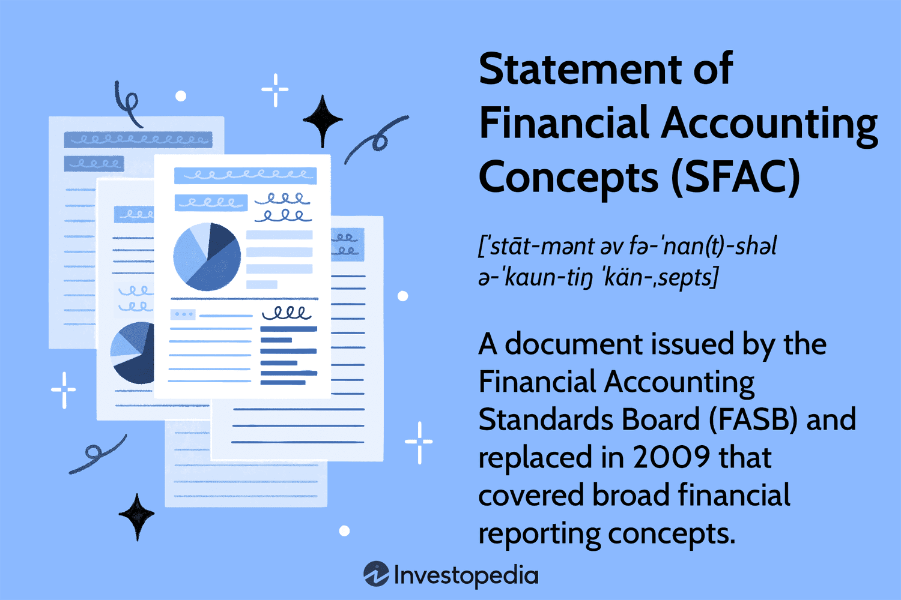

In the rapidly evolving world of finance, understanding fundamental accounting concepts is crucial for professionals seeking to gain a competitive edge. This article explores the intersection of accounting concepts, financial accounting, the Statement of Financial Accounting Concepts (SFAC), and algorithmic trading, highlighting their significance in modern financial practices.

Accounting concepts are the foundation upon which reliable financial reporting frameworks are built. These frameworks play a pivotal role in creating robust systems that support effective trading strategies and investment decisions. In this context, financial accounting provides a structured method of recording and reporting financial transactions, ensuring transparency and accuracy in the presentation of a company's financial position.



The SFAC serves as a guiding framework for the development of accounting standards, outlining essential objectives and qualitative characteristics that inform financial reporting practices. It lays the groundwork for establishing the elements of financial statements and setting recognition and measurement criteria. Understanding SFAC is integral for those involved in creating and interpreting financial reports, as it enhances the credibility and consistency of financial information provided to stakeholders.

In addition to these accounting frameworks, algorithmic trading exemplifies the practical application of accurate and timely financial data in contemporary finance. Algorithmic trading relies on sophisticated algorithms to execute trades at high speeds, necessitating reliable and precise financial data inputs derived from sound accounting principles. Accurate financial reporting and adherence to established standards are vital to minimize errors and optimize trading outcomes.

By grasping these interconnected elements, professionals can make more informed decisions in the financial markets, ultimately contributing to the stability and growth of these markets. Understanding and employing accounting concepts, SFAC, and algorithmic trading principles enable professionals to navigate complex financial structures with greater clarity, leading to more effective financial strategies and enhanced market participation.

## Table of Contents

## Understanding Accounting Concepts

Accounting concepts are essential for ensuring reliable financial reporting and effective decision-making within a company. These foundational principles provide the framework for accurately representing a company's financial position and performance. Key accounting concepts include the accounting equation, the accrual basis, and the matching principle. 

The **accounting equation** is a fundamental principle and can be expressed as:

$$
\text{Assets} = \text{Liabilities} + \text{Equity}
$$

This equation underlines the double-entry bookkeeping system, ensuring that every financial transaction recorded affects at least two accounts, maintaining the balance. It is instrumental in reflecting the financial position of a company by showing what the company owns versus what it owes, including owners' equity.

The **accrual basis** of accounting mandates that revenues and expenses are recognized when they are earned or incurred, regardless of when cash transactions occur. This concept supports a more accurate depiction of a company's financial status during a particular period. For example, if a service is delivered in December but not paid for until January, the revenue should still be recognized in December under the accrual concept. This approach contrasts with cash basis accounting, which records revenues and expenses strictly when cash changes hands.

The **matching principle** complements the accrual basis by requiring that expenses be matched with the revenues they help to generate in the same period. This principle ensures that a company's financial statements reflect the actual causes and effects, providing a more comprehensive picture of operational success and financial well-being. For example, if a business provides consulting services in December but will only pay associated staff salaries in January, the expense should still be recorded in December.

The robust application of these principles is crucial for maintaining transparency and fostering trust in financial reporting. Accurate and honest financial statements facilitate informed decision-making by management, investors, and other stakeholders. For instance, by adhering to these accounting concepts, companies provide a reliable financial narrative allowing investors to assess potential risks and returns objectively.

In practical applications, these concepts serve corporations by guiding the preparation of financial statements, budgeting, forecasting, and strategic planning. Companies leveraging these principles can enhance stakeholders' confidence, streamline their operations through comprehensive financial insights, and better comply with regulatory standards. Thus, understanding and applying these accounting concepts is foundational to creating a robust financial reporting framework and fostering sustainable growth within the financial markets.

## Financial Accounting and SFAC

The Statement of Financial Accounting Concepts (SFAC) plays a pivotal role in shaping the landscape of financial accounting. Developed by the Financial Accounting Standards Board (FASB), SFAC establishes a theoretical framework that underpins the development of accounting standards, ensuring that they are both relevant and reliable. The SFAC outlines a set of objectives and qualitative characteristics that are fundamental in guiding the formulation and evaluation of financial accounting practices.

One of the primary objectives of SFAC is to provide information that is useful to present and potential investors, creditors, and other users in making rational investment, credit, and similar decisions. This objective underscores the need for financial reports to offer insights that go beyond mere compliance with stipulations, such as those outlined by regulatory bodies, towards meeting the pragmatic demands of stakeholders.

The qualitative characteristics defined by SFAC reflect the criteria for evaluating the quality of financial reporting. These include understandability, relevance, reliability, and comparability:

1. **Understandability**: Financial information should be comprehensible to users who possess a reasonable knowledge of business and economic activities.

2. **Relevance**: Information must be pertinent to decision-making processes, providing predictive and confirmatory value.

3. **Reliability**: Information should be free from material error and bias, conveying a faithful representation of real-world economic phenomena.

4. **Comparability**: Users must be able to compare the financial statements of an entity over time and across different entities to identify trends and make informed decisions.

SFAC significantly influences the establishment of recognition and measurement criteria. The framework emphasizes the necessity to identify elements of financial statements such as assets, liabilities, equity, revenues, expenses, gains, and losses. These elements are crucial for constructing financial statements that present a true and fair view of an entity's financial position and performance.

The impact of SFAC extends to its influence on the accounting profession by promoting consistency and enhancing the credibility of financial reporting. By providing a structured approach to financial accounting, professionals engaged in creating and interpreting financial reports can ensure that standards are applied uniformly across different contexts and industries. This uniformity is critical in fostering trust and transparency in financial markets, as it assures users of the comparability and reliability of financial information.

Understanding SFAC is essential for accounting professionals and stakeholders. It provides the conceptual underpinnings necessary for the development of robust accounting policies and procedures. As businesses navigate the complexities of financial reporting, SFAC serves as a guide to aligning accounting practices with practical needs and emerging issues, thereby supporting effective decision-making processes.

## SFAC and the Conceptual Framework for Reporting

The Statement of Financial Accounting Concepts (SFAC) serves as a pivotal framework for crafting financial reports across various sectors. This framework emphasizes the provision of relevant, reliable, and comprehensible financial information to stakeholders, ensuring the transparency and effectiveness necessary for sound financial decision-making.

The conceptual framework established by the SFAC meticulously guides both the presentation and disclosure of financial statements. The primary objective is to empower stakeholders with a clear and accurate understanding of a company’s financial health. By adhering to these standards, financial statements enhance their credibility and consistency, providing assurances to investors, regulators, and other interested parties.

Core elements within the SFAC framework, such as assets, liabilities, and equity, are carefully defined to shed light on a company’s financial position and performance. An asset is recognized as any resource controlled by the entity anticipated to produce future economic benefits. Liabilities represent present obligations that may result in the outflow of resources, while equity refers to the residual interest in the assets after settling liabilities. These components form the accounting equation:

$$
\text{Assets} = \text{Liabilities} + \text{Equity}
$$

This equation ensures a balanced financial statement, thereby enhancing the integrity of financial reporting. The clarity provided by these definitions allows for standardized financial reporting practices, making comparisons across different companies and industries possible.

By framing these key components within transparent disclosure standards, SFAC contributes significantly to the fidelity and uniformity of financial reports. Stakeholders, therefore, can trust that the financial information portrayed accurately reflects the economic realities of the entity. This trust is fundamental in fostering an environment where stakeholders can make informed investment decisions, promoting financial market efficiency and stability.

## Algorithmic Trading and Financial Accounting

Algorithmic trading, a cornerstone of modern financial markets, depends fundamentally on the accuracy and timeliness of financial data, which is ensured through stringent accounting practices. Financial accounting provides a structured method for recording and reporting economic transactions, yielding consistent and reliable data that trading algorithms can use to make informed decisions. A sound understanding of accounting principles, such as the double-entry system and revenue recognition criteria, is crucial to creating an effective trading algorithm.

The integrity of [algorithmic trading](/wiki/algorithmic-trading) systems relies heavily on the precision of the underlying financial data. Accounting errors or misrepresentations can distort this data, leading to skewed trading outcomes. For instance, if a company misstates its revenue figures, algorithms dependent on this data for assessing enterprise value may execute incorrect trades, potentially resulting in financial losses.

Accounting standards establish a robust framework that enables traders and investors to rely on the financial statements provided by entities. The application of International Financial Reporting Standards (IFRS) or Generally Accepted Accounting Principles (GAAP) ensures consistency and comparability across financial statements, providing a stable foundation for algorithmic analysis. These standards guide the recognition, measurement, and disclosure of financial elements, reducing the room for ambiguities in financial reporting and thereby supporting the needs of market participants.

Collaboration between financial accountants and traders is essential for optimizing trading strategies and outcomes. Accountants play a critical role in ensuring that financial data accurately reflects the company's economic activities, while traders leverage this data to develop and refine algorithms. A practical example of collaborative synergy is the use of quarterly financial reports. These reports provide a wealth of data that traders can analyze to adjust their algorithms, taking into consideration aspects like seasonality or one-off events, thereby enhancing prediction accuracy.

This collaborative approach can be supported by technological advancements in data analytics and [machine learning](/wiki/machine-learning). For example, accountants can leverage Python libraries such as Pandas and NumPy to preprocess and clean financial data, ensuring it is in a format optimal for feeding into trading algorithms. The cross-disciplinary understanding can significantly enhance the quality and speed of information flow from financial reporting systems to trading platforms.

```python
import pandas as pd
import numpy as np

# Example of cleaning financial data for algorithmic trading
data = pd.read_csv('financial_data.csv')
data.dropna(inplace=True)  # Remove missing values
data['date'] = pd.to_datetime(data['date'])  # Ensure proper date format
data.set_index('date', inplace=True)
```

In conclusion, the symbiosis between accounting and algorithmic trading underscores the importance of precision in financial reporting. By fostering interdisciplinary collaboration and leveraging advancements in technology, traders and accountants can ensure that financial data not only meets the rigorous standards of reporting but also supports sophisticated trading strategies, ultimately contributing to market efficiency and stability.

## Criticisms and Future Developments of SFAC

The Statement of Financial Accounting Concepts (SFAC) has been instrumental in shaping the landscape of financial reporting. However, it has not been without its criticisms. One of the primary critiques of SFAC revolves around its complexity and the abstract nature of its principles. Critics argue that the broad conceptual guidelines provided by SFAC can be daunting for practitioners to apply in specific, real-world scenarios. This complexity occasionally results in inconsistencies in how financial information is reported across different entities and industries.

Another significant issue is SFAC's lack of enforceability. Unlike specific accounting standards that possess the weight of regulation, SFAC serves more as a conceptual guide. This can lead to varied interpretations and implementations in financial reporting, thereby affecting the uniformity and reliability of financial statements. The absence of enforceable mandates often raises questions about the practical utility of SFAC's guidelines in ensuring consistent and transparent financial reporting.

Efforts to address these criticisms are ongoing. The Financial Accounting Standards Board (FASB), the body responsible for developing SFAC, is actively pursuing revisions to make the framework more applicable to contemporary business environments. This includes attempts to align SFAC more closely with evolving accounting standards and global financial practices. Among these efforts are initiatives aimed at simplifying the language of SFAC and providing more concrete examples of how its principles should be applied in practice.

Future developments in SFAC are anticipated to focus on enhancing clarity and responsiveness to new financial challenges. The goal is to create a framework that not only guides the preparation of financial statements but also adapts to the rapid changes in the financial sector, such as the rise of digital currencies, increased regulatory scrutiny, and the integration of sustainability into financial reporting. Enhancements in SFAC might include more robust guidelines for emerging financial issues, along with a stronger emphasis on enforceability to ensure consistent application across the board.

In summary, while SFAC remains a cornerstone of financial accounting theory, its effectiveness depends on continuous refinement to meet the demands of modern finance. By addressing its current criticisms and embracing future developments, SFAC can maintain its relevance in facilitating accurate and transparent financial reporting.

## Conclusion

The convergence of accounting concepts, the Statement of Financial Accounting Concepts (SFAC), and algorithmic trading underscores the interconnected nature of modern finance. Professionals equipped with an understanding of these key elements are better positioned to navigate the complexities of today's financial landscape. As financial markets continue to evolve, it becomes increasingly crucial to remain informed about current accounting standards and reporting frameworks. This is not merely an academic exercise; continuous learning is vital to ensuring effective decision-making and strategic planning in the real world.

The integration of accounting principles, as outlined in SFAC, facilitates the creation of transparent financial reports, which serve as the foundation for analytical tools and trading algorithms. Accounting transparency and accuracy are indispensable for traders who rely on precise data to devise strategies and execute trades efficiently. In this dynamic environment, the role of financial professionals is to not only comprehend these concepts but to adapt them to emerging market conditions and technologies.

By leveraging the insights gained from a comprehensive understanding of accounting concepts, SFAC regulations, and algorithmic trading methodologies, financial professionals can make informed decisions that contribute to the stability and growth of financial markets. The journey of adaptation and continuous learning in this field is ongoing, emphasizing the necessity for professionals to stay ahead of technological and regulatory changes. This proactive approach will enable them to foster resilience and innovation within the financial industry.

## References & Further Reading

[1]: ["Conceptual Framework for Financial Reporting"](https://www.ifrs.org/content/dam/ifrs/publications/pdf-standards/english/2021/issued/part-a/conceptual-framework-for-financial-reporting.pdf) by the International Financial Reporting Standards (IFRS) Foundation.

[2]: ["Financial Accounting and Reporting"](https://www.investopedia.com/terms/f/financialaccounting.asp) by Barry Elliott and Jamie Elliott.

[3]: ["Accounting for Non-Accountants: A Manual for Managers and Students"](https://books.google.com/books/about/Accounting_for_Non_accountants.html?id=GE1lHiU1ZCwC) by David Horner.

[4]: ["Algorithmic Trading: Winning Strategies and Their Rationale"](https://www.wiley.com/en-us/Algorithmic+Trading%3A+Winning+Strategies+and+Their+Rationale-p-9781118746912) by Ernest P. Chan.

[5]: ["Introduction to Algorithmic Trading: Basic to Advanced Strategies"](https://archive.org/details/introductiontoal0000lesh) by Robert Kissell.

[6]: ["Accounting Standards: Framework, Principles and Procedures"](https://fasb.org/standards) by Gregory Becker and Andrew Gibson.

[7]: ["Algorithmic Trading and DMA: An Introduction to Direct Access Trading Strategies"](https://archive.org/details/algorithmictradi0000john) by Barry Johnson.