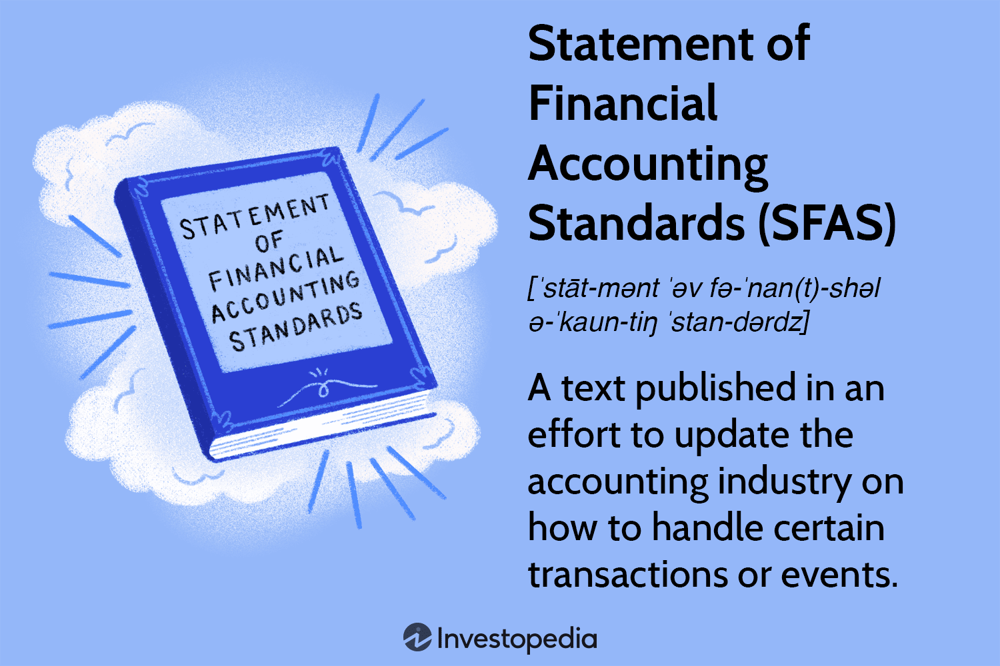

## Table of Contents

## What is a Statement of Financial Accounting Standards (SFAS)?

A Statement of Financial Accounting Standards (SFAS) is a set of rules and guidelines that companies use to prepare their financial statements. These standards are created by the Financial Accounting Standards Board (FASB), which is a group of experts in the United States. The main goal of SFAS is to make sure that all companies report their financial information in a clear and consistent way, so that investors and other people can easily understand it.

SFAS covers many different topics, like how to report income, expenses, assets, and liabilities. For example, one SFAS might explain how a company should record the cost of its inventory, while another might describe how to account for leases. By following these standards, companies can make sure their financial statements are accurate and reliable, which helps build trust with investors and other stakeholders.

## Who issues the Statements of Financial Accounting Standards?

The Statements of Financial Accounting Standards (SFAS) are issued by the Financial Accounting Standards Board (FASB). The FASB is a group of experts in the United States who work to make sure that companies report their financial information in a clear and consistent way.

The FASB creates these standards to help companies prepare their financial statements accurately. By following the SFAS, companies can make sure their financial reports are reliable, which helps build trust with investors and other people who use the financial information.

## Why are SFAS important for financial reporting?

SFAS, or Statements of Financial Accounting Standards, are really important for financial reporting because they help make sure that all companies report their financial information in the same way. This makes it easier for people like investors to understand and compare the financial statements of different companies. If every company used its own way of reporting, it would be hard to know if they were all being fair and accurate.

The rules in SFAS cover a lot of different things, like how to report money coming in and going out, what a company owns, and what it owes. By following these rules, companies can make sure their financial statements are correct and trustworthy. This is important because it helps investors and others feel confident that they can rely on the financial information they see.

## How do SFAS differ from other accounting standards?

SFAS, or Statements of Financial Accounting Standards, are specific rules made by the Financial Accounting Standards Board (FASB) in the United States. They are meant for companies in the U.S. to follow when they make their financial reports. SFAS focus on making sure that all U.S. companies report their money in the same way, so it's easier for people to understand and compare the financial information of different companies.

Other accounting standards, like International Financial Reporting Standards (IFRS), are used in many countries around the world. IFRS are made by the International Accounting Standards Board (IASB) and are meant to be used globally. While SFAS are specific to the U.S., IFRS aim to create a common language for financial reporting that can be used everywhere. This means that while SFAS and IFRS have similar goals of making financial reports clear and reliable, they are created by different groups and used in different places.

## Can you explain the process of developing an SFAS?

When the Financial Accounting Standards Board (FASB) wants to make a new Statement of Financial Accounting Standards (SFAS), they start by looking at what might need to change or be added to the rules. They do a lot of research and talk to people who know a lot about accounting and finance. They might also ask for ideas from the public. Once they have a good idea of what the new standard should cover, they write a draft of the SFAS.

After the draft is ready, the FASB shares it with everyone and asks for feedback. People like accountants, business owners, and investors can read the draft and tell the FASB what they think. The FASB listens to all the feedback and might make changes to the draft based on what they hear. Once they think the draft is good enough, they vote on it. If most of the board members agree, the new SFAS becomes official and companies start using it to make their financial reports.

## What are some key SFAS that have significantly impacted accounting practices?

One key SFAS that has significantly impacted accounting practices is SFAS No. 95, which deals with how companies report their cash flows. Before this standard, companies could show their cash flow in different ways, which made it hard to compare them. SFAS No. 95 made it so that all companies have to show their cash flow in the same three categories: operating, investing, and financing activities. This change helped investors and others understand how money moves in and out of a company more easily.

Another important SFAS is No. 142, which changed how companies handle goodwill on their financial statements. Goodwill is the extra money a company pays when it buys another company. Before SFAS No. 142, companies had to reduce the value of goodwill over time, even if it was still worth a lot. This new standard said that companies should check the value of goodwill every year and only reduce it if it's really worth less. This change made financial statements more accurate and helped companies show the true value of what they own.

Lastly, SFAS No. 123(R) had a big impact on how companies report the cost of stock options they give to employees. Before this standard, companies didn't have to show the cost of stock options on their financial statements, which could make their profits look higher than they really were. SFAS No. 123(R) made it so that companies have to show the cost of stock options as an expense. This change made financial statements more honest and helped investors see the true cost of giving stock options to employees.

## How do companies implement SFAS in their financial statements?

When a company wants to follow a new SFAS, they first need to learn about the new rules. They read the SFAS and understand what it says about how to report their money. Then, they change their accounting systems to match the new rules. This might mean updating their computer programs or training their accountants to do things differently. They also need to make sure that all their financial reports follow the new SFAS, so they might need to go back and change old reports to make them right.

Once the company has made these changes, they start using the new SFAS in their financial statements. This means they report their money in the way the SFAS says they should. For example, if the SFAS is about how to show cash flow, the company will make sure their cash flow statement follows the new rules. They keep doing this every time they make a financial report, so that their reports are always correct and follow the latest SFAS. This helps make sure their financial statements are clear and trustworthy for people like investors who look at them.

## What are the challenges businesses face when adopting new SFAS?

When a new SFAS comes out, businesses often face challenges in understanding and applying the new rules. They need to spend time reading and learning about the new standard, which can be complicated. Sometimes, the new rules mean that they have to change the way they do their accounting, which can be hard and take a lot of work. They might need to update their computer systems or hire experts to help them make the changes correctly. This can be expensive and take a lot of time away from their regular work.

Another challenge is making sure that their old financial reports match the new SFAS. They might need to go back and change numbers in their past reports to make them right, which can be a big job. Also, if the new SFAS changes how they show their money, it can be hard to explain these changes to investors and other people who look at their financial statements. They need to make sure everyone understands why the numbers might look different now, which can be tricky. All these challenges can make it tough for businesses to adopt a new SFAS smoothly.

## How do SFAS affect the comparability of financial statements across different jurisdictions?

SFAS, or Statements of Financial Accounting Standards, are rules made by the Financial Accounting Standards Board (FASB) in the United States. They help U.S. companies report their money in the same way, which makes it easier to compare financial statements within the U.S. But, when you want to compare the financial statements of a U.S. company with a company from another country, it can be harder. This is because other countries might use different accounting standards, like the International Financial Reporting Standards (IFRS), which are made by a different group and have different rules.

The difference in standards can make it tricky to compare financial statements across different jurisdictions. For example, how a U.S. company reports its income might be different from how a company in Europe does it. This means that even if both companies are doing well, their financial statements might look different just because they are following different rules. To make things easier, some companies around the world are starting to use IFRS, which can help make financial statements more comparable globally, but until everyone uses the same standards, comparing across jurisdictions will still be challenging.

## What role do SFAS play in ensuring transparency and accountability in financial reporting?

SFAS, or Statements of Financial Accounting Standards, are important rules that help make sure companies are clear and honest about their money. These rules are made by a group called the Financial Accounting Standards Board (FASB) in the United States. When companies follow SFAS, they have to report their money in a certain way. This helps everyone see exactly how much money the company is making, spending, and what it owns or owes. By having these clear rules, it's harder for companies to hide things or make their financial reports confusing. This means investors and other people who look at the reports can trust that the numbers are correct and fair.

SFAS also help keep companies accountable. When everyone has to follow the same rules, it's easier to check if a company is doing things right. If a company doesn't follow the SFAS, people can see it and ask questions. This can lead to the company fixing any mistakes or facing consequences if they did something wrong on purpose. By making sure everyone follows the same clear rules, SFAS help make sure companies are responsible for showing their money in a way that is honest and easy to understand.

## How have recent SFAS updates addressed emerging issues in financial accounting?

Recent SFAS updates have been important for dealing with new issues in financial accounting. For example, SFAS No. 168, which came out in 2009, changed how companies report the costs of accounting changes. This update made it so that companies have to show these costs in their financial statements right away, instead of spreading them out over time. This helps investors see the true cost of making changes to accounting rules more clearly.

Another recent update is SFAS No. 166, which deals with how banks and other financial companies report their money. This standard, updated in 2009, made rules about how these companies should show what they own and what they owe more clear. This is important because it helps people understand the financial health of banks better, especially during tough economic times. By addressing these new issues, SFAS updates help keep financial reporting honest and easy to understand.

## What is the future outlook for SFAS in the context of global accounting standards convergence?

The future of SFAS, or Statements of Financial Accounting Standards, is closely tied to the idea of global accounting standards convergence. This means trying to make the accounting rules used around the world more similar. The goal is to have one set of rules that everyone can follow, so it's easier to compare financial statements from different countries. Right now, the U.S. uses SFAS, while many other countries use the International Financial Reporting Standards (IFRS). There's been a lot of talk about whether the U.S. should switch to IFRS or find a way to make SFAS and IFRS work together better.

In the coming years, we might see more changes to SFAS to make them closer to IFRS. This could mean updating some rules to match what IFRS says, or finding ways for companies to report their money using both sets of standards. The idea is to make financial reporting clearer and more trustworthy everywhere. But making these changes will take time and a lot of work, because it involves changing laws and getting everyone to agree. Still, the push for global accounting standards convergence is strong, and SFAS will likely play a big role in making this happen.

## References & Further Reading

[1]: ["Financial Accounting Standards Board (FASB) - Official Website"](https://fasb.org/standards)

[2]: Lopez de Prado, M. (2018). ["Advances in Financial Machine Learning."](https://www.amazon.com/Advances-Financial-Machine-Learning-Marcos/dp/1119482089) Wiley.

[3]: Aronson, D. R. (2006). ["Evidence-Based Technical Analysis: Applying the Scientific Method and Statistical Inference to Trading Signals."](https://www.amazon.com/Evidence-Based-Technical-Analysis-Scientific-Statistical/dp/0470008741) Wiley.

[4]: Jansen, S. (2020). ["Machine Learning for Algorithmic Trading."](https://github.com/stefan-jansen/machine-learning-for-trading) Packt Publishing.

[5]: Chan, E. P. (2009). ["Quantitative Trading: How to Build Your Own Algorithmic Trading Business."](https://github.com/ftvision/quant_trading_echan_book) Wiley.

[6]: ["Generally Accepted Accounting Principles (GAAP) - Overview and Resources on GAAP Compliance"](https://www.forbes.com/advisor/business/generally-accepted-accounting-principles-gaap-guide/) on Investopedia

[7]: ["Algorithmic Trading: A Literature Review"](https://ijsser.org/2023files/ijsser_08__167.pdf) by Arnuk, Sal L. and Saluzzi, Joseph C.