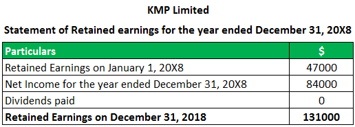

In today's fast-paced financial world, understanding the intricacies of accounting, retained earnings, and financial statements is crucial for both traditional investors and those involved in algorithmic trading. Financial markets are becoming increasingly complex, and technology is driving a significant transformation. To navigate these changes effectively, investors must comprehend the foundational concepts of financial analysis.

Accounting serves as the systematic process of recording, categorizing, and interpreting financial data. It acts as the foundational language through which businesses present their financial health and performance. Key financial statements—balance sheets, income statements, and cash flow statements—serve as indispensable tools. These documents provide comprehensive insights into a firm's operational efficiency, liquidity status, and profitability. For investors, particularly those utilizing algorithmic trading, financial statements are not just reports; they are integral datasets that inform strategy and decisions.



The interconnection between accounting data and trading decisions is increasingly relevant in the digital age. Algorithmic trading, which utilizes complex algorithms to execute trades at high speed, places a premium on accurate financial information. Algorithms equipped with financial data can swiftly identify market trends and potential investment opportunities, which are crucial for staying ahead in competitive markets. While traditional investors may manually analyze financial statements to gauge a company's health, algorithmic traders can automate this process, analyzing large volumes of data in real-time.

As the financial industry continues to evolve, staying updated on technological advancements and financial analysis techniques is vital. Both seasoned traders and newcomers must adapt to a shifting landscape where technology and finance intersect more than ever. A robust understanding of accounting concepts, coupled with an ability to interpret financial statements, empowers traders to make informed decisions. This article will explore these essential financial elements, examining their implications and the role they play in shaping modern trading practices. By doing so, we aim to provide a clear understanding of how these foundational terms impact today's trading ecosystem.

## Table of Contents

## Understanding Accounting and Financial Statements

Accounting is recognized as the language of business due to its systematic approach in recording, analyzing, and interpreting financial data. Its primary purpose is to provide stakeholders with a clear picture of the financial health and performance of a business. This communication occurs primarily through financial statements, which include the balance sheet, income statement, and cash flow statement.

### Balance Sheet

The balance sheet, also known as the statement of financial position, offers a snapshot of a company's assets, liabilities, and shareholders' equity at a specific point in time. This financial statement adheres to the accounting equation:

$$
\text{Assets} = \text{Liabilities} + \text{Shareholders' Equity}
$$

- **Assets:** These are resources owned by the company that have economic value and can provide future benefits. Assets are typically classified into current assets, such as cash and inventory, and non-current assets like property and equipment.
- **Liabilities:** These are the obligations or debts the company owes to external parties, such as loans and accounts payable. Liabilities are also divided into current (short-term) and non-current (long-term).
- **Shareholders' Equity:** This represents the owners’ claim after all liabilities have been settled. It includes common stock, retained earnings, and other reserves.

Understanding the balance sheet is essential for traders and investors as it reflects the company's financial stability and capital structure.

### Income Statement

The income statement, sometimes referred to as the profit and loss statement, summarizes a company's revenues, expenses, and profits over a specified period, typically a quarter or a year. The fundamental equation for the income statement is:

$$
\text{Net Income} = \text{Revenue} - \text{Expenses}
$$

- **Revenue:** Also known as sales or income, it represents the total amount of money earned from selling goods or services.
- **Expenses:** These are the costs incurred in the process of earning revenue, including cost of goods sold (COGS), operating expenses, interest, and taxes.
- **Net Income:** This is the profit remaining after all expenses have been subtracted from revenues. It is a key indicator of a company’s profitability.

For traders, the income statement provides insights into a company's operational efficiency and profit margins, influencing investment decisions.

### Cash Flow Statement

The cash flow statement shows how changes in balance sheet accounts and income affect cash and cash equivalents. It breaks down the analysis into three primary categories:

- **Operating Activities:** Reflects cash generated or consumed during regular business operations. It includes net income, adjustments for non-cash items, and changes in working capital.
- **Investing Activities:** Covers cash used in or generated from investments in assets, such as purchasing equipment or investing in securities.
- **Financing Activities:** Encompasses cash flows related to borrowing, repaying debt, issuing shares, or paying dividends.

The formula to determine cash flow is:

$$
\text{Net Cash Flow} = \text{Cash Flow from Operations} + \text{Cash Flow from Investing} + \text{Cash Flow from Financing}
$$

The cash flow statement is vital for traders to gauge a company’s [liquidity](/wiki/liquidity-risk-premium) and financial flexibility, ensuring that it can sustain operations and investment activities without relying excessively on external funding.

### Importance in Trading

For traders, financial statements are indispensable tools in analyzing a company's financial health and making informed trading decisions. They enable an assessment of a company’s operational effectiveness, financial condition, and growth prospects. In the fast-paced trading environment, having a concrete understanding of these statements allows traders to accurately evaluate a company's intrinsic value, compare it against market performance, and identify potential investment or trading opportunities. By interpreting these statements accurately, traders and investors can make astute decisions that align with their financial goals and risk tolerance in the trading world.

## Decoding Retained Earnings

Retained earnings are a vital component of a company's financial health, representing the cumulative profit that a company chooses to retain rather than distribute to shareholders as dividends. These earnings play a significant role in signaling how effectively a company is reinvesting its profits to stimulate growth and enhance shareholder value.

### Calculation of Retained Earnings

The calculation of retained earnings is relatively straightforward and involves three key elements: the beginning retained earnings, net income for the period, and dividends paid. The formula can be expressed as:

$$
\text{Retained Earnings}_{\text{end}} = \text{Retained Earnings}_{\text{beginning}} + \text{Net Income} - \text{Dividends Paid}
$$

This calculation aids in understanding the changes in a company's retained earnings over a specific accounting period, providing insights into its dividend policies and profit reinvestment strategies.

### Implications for Investors and Traders

For investors and traders, retained earnings serve as an indicator of a company's potential for expansion and its financial stability. An increasing retained earnings balance suggests that a company is effectively utilizing its earnings to generate additional income and can indicate positive future growth prospects. Conversely, if a company consistently retains its earnings but does not experience corresponding growth, it might signal inefficiencies in resource allocation.

Retained earnings are a crucial metric for assessing whether a company is in a position to fund expansion projects, invest in new markets or products, and improve returns on investments. They provide an indication of the company's ability to finance its operations without resorting to external borrowing.

### Reflecting Capacity for Expansion and Financial Stability

Retained earnings reflect a company's internal funding capacity, which is essential for expansion and sustaining operations during economic downturns. Companies with substantial retained earnings are often considered more financially stable, as they have the resources to navigate unexpected challenges and invest in opportunities that require immediate funding. This stability can be attractive to investors seeking long-term growth and reduced investment risk.

### Insights into Long-term Strategy and Fiscal Health

Understanding retained earnings provides valuable insights into a company's long-term strategic direction and fiscal health. A consistent reinvestment of retained earnings into profitable ventures indicates a robust growth strategy, which can lead to enhanced shareholder value over time. On the other hand, excessive accumulation of retained earnings without clear reinvestment plans may suggest a lack of viable growth opportunities or indicate potential issues with corporate governance.

In conclusion, retained earnings are a key financial metric that offers insights into a company's operational efficiency and strategic intent. For traders and investors, analyzing trends in retained earnings can aid in making more informed decisions regarding stock purchases, portfolio management, and risk assessment.

## Financial Statement Analysis in Algo Trading

Algorithmic trading has transformed financial markets by automating the process of buying and selling assets using advanced algorithms. A critical component of this transformation is the use of financial statements as a primary data source. Financial statement analysis allows traders to extract meaningful insights about a company's financial health, which can then be integrated into [algorithmic trading](/wiki/algorithmic-trading) strategies.

Financial statements, such as the balance sheet, income statement, and cash flow statement, offer a comprehensive view of a company's financial activities. Algorithms can be designed to parse this data swiftly, identifying valuable trading opportunities that human traders might overlook.

For instance, by automating the analysis of an income statement, algorithms can detect trends in revenue, profit margins, and expenses. These patterns can identify companies with improving financials, potentially signaling a good investment opportunity. Similarly, balance sheet analysis can assess a company's solvency and capital structure, crucial for evaluating long-term sustainability.

Moreover, the integration of [machine learning](/wiki/machine-learning) can further enhance the accuracy and efficiency of financial statement analysis. Machine learning algorithms can uncover complex patterns and correlations within financial data that traditional methods might miss. These algorithms are trained on vast datasets, improving their ability to predict financial outcomes, assess risk, and suggest strategic moves.

To illustrate, consider the task of predicting stock price movements. A machine learning model could be trained on historical financial data, incorporating factors such as earnings per share (EPS), debt-to-equity ratios, and cash flow. By learning from past data, the model can make informed predictions about future price movements.

Here's a simple Python example of how one might begin implementing a machine learning model for stock prediction, using financial statement data:

```python
from sklearn.ensemble import RandomForestRegressor
import pandas as pd

# Load financial data
data = pd.read_csv('financial_data.csv')

# Features can include accounting ratios and metrics
features = data[['eps', 'debt_to_equity', 'cash_flow']]
target = data['future_stock_price']

# Split the data into training and testing sets
train_features, test_features, train_target, test_target = train_test_split(features, target, test_size=0.2, random_state=42)

# Initialize and train the model
model = RandomForestRegressor(n_estimators=100, random_state=42)
model.fit(train_features, train_target)

# Predict future stock prices
predictions = model.predict(test_features)

# Evaluate the model with your preferred metrics
```

Understanding financial statements aids not only in stock selection but also in managing risk and optimizing trading models. Algorithms can measure a company's vulnerability to economic downturns by analyzing its cash flow statement, for instance. This insight allows traders to hedge against potential risks, maximizing returns while minimizing exposure.

In conclusion, integrating financial statement analysis into algorithmic trading equips traders with a sophisticated toolset for navigating the complexities of financial markets. These capabilities extend beyond traditional trading tactics, leveraging technology to make more rational, data-driven decisions.

## The Interplay Between Accounting Concepts and Algo Trading

The interplay of accounting concepts and algorithmic trading underscores a significant shift towards informed trading strategies. The use of algorithms to process accounting data automates and enhances financial analysis, leading to more robust trading models. In algorithmic trading, various accounting metrics, such as retained earnings, net income, and expense ratios, are key parameters that inform investment decisions. These metrics provide valuable insights into a company's financial health and growth prospects, thus guiding complex trading strategies.

Automated systems can systematically analyze large volumes of financial data, identifying patterns and trends that might be overlooked in manual analysis. Algorithms can be programmed to evaluate specific accounting metrics, correlating financial statement data with market outcomes to anticipate stock performance. This data-driven approach enables traders to build trading models that are not only more informed but also adaptive to market changes.

An example of this application involves the use of retained earnings as a metric to predict a company's capacity for reinvestment and growth. Retained earnings, which reflect the portion of net income retained in the company rather than distributed as dividends, can signal potential for future expansion. Algorithms can incorporate trends in retained earnings to adjust trading positions, optimizing the portfolio for long-term growth. 

Additionally, case studies illustrate the successful integration of accounting data in algo trading. For instance, firms have developed algorithms that utilize not just the absolute figures of financial statements but also accounting ratios such as the debt-to-equity ratio, gross margin, and return on assets. These insights are used to refine risk management strategies and enhance stock selection processes. Machine learning models are trained on historical accounting data to predict future trends, improving decision-making accuracy and trading efficiency.

To integrate such accounting insights, traders often employ programming languages like Python to handle data processing and analysis. A Python script could, for example, calculate and track changes in key accounting metrics over time, triggering automatic trading actions based on predefined criteria. Here is a simple Python snippet illustrating the calculation of a financial ratio:

```python
def return_on_assets(net_income, total_assets):
    """Calculate Return on Assets (ROA)"""
    return net_income / total_assets

# Example usage:
net_income = 500000  # Net Income in dollars
total_assets = 1000000  # Total Assets in dollars
roa = return_on_assets(net_income, total_assets)
print(f"Return on Assets: {roa:.2%}")
```

In conclusion, incorporating accounting concepts into algorithmic trading not only automates financial analysis but enriches trading approaches with strategic insights. As algorithmic trading continues to evolve, leveraging accounting data will be essential for developing sophisticated and successful trading strategies.

## Conclusion

Accounting, retained earnings, and financial statements are not just fundamental concepts but play a critical role in algorithmic trading. By integrating these elements into trading strategies, traders can make more informed decisions, enhancing their performance in financial markets. As the trading environment continues to evolve, the importance of understanding and utilizing these concepts becomes even more significant.

The incorporation of accounting data into algorithmic models allows for a more nuanced analysis of potential investments. This data can serve as a foundation for developing sophisticated algorithms that identify patterns and trends that might otherwise be overlooked. As algorithmic trading techniques become more advanced, the synergy between financial analysis and technology is expected to deepen, underscoring the necessity of a strong grasp of financial concepts.

For traders looking to stay competitive, ongoing education and adaptation are crucial. As new technologies and methodologies emerge, the ability to leverage detailed financial analysis will likely become even more important. Staying informed about advancements and continuously improving one's understanding of these financial principles will be key to navigating the dynamic landscape of finance successfully.

## References & Further Reading

[1]: Bergstra, J., Bardenet, R., Bengio, Y., & Kégl, B. (2011). ["Algorithms for Hyper-Parameter Optimization."](https://dl.acm.org/doi/10.5555/2986459.2986743) Advances in Neural Information Processing Systems 24.

[2]: ["Advances in Financial Machine Learning"](https://www.amazon.com/Advances-Financial-Machine-Learning-Marcos/dp/1119482089) by Marcos Lopez de Prado

[3]: ["Evidence-Based Technical Analysis: Applying the Scientific Method and Statistical Inference to Trading Signals"](https://www.amazon.com/Evidence-Based-Technical-Analysis-Scientific-Statistical/dp/0470008741) by David Aronson

[4]: ["Machine Learning for Algorithmic Trading"](https://github.com/PacktPublishing/Machine-Learning-for-Algorithmic-Trading-Second-Edition) by Stefan Jansen

[5]: ["Quantitative Trading: How to Build Your Own Algorithmic Trading Business"](https://books.google.com/books/about/Quantitative_Trading.html?id=j70yEAAAQBAJ) by Ernest P. Chan