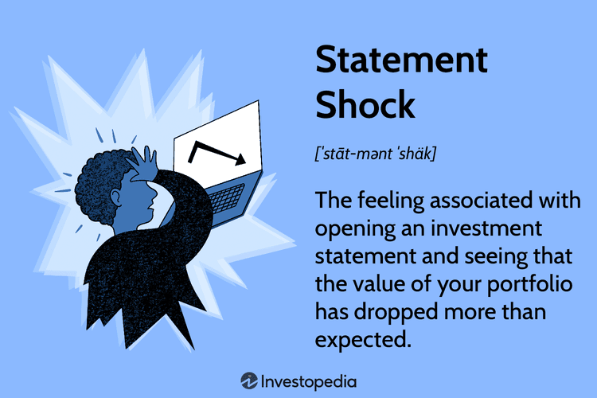

In today's rapidly evolving financial landscape, understanding the intricate dynamics between financial reactions and economic implications is paramount. This comprehension is crucial for stakeholders, ranging from individual investors to large financial institutions, as they navigate the challenges and opportunities presented by modern markets. One of the most significant revolutions in financial markets in recent years is algorithmic trading. This technological advancement has substantially transformed the way trades are executed, adding layers of complexity to the interactions and relationships within financial systems.

Algorithmic trading employs sophisticated algorithms and powerful computing technology to perform trades at extraordinary speeds and volumes, significantly altering market dynamics. This method has introduced a new dimension to trading, influencing liquidity, volatility, and the overall behavior of financial markets. As a result, it has become an essential topic of discussion among economists and market participants looking to comprehend its impact on market stability and economic growth.

Among the financial phenomena significantly impacted by these developments are statement shocks and demand shocks. Statement shock typically refers to the emotional response of investors to a sudden and unexpected change in their investment values, often driven by market volatility. Such shocks can lead to hasty financial decisions, mispricing, and destabilization of markets. Understanding this reaction is crucial in developing strategies to prevent adverse effects on investor behavior and market conditions.

Similarly, demand shocks, characterized by sudden changes in the demand for goods and services, play a significant role in economic fluctuations. These shocks can alter market equilibrium, affect pricing mechanisms, and disrupt economic stability. Through this article, we explore how demand shocks interact with the financial ecosystem, especially in the context of algorithmic trading, which can either mitigate or exacerbate the economic consequences of these shocks.

The objective of this article is to provide insights into how statement shocks, demand shocks, and algorithmic trading collectively influence market stability and economic growth. By examining the relationships and interdependencies among these elements, we aim to offer a comprehensive understanding of their roles in shaping financial markets. Additionally, we will explore various causes and impacts of these phenomena and outline strategies to mitigate their adverse effects, enhancing the robustness and resilience of financial systems.

## Table of Contents

## Statement Shock: An Overview

In the investment world, statement shock refers to the intense emotional reaction that investors encounter when witnessing unexpected declines in their portfolio values. This phenomenon is particularly prevalent among novice investors who harbor unrealistic expectations regarding market returns. Classical economic theories often assume rational behavior in financial decision-making; however, emotional responses can significantly influence investor actions, leading to potentially detrimental financial choices.

Psychological effects play a crucial role in exacerbating statement shock. When investors experience losses, they may feel anxiety, fear, and disappointment, which can drive impulsive decision-making. Behavioral finance, a field that explores how psychological factors affect financial markets, suggests that these emotional states can lead investors to sell assets hastily, exacerbating losses and negatively impacting their long-term financial health. This reaction aligns with the prospect theory, developed by Daniel Kahneman and Amos Tversky, which posits that people tend to weigh losses more heavily than equivalent gains, prompting a more pronounced response to negative returns.

To mitigate the adverse impacts of statement shock, investors can adopt long-term investment strategies, such as diversification and dollar-cost averaging. Diversification involves spreading investments across a wide range of asset classes (e.g., stocks, bonds, real estate) to reduce risk exposure to any single entity. By diversifying, investors are less likely to experience significant portfolio value fluctuations due to shocks in one specific sector or asset class.

Dollar-cost averaging is another strategy that involves regularly investing a fixed amount of money regardless of market conditions. This method reduces the emotional intensity associated with market timing and can lead to the purchase of more shares when prices are low and fewer when they are high, effectively smoothing out the investor's cost basis over time.

Ultimately, understanding the psychological drivers behind statement shock and implementing prudent investment strategies can help investors maintain composure during market turbulence. By focusing on a long-term perspective and adhering to disciplined investment practices, investors can potentially enhance their financial resilience and reduce susceptibility to panic-induced actions.

## Demand Shocks and Economic Impacts

Demand shocks are sudden, unexpected changes in demand for goods and services that can significantly impact economic stability. These shifts can result in abrupt alterations in market equilibrium and prices, frequently leading to a misalignment between supply and demand.

One of the primary effects of demand shocks is the disturbance they cause to market equilibrium. When demand unexpectedly rises, it can lead to shortages, causing prices to increase as suppliers scramble to meet the higher demand. Conversely, a sudden drop in demand can result in excess supply, pushing prices downward as sellers attempt to offload unsold goods. This dynamic is often modeled using basic supply and demand curves in economics, where the intersection point denotes the market equilibrium.

Various [agents](/wiki/agents) and factors can trigger demand shocks. Economic recessions are a common source, as they often lead to significant reductions in consumer and business spending. During a recession, uncertainty about future income and employment can cause households to reduce consumption, leading to a negative demand shock. Policy changes, such as tax increases or decreases in government spending, can also influence demand by altering the disposable income of consumers or the investment capacity of businesses.

Technological advances represent another critical component that can instigate demand shocks. Innovations such as the internet or the smartphone have historically shifted consumer demand patterns by introducing new products and services while rendering others obsolete. These changes can dramatically reshape market demands and influence economic stability.

The impact of demand shocks on macroeconomic indicators like GDP, inflation, employment, and investor confidence can be profound. A positive demand shock, where demand surges unexpectedly, can boost GDP in the short term due to increased production and sales. However, if the supply side cannot keep pace, it may lead to inflationary pressures as too much money chases too few goods.

Employment often reacts to demand shocks due to shifts in production needs. An increase in demand may lead to higher employment as firms hire more workers to meet production targets. In contrast, a negative demand shock can result in layoffs as companies scale back operations. This relationship is often encapsulated in the concept of the Phillips Curve, which depicts the inverse relationship between unemployment and inflation.

Investor confidence is another variable susceptible to demand shocks. The uncertainty surrounding the duration and magnitude of a demand shock can lead to [volatility](/wiki/volatility-trading-strategies) in financial markets. A sudden change in demand can lead investors to reassess the profitability of companies, leading to fluctuations in stock prices and investment portfolios.

Overall, understanding demand shocks and their economic impacts is crucial for policymakers and market participants. By recognizing the causes and potential outcomes of these shocks, stakeholders can better anticipate changes and implement measures to mitigate adverse effects, contributing to more stable economic environments.

## Algorithmic Trading and Its Role

Algorithmic trading involves the use of advanced mathematical models and computational techniques to execute trades at high speed, fundamentally altering the landscape of financial markets. This trading strategy relies on algorithms to make trading decisions, initiate orders, and manage portfolios autonomously. The integration of algorithms aims to optimize trading processes, typically focusing on speed, accuracy, and efficiency.

The impact of [algorithmic trading](/wiki/algorithmic-trading) on market volatility is significant. Algorithms can process and act upon market data within milliseconds, far quicker than any human trader. This rapid-response capability can lead to increased market [liquidity](/wiki/liquidity-risk-premium) and tighter bid-ask spreads, theoretically stabilizing prices. However, algorithmic trading can also amplify the effects of demand shocks—sudden, unexpected changes in consumer demand for goods and services. For instance, when a demand shock occurs, algorithmic systems may trigger a cascade of selling or buying orders, rapidly adjusting asset prices and contributing to heightened volatility.

The dual nature of algorithmic trading lies in its ability to both stabilize and destabilize financial markets. On one hand, algorithms can stabilize markets by providing liquidity and enabling efficient price discovery through continuous trading. On the other hand, during periods of economic disruption or market stress, algorithms may exacerbate price swings. High-frequency trading ([HFT](/wiki/high-frequency-trading-strategies)), a subset of algorithmic trading, is particularly known for such effects. HFT strategies might execute thousands of trades in seconds, intensifying trends in asset price movements rather than counteracting them.

For example, during flash crashes—extreme and rapid market declines and recoveries, such as the May 6, 2010, Flash Crash—algorithmic trading systems, driven by pre-programmed rules, can unintentionally magnify price fluctuations. In this scenario, algorithms triggered selling orders upon detecting initial drops in asset prices, which in turn caused further declines as other algorithms reacted to these changes, demonstrating a feedback loop effect.

Furthermore, algorithms can adapt to a wide range of market conditions by analyzing vast datasets, including real-time news and social media sentiments. Advanced [machine learning](/wiki/machine-learning) techniques allow these systems to predict market movements based on historical patterns and statistical models. However, this adaptability also presents risks; reliance on historical data without accounting for aberrant events or structural changes in the market can lead to erroneous predictions, potentially destabilizing market conditions further.

Despite the potential risks, algorithmic trading provides crucial opportunities for improving market mechanisms. By automating trading operations, it reduces human errors and emotional decision-making, enabling a more rational allocation of resources. As such, the financial industry continually explores robust risk management frameworks and regulatory policies to minimize unintentional market disturbances associated with algorithmic trading.

In summary, algorithmic trading serves as a double-edged sword in financial markets. While it enhances efficiency and liquidity, its capacity to amplify demand shocks and contribute to volatility requires careful oversight and strategic implementation to ensure market stability during economic disruptions.

## Real-World Examples of Demand Shocks

The economic landscape is often shaped by demand shocks, which are pivotal in influencing market dynamics. Real-world examples of these phenomena reflect their intricate and multifaceted impacts on the global economy.

One of the critical case studies of demand shock is the global shift toward electric vehicles (EVs). As consumer preferences lean towards more sustainable transportation solutions, demand for traditional combustion-engine vehicles has declined. This transition, fueled by environmental consciousness and supported by government policies and incentives, has led to significant fluctuations in the automotive industry. Manufacturers and suppliers had to adapt their production lines, leading to changes in the demand for raw materials, like lithium for batteries. The ripple effects extend beyond automobile companies to energy sectors, affecting oil markets due to anticipated declines in gasoline demand. 

The 2008 Financial Crisis represents another substantial example of a demand shock with far-reaching consequences. Triggered by the collapse of the housing bubble in the United States, it caused a sharp decline in consumer spending and investment. This massive drop in demand led to severe recessions across the globe. Businesses faced plummeting revenue, leading to layoffs and increased unemployment rates, which further depressed economic activity. Monetary and fiscal policies were employed worldwide to stimulate demand, restore financial stability, and encourage economic recovery.

The COVID-19 pandemic offers a contemporary illustration of a complex demand shock, with its unique characteristics varying across sectors. The pandemic resulted in an abrupt halt in traditional economic activities due to global lockdowns and social distancing measures. Certain industries, such as travel and hospitality, saw unprecedented declines in demand, leading to widespread job losses and business closures. Conversely, there was a surge in demand for healthcare products, digital services, and home entertainment, illustrating the uneven nature of the pandemic's impact. Governments intervened with stimulus packages to support affected sectors, aiming to stabilize economies and restore consumer confidence.

These examples of demand shocks underscore their significant and complex effects on economies, highlighting the need for adaptable and responsive strategies to navigate such disruptions efficiently. The transitions in consumer demand, financial disruptions, and pandemic responses exemplify the unpredictable nature of demand shocks and their capacity to shape economic landscapes.

## Strategies to Mitigate Adverse Impacts

To mitigate the adverse impacts of demand shocks, implementing a set of comprehensive strategies is crucial for sustaining economic stability. Understanding these strategies necessitates exploring fiscal and monetary policies, diversification, adaptive business practices, and risk management.

### Fiscal and Monetary Policies

Fiscal and monetary policies are fundamental tools in managing demand shocks. During periods of economic uncertainty, governments can utilize fiscal policy by adjusting public spending and taxation levels to influence aggregate demand. For instance, an expansionary fiscal policy, which involves increasing government spending or cutting taxes, can stimulate demand and mitigate recessionary impacts. The Keynesian economic theory supports this approach, proposing that increased public sector expenditures can offset declining private sector expenditures during economic downturns.

Monetary policy is equally vital, primarily through the regulation of interest rates and money supply. Central banks can employ expansionary monetary policies by lowering interest rates or purchasing government securities in open market operations, which encourages borrowing and investment. These actions can stabilize financial markets and boost economic activity by ensuring liquidity in the system. Quantitative easing, a non-traditional monetary policy, has been utilized in situations where standard policies are ineffective, such as during the 2008 financial crisis.

### Diversification

Diversification serves as a premier risk management strategy. By spreading investments across various asset classes, industries, or geographic regions, economies and businesses can reduce exposure to specific risks associated with demand shocks. A diversified portfolio minimizes the impact of a significant downturn in any single sector. For example, if a demand shock affects the automotive sector due to technological shifts, a diversified investment in unrelated sectors like healthcare or technology can cushion the financial blow.

In practice, mathematical models, such as the modern portfolio theory (MPT), can optimize the diversification process by balancing the expected return against the risk. MPT advocates for constructing a portfolio that maximizes returns for a given level of risk, which can be done using the efficient frontier approach.

### Adaptive Business Practices

Businesses can adopt adaptive practices to withstand demand shocks effectively. This includes flexible supply chain management, technological integration, and scalability. A robust supply chain can quickly adjust production levels in response to changing demand patterns, mitigating risks related to supply-demand mismatches.

Technological integration, such as digital transformation and data analytics, can further enhance a company's adaptability. By leveraging data insights, businesses can anticipate demand changes and adjust strategies proactively. Implementing scalable business models also allows firms to expand or contract resources swiftly, aligning costs with revenue streams.

### Risk Management and Strategic Planning

Risk management is pivotal in maintaining stability amidst demand shocks. It involves identifying potential risks, analyzing their implications, and developing strategies to mitigate them. Techniques such as scenario analysis, stress testing, and contingency planning can prepare economies and businesses for various shock scenarios. 

Strategic planning further complements risk management by setting long-term objectives aligned with market conditions and potential disruptions. By adopting a forward-thinking approach, entities can craft resilient strategies that emphasize flexibility and innovation, ensuring they remain competitive despite economic volatility.

In conclusion, a multi-faceted approach that integrates fiscal and monetary policies, diversification, adaptive business practices, and robust risk management forms the foundation for cushioning economies against demand shocks. By fostering these strategies, stakeholders can enhance their resilience, ensuring sustainable growth and stability.

## Conclusion

Understanding and managing financial reactions and their resultant economic impacts are imperative for maintaining market stability over the long term. The role of algorithmic trading in this dynamic landscape provides both opportunities and challenges. On one hand, algorithmic trading allows for heightened efficiency and speed in financial markets, processing large volumes of data to execute trades instantaneously. This advancement can lead to improved liquidity and price discovery. On the other hand, the same mechanisms can amplify market volatility, especially during demand shocks and rapid asset price adjustments. This duality demands careful consideration and strategic oversight.

A proactive approach is necessary to harness the benefits of algorithmic trading while mitigating its risks. This involves implementing comprehensive policy measures that encompass robust regulatory frameworks to prevent market manipulation and ensure transparency. Adaptive strategies are crucial for fostering economic resilience against future fluctuations. These may include promoting diversified investment portfolios and adopting advanced risk management practices that anticipate and respond to potential market disturbances.

Furthermore, policymakers and financial institutions must remain vigilant to the evolving technological landscape, adapting regulatory standards to accommodate new algorithms and trading strategies. Encouraging collaboration between regulators, technologists, and financial experts is key to striking a balance that supports innovation without compromising market integrity.

In conclusion, navigating the intricate dynamics of financial reactions with a forward-thinking mindset and an emphasis on strategic planning is essential. By doing so, it is possible to leverage the advantages of algorithmic trading while ensuring economic stability and resilience against uncertainties that may arise in the global market.

## References & Further Reading

1. **Hasbrouck, J.** (2003). "Intraday Price Formation in U.S. Equity Markets." _The Journal of Finance_. This paper provides an in-depth look into the price creation process within equity markets and discusses the implications of algorithmic trading on market stability.

2. **Engle, R., and Rangel, J.** (2008). "The Spline-GARCH Model for Low-Frequency Volatility and Its Global Macro Circulation Mechanisms." _The Review of Financial Studies_. This study explores volatility models that can help understand the effects of financial shocks and the corresponding economic responses.

3. **Sewell, M.** (2011). "Characterization of Financial Time Series." _University College London_. This document offers a framework for understanding the statistical properties of financial time series, relevant for comprehending the behavior of algorithmic trading systems.

4. **Kirilenko, A.A., Kyle, A.S., Samadi, M., and Tuzun, T.** (2014). "The Flash Crash: High-Frequency Trading in an Electronic Market." _Journal of Finance_. This research analyzes the events and implications of the "Flash Crash" of May 6, 2010, emphasizing the role of high-frequency trading.

5. **Easley, D., Lopez de Prado, M., and O'Hara, M.** (2012). "Flow Toxicity and Liquidity in a High-Frequency World." _The Review of Financial Studies_. This paper examines how high-frequency trading affects market liquidity and the potential negative consequences for market stability.

6. **Jarrow, R.A., and Protter, P.** (2012). "A Dysfunctional Role of High-Frequency Trading in Electronic Markets." _International Journal of Theoretical and Applied Finance_. The authors investigate high-frequency trading's potential to destabilize markets during economic disruptions.

7. **Bansal, R., and Yaron, A.** (2004). "Risks for the Long Run: A Potential Resolution of Asset Pricing Puzzles." _The Journal of Finance_. This article discusses long-run risks affecting asset pricing, providing context for understanding demand shocks' economic impacts.

8. **Gabaix, X.** (2012). "Variable Rare Disasters: An Exact Framework for Ten Puzzles in Macro-Finance." _The Quarterly Journal of Economics_. This paper introduces a macroeconomic model accounting for rare, disruptive events, shedding light on demand shocks' pervasive effects.

9. **Farhi, E., and Werning, I.** (2012). "Dealing with the Trilemma: Optimal Capital Controls with Fixed Exchange Rates." _IMF Economic Review_. This study presents strategies for mitigating economic fluctuations, offering insight into fiscal and monetary policies used in response to demand shocks.

10. **Chakraborty, A., and Subramanian, N.** (2014). "Algorithmic Trading and Competition." _The Handbook of Electronic Trading_. This chapter provides a comprehensive overview of the effects of algorithmic trading on competitive dynamics within financial markets.

These references provide a foundational understanding of financial reactions, economic impacts, and algorithmic trading—essential for further research and analysis in the topics discussed in this article.