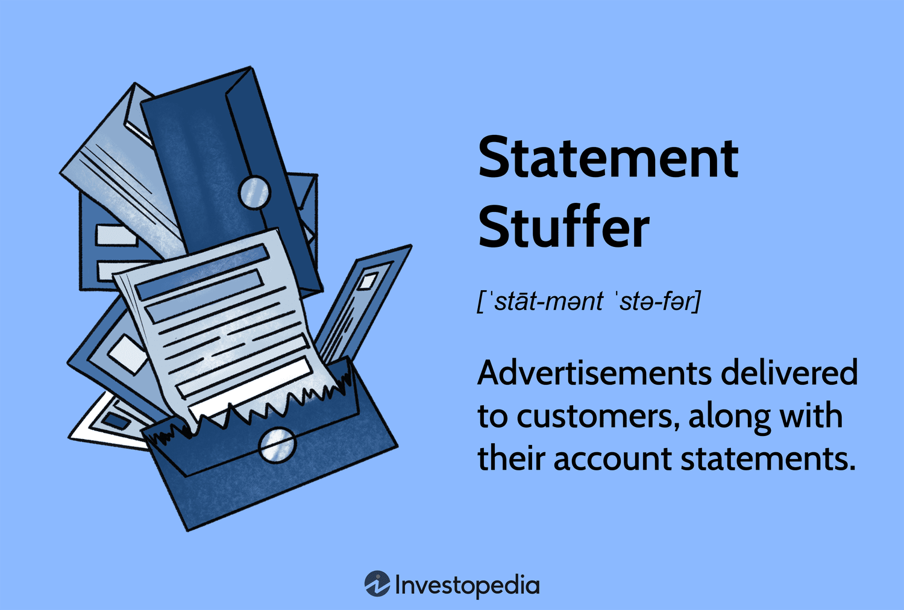

## Table of Contents

## What is a statement stuffer?

A statement stuffer is a type of insert that companies put into their billing statements or envelopes. These inserts are usually small pieces of paper or flyers that contain additional information or promotional offers. Companies use statement stuffers to communicate with their customers about new products, services, or special deals.

Statement stuffers are a cost-effective way for businesses to reach their customers directly. Since the company is already sending out a bill or statement, adding a stuffer doesn't cost much more. This method helps companies save on mailing costs while still getting important messages to their customers.

## How does a statement stuffer work?

A statement stuffer is a small piece of paper that companies put inside the envelopes with their bills or statements. When a company sends out a bill, they can add this extra paper to tell customers about new things or special deals. It's like getting a little note with your bill that says, "Hey, check this out!"

Companies like using statement stuffers because it's a cheap way to talk to their customers. They are already sending out the bill, so adding the stuffer doesn't cost much more. This way, they can share news or offers without spending a lot of money on extra mail. It's a smart way to keep customers informed and interested.

## What are the common uses of statement stuffers?

Statement stuffers are often used by companies to tell their customers about new products or services. For example, a phone company might use a stuffer to let people know about a new phone plan or a special deal on a new phone. This helps the company share important news without having to send out a separate letter or email.

Another common use of statement stuffers is to promote special offers or discounts. A credit card company might include a stuffer with a bill to tell customers about a cashback offer or a lower [interest rate](/wiki/interest-rate-trading-strategies) for a limited time. This can encourage customers to use their card more often or take advantage of the deal.

Sometimes, statement stuffers are also used to share important information or reminders. For instance, a utility company might use a stuffer to remind customers about a change in billing dates or to provide tips on how to save energy. This helps keep customers informed and can improve their experience with the company.

## What materials are typically used to create statement stuffers?

Statement stuffers are usually made from paper. The paper is often lightweight and thin so it can fit easily into the envelope with the bill or statement. Companies might choose different colors or types of paper to make the stuffer stand out and catch the customer's attention. Sometimes, they use recycled paper to be more environmentally friendly.

The printing on statement stuffers is usually done with ink. The ink can be in black and white or in color, depending on what the company wants to show. The design and message on the stuffer are printed clearly so customers can read it easily. Some companies might also use special finishes like gloss or matte to make the stuffer look nicer and more professional.

## How can statement stuffers be customized for different businesses?

Statement stuffers can be customized in many ways to fit the needs of different businesses. A company can change the size and shape of the stuffer to fit well with their billing envelopes. They can also choose different colors and types of paper to match their brand or to make the stuffer stand out. For example, a bank might use blue paper to match their logo, while a restaurant might use a bright color to catch the eye.

The content on the stuffer can also be changed to suit the business. A company can write messages that tell customers about new products, special deals, or important information. They can use pictures, logos, and different fonts to make the message clear and interesting. This way, a phone company might show pictures of new phones, while a utility company might include tips on saving energy. By customizing the stuffer, businesses can make sure their message reaches customers in the best way possible.

## What are the benefits of using statement stuffers in marketing?

Statement stuffers are a great way for businesses to talk to their customers without spending a lot of money. Since the company is already sending out a bill or statement, adding a stuffer doesn't cost much more. This means they can share news about new products, special deals, or important information without having to pay for extra mail. It's like getting a free ride to tell customers something important.

Using statement stuffers also helps businesses keep their customers interested and informed. When customers see a stuffer with their bill, it can remind them about the company and what they offer. This can make customers more likely to use the company's services or take advantage of a special deal. Plus, because the stuffer is right there with the bill, customers are more likely to see it and read it, which can help the company's message get through.

## How do you measure the effectiveness of statement stuffers?

To measure how well statement stuffers work, companies look at how many people take action after seeing the stuffer. They might track how many customers use a special offer or sign up for a new service mentioned on the stuffer. For example, if a phone company offers a discount on a new phone plan and more people sign up for it, they know the stuffer was effective.

Another way to see if statement stuffers are working is by asking customers directly. Companies can include a short survey with the bill or use a phone call to ask if customers saw the stuffer and what they thought about it. If a lot of customers remember the stuffer and say it was helpful, that's a good sign that the stuffer is doing its job well.

## What are the legal considerations when using statement stuffers?

When using statement stuffers, companies need to make sure they follow the law. They must be honest and clear about what they are offering. For example, if a stuffer talks about a special deal, the company can't leave out important details or make the deal sound better than it is. They also need to respect people's privacy. This means not sharing personal information without permission and following rules about how to use customer data.

Another important thing to remember is that some places have rules about what can go into billing envelopes. Companies need to check these rules to make sure their stuffers are okay to use. They should also be careful not to send too many stuffers, as this can annoy customers and might even break laws about how often companies can contact people. By following these rules, companies can use statement stuffers in a way that is fair and legal.

## How have digital statement stuffers evolved from traditional ones?

Digital statement stuffers have changed a lot from the old paper ones. Instead of getting a piece of paper with your bill, you now see messages or offers right on your computer or phone screen. This happens when you get your bills through email or an online account. Companies can now use colors, videos, and links to make their messages more interesting and easy to click on. It's like getting a little ad or notice with your bill, but it's all digital.

Using digital stuffers has some big advantages. They are easier to change and update, so companies can quickly tell customers about new deals or news. Plus, they can track how many people see the stuffer and click on it, which helps them know if it's working. But there are also some challenges. Not everyone checks their bills online, so some customers might miss the message. Also, digital stuffers can sometimes get lost in a busy inbox or be ignored if people are used to seeing ads online.

## What are the best practices for designing effective statement stuffers?

When designing statement stuffers, it's important to keep the message clear and simple. Use short sentences and big, easy-to-read fonts so people can quickly understand what you're saying. Choose colors that stand out but don't make the stuffer too busy. A good idea is to use your company's colors so customers can easily recognize it. Also, make sure the most important information is at the top, so people see it first. If you're offering a deal, tell them how to use it right away.

Another key thing is to make the stuffer look nice and professional. Use good quality paper and ink so it doesn't look cheap. If you're using pictures or logos, make sure they are clear and not too small. It's also a good idea to test the stuffer with a few people before sending it out to everyone. Ask them if they understand the message and if it makes them want to take action. By following these tips, you can create statement stuffers that really work and help your business.

## How can statement stuffers be integrated into a broader marketing strategy?

Statement stuffers can be a great part of a bigger marketing plan. They can work together with other ways a company talks to customers, like emails, social media, and ads on TV or the internet. For example, if a company is starting a new product, they can use statement stuffers to tell customers about it when they get their bills. At the same time, they can send emails and post on social media to reach more people. This way, the message gets to customers in different places and helps them remember the new product.

Using statement stuffers in a bigger plan also helps companies see if their marketing is working. They can track how many people use the special offer on the stuffer and compare it with how many people click on their emails or ads. If more people use the offer from the stuffer, the company knows it's a good way to reach customers. By mixing statement stuffers with other marketing tools, companies can make sure their message is strong and reaches as many people as possible.

## What future trends are expected in the use of statement stuffers?

In the future, statement stuffers might become more digital as more people get their bills online. Companies could use videos and interactive links to make their messages more interesting. This would let customers click on the stuffer to learn more or even buy something right away. But, companies will need to make sure their digital stuffers work well on all kinds of devices, like phones and tablets, so everyone can see them easily.

Even with digital stuffers, some companies might still use paper ones because not everyone gets their bills online. But they might start using greener materials, like recycled paper, to help the environment. Also, companies might use new technology to make their paper stuffers more personal. They could print different messages for different customers based on what they know about them. This way, the stuffer feels more special and might make customers more likely to pay attention to it.

## References & Further Reading

[1]: Data & Marketing Association. ["Statistical Fact Book."](https://www.ana.net/miccontent/show/id/ii-dma-2018-statistical-fact-book) 

[2]: Lopez de Prado, M. (2018). ["Advances in Financial Machine Learning."](https://www.amazon.com/Advances-Financial-Machine-Learning-Marcos/dp/1119482089) Wiley.

[3]: Aronson, D. (2007). ["Evidence-Based Technical Analysis: Applying the Scientific Method and Statistical Inference to Trading Signals."](https://www.amazon.com/Evidence-Based-Technical-Analysis-Scientific-Statistical/dp/0470008741) Wiley.

[4]: Jansen, S. (2020). ["Machine Learning for Algorithmic Trading."](https://github.com/stefan-jansen/machine-learning-for-trading) Packt Publishing.

[5]: Chan, E. P. (2008). ["Quantitative Trading: How to Build Your Own Algorithmic Trading Business."](https://github.com/ftvision/quant_trading_echan_book) Wiley.

[6]: Bardenet, R., Kégl, B., Bergstra, J., & Bengio, Y. (2011). ["Algorithms for Hyper-Parameter Optimization."](https://dl.acm.org/doi/10.5555/2986459.2986743) Advances in Neural Information Processing Systems 24.