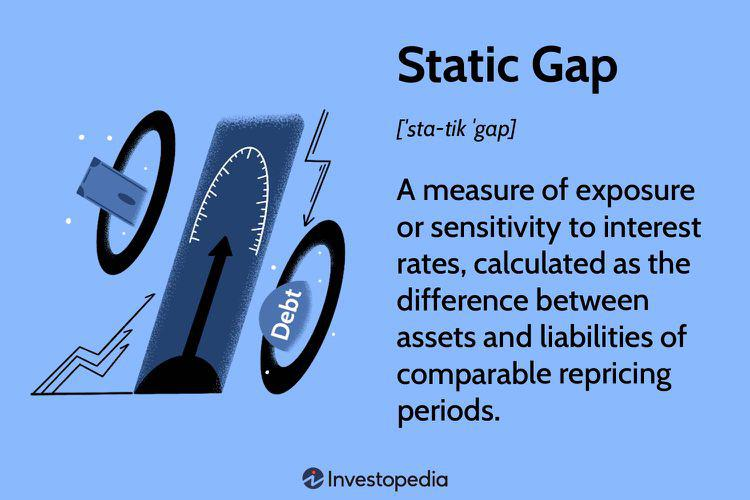

## Table of Contents

## What is a static gap in the context of engineering?

A static gap in engineering refers to a fixed distance between two parts of a machine or structure that does not change when the machine is working. Think of it like the space between two gears that stays the same no matter how fast the gears are turning. Engineers need to carefully measure and maintain these gaps because they can affect how well the machine works and how long it lasts.

For example, in a car engine, there are static gaps between the spark plug and the cylinder head. If this gap is too big or too small, the engine might not start properly or could run less efficiently. By keeping the static gap just right, engineers make sure the engine performs well and lasts longer.

## How does a static gap function in mechanical systems?

In mechanical systems, a static gap is like a space that stays the same between two parts. This space is important because it helps the parts work together smoothly. For example, in a machine with gears, the static gap between the gears makes sure they don't touch too much and wear out quickly. If the gap is too small, the gears might rub against each other and cause friction, which can make the machine less efficient and more likely to break down.

Engineers have to be very careful when setting up these static gaps. They use special tools to measure the gaps and make sure they are just right. If the gap is too big, the parts might not work together properly, and the machine might not do its job well. By keeping the static gap at the right size, engineers can make sure the machine runs smoothly and lasts a long time. This is why understanding and maintaining static gaps is a big part of keeping mechanical systems in good shape.

## What are the primary applications of static gaps?

Static gaps are used in many machines and devices to make sure they work well. For example, in car engines, the space between the spark plug and the cylinder head needs to be just right. If this gap is too big or too small, the engine might not start or could run badly. Another example is in printers, where the gap between the print head and the paper needs to be exact so the printer can make clear prints. By keeping these gaps the right size, engineers help the machines do their jobs better and last longer.

In other machines like gear systems, static gaps are important to stop the gears from rubbing against each other too much. If the gears touch too much, they can wear out quickly and the machine might break down. So, engineers measure and set these gaps carefully to make sure the gears turn smoothly without too much friction. This is why static gaps are a big part of making sure mechanical systems work well and stay in good shape.

## What are the basic components of a static gap mechanism?

The basic components of a static gap mechanism include the two parts that have a fixed space between them. These parts could be gears, a spark plug and a cylinder head, or a print head and paper. The space between them is the static gap, and it's important that this space stays the same no matter what the machine is doing.

To keep the static gap the right size, engineers use special tools to measure it. They make sure the gap is just right so the machine can work well. If the gap is too big or too small, the machine might not work properly or could wear out faster. By keeping the static gap at the perfect size, engineers help the machine run smoothly and last longer.

## How does the design of a static gap affect its performance?

The design of a static gap is really important for how well a machine works. If the gap is designed to be the right size, the machine can do its job smoothly. For example, in a car engine, the space between the spark plug and the cylinder head needs to be just right. If it's too big, the spark might not jump across, and the engine won't start. If it's too small, the spark might cause too much heat, which can damage the engine. So, getting the design of the static gap right helps the machine work better and last longer.

But if the static gap is not designed well, it can cause problems. For instance, in a gear system, if the gap between the gears is too small, the gears might rub against each other and wear out quickly. This can make the machine less efficient and more likely to break down. On the other hand, if the gap is too big, the gears might not mesh properly, and the machine won't work as it should. By carefully designing the static gap, engineers can make sure the machine runs smoothly and keeps working well for a long time.

## What are the common materials used in constructing static gaps?

The materials used to make static gaps depend on what the machine is used for. In car engines, the parts that make the static gap, like the spark plug and the cylinder head, are often made of metal. Metals like steel or aluminum are strong and can handle the heat and pressure inside an engine. These materials help the static gap stay the right size even when the engine is running hot.

In other machines, like printers, the materials might be different. The print head might be made of plastic or ceramic, which are good at keeping the right gap between the head and the paper. These materials are chosen because they are less likely to wear out quickly and can keep the gap steady while the printer is working. By using the right materials, engineers can make sure the static gap stays the same and the machine works well.

## What are the limitations of static gaps in terms of load capacity?

Static gaps have limits when it comes to how much weight or force they can handle. If a machine has a static gap, it means there's a space between two parts that stays the same. But if you put too much weight or force on those parts, the gap might change. For example, in a gear system, if the gears are under a lot of pressure, the static gap between them might get smaller. This can cause the gears to rub against each other more, which can wear them out faster.

To deal with this, engineers need to think carefully about how much load the machine will have to handle. They choose materials that are strong enough to keep the static gap the right size, even under heavy loads. For instance, in a car engine, the parts around the static gap, like the spark plug and cylinder head, are made of strong metals like steel or aluminum. These materials can handle the heat and pressure inside the engine, helping to keep the static gap steady. By understanding these limits, engineers can design machines that work well and last a long time.

## How do environmental factors like temperature and humidity impact static gaps?

Environmental factors like temperature and humidity can change how well static gaps work. When it gets hot, materials can expand, which means the space between parts might get smaller. If it gets cold, materials can shrink, making the gap bigger. This can be a problem because the machine might not work as well if the gap changes. For example, in a car engine, if the temperature changes a lot, the gap between the spark plug and the cylinder head might not stay the same, which can make the engine run badly.

Humidity can also affect static gaps. When the air is very wet, moisture can get into the materials and make them swell. This can change the size of the gap. In machines like printers, if the air is too humid, the gap between the print head and the paper might change, which can make the prints blurry. Engineers need to think about these things when they design machines. They might use special materials or add ways to control the temperature and humidity to keep the static gaps working well.

## What advanced techniques can be used to enhance the precision of static gaps?

To make static gaps more precise, engineers can use a method called laser measurement. This means they use a laser to measure the exact size of the gap. Lasers are very accurate, so they can help make sure the gap is just the right size. Another way to improve precision is by using computer-controlled machines. These machines can set the gap to be very exact because they follow instructions from a computer, which can make tiny adjustments that are hard to do by hand.

Engineers can also use special materials that don't change much when the temperature or humidity changes. These materials help keep the gap steady no matter what the weather is like. Another advanced technique is to use sensors to keep an eye on the gap all the time. If the gap starts to change, the sensors can tell the machine to make small adjustments to keep it just right. By using these advanced methods, engineers can make sure the static gaps in machines are as precise as possible, which helps the machines work better and last longer.

## How can static gaps be integrated into automated systems?

Static gaps can be added to machines that work on their own by using special tools and computers. For example, in a machine that makes things, the space between the parts that do the work needs to be just right. Engineers can use computers to set this space to be very exact. The computer tells the machine what to do, and it can make tiny changes to the gap to keep it perfect. This way, the machine can work well without someone always watching it.

Also, sensors can be used to keep an eye on the static gap all the time. If the gap starts to change because of heat or other things, the sensors can tell the machine to fix it. This helps the machine keep working well even when things around it change. By using computers and sensors, engineers can make sure the static gaps in automated machines are always just right, which helps the machines do their jobs better and last longer.

## What are the latest research findings on improving static gap efficiency?

Recent research has focused on using smart materials to make static gaps work better. These materials can change their shape or size when they get hot or cold, but in a controlled way. This means they can help keep the gap the right size even when the temperature changes a lot. Scientists are also looking at ways to make these materials even better, so they can handle more heat or pressure without changing the gap too much.

Another big area of research is using tiny machines, called micro-actuators, to adjust static gaps. These micro-actuators can make very small changes to the gap, which helps keep it perfect. Researchers are working on making these tiny machines cheaper and easier to use in different kinds of machines. By using smart materials and micro-actuators, engineers hope to make static gaps more efficient and reliable, so machines can work better and last longer.

## How do static gaps compare to dynamic gaps in terms of performance and application?

Static gaps and dynamic gaps are both spaces between parts in a machine, but they work differently. A static gap stays the same size no matter what the machine is doing. This makes it good for machines where the parts need to stay a certain distance apart, like in car engines where the gap between the spark plug and the cylinder head needs to be exact. Static gaps are important for keeping machines running smoothly and efficiently because they don't change, which helps prevent wear and tear on the parts.

On the other hand, dynamic gaps change size while the machine is working. They are used in machines where parts need to move closer or farther apart, like in some types of pumps or engines. Dynamic gaps can be harder to control because they change, but they are good for machines that need to adjust to different conditions. While static gaps are better for steady, reliable performance, dynamic gaps offer more flexibility but might need more maintenance to keep them working right.

## What is the Understanding of Static Gap in Algo Trading?

The term 'static gap' refers to the difference between a trader's assets and liabilities within a specified timeframe, typically less than a year. In [algorithmic trading](/wiki/algorithmic-trading), this concept is an essential tool for evaluating interest rate exposure. It measures a trader’s risk in relation to potential rate fluctuations by providing a snapshot of the existing gap between assets and liabilities.

Static gap analysis does not account for changes over time, making it a static rather than a dynamic measure of financial exposure. It offers a simplified view, taking a specific point in time to calculate the difference between interest rate-sensitive assets and liabilities. Mathematically, the static gap can be represented as:

$$
\text{Static Gap} = \text{Interest Rate Sensitive Assets} - \text{Interest Rate Sensitive Liabilities}
$$

This formula helps traders identify whether they have more assets or liabilities that are subject to [interest rate](/wiki/interest-rate-trading-strategies) repricing within the examined period. A positive static gap suggests that an increase in interest rates could potentially enhance profitability, as more assets than liabilities are set to be repriced at higher rates. Conversely, a negative static gap may signify a vulnerability to rising interest rates, as more liabilities would incur increased costs before corresponding asset returns can adjust.

Banks frequently employ static gap analysis as a technique to ascertain their profit margins by borrowing funds at one interest rate and lending them at another. By analyzing the gap between liabilities and assets, banks can strategize their financial operations to exploit favorable interest rate environments. However, the static nature of this analysis implies that it does not [factor](/wiki/factor-investing) in the evolution of market conditions or the potential early repayment of loans and shifts in deposit portfolios, which can lead to inaccuracies in interest rate risk assessment.

## What is the Mechanism of Static Gap?

Static gap analysis quantifies interest rate exposure by examining the repricing periods of assets and liabilities within a specified timeframe. This method evaluates the timing with which financial instruments can be adjusted in response to fluctuating interest rates. The analysis focuses on the difference between interest-sensitive assets and interest-sensitive liabilities, indicating how much will be affected by rate changes within a given duration.

To calculate the static gap, one needs to:

1. **Classify Assets and Liabilities**: Sort assets and liabilities based on their repricing periods. Instruments are grouped into time buckets—commonly months or quarters—based on when they are expected to be repriced or mature.

2. **Compute the Gap**: For each time bucket, subtract the total amount of liabilities that are expected to reprice from the total amount of assets in the same category:
$$
   \text{Static Gap} = \text{Repricing Assets} - \text{Repricing Liabilities}

$$

3. **Analyze the Static Gap**:
   - **Positive Static Gap**: This scenario arises when repricing assets exceed repricing liabilities within the timeframe. It suggests that if interest rates increase, the entity could potentially realize higher profits, as more assets are gaining higher yields than the cost increase of liabilities.
   - **Negative Static Gap**: Conversely, when repricing liabilities surpass repricing assets, the gap is negative. Under such conditions, an interest rate hike may lead to increased interest expenses on the liabilities relative to the income from assets, potentially causing financial losses.

The static gap thus serves as an indicator of interest rate risk sensitivity, highlighting the asset-liability mismatch over a specified period. It does not, however, account for the nuances of fluctuating market conditions or interim cash flows, which can significantly influence the eventual outcomes beyond static assessments.

## References & Further Reading

[1]: ["Dynamic Hedging: Managing Vanilla and Exotic Options"](https://www.amazon.com/Dynamic-Hedging-Managing-Vanilla-Options/dp/0471152803) by Nassim Nicholas Taleb

[2]: ["Interest Rate Risk Modeling"](https://web.actuaries.ie/sites/default/files/erm-resources/TEREST_RATE_RISK_MODELING_INTEREST_RATE_RISK_MODELING.pdf) by Sanjay K. Nawalkha, Gloria M. Soto, and Natalia A. Beliaeva

[3]: ["Risk Management and Financial Institutions"](https://www.amazon.com/Management-Financial-Institutions-Wiley-Finance/dp/1119932483) by John C. Hull

[4]: ["Interest Rate Risk in the Banking Book: A Best Practice Guide to Management and Hedging"](https://www.amazon.com/Interest-Rate-Risk-Banking-Book/dp/1119755018) by Beata Lubinska

[5]: ["Bond Markets, Analysis, and Strategies"](https://books.google.com/books/about/Bond_Markets_Analysis_and_Strategies_ten.html?id=bQpNEAAAQBAJ) by Frank J. Fabozzi