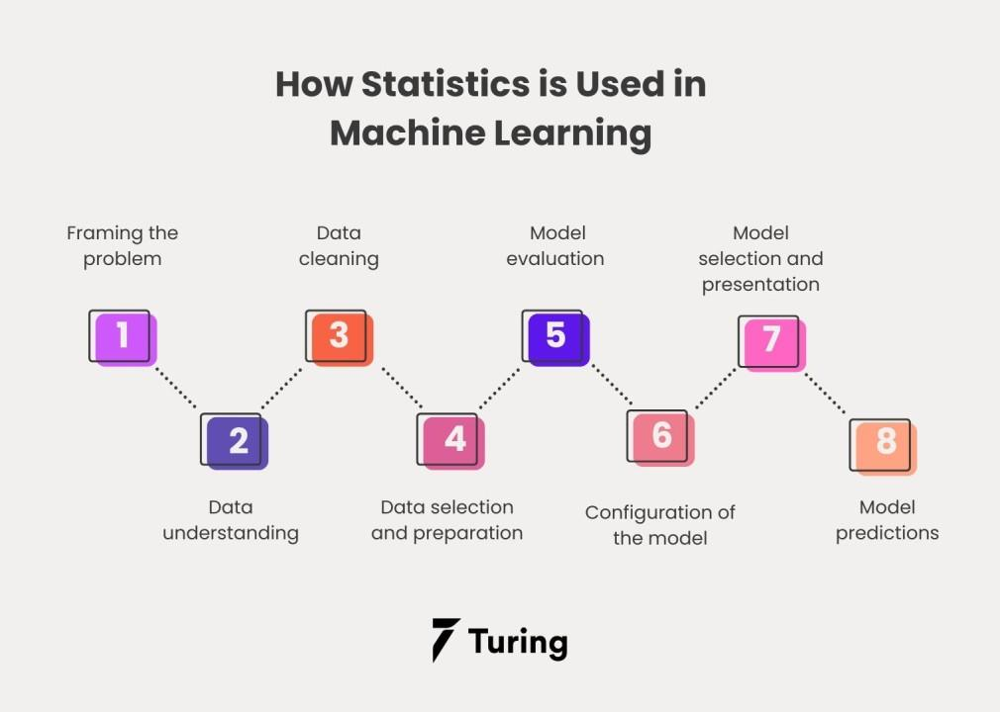

## Table of Contents

## What is static inference in the context of machine learning?

Static inference in machine learning refers to the process of determining the characteristics of data without actually running the model on that data. It's like making educated guesses about what the data might look like or how a model might perform based on its structure and the data it's meant to handle. For example, if you know you're working with images, static inference might involve predicting that a model designed for image recognition will need to process large amounts of pixel data.

This technique is useful for optimizing models before they're fully trained or deployed. By understanding the data's nature and the model's expected behavior, developers can make adjustments to improve efficiency and performance. For instance, if static inference suggests that a model will struggle with high-dimensional data, developers might choose to implement dimensionality reduction techniques beforehand. This way, they can save time and resources by fine-tuning the model based on these predictions, rather than waiting for the model to be fully trained and then finding out it needs changes.

## How does static inference differ from dynamic inference?

Static inference and dynamic inference are two different ways to understand how a machine learning model works. Static inference is like looking at a map before you start a journey. You study the model's structure and the data it will use without actually running it. This helps you predict how the model might behave or what kind of data it will need. For example, if you know you're working with text data, static inference might tell you that the model will need to handle lots of words and sentences.

On the other hand, dynamic inference is like actually taking the journey and seeing what happens along the way. It involves running the model on real data and watching how it performs. This gives you a direct look at the model's behavior, its accuracy, and how it handles different situations. For instance, if you run a model on text data, dynamic inference will show you how well it understands and processes the words and sentences in real time.

Both methods are important. Static inference helps you plan and optimize your model before you spend a lot of time training it. Dynamic inference gives you the real-world feedback you need to make the model better. Together, they help you build a more effective and efficient [machine learning](/wiki/machine-learning) model.

## What are the main benefits of using static inference in machine learning models?

Static inference helps save time and resources by letting you understand how a model might work before you even start training it. Imagine you're planning a trip. Before you hit the road, you look at a map to see where you're going and what you might need. In machine learning, static inference is like looking at that map. By studying the model's structure and the data it will use, you can predict if the model will need a lot of memory or if it might struggle with certain types of data. This way, you can make changes to the model or the data before you start training, which can save a lot of effort and time.

Another big benefit of static inference is that it helps you make the model more efficient. For example, if you know your model will be working with images, static inference can tell you that the model will need to process a lot of pixel data. You might decide to use techniques like reducing the size of the images before feeding them into the model. This can make the model run faster and use less memory. By using static inference, you can fine-tune your model to work better without having to wait until it's fully trained to see what needs to be fixed.

## Can you explain the process of implementing static inference in a machine learning pipeline?

Implementing static inference in a machine learning pipeline starts with understanding the model's architecture and the data it will process. Before training begins, you analyze the model's structure to predict how it will handle different types of data. For example, if you know your model will work with text data, you can use static inference to estimate the amount of memory needed to process sentences and words. This involves looking at the model's layers, their parameters, and the expected data dimensions. By doing this, you can identify potential bottlenecks or areas where the model might struggle, allowing you to make adjustments early in the development process.

Once you have a clear picture of the model's expected behavior, you can apply optimizations based on your static inference findings. For instance, if your analysis suggests that the model will require a lot of memory to process high-dimensional data, you might decide to implement dimensionality reduction techniques like Principal Component Analysis (PCA) before feeding the data into the model. This can be done by adding a preprocessing step in your pipeline that reduces the data's complexity. By making these changes before training, you can improve the model's efficiency and performance, saving time and computational resources in the long run.

## What types of machine learning models are best suited for static inference?

Static inference works well with models that have a clear and straightforward structure. For example, linear models like linear regression or logistic regression are great for static inference because their equations are simple and easy to analyze. You can look at the model's coefficients and predict how it will behave with different kinds of data. If you know the model's formula is something like $$ y = \beta_0 + \beta_1 x_1 + \beta_2 x_2 $$, you can estimate how changes in $$ x_1 $$ and $$ x_2 $$ will affect $$ y $$ without running the model.

Neural networks can also benefit from static inference, but it's a bit trickier because they have many layers and parameters. However, if you focus on the network's architecture, like the number of layers, the type of activation functions, and the input data's shape, you can make educated guesses about its performance. For instance, if you know your [neural network](/wiki/neural-network) will process images, you can predict that it will need a lot of memory to handle the pixel data. By analyzing these aspects, you can make adjustments to improve the model's efficiency before training.

Decision trees and random forests are another type of model where static inference can be useful. You can look at the tree's structure and the splits it makes to predict how it will classify new data. If you see that the tree splits mostly on certain features, you can infer that those features will be important for the model's decisions. By understanding the tree's logic, you can optimize the model's performance by focusing on the most relevant features before training.

## How does static inference impact the performance and efficiency of machine learning applications?

Static inference helps improve the performance and efficiency of machine learning applications by allowing developers to make smart guesses about how a model will work before it's even trained. Imagine you're planning a trip and you look at a map first. By studying the model's structure and the data it will use, you can predict if the model will need a lot of memory or if it might struggle with certain types of data. For example, if you know your model will be working with images, static inference can tell you that the model will need to process a lot of pixel data. This way, you can make changes to the model or the data before you start training, which can save a lot of effort and time.

By using static inference, you can fine-tune your model to work better without having to wait until it's fully trained to see what needs to be fixed. If your analysis suggests that the model will require a lot of memory to process high-dimensional data, you might decide to implement dimensionality reduction techniques like Principal Component Analysis (PCA) before feeding the data into the model. This can be done by adding a preprocessing step in your pipeline that reduces the data's complexity. By making these changes before training, you can improve the model's efficiency and performance, saving time and computational resources in the long run.

## What are common challenges faced when deploying static inference in real-world scenarios?

One common challenge when deploying static inference in real-world scenarios is accurately predicting how a model will behave with new or changing data. Static inference relies on analyzing the model's structure and the data it will process, but real-world data can be messy and unpredictable. For example, if a model is designed to work with text data, static inference might suggest that the model will need to handle a lot of words and sentences. But if the text data changes over time, like new slang or different languages being introduced, the model's performance might not match the initial predictions. This makes it hard to rely solely on static inference without also considering dynamic inference to see how the model actually performs.

Another challenge is balancing the time and resources spent on static inference with the benefits it provides. While static inference can help optimize a model before training, it requires a good understanding of the model's architecture and the data it will use. This can be time-consuming, especially for complex models like neural networks with many layers and parameters. If the model's structure or the data changes frequently, the effort put into static inference might not pay off as much. Developers need to weigh the potential improvements in efficiency against the time spent analyzing the model and making adjustments based on static inference predictions.

## How can static inference be optimized for large-scale machine learning systems?

To optimize static inference for large-scale machine learning systems, it's important to focus on understanding the model's structure and the data it will handle efficiently. For example, if you know your model will work with images, static inference can tell you that it will need a lot of memory to process pixel data. By analyzing the model's architecture, like the number of layers and the type of activation functions, you can make educated guesses about its performance. If you see that the model will need a lot of memory to process high-dimensional data, you might decide to implement dimensionality reduction techniques like Principal Component Analysis (PCA) before feeding the data into the model. This can be done by adding a preprocessing step in your pipeline that reduces the data's complexity, helping to save time and computational resources.

Another way to optimize static inference for large-scale systems is by using automated tools and frameworks that can analyze the model's behavior more quickly and accurately. These tools can help you make adjustments to the model or the data before training begins, which can be especially useful when working with complex models like neural networks. By automating some of the static inference process, you can focus on the most critical parts of the model's structure and the data's characteristics, making it easier to fine-tune the model for better performance and efficiency. This approach can help you balance the time spent on static inference with the benefits it provides, ensuring that large-scale systems run smoothly and effectively.

## What role does static inference play in edge computing and IoT devices?

Static inference is really helpful for edge computing and IoT devices because it lets you make smart guesses about how a model will work before it's even trained. Imagine you have a small device that needs to recognize pictures. By using static inference, you can look at the model's structure and the pictures it will see, and predict if the device will need a lot of memory or if it might struggle with certain types of images. This way, you can make changes to the model or the pictures before you start training, which can save a lot of time and battery life on the device.

For example, if you know your model will process images, static inference can tell you that the model will need to handle a lot of pixel data. You might decide to use techniques like reducing the size of the images before feeding them into the model. This can make the model run faster and use less memory, which is really important for small IoT devices that don't have a lot of power. By using static inference, you can fine-tune your model to work better on these devices without having to wait until it's fully trained to see what needs to be fixed.

## How do advancements in hardware affect the application of static inference in machine learning?

Advancements in hardware have made a big difference in how we use static inference in machine learning. With better and faster processors, we can do more detailed analysis of a model's structure and the data it will use. This means we can make smarter guesses about how the model will perform without actually running it. For example, if you know your model will work with images, static inference can tell you that it will need a lot of memory to process pixel data. With powerful hardware, you can quickly figure out if you need to make changes to the model or the images to make it run faster and use less memory.

These hardware improvements also help us use static inference on bigger and more complex models, like neural networks with many layers. Before, it might have been too slow or too hard to analyze these models, but now we can do it more easily. This is really important for things like edge computing and IoT devices, where you want the model to work well without using too much power. By using static inference, you can fine-tune the model to work better on these devices, saving time and battery life.

## Can you discuss any recent research or developments in the field of static inference for machine learning?

Recent research in static inference for machine learning has focused on improving the accuracy of predictions about model behavior before training. One notable development is the use of automated tools and frameworks that can quickly analyze complex model architectures. For example, researchers have developed methods to estimate the memory and computational requirements of deep neural networks by analyzing their layers and parameters without running the model. This helps developers optimize models for efficiency, especially in resource-constrained environments like edge computing and IoT devices. By understanding how the model will perform with different types of data, developers can make adjustments to improve performance before the training process even begins.

Another area of recent development is the integration of static inference with dynamic inference to create more robust machine learning pipelines. Researchers have been exploring ways to combine the predictive power of static inference with the real-world feedback provided by dynamic inference. This hybrid approach allows for better optimization of models by using static inference to make initial guesses and then refining those guesses with actual performance data. For instance, if static inference suggests that a model will struggle with high-dimensional data, developers can implement dimensionality reduction techniques like Principal Component Analysis (PCA) before training. This not only saves time and resources but also leads to more efficient and effective machine learning applications.

## What future trends are expected in the use of static inference within machine learning technologies?

In the future, static inference is expected to become even more important in machine learning technologies. As models get bigger and more complex, like deep neural networks with many layers, static inference will help us understand how these models will work before we even start training them. This will be really helpful for saving time and making models more efficient, especially on small devices like IoT gadgets. By using tools and frameworks that can quickly analyze a model's structure, we can make smart guesses about how much memory or processing power it will need, and then make changes to make it work better.

Another trend we might see is the use of static inference together with dynamic inference to make machine learning pipelines even better. Static inference will give us a starting point by predicting how a model will behave, and then dynamic inference will help us fine-tune it by looking at how it actually performs with real data. For example, if static inference suggests that a model will struggle with high-dimensional data, we can use techniques like Principal Component Analysis (PCA) to reduce the data's complexity before training. This way, we can make our models more efficient and effective, saving time and resources in the long run.

## References & Further Reading

[1]: Grigorescu, S., Trasnea, B., Cocias, T., & Macesanu, G. (2020). ["A Survey of Deep Learning Techniques for Autonomous Driving."](https://arxiv.org/abs/1910.07738) Journal of Field Robotics.

[2]: He, K., Zhang, X., Ren, S., & Sun, J. (2016). ["Deep Residual Learning for Image Recognition."](https://ieeexplore.ieee.org/document/7780459) IEEE Conference on Computer Vision and Pattern Recognition (CVPR).

[3]: Murphy, K. P. (2012). ["Machine Learning: A Probabilistic Perspective."](https://www.cs.ubc.ca/~murphyk/MLbook/pml-toc-1may12.pdf) MIT Press.

[4]: Goodfellow, I., Bengio, Y., & Courville, A. (2016). ["Deep Learning."](https://link.springer.com/article/10.1007/s10710-017-9314-z) MIT Press.

[5]: LeCun, Y., Bengio, Y., & Hinton, G. (2015). ["Deep Learning."](https://www.nature.com/articles/nature14539) Nature, 521(7553), 436-444.

[6]: Chen, T., & Guestrin, C. (2016). ["XGBoost: A Scalable Tree Boosting System."](https://arxiv.org/abs/1603.02754) Proceedings of the 22nd ACM SIGKDD International Conference on Knowledge Discovery and Data Mining.