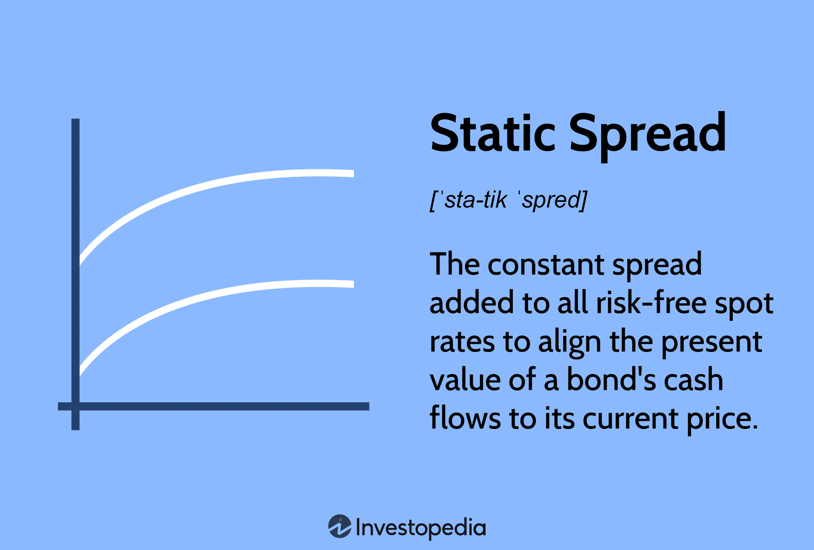

In today's rapidly evolving financial landscape, understanding static spread, bond spread, and their analysis is crucial for effective algorithmic trading. Algorithmic trading, which relies on quantitative techniques and automated execution of trading strategies, benefits immensely from a detailed analysis of these financial concepts. Static spread, also known as zero-volatility spread, provides a more comprehensive measure of a bond's yield spread over the risk-free yield curve by taking into account the entire yield curve, rather than relying on a single point. This precision is essential for accurate bond pricing, particularly in complex financial instruments such as bonds with embedded options or credit default swaps.

Bond spreads, which define the yield differential between two bonds, serve as vital indicators of risk and credit quality within the market. They offer insights into market conditions, letting investors assess the relative risk levels and potential returns of different bonds. By comparing various types of spreads—such as yield spreads and credit spreads—investors can make informed decisions that align with their risk management strategies.



Algorithmic trading leverages these insights to optimize real-time trading decisions, using advanced statistical and mathematical models to reduce human error and enhance trade execution. By integrating static and bond spreads, algorithms can improve their decision-making processes, allowing traders to capitalize on market opportunities efficiently. This article aims to explore these aspects, providing both novice investors and seasoned traders with a comprehensive overview of how these concepts can be applied practically. The integration of static and bond spreads into financial analysis is pivotal, enabling traders to navigate complex financial markets with precision and improving overall profitability through informed decision-making.

## Table of Contents

## Understanding Static Spread

Static spread, also referred to as the zero-volatility spread (Z-spread), is an essential financial metric employed to determine the yield spread added to each spot rate along the yield curve. Unlike the nominal spread, which compares a bond's yield to a single yield point, the static spread takes into consideration the entire yield curve, offering a more comprehensive and involved measure.

The calculation of the static spread involves determining the constant spread that, when added to each spot rate on the yield curve, equates the present value of a bond's cash flows to its market price. This calculation can be expressed mathematically as follows:

$$
P = \sum_{t=1}^{n} \frac{C_t}{(1 + r_t + ZS)^t}
$$

Where:
- $P$ is the current market price of the bond.
- $C_t$ represents the cash flow (coupon payment or principal) at time $t$.
- $r_t$ is the spot rate at time $t$.
- $ZS$ is the static spread.

Static spread offers enhanced accuracy over the nominal spread, particularly in connection with bond pricing, because it accounts for changes in the yield curve across multiple maturities. This becomes especially significant when analyzing and pricing bonds with embedded options, such as callable or putable bonds. For instance, unlike option-adjusted spread (OAS), the static spread does not adjust for the different time periods' [volatility](/wiki/volatility-trading-strategies), which gives it a direct comparison with basic yield spreads without incorporating optionality adjustments.

Furthermore, static spread is also instrumental in the context of credit default swaps (CDS). In CDS pricing, the spread can help evaluate the default risk implied by the market. Adding static spread to the analysis helps traders and analysts estimate the additional yield that compensates for credit risk differences discerningly over time.

Static spread serves as a key component in fixed income analysis, aiding traders and investors in pricing complicated financial instruments more accurately, thus supporting more informed and effective financial decision-making processes.

## The Significance of Bond Spreads

Bond spreads are vital indicators in the financial world, reflecting the difference in yields between two bonds and serving as a key measure to assess risk and credit quality. By examining these spreads, investors gain insights into market conditions, which is crucial for making informed investment decisions.

### Types of Bond Spreads

There are several types of bond spreads, each offering unique insights into market dynamics:

1. **Yield Spread**: This is the simplest measure of the difference in yields between two bonds, often a government bond and a corporate bond. Yield spreads help investors assess the relative riskiness between different bond issuers. A widening yield spread may indicate increasing risk perception in the market.

2. **Credit Spread**: This indicates the difference in yield between a corporate bond and a risk-free government bond of similar maturity. Credit spreads provide insights into the perceived default risk of the corporate issuer. Higher credit spreads signify a higher risk premium demanded by investors for holding a riskier bond.

3. **Z-Spread (Zero-Volatility Spread)**: This spread measures the yield difference over the entire yield curve, as opposed to a single point. It is utilized mainly for bonds with uncertain cash flows, such as mortgage-backed securities, helping investors understand how the bond compensates for risk over time.

4. **Option-Adjusted Spread (OAS)**: This spread adjusts the Z-spread for bonds with embedded options by considering the effects of the option on the bond's yield. OAS is particularly useful for analyzing mortgage-backed securities and callable bonds.

### Bond Spreads as Economic Indicators

Bond spreads serve as economic indicators by reflecting investor sentiment and economic outlooks. For example, a narrowing credit spread may indicate increased investor confidence in the corporate sector, suggesting economic stability or growth. Conversely, a widening spread may signal economic uncertainty or perceived higher default risks.

Moreover, the yield curve's shape, influenced by changes in bond spreads, can signal economic cycles. An inverted yield curve, where long-term rates fall below short-term rates, is often seen as a predictor of economic recession.

### Risk Assessment Through Bond Spreads

Investors use bond spreads as a tool for risk assessment in their portfolios. By analyzing these spreads, particularly the yield and credit spreads, investors can evaluate the risk-return profile of different bonds. For instance, a larger credit spread for a corporate bond compared to its peers indicates higher default risk, prompting more cautious investment decisions.

Furthermore, during volatile market conditions, bond spreads can widen quickly, impacting the valuation of fixed-income portfolios. Analyzing these shifts helps investors adjust their strategies, either by diversifying to manage risk or capitalizing on mispricings for potential gains.

In conclusion, understanding bond spreads is essential for investors aiming to navigate financial markets proficiently. They offer critical insights into market conditions, credit quality, and risk, facilitating more informed decision-making and effective risk management. As such, mastering the analysis of bond spreads aids in formulating robust investment strategies in the complex world of bond markets.

## Algorithmic Trading and Financial Analysis

Algorithmic trading relies on advanced statistical and mathematical models to make precise trading decisions, often in milliseconds. These models analyze vast amounts of financial data to execute trades at optimal prices, reducing human error and leveraging efficiency. In this context, static and bond spreads are integral to forming the basis for algorithmic decisions.

Static spread, or zero-volatility spread, helps algorithms derive exact yield spreads by adding a constant spread to each point on the yield curve. This calculation enhances the accuracy of bond pricing models. For example, algorithms can calculate a more precise bond price by solving for the static spread that equates the present value of future cash flows to the bond's market price. This process involves integrating the spread into the discount rates applied to these cash flows.

Similarly, bond spreads offer critical insights into market risk and credit quality differences, allowing algorithms to assess and compare investment opportunities. By monitoring yield spreads and credit spreads, algorithms can identify market inefficiencies and execute trades that exploit these differences.

To facilitate effective [algorithmic trading](/wiki/algorithmic-trading), programmers commonly turn to Python, favored for its versatility and efficient libraries. NumPy and pandas are particularly popular for data manipulation and analysis. NumPy provides support for handling large arrays and matrices of financial data, whereas pandas offers data structures and functions needed for high-performance data analysis.

Here's an example of how these tools can be used in algorithmic trading:

```python
import numpy as np
import pandas as pd

# Assume 'market_data' is a DataFrame containing bond yield data
market_data = pd.DataFrame({
    'Bond A': [2.5, 2.8, 3.0],
    'Bond B': [2.0, 2.3, 2.5],
    'Bond C': [3.0, 3.3, 3.5]
}, index=pd.date_range('2023-01-01', periods=3))

# Compute bond spreads
bond_spreads = market_data['Bond C'] - market_data['Bond B']

# Identify optimal trading opportunities based on bond spreads
trading_opportunities = bond_spreads[bond_spreads > 0.8]
print(trading_opportunities)
```

In this snippet, NumPy could be used to handle and compute any necessary mathematical operations on the arrays if needed. By combining real-time data processing with robust analysis tools, trading algorithms efficiently manage trades while minimizing risk and maximizing potential returns. This integration of static and bond spreads enhances the accuracy and responsiveness of trading strategies in dynamic financial markets.

## Integrating Spreads in Trading Strategies

Spread trading strategies are popular among traders aiming to harness price discrepancies between related securities to achieve risk-adjusted returns. These strategies rely fundamentally on spread analysis to identify profitable opportunities and execute trades efficiently. Two of the most common spread trading strategies are statistical [arbitrage](/wiki/arbitrage) and [pair trading](/wiki/pair-trading), both of which are enhanced through algorithmic systems.

Statistical arbitrage involves using statistical models to forecast price movements and identify mispricing between securities. By analyzing the historical price data, traders can exploit mean-reverting behavior or price deviation tendencies. An algorithmic approach to [statistical arbitrage](/wiki/statistical-arbitrage) consists of continuously analyzing a basket of securities, identifying temporary pricing inefficiencies, and executing trades to capture the spread. Successful application requires advanced statistical methods and computational techniques, often involving large datasets and sophisticated models to manage operational risk effectively.

Pair trading is a simpler form of statistical arbitrage where two historically correlated securities are treated as a pair. The core idea is to monitor these pairs for divergences from their historical correlation and execute trades when they move apart with the expectation that they will revert to their mean correlation. This method requires a sound understanding of correlation and co-integration principles. A typical algorithm for pair trading may involve steps such as:

1. **Selection of Pairs:** Use historical data to find securities pairs with strong correlation or co-integration.

2. **Monitoring Spread:** Calculate the spread between securities and set threshold levels to identify trading signals.

3. **Execution of Trades:** When the spread crosses the threshold, execute trades to short the overperforming security and buy the underperforming one.

4. **Closure of Trades:** Once the spread converges back to the mean, exit the positions to realize the gains.

A Python implementation for a basic pair trading algorithm might involve using libraries such as `pandas` for data handling and `numpy` for mathematical calculations. Here is a simplified pseudo-code for initiating a pair trading strategy:

```python
import pandas as pd
import numpy as np

# Load historical price data
stock_a = pd.Series()  # Prices for Stock A
stock_b = pd.Series()  # Prices for Stock B

# Calculate Spread
spread = stock_a - stock_b
mean_spread = spread.mean()
std_spread = spread.std()

# Identify trading signals
buy_signal = spread < (mean_spread - 2 * std_spread)
sell_signal = spread > (mean_spread + 2 * std_spread)

# Execute trades
positions = np.where(buy_signal, 1, 0) - np.where(sell_signal, 1, 0)
```

Case studies on successful spread trading strategies often highlight firms that leverage cutting-edge algorithmic systems to execute these trades with [high frequency](/wiki/high-frequency-trading) and precision. For instance, certain hedge funds have developed proprietary systems that use [machine learning](/wiki/machine-learning) algorithms to continually refine their models based on new market data, ensuring they remain adaptive to market changes.

Overall, the integration of spread analysis in trading strategies allows traders to exploit relative value across markets and incur comparatively lower risk than directional positions. However, implementation requires a deep understanding of statistical methods, robust infrastructure for data analysis, and an adept risk management framework to ensure sustainable profitability.

## Challenges and Risks in Spread Trading

Spread trading is a popular strategy among traders aiming to exploit price differentials between related financial instruments. However, it inherently carries certain risks and challenges, the most notable of which are market volatility and [liquidity](/wiki/liquidity-risk-premium) risks. Understanding these challenges is crucial for traders aiming to maximize the benefits of spread trading while minimizing potential downside.

Market volatility poses a significant challenge in spread trading due to its potential to distort expected price relationships between paired securities. Volatility can lead to unpredictable and abrupt price movements, increasing the likelihood of losses. This can be particularly problematic for strategies relying on stable, predictable spreads. High volatility conditions may necessitate adjusting trading models to account for increased price movement likelihood, since spread widening or narrowing beyond anticipated levels can lead to suboptimal trade exits or missed opportunities.

Liquidity risk is another crucial [factor](/wiki/factor-investing) in spread trading. Sufficient liquidity is necessary to enter and [exit](/wiki/exit-strategy) positions without significantly impacting the asset's price. In thinly traded markets, wide bid-ask spreads can erode the anticipated profits from spread trading. Additionally, a lack of liquidity can result in slippage, where the executed price differs from the expected price, further reducing profitability. To mitigate this risk, traders often opt for markets or instruments known for high liquidity, such as major currency pairs or large-cap stocks, ensuring ease of trade execution without substantial price influence.

Effective risk management strategies are essential in addressing these challenges. Diversification is one such strategy, where traders can spread exposure across multiple pairs or asset classes. This helps mitigate the impact of volatility in any single market or instrument. For example, a trader might diversify their portfolio by involving both equity and fixed income spread trades. This diversification can stabilize returns and reduce the risk inherent in relying on a single trading strategy or asset class.

Algorithmic systems embedded with advanced risk management tools can further enhance the execution and monitoring of spread trades. These systems utilize real-time data analytics, enabling quick adjustments to trading strategies in response to market changes. For example, stop-loss orders can be implemented automatically to limit losses when prices move unfavorably. Python, a popular programming language in algorithmic trading, can be employed to develop such systems. Using libraries like Pandas for data handling and NumPy for numerical operations, traders can build robust algorithms that automatically adjust to volatility and liquidity variations.

Here is a sample Python code snippet to illustrate setting up a basic stop-loss mechanism in a spread trading algorithm:

```python
import numpy as np

# Hypothetical spread and stop-loss threshold
current_spread = np.random.randn()
stop_loss_threshold = -0.02  # Example threshold

def evaluate_trade(current_spread, stop_loss_threshold):
    if current_spread < stop_loss_threshold:
        return "Execute stop-loss"
    else:
        return "Hold position"

action = evaluate_trade(current_spread, stop_loss_threshold)
print(action)
```

This code evaluates whether a stop-loss condition is met given the current spread and specified threshold. It is a simple illustration of how algorithmic strategies can incorporate risk management tactics efficiently.

In conclusion, while spread trading offers lucrative opportunities, understanding the risks associated with market volatility and liquidity is essential. By employing diversified trading strategies and integrating robust risk management tools within algorithmic frameworks, traders can better navigate these challenges and enhance their profitability.

## Conclusion

The integration of static and bond spreads into financial analysis is essential for developing more sophisticated algorithmic trading strategies. These spreads provide critical insights into market dynamics, allowing traders to assess risk and potential returns with greater accuracy. Static spreads offer a nuanced view by incorporating all points on the yield curve, making them particularly useful for pricing complex financial instruments such as bonds with embedded options. Bond spreads, on the other hand, serve as vital indicators of market sentiment, credit risk, and macroeconomic conditions. Understanding these spreads helps traders make informed decisions regarding portfolio allocation and risk management.

Algorithmic trading relies heavily on these spreads to automate and optimize trading decisions. By utilizing advanced statistical and mathematical models, algorithmic systems can analyze vast amounts of data in real-time, identifying profitable opportunities with precision. Python, with its robust libraries such as NumPy, pandas, and SciPy, is widely used for developing these algorithms. For instance, using Python, a trader can calculate static spreads through yield curve data and employ this information in a predictive model to forecast bond pricing:

```python
import numpy as np
from scipy.interpolate import interp1d

# Assume spot_rates and yield_curve_data are obtained from market data
spot_rates = np.array([0.02, 0.025, 0.03])
yield_curve_data = np.array([1, 2, 3])  # maturity in years

# Interpolation of yield curve
yield_curve = interp1d(yield_curve_data, spot_rates, kind='cubic')

# Calculate static spread for a hypothetical bond
def calc_static_spread(yield_to_maturity, yield_curve, maturity_years):
    yield_curve_rate = yield_curve(maturity_years)
    static_spread = yield_to_maturity - yield_curve_rate
    return static_spread

print(calc_static_spread(0.035, yield_curve, 3))
```

Continuous learning and adaptation are vital as market conditions are perpetually shifting. Algorithmic trading systems must be regularly updated with new models and data sources to maintain their efficacy. Traders who consistently refine their strategies by integrating updated spread analyses can better navigate the complex financial landscape, ultimately improving their profitability and maintaining a competitive edge. This iterative process of adaptation, coupled with the precise analysis provided by spreads, empowers traders to operate efficiently and strategically in the financial markets.

## References & Further Reading

[1]: [Fabozzi, F. J. (2018). "Fixed Income Analysis."](https://www.amazon.com/Fixed-Income-Analysis-Frank-Fabozzi/dp/047005221X) John Wiley & Sons.

[2]: ["Quantitative Finance for Dummies"](https://www.amazon.com/Quantitative-Finance-Dummies-Steve-DPhil/dp/1118769465) by Steve Bell

[3]: ["Algorithmic and High-Frequency Trading"](https://www.amazon.com/Algorithmic-High-Frequency-Trading-Mathematics-Finance/dp/1107091144) by Álvaro Cartea, Sebastian Jaimungal, and José Penalva

[4]: ["Fixed Income Securities: Tools for Today's Markets"](https://www.amazon.com/Fixed-Income-Securities-Markets-Finance/dp/1119835550) by Bruce Tuckman and Angel Serrat

[5]: ["Credit Risk Modeling using Excel and VBA"](https://assets.thalia.media/doc/artikel/b30/bbb/b30bbbebe43c795a0381bd95b7043d9c3fe307e6.pdf) by Gunter Löffler and Peter N. Posch