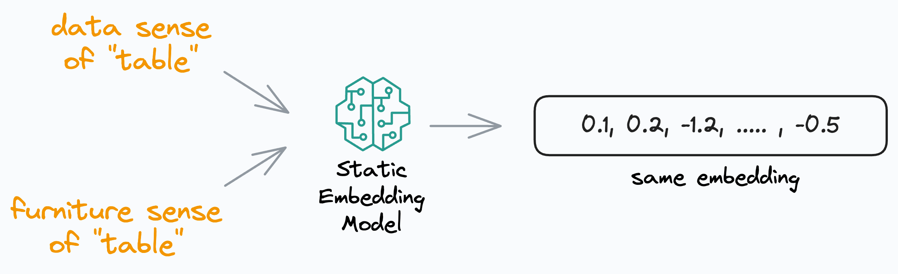

## Table of Contents

## What are static word embeddings and why are they important in natural language processing?

Static word embeddings are a way to represent words as numbers that computers can understand. They turn each word into a list of numbers, called a vector, where similar words have similar vectors. These vectors are created by looking at how often words appear near each other in a large set of text. For example, if "dog" and "puppy" often appear together, their vectors will be similar. A common method to create these embeddings is called Word2Vec, which can capture the meaning of words based on their context.

Static word embeddings are important in natural language processing because they help computers understand and process human language better. Before embeddings, computers treated words as unique symbols without understanding their meanings or relationships. With embeddings, tasks like translating languages, searching for information, and understanding text become more accurate. For instance, if a computer needs to find documents about pets, it can use the vectors of words like "dog" and "cat" to find relevant texts more effectively. Even though newer methods like dynamic embeddings have been developed, static embeddings are still useful because they are simpler and faster to use in many applications.

## How do static word embeddings differ from dynamic word embeddings?

Static word embeddings give each word a fixed vector that doesn't change, no matter where the word appears in a sentence. For example, the word "bank" will have the same vector whether it's talking about a river bank or a place to store money. These embeddings are created by looking at how words appear together in a large set of text, using methods like Word2Vec. This means that once the vectors are made, they stay the same and are used for all tasks.

Dynamic word embeddings, on the other hand, change depending on the context of the word in a sentence. This means the vector for "bank" could be different if it's used in a sentence about finance compared to a sentence about nature. Dynamic embeddings are usually created by models like BERT, which look at the whole sentence to understand the meaning of each word. This makes them more accurate for understanding language but also more complex and slower to use than static embeddings.

Both types of embeddings have their uses. Static embeddings are simpler and faster, making them good for tasks where speed is important. Dynamic embeddings are better at understanding the nuances of language, which is helpful for tasks like answering questions or translating languages where context is key.

## What is the basic principle behind the creation of static word embeddings?

The basic principle behind the creation of static word embeddings is to represent words as vectors in a way that captures their meaning based on how they are used in a large set of text. This is done by looking at the context in which words appear. For example, if "dog" and "puppy" often appear near each other, their vectors will be similar. This idea is based on the distributional hypothesis, which suggests that words with similar meanings tend to appear in similar contexts. A common method to create these embeddings is called Word2Vec, which can learn these vectors by predicting which words are likely to appear near each other.

Word2Vec, for instance, uses two main approaches: Continuous Bag of Words (CBOW) and Skip-gram. In CBOW, the model predicts a target word based on the context words around it. In Skip-gram, the model does the opposite, predicting the context words given a target word. Both methods adjust the vectors of words to minimize the prediction error. Once trained, these vectors remain fixed and can be used for various natural language processing tasks. This fixed nature of the vectors is why they are called "static" embeddings.

## Can you explain the Skip-gram model of Word2Vec and how it generates word embeddings?

The Skip-gram model of Word2Vec is a way to create word embeddings by looking at how words are used together. Imagine you have a sentence, and you pick one word from it. The Skip-gram model tries to guess the words that come before and after this chosen word. For example, if you pick the word "dog" in the sentence "The dog chased the cat," the model would try to predict "The," "chased," "the," and "cat." By doing this over and over with lots of sentences, the model learns to make vectors for each word that capture their meanings based on the words they often appear with.

To create these vectors, the Skip-gram model starts with random vectors for each word. Then, it adjusts these vectors to make better predictions. When the model sees "dog" and tries to predict "cat," it looks at the vector for "dog" and adjusts it a little bit to make the prediction more accurate. Over many tries with many sentences, these adjustments help the vectors get closer to representing the real meanings of the words. The final vectors are the static word embeddings that can be used for tasks like finding similar words or understanding text.

Here's a simple example of how the Skip-gram model works in code:

```python
from gensim.models import Word2Vec

# Sample sentences
sentences = [["the", "dog", "chased", "the", "cat"]]

# Train the Skip-gram model
model = Word2Vec(sentences, vector_size=100, window=5, min_count=1, sg=1)

# Get the vector for "dog"
dog_vector = model.wv['dog']
print(dog_vector)
```

This code creates a Skip-gram model using the gensim library and trains it on a simple sentence. The `sg=1` parameter tells the model to use the Skip-gram approach. After training, you can get the vector for any word, like "dog," and use it for further tasks.

## How does the Continuous Bag of Words (CBoW) model of Word2Vec work?

The Continuous Bag of Words (CBOW) model of Word2Vec works by trying to predict a target word based on the words around it. Imagine you have a sentence and you pick one word as the target. The CBOW model looks at the words before and after the target word and uses them to guess what the target word is. For example, if the sentence is "The dog chased the cat," and "dog" is the target word, the model uses "The," "chased," "the," and "cat" to predict "dog." By doing this over and over with many sentences, the model learns to make vectors for each word that capture their meanings based on the words they often appear with.

To create these vectors, the CBOW model starts with random vectors for each word. Then, it adjusts these vectors to make better predictions. When the model sees "The," "chased," "the," and "cat" and tries to predict "dog," it looks at the vectors for these context words and adjusts them a little bit to make the prediction more accurate. Over many tries with many sentences, these adjustments help the vectors get closer to representing the real meanings of the words. The final vectors are the static word embeddings that can be used for tasks like finding similar words or understanding text.

Here's a simple example of how the CBOW model works in code:

```python
from gensim.models import Word2Vec

# Sample sentences
sentences = [["the", "dog", "chased", "the", "cat"]]

# Train the CBOW model
model = Word2Vec(sentences, vector_size=100, window=5, min_count=1, sg=0)

# Get the vector for "dog"
dog_vector = model.wv['dog']
print(dog_vector)
```

This code creates a CBOW model using the gensim library and trains it on a simple sentence. The `sg=0` parameter tells the model to use the CBOW approach. After training, you can get the vector for any word, like "dog," and use it for further tasks.

## What are the key features and advantages of using GloVe for word embeddings?

GloVe, which stands for Global Vectors for Word Representation, is another way to create word embeddings. It's different from Word2Vec because it looks at the whole set of text at once, not just one word at a time. GloVe counts how often words appear together in the entire text and uses this to make vectors. This means it can capture the overall patterns of word use across a big collection of text. For example, if "king" and "queen" often appear with similar words, their vectors will be close to each other.

One big advantage of using GloVe is that it's good at understanding the relationships between words. It can show that "king" is to "man" what "queen" is to "woman" using a simple vector math formula like $$ \text{vector(king)} - \text{vector(man)} + \text{vector(woman)} \approx \text{vector(queen)} $$. This makes it really useful for tasks like finding synonyms or understanding analogies. Another advantage is that GloVe can be trained faster than some other methods because it uses a simpler approach to learning from the text. This makes it a good choice when you need to create embeddings quickly and still want them to be accurate.

## How does fastText improve upon traditional word embedding methods like Word2Vec?

fastText improves on traditional word embedding methods like Word2Vec by taking into account the internal structure of words. Instead of treating words as single units, fastText breaks them down into smaller parts called subwords. For example, the word "playing" can be seen as made up of subwords like "play" and "ing". This means that even if a word is not in the training data, fastText can still create a good vector for it by combining the vectors of its subwords. This is very helpful for languages with many word forms or for understanding new words that were not seen during training.

Another way fastText improves over Word2Vec is by being faster and more efficient to train. It uses a method that allows it to learn from large amounts of text more quickly. This makes it easier to create embeddings for big datasets. Also, because fastText considers subwords, it can handle typos and misspellings better than Word2Vec. If someone types "playng" instead of "playing," fastText can still understand it because it recognizes the subwords "play" and "ing." This makes fastText a more robust and versatile tool for many natural language processing tasks.

## What is the purpose of Poincaré Embeddings and in which scenarios are they particularly useful?

Poincaré Embeddings are a special type of word embedding that are designed to capture the hierarchical relationships between words. Instead of using a regular flat space like other embeddings, Poincaré Embeddings use a curved space called a hyperbolic space. This curved space is good at showing how some words are more general while others are more specific. For example, "animal" is a very general word that includes more specific words like "dog" and "cat." In a Poincaré Embedding, "animal" would be placed near the center, with "dog" and "cat" further out but still close to "animal." This helps computers understand the structure of language better.

Poincaré Embeddings are particularly useful in scenarios where understanding the hierarchy of concepts is important. For instance, in fields like biology or taxonomy, where you have broad categories like "mammal" that break down into more specific categories like "whale" and "elephant," Poincaré Embeddings can help represent these relationships more accurately. They are also useful in natural language processing tasks like text classification or ontology learning, where understanding the hierarchical structure of words can improve the performance of the models. By using the special properties of hyperbolic space, Poincaré Embeddings can capture these complex relationships in a way that traditional embeddings cannot.

## How does lda2vec combine topic modeling with word embeddings, and what are its benefits?

lda2vec combines topic modeling and word embeddings by using the strengths of both. Topic modeling, like LDA (Latent Dirichlet Allocation), groups words into topics based on how often they appear together. Word embeddings, like Word2Vec, turn words into vectors that capture their meanings. lda2vec takes these two ideas and mixes them together. It learns topics from the text and also learns word vectors. But instead of just learning separate topics and vectors, lda2vec makes sure that the word vectors are also influenced by the topics. This means that words in the same topic will have vectors that are closer to each other.

The benefits of using lda2vec are that it can give a more detailed understanding of text. It can show not just what topics are in a document, but also how the words relate to each other within those topics. For example, if you have a document about animals, lda2vec can show that "dog" and "puppy" are close in meaning and also part of the same topic. This makes it easier to find patterns and relationships in large sets of text. lda2vec can be used for tasks like document classification, where understanding both the topics and the word meanings can help make better predictions.

## What are the limitations of static word embeddings, and how do they impact their use in advanced NLP tasks?

Static word embeddings have some limitations that can make them less useful for some advanced natural language processing tasks. One big problem is that they give each word the same vector no matter where it appears in a sentence. For example, the word "bank" will have the same vector whether it means a place to store money or the side of a river. This can make it hard for computers to understand the meaning of words in different contexts. Another issue is that static embeddings can't capture new words or slang that weren't in the training data. If a new word like "selfie" comes along after the embeddings are made, the computer won't know what it means.

These limitations can impact how well static embeddings work for tasks like understanding questions or translating languages. In question answering, knowing the right meaning of a word based on the context is very important. If a computer can't tell the difference between "bank" as a financial institution and "bank" as a river side, it might give the wrong answer. In language translation, understanding different meanings of words is also key. Static embeddings might not be able to handle these tasks as well as dynamic embeddings, which change based on the context. But static embeddings are still useful for simpler tasks where speed and simplicity are more important than understanding every detail of the language.

## Can you discuss the concept of Mirror-BERT and how it relates to static word embeddings?

Mirror-BERT is a way to make word embeddings that are both static and understand the context of words. It's like a mix between the old static embeddings and the newer dynamic embeddings. Mirror-BERT starts with a pre-trained BERT model, which is really good at understanding the meaning of words based on where they appear in a sentence. But instead of changing the vectors for each word every time, Mirror-BERT takes the vectors from BERT and makes them into static embeddings. This means that the vectors don't change, but they still capture some of the context that BERT learned.

The reason Mirror-BERT is important is that it tries to get the best of both worlds. Static embeddings are fast and simple to use, but they don't understand context well. Dynamic embeddings like BERT are great at understanding context, but they can be slow and hard to use in some tasks. By using BERT to make static embeddings, Mirror-BERT can be used in tasks where you need to understand some context but also need speed and simplicity. This makes it a useful tool for many natural language processing jobs where the old static embeddings might not be enough, but the full power of BERT might be too much.

## How can one evaluate the quality of static word embeddings, and what metrics are commonly used?

Evaluating the quality of static word embeddings involves checking how well they capture the relationships between words. One common way to do this is by using the word analogy task. In this task, you test if the embeddings can solve simple word puzzles like "man is to woman as king is to queen." If the embeddings are good, the vector math $$ \text{vector(man)} - \text{vector(woman)} + \text{vector(king)} \approx \text{vector(queen)} $$ should work well. Another way to evaluate embeddings is by looking at how similar the vectors are for words that mean the same thing. If "dog" and "puppy" have vectors that are close together, that's a good sign.

Another important metric for evaluating static word embeddings is the performance on downstream tasks. This means using the embeddings in real natural language processing jobs like text classification or sentiment analysis. If the embeddings help these tasks work better, they are probably good embeddings. For example, you might use the embeddings to train a model to tell if a review is positive or negative. If the model does well, the embeddings are likely capturing useful information about the words. These evaluation methods help researchers and developers choose the best embeddings for their needs.

## References & Further Reading

[1]: Mikolov, T., Chen, K., Corrado, G., & Dean, J. (2013). ["Efficient Estimation of Word Representations in Vector Space."](https://arxiv.org/abs/1301.3781) arXiv preprint arXiv:1301.3781.

[2]: Pennington, J., Socher, R., & Manning, C. D. (2014). ["GloVe: Global Vectors for Word Representation."](https://aclanthology.org/D14-1162/) Proceedings of the 2014 Conference on Empirical Methods in Natural Language Processing (EMNLP).

[3]: Bojanowski, P., Grave, E., Joulin, A., & Mikolov, T. (2017). ["Enriching Word Vectors with Subword Information."](https://arxiv.org/abs/1607.04606) Transactions of the Association for Computational Linguistics, 5, 135-146.

[4]: Nickel, M., & Kiela, D. (2017). ["Poincaré Embeddings for Learning Hierarchical Representations."](https://arxiv.org/abs/1705.08039) Advances in Neural Information Processing Systems 30.

[5]: Moody, C. (2016). ["mixing-dirichlet-lda2vec-tmvector."](https://multithreaded.stitchfix.com/blog/2016/07/08/mixing-dirichlet-multinomials-lda2vec/) Retrieved from Stitch Fix Tech Blog.

[6]: Devlin, J., Chang, M. W., Lee, K., & Toutanova, K. (2018). ["BERT: Pre-training of Deep Bidirectional Transformers for Language Understanding."](https://arxiv.org/abs/1810.04805) arXiv preprint arXiv:1810.04805.