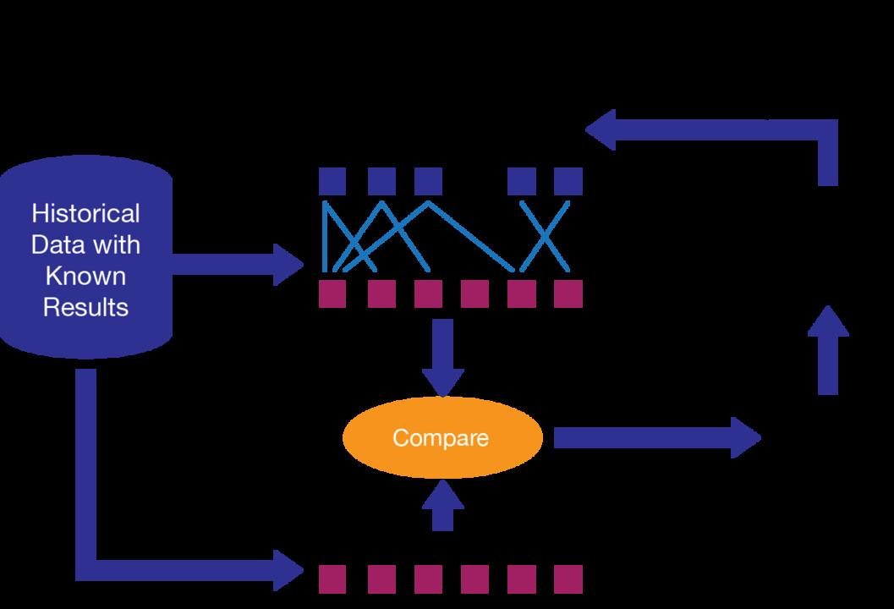

## Table of Contents

## What is static machine learning?

Static machine learning refers to a type of machine learning where the model is trained on a fixed dataset and then used to make predictions without being updated with new data. Once the training is complete, the model's parameters are set and do not change. This means that if new data becomes available, the model does not automatically learn from it unless it is retrained from scratch with the new data included.

This approach is simpler and can be useful in situations where the underlying patterns in the data do not change over time. For example, a model trained to recognize handwritten digits might be static because the way people write numbers does not typically change. However, static machine learning can be less effective in environments where data patterns evolve, such as in stock market predictions or user behavior analysis, because the model cannot adapt to new trends or information without being retrained.

## How does static machine learning differ from dynamic machine learning?

Static machine learning and dynamic machine learning are two different ways to use machine learning models. In static machine learning, you train a model on a set amount of data. Once the training is done, the model stays the same and doesn't change, even if you get new data. It's like taking a snapshot of what the model knows at one point and using that snapshot forever. This can be good when the data you're working with doesn't change much over time, like recognizing shapes or numbers.

On the other hand, dynamic [machine learning](/wiki/machine-learning) allows the model to keep learning and updating itself as new data comes in. This means the model can adapt to new patterns and changes in the data over time. It's like having a model that can learn from new experiences and get better at its job. This is really helpful in areas where things change a lot, like predicting what people will buy or how they will behave on a website. Dynamic models can use techniques like online learning or [reinforcement learning](/wiki/reinforcement-learning) to keep improving.

In summary, the main difference between static and dynamic machine learning is how they handle new data. Static models stay the same after training, while dynamic models can change and improve as they see new information. Choosing between them depends on whether the data you're working with is likely to change and if you need your model to adapt over time.

## What are the key components of a static machine learning model?

The key components of a static machine learning model include the training data, the algorithm used for learning, and the model itself. The training data is a set of examples that the model uses to learn from. This data is fixed and does not change once the model is trained. The algorithm is the method or set of rules that the model uses to learn from the training data. Common algorithms include linear regression for predicting numbers, decision trees for making choices, and neural networks for complex patterns. The model is the result of the algorithm's learning process, which can be represented by a set of parameters or weights that the algorithm adjusts to best fit the training data.

Once the model is trained, it is used to make predictions on new data. The model's performance is often evaluated using metrics like accuracy, precision, or mean squared error, depending on the type of problem it's solving. For example, in a classification problem, accuracy might be calculated as $$ \text{Accuracy} = \frac{\text{Number of correct predictions}}{\text{Total number of predictions}} $$. The model does not change after training, so if new data comes in, the model will not automatically adjust to it. To use new data, the model would need to be retrained from scratch, which means going through the whole process again with the new data included.

## Can you explain the process of training a static machine learning model?

Training a static machine learning model starts with gathering a set of data called the training data. This data is used to teach the model about the patterns it needs to recognize. For example, if you want to train a model to recognize pictures of cats and dogs, you would collect many pictures labeled as either "cat" or "dog." The next step is to choose an algorithm that will help the model learn from this data. Common algorithms include decision trees, which make choices based on questions about the data, and neural networks, which can learn complex patterns. Once you have your data and algorithm, you start the training process. During training, the algorithm adjusts the model's parameters or weights to better fit the training data. This process continues until the model can accurately predict the labels for the training data.

After training, the model's performance is evaluated using a separate set of data called the validation data. This helps to check if the model can generalize well to new data it hasn't seen before. A common way to measure performance is accuracy, which is calculated as $$ \text{Accuracy} = \frac{\text{Number of correct predictions}}{\text{Total number of predictions}} $$. If the model performs well on the validation data, it can be used to make predictions on new data. However, since it's a static model, it won't change or learn from any new data it sees after training. If you want to improve the model with new data, you would need to retrain it from scratch, starting the whole process over again with the new data included.

## What types of problems are best suited for static machine learning?

Static machine learning works best for problems where the data doesn't change much over time. For example, if you want to build a model to recognize handwritten numbers, the way people write numbers stays pretty much the same. So, you can train a model once and use it for a long time without needing to update it. Another good use is for tasks like detecting certain shapes or patterns in images that don't change, like recognizing specific types of objects in photos.

In these situations, static models are simple and effective. They don't need to keep learning from new data, which makes them easier to use and maintain. If you want to measure how well the model works, you can use accuracy, which is calculated as $$ \text{Accuracy} = \frac{\text{Number of correct predictions}}{\text{Total number of predictions}} $$. But remember, if the data does start to change, like if people start writing numbers differently, you would need to retrain the model from scratch to keep it working well.

## How do you evaluate the performance of a static machine learning model?

To evaluate the performance of a static machine learning model, you need to use a separate set of data called the validation data. This data is different from the training data the model used to learn. You test the model on this validation data to see how well it can predict or classify new examples it hasn't seen before. A common way to measure performance is accuracy, which tells you how many predictions the model got right out of all the predictions it made. You can calculate accuracy with the formula $$ \text{Accuracy} = \frac{\text{Number of correct predictions}}{\text{Total number of predictions}} $$. If the accuracy is high, it means the model is good at making correct predictions.

Besides accuracy, there are other metrics you can use depending on the type of problem you're solving. For example, if you're working on a problem where you need to predict numbers, you might use mean squared error to see how far off your predictions are from the actual values. If you're classifying things into different categories, you might look at precision and recall. Precision tells you how many of the positive predictions were actually correct, and recall tells you how many of the actual positives the model was able to find. By using these metrics, you can get a better understanding of how well your static machine learning model is performing and whether it's ready to use on new data.

## What are the advantages of using static machine learning models?

Static machine learning models are simple and easy to use because once you train them, they don't change. This means you don't have to worry about updating the model every time new data comes in. It's like taking a picture of what the model knows at one point and using that picture forever. This can save a lot of time and effort, especially if the data you're working with doesn't change much over time. For example, if you're using a model to recognize handwritten numbers, you can train it once and keep using it because people don't usually change how they write numbers.

Another advantage of static models is that they are easier to understand and explain. Since the model's parameters don't change after training, you can look at the model and see exactly what it learned from the training data. This can be helpful if you need to explain to others how the model makes its predictions. Also, because static models don't need to keep learning, they can be faster and use less computer power when you use them to make predictions. If you want to measure how well the model works, you can use accuracy, which is calculated as $$ \text{Accuracy} = \frac{\text{Number of correct predictions}}{\text{Total number of predictions}} $$.

## What are the limitations or challenges faced when using static machine learning?

Static machine learning models have a big challenge: they can't learn from new data after they're trained. If the world changes and the data changes, the model won't be able to keep up. For example, if you use a static model to predict what people will buy, and people's tastes change over time, the model might start making bad predictions. To fix this, you'd have to retrain the model from scratch with all the new data, which can take a lot of time and effort.

Another limitation is that static models might not work well if the data they're trained on isn't a good representation of all the possible data they'll see. If the training data is too different from the new data, the model might not be accurate. For instance, if you train a model to recognize pictures of dogs in the summer, it might not work well in the winter when dogs might wear coats. You can check how well the model is doing by using accuracy, which is calculated as $$ \text{Accuracy} = \frac{\text{Number of correct predictions}}{\text{Total number of predictions}} $$. If the accuracy is low on new data, it's a sign that the model might not be very useful anymore.

## How can static machine learning be applied in real-world scenarios?

Static machine learning can be used in many real-world situations where the data doesn't change much over time. For example, if you want to create a system that can read handwritten numbers, like on checks or forms, you can train a static model once and use it for a long time. The way people write numbers doesn't change a lot, so the model can keep working well without needing updates. Another example is in manufacturing, where a static model can be trained to spot defects in products. If the defects always look the same, the model can keep finding them without needing to learn anything new.

However, there are situations where static machine learning might not be the best choice. If you're trying to predict what people will buy, their tastes and preferences can change over time. A static model trained on old data might start making bad predictions because it can't learn from the new data. To keep the model working well, you'd have to retrain it from scratch with the new data, which can be a lot of work. You can check how well the model is doing by using accuracy, which is calculated as $$ \text{Accuracy} = \frac{\text{Number of correct predictions}}{\text{Total number of predictions}} $$. If the accuracy is low on new data, it's a sign that the model might need to be retrained.

## What are some common algorithms used in static machine learning?

Static machine learning uses many different algorithms to learn from data. Some common ones are linear regression, which is great for predicting numbers. For example, if you want to guess how much a house will cost based on its size, linear regression can help. Another common algorithm is decision trees, which make choices based on questions about the data. They're like a flowchart that helps decide if something is a cat or a dog by asking questions like, "Does it have whiskers?" Neural networks are also popular, especially for recognizing patterns in pictures or sounds. They can learn very complex things, but once trained, they don't change.

These algorithms are chosen based on the type of problem you're trying to solve. For example, if you want to recognize handwritten numbers, a [neural network](/wiki/neural-network) might be the best choice because it can learn the shapes and patterns of numbers really well. Once you train the model with these algorithms, you can use it to make predictions on new data. To see how well the model is doing, you can use accuracy, which is calculated as $$ \text{Accuracy} = \frac{\text{Number of correct predictions}}{\text{Total number of predictions}} $$. If the accuracy is high, it means the model is good at making correct predictions.

## How does feature selection impact the performance of static machine learning models?

Feature selection is really important for how well a static machine learning model works. It's about choosing which pieces of information, or features, the model will use to learn from the data. If you pick the right features, the model can learn better and make more accurate predictions. For example, if you're trying to predict house prices, using features like the size of the house and the number of bedrooms can help the model a lot. But if you use features that don't matter much, like the color of the house, the model might get confused and not work as well. You can check how well the model is doing by using accuracy, which is calculated as $$ \text{Accuracy} = \frac{\text{Number of correct predictions}}{\text{Total number of predictions}} $$. If the accuracy goes up after you choose better features, it means the model is doing a better job.

On the other hand, if you use too many features, the model can get overwhelmed and start to see patterns that aren't really there. This is called overfitting, and it can make the model work well on the training data but not on new data. By carefully choosing which features to use, you can help the model focus on what's important and avoid overfitting. This way, the model can make good predictions even when it sees new data it hasn't seen before. So, feature selection is a key step in making sure your static machine learning model performs well and stays useful over time.

## What advanced techniques can be used to optimize static machine learning models?

To optimize static machine learning models, one advanced technique is called hyperparameter tuning. Hyperparameters are settings that you choose before you start training the model, like the learning rate or the number of layers in a neural network. By trying different values for these hyperparameters, you can find the best ones that make the model work better. This can be done using methods like grid search, where you test every possible combination of hyperparameters, or random search, where you try random combinations. Another method is cross-validation, where you split your data into different parts and train the model multiple times to see how well it works on different pieces of data. This helps you make sure the model isn't just memorizing the training data but can work well on new data too.

Another technique is feature engineering, which involves creating new features or changing existing ones to help the model learn better. For example, if you're predicting house prices, you might create a new feature that combines the size of the house and the number of bedrooms into one number. This can help the model see patterns it might miss otherwise. You can also use dimensionality reduction techniques like Principal Component Analysis (PCA) to simplify your data by keeping only the most important features. This can make the model easier to train and less likely to overfit. To check how well the model is doing after using these techniques, you can use accuracy, which is calculated as $$ \text{Accuracy} = \frac{\text{Number of correct predictions}}{\text{Total number of predictions}} $$. If the accuracy goes up, it means your optimizations are working.

## References & Further Reading

[1]: Goodfellow, I., Bengio, Y., & Courville, A. (2016). ["Deep Learning"](https://link.springer.com/article/10.1007/s10710-017-9314-z). MIT Press.

[2]: Mitchell, T. M. (1997). ["Machine Learning"](https://www.cs.cmu.edu/~tom/mlbook.html). McGraw Hill.

[3]: Bishop, C. M. (2006). ["Pattern Recognition and Machine Learning"](https://www.cs.uoi.gr/~arly/courses/ml/tmp/Bishop_book.pdf). Springer.

[4]: Murphy, K. P. (2012). ["Machine Learning: A Probabilistic Perspective"](https://www.cs.ubc.ca/~murphyk/MLbook/pml-toc-1may12.pdf). MIT Press.

[5]: Hastie, T., Tibshirani, R., & Friedman, J. (2009). ["The Elements of Statistical Learning: Data Mining, Inference, and Prediction"](https://link.springer.com/book/10.1007/978-0-387-84858-7). Springer.