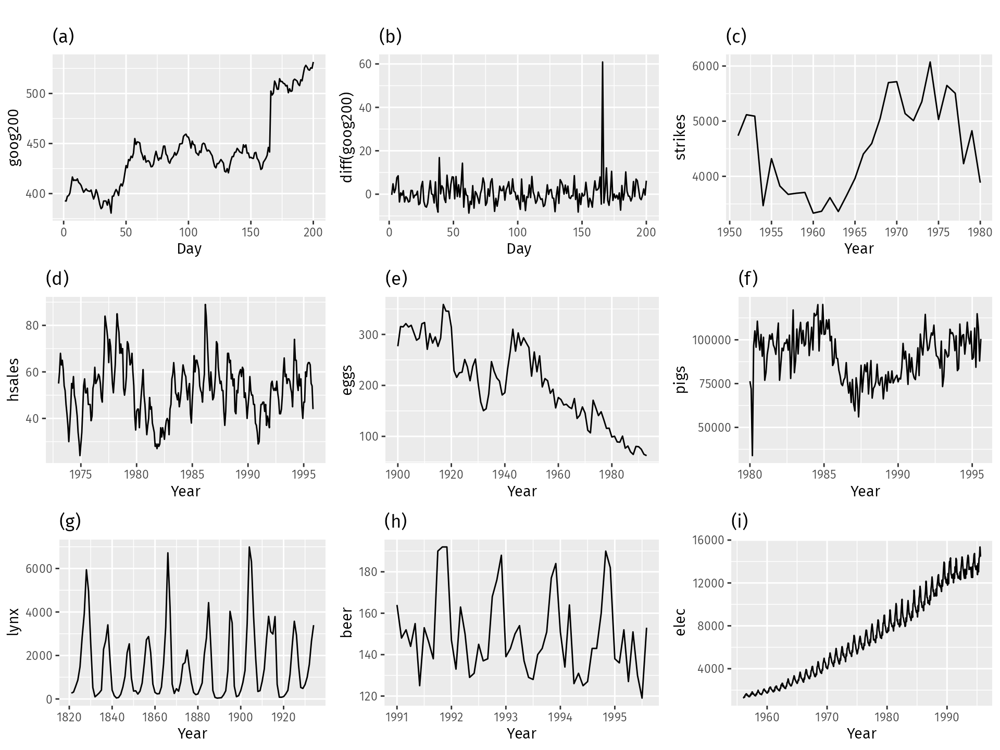

## Table of Contents

## What is stationarity in time series analysis?

Stationarity in time series analysis means that the statistical properties of a series, like its mean, variance, and autocorrelation, stay the same over time. Imagine you're looking at the average temperature in a city over many years. If the average temperature doesn't change much from year to year, the series is stationary. This is important because many statistical models work better with stationary data.

If a time series is not stationary, it can be hard to make good predictions. For example, if the average temperature in the city is going up every year, the series is not stationary. Analysts often try to make a non-stationary series stationary by using techniques like differencing, where they look at the changes between consecutive observations instead of the observations themselves. This helps in applying various statistical methods more effectively.

## Why is stationarity important in statistical modeling?

Stationarity is important in statistical modeling because it makes the data easier to work with. When a time series is stationary, its average value, how much it varies, and how it relates to itself over time don't change. This means that the patterns we see in the past are likely to continue into the future. This makes it easier for models to predict what will happen next, because the rules stay the same.

If a time series isn't stationary, it can be tricky to use in models. For example, if the average value of the series is going up or down over time, the model has to figure out not just the pattern, but also how that pattern is changing. This can make predictions less reliable. To fix this, analysts often transform the data to make it stationary, like looking at the differences between consecutive values instead of the values themselves. This helps the models work better and give more accurate predictions.

## How can you identify if a time series is stationary?

To find out if a time series is stationary, you can start by looking at a graph of the data. If the series looks like it's going up or down over time, or if it's getting more or less spread out, it's probably not stationary. You can also look at the average value of the series over different time periods. If the average stays about the same, that's a good sign that the series might be stationary.

Another way to check for stationarity is by using statistical tests. One common test is the Augmented Dickey-Fuller (ADF) test. This test looks at whether the series has a unit root, which means it's not stationary. If the test shows that there's no unit root, then the series is likely stationary. Another test you can use is the KPSS test, which works the other way around—it checks if the series is trend-stationary. If the KPSS test says the series is not trend-stationary, then it's probably stationary.

You can also look at the autocorrelation function (ACF) of the series. If the ACF plot shows that the correlations between the series and its past values drop off quickly, that's another sign that the series might be stationary. If the correlations stay high for a long time, it could mean the series is not stationary. By using these methods together, you can get a good idea of whether your time series is stationary or not.

## What are the different types of stationarity?

There are different types of stationarity, but the two main ones are strict stationarity and weak stationarity. Strict stationarity means that the entire probability distribution of the time series stays the same over time. This includes not just the average and how much the series varies, but everything about how the numbers are spread out. It's a very strong condition and can be hard to check in real data.

Weak stationarity, also called covariance stationarity, is a bit easier to work with. It means that the average value of the series stays the same over time, and the way the series varies around that average also stays the same. Plus, the correlation between the series at different times stays the same, no matter where you start looking. This type of stationarity is what most statistical models need to work well. It's easier to check for than strict stationarity because you don't need to know the whole probability distribution, just a few key pieces of information.

## What is the difference between strict stationarity and weak stationarity?

Strict stationarity means that the entire way the numbers in a time series are spread out stays the same over time. This includes the average, how much the numbers vary, and everything else about the probability distribution. It's like saying that if you look at the series at any point in time, it would look the same statistically. Strict stationarity is a very strong condition, and it can be hard to check in real data because you need to know a lot about the series.

Weak stationarity, on the other hand, is easier to understand and check. It means that the average value of the series stays the same over time, and the way the numbers vary around that average also stays the same. Plus, the correlation between the series at different times stays the same no matter where you start looking. This is what most statistical models need to work well. It's easier to check for weak stationarity because you only need to know a few key pieces of information about the series, not the whole probability distribution.

## How does non-stationarity affect forecasting models?

When a time series is non-stationary, it means its average value, how much it varies, or how it relates to itself over time can change. This makes it hard for forecasting models to predict the future because the rules keep changing. Imagine trying to guess the next number in a sequence where the pattern keeps shifting. It's much harder than if the pattern stayed the same. Non-stationary data can make models give wrong predictions because they're built to work with data where the rules don't change.

To deal with non-stationarity, analysts often try to make the data stationary before using it in models. They might look at the differences between consecutive values instead of the values themselves. This can help make the data more predictable. But if the data stays non-stationary, the models might still struggle to give good forecasts. It's like trying to hit a moving target—it's much harder than if the target stayed still.

## What are common methods to test for stationarity?

To check if a time series is stationary, one simple way is to look at a graph of the data. If the series seems to go up or down over time, or if it spreads out more or less, it's probably not stationary. You can also look at the average value of the series over different times. If the average stays about the same, that's a good sign it might be stationary.

Another way to test for stationarity is by using statistical tests. One common test is the Augmented Dickey-Fuller (ADF) test. This test checks if the series has a unit root, which means it's not stationary. If the test says there's no unit root, the series is likely stationary. Another test you can use is the KPSS test, which checks if the series is trend-stationary. If the KPSS test says it's not trend-stationary, then it's probably stationary.

You can also look at the autocorrelation function (ACF) of the series. If the ACF plot shows that the correlations between the series and its past values drop off quickly, that's another sign the series might be stationary. If the correlations stay high for a long time, it could mean the series is not stationary. By using these methods together, you can get a good idea of whether your time series is stationary or not.

## How can you transform a non-stationary series into a stationary one?

One common way to turn a non-stationary series into a stationary one is by using differencing. This means you look at the changes between one value and the next instead of the values themselves. For example, if your series is the daily temperature, you can make it stationary by looking at the difference between today's temperature and yesterday's temperature. This often helps because even if the temperature is going up over time, the daily changes might stay the same. This way, the series becomes easier to predict because the average of the changes stays about the same over time.

Another method is called log transformation. If your series grows over time but at a steady rate, you can take the log of the values. This can make the series stationary because the log of a growing number grows more slowly. For example, if you're looking at a company's sales that keep going up by the same percentage each year, taking the log of the sales can make the series easier to work with. By using these methods, you can make your data more predictable and easier to use in statistical models.

## What are the implications of incorrectly assuming stationarity?

If you think a time series is stationary when it's not, your predictions can go wrong. Imagine you're trying to guess the next number in a sequence, but the pattern keeps changing. If you don't know the pattern is changing, your guesses will be off. This can make your models less accurate because they're built to work with data where the rules don't change. It's like trying to hit a moving target with a steady aim—you're likely to miss.

To fix this, you need to make the data stationary before using it in models. If you don't, you might make decisions based on wrong predictions. For example, a business might think sales will stay the same when they're actually growing, leading to missed opportunities. By understanding and correcting for non-stationarity, you can make better predictions and decisions. It's important to check for stationarity before you start modeling, so you don't make mistakes that could cost time and money.

## Can machine learning models handle non-stationary data?

Machine learning models can handle non-stationary data, but it's a bit trickier than working with stationary data. Non-stationary data means the patterns in the data change over time, which can make it hard for models to learn the right rules. Some [machine learning](/wiki/machine-learning) models, like those that use time as a feature or have ways to adapt to changes, can still work well with non-stationary data. For example, models like Long Short-Term Memory (LSTM) networks are good at this because they can remember past patterns and adjust as new patterns emerge.

However, it's often still a good idea to make the data stationary before using it in machine learning models. This can make the models more accurate and easier to understand. You can do this by using techniques like differencing, where you look at the changes between values instead of the values themselves. This way, even if the original data was changing over time, the changes might stay the same, making it easier for the model to predict what will happen next.

## How do advanced statistical tests like the Augmented Dickey-Fuller test work?

The Augmented Dickey-Fuller (ADF) test is a way to check if a time series is stationary. It does this by looking for something called a "unit root," which means the series is not stationary. The test starts by setting up a null hypothesis that says the series has a unit root. Then, it looks at the data and tries to see if it can reject this hypothesis. If the test can reject the null hypothesis, it means the series is likely stationary. The test does this by running a regression that includes the series, its lagged values, and sometimes a trend or constant term. It then calculates a test statistic and compares it to critical values. If the test statistic is more negative than the critical values, the null hypothesis is rejected, suggesting the series is stationary.

The ADF test is useful because it can handle more complex time series data than simpler tests. It can account for things like trends and different ways the series might change over time. But it's not perfect. Sometimes, the test might say a series is stationary when it's not, or vice versa. That's why it's often a good idea to use other tests, like the KPSS test, alongside the ADF test. The KPSS test works the other way around—it assumes the series is stationary and tries to see if it can reject that. By using both tests, you can get a better idea of whether your time series is really stationary or not.

## What are the latest research developments in dealing with non-stationarity in complex systems?

The latest research in dealing with non-stationarity in complex systems has focused on developing new methods that can adapt to changing patterns over time. One big area of work is on machine learning models that can learn from data that keeps changing. For example, researchers are working on models like online learning algorithms that can update their predictions as new data comes in. This is really helpful for things like predicting stock prices or weather patterns, where the data can change a lot over time. Another approach is using ensemble methods, where you combine different models to make better predictions. By using several models together, you can get a more stable prediction even when the data is not staying the same.

Another exciting development is in the field of transfer learning, where models learn from one set of data and then use that knowledge to help with a different but related set of data. This can be really useful for dealing with non-stationarity because it lets models adapt to new situations by using what they've learned before. For example, a model that learned to predict traffic patterns in one city could use that knowledge to help predict traffic in another city, even if the patterns are a bit different. Researchers are also looking at how to use domain adaptation techniques to make models work better with data that changes over time. By combining these new methods, scientists are getting better at handling non-stationarity in complex systems and making more accurate predictions.

## How can we detect stationarity in time series data?

Stationarity in time series data is a fundamental assumption for many statistical models used in [algorithmic trading](/wiki/algorithmic-trading). Detecting stationarity is crucial to ensure the reliability and effectiveness of these models. This section explores methods and tools for assessing the stationarity of time series data.

### Methods for Testing Stationarity

#### Augmented Dickey-Fuller (ADF) Test

The Augmented Dickey-Fuller test is a common statistical test used to check for the presence of a unit root in a univariate time series sample. A unit root indicates that the time series is non-stationary. The null hypothesis of the ADF test is that the series contains a unit root, suggesting non-stationarity. Conversely, the alternative hypothesis suggests that the series is stationary. The ADF test equation is:

$$
\Delta y_t = \alpha + \beta t + \gamma y_{t-1} + \sum_{i=1}^p \delta_i \Delta y_{t-i} + \varepsilon_t
$$

where $y_t$ is the variable of interest, $\Delta$ is the difference operator, $\alpha$ is a constant, $t$ represents time trend, $p$ is the lag order, and $\varepsilon_t$ is white noise.

#### KPSS Test

The Kwiatkowski-Phillips-Schmidt-Shin (KPSS) test is another method to test stationarity. Unlike the ADF test, the null hypothesis of the KPSS test is that the series is stationary around a deterministic trend. If the KPSS test statistic is greater than the critical value, the null hypothesis is rejected, indicating non-stationarity. The KPSS test focuses on testing a null hypothesis of stationarity around a deterministic trend, contrasting with the ADF test.

### Visual Tools for Identifying Stationarity

Autocorrelation plots, particularly correlograms, are valuable for visualizing the relationship between observations of a time series. They help identify stationarity by displaying how observations in a time series are correlated with past values at different lags. A rapid decline to zero in the autocorrelation function typically indicates stationarity.

### Implementing Stationarity Tests in Python

Python provides robust libraries such as `statsmodels` for conducting stationarity tests. Below is a step-by-step guide for performing the ADF and KPSS tests in Python:

```python
import pandas as pd
from statsmodels.tsa.stattools import adfuller, kpss

# Load the dataset
data = pd.read_csv('your_time_series_data.csv')
time_series = data['your_column_name']

# ADF Test
adf_result = adfuller(time_series)
print('ADF Statistic:', adf_result[0])
print('p-value:', adf_result[1])

# KPSS Test
kpss_result = kpss(time_series, regression='c')
print('KPSS Statistic:', kpss_result[0])
print('p-value:', kpss_result[1])
```

### Significance of Visualizing Time Series Data

Visual analysis is an essential precursor to statistical testing. Plotting time series data can provide immediate insights into potential trends, seasonality, and stationarity. Visual inspections can guide decisions on further transformations or treatment needed to satisfy stationarity assumptions. For example, persistently increasing or decreasing trends visible on a plot suggest non-stationarity, which might require differencing or detrending.

In conclusion, accurately detecting stationarity in time series data through statistical tests and visual tools is vital for building reliable predictive models in algorithmic trading. It ensures that the underlying assumptions of statistical models are met, enhancing the predictive power and reliability of trading algorithms.

## What are the techniques to transform non-stationary data to stationary?

Transforming non-stationary data into stationary data is crucial for developing reliable algorithmic trading models. One of the primary techniques to achieve stationarity is differencing. This method involves computing the difference between consecutive observations in a time series to eliminate trends and stabilize the mean of the data. The first difference of a time series $Y_t$ is defined as:

$$
Y'_t = Y_t - Y_{t-1}
$$

If the first difference does not induce stationarity, higher-order differencing might be employed. However, it is essential to avoid over-differencing, which can introduce unnecessary noise and affect the model's predictive capability.

Another common technique is the application of transformations like logarithms or power transformations. Log transformations can help stabilize variance and are particularly useful for data with an exponential growth pattern. The transformation is applied as follows:

$$
Y'_t = \log(Y_t)
$$

Seasonal adjustments are also crucial for addressing periodic fluctuations. The Seasonal-Trend decomposition using LOESS (STL) is a popular method to decompose a time series into trend, seasonal, and residual components, allowing traders to focus on the non-seasonal components:

```python
import statsmodels.api as sm
result = sm.tsa.seasonal_decompose(time_series, model='additive', period=seasonal_period)
detrended = result.resid + result.seasonal  # Remove seasonality
```

Trends can often be managed by subtracting an estimated trend component from the original series. This is generally conducted by fitting a linear model and using the residuals for analysis.

```python
from scipy.signal import detrend
detrended_data = detrend(time_series)
```

To address non-stationarity caused by [volatility](/wiki/volatility-trading-strategies), techniques such as GARCH (Generalized Autoregressive Conditional Heteroskedasticity) models come into play. These models provide a way to model and forecast time series data where the variance changes over time.

When transforming real market data, one might observe a financial time series and apply these techniques step-by-step:

1. **Observe the Raw Data:** Plot the series to identify the type of non-stationarity.

2. **Differencing:** Apply differencing and plot the ACF and PACF to decide if further differencing is needed.

3. **Log Transformation:** For series with exponential growth.

4. **Decompose Seasonality:** Use STL or similar methods for seasonally adjusted data.

5. **Volatility Adjustment:** Consider models like GARCH to stabilize periods of high variance.

These techniques, when applied correctly, can effectively transform non-stationary data into a stationary form, making it suitable for accurate forecasting and reliable trading strategy development. Each transformation should be carefully tested to ensure the resulting series fulfills the assumptions of stationarity, crucial for the success of statistical trading models.

## What types of stationarity are relevant to trading strategies?

Stationarity is a crucial concept in the development of trading strategies, as it enables traders to build models that can effectively respond to market movements. In practical scenarios, different classifications of stationarity, such as trend stationarity and joint stationarity, find their application in creating various trading strategies.

### Trend Stationarity and Mean Reversion Strategies

Trend stationarity refers to a time series whose statistical properties, such as mean and variance, remain constant over time after removing deterministic trends. In mathematical terms, a trend stationary process can be described by the equation:

$$
X_t = \beta t + \epsilon_t
$$

where $\beta t$ represents the deterministic trend and $\epsilon_t$ is a stationary error term with zero mean and constant variance. Removing the trend turns the data into a purely stationary process, which can be leveraged to identify mean-reverting behaviors.

Mean reversion strategies, used in algorithmic trading, capitalize on the expectation that prices will return to their long-term average. By applying detrending techniques, traders can isolate the mean-reverting component of a price series, allowing them to make predictions about future price corrections.

### Joint Stationarity and Pairs Trading

Joint stationarity deals with the relationship between multiple time series, where combinations of these series exhibit stationarity. This concept is instrumental in pairs trading strategies, which involve trading two correlated assets simultaneously. The idea is to exploit temporary divergences from historical equilibrium relationships, anticipating a return to the equilibrium.

In pairs trading, the spread between two asset prices is typically modeled as a stationary series. This approach uses cointegration—a statistical property indicating a stationary linear combination of non-stationary processes. If two non-stationary series $X_t$ and $Y_t$ are cointegrated, there exists a vector $\beta$ such that:

$$
Z_t = X_t - \beta Y_t
$$

is stationary. Traders monitor the spread $Z_t$ and execute trades when it deviates from the mean, expecting it to revert over time.

### Importance of Selecting the Right Type of Stationary Transformation

The selection of the appropriate stationary transformation is critical for effective trading models and strategies. Not all financial time series are alike; hence understanding the characteristics of the data and choosing the right type of stationarity to target is vital. For instance, when dealing with data exhibiting strong trends, detrending methods are suitable. Alternatively, in scenarios where relationships between variables are significant, techniques to achieve joint stationarity are more appropriate.

Utilizing the right stationary transformation ensures that the predictive models are not only statistically valid but also robust against various market conditions. This selection impacts the reliability of forecasts and the ability of a trading strategy to adapt to dynamic market environments, thereby affecting overall trading performance.

## References & Further Reading

[1]: Campbell, J. Y., Lo, A. W., & MacKinlay, A. C. (1997). ["The Econometrics of Financial Markets."](https://press.princeton.edu/books/hardcover/9780691043012/the-econometrics-of-financial-markets) Princeton University Press.

[2]: Hamilton, J. D. (1994). ["Time Series Analysis."](https://press.princeton.edu/books/hardcover/9780691042893/time-series-analysis) Princeton University Press.

[3]: Tsay, R. S. (2010). ["Analysis of Financial Time Series (3rd ed.)."](https://onlinelibrary.wiley.com/doi/book/10.1002/9780470644560) John Wiley & Sons.

[4]: Engle, R. F., & Granger, C. W. J. (1987). ["Co-integration and Error Correction: Representation, Estimation, and Testing."](https://www.jstor.org/stable/1913236?read-now=1) Econometrica.

[5]: Box, G. E. P., Jenkins, G. M., & Reinsel, G. C. (2008). ["Time Series Analysis: Forecasting and Control."](https://onlinelibrary.wiley.com/doi/book/10.1002/9781118619193) John Wiley & Sons.

[6]: Lopez de Prado, M. (2018). ["Advances in Financial Machine Learning."](https://www.amazon.com/Advances-Financial-Machine-Learning-Marcos/dp/1119482089) Wiley.

[7]: Fuller, W. A. (1976). ["Introduction to Statistical Time Series."](https://onlinelibrary.wiley.com/doi/pdf/10.1002/9780470316917.fmatter) Wiley-Interscience.