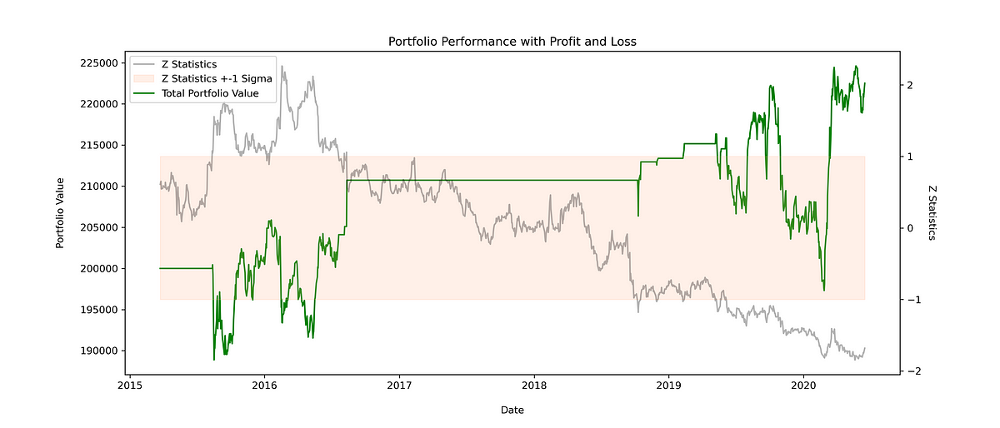

## Table of Contents

## What is statistical arbitrage?

Statistical arbitrage, often called Stat Arb, is a type of trading strategy that uses math and statistics to find and take advantage of price differences in the market. Traders use computers and lots of data to spot patterns and make trades that can make money. The idea is to buy something that is priced too low and sell something that is priced too high, hoping that the prices will soon balance out, letting the trader make a profit.

This strategy is popular among hedge funds and big investors because it can work well in different market conditions. It relies a lot on technology and quick data analysis to find small opportunities that might not last long. While it can be profitable, it also comes with risks, like sudden market changes or errors in the data or models used. So, it's important for traders to keep watching and adjusting their strategies.

## How does statistical arbitrage differ from traditional arbitrage?

Traditional arbitrage is when you buy something in one place where it's cheaper and sell it in another place where it's more expensive, making a profit from the price difference. It's like buying a toy for $10 in one store and selling it for $15 in another store. This kind of arbitrage is simple and doesn't need fancy tools or math. You just need to spot where the same thing is being sold at different prices and act quickly.

Statistical [arbitrage](/wiki/arbitrage) is different because it uses math and computers to find more hidden opportunities. Instead of just looking at the price of one thing, it looks at many things and their relationships. For example, it might look at how the prices of two different stocks move together and use that information to make trades. This method needs a lot of data and fast computers to work well. It's more complex and can find smaller opportunities that traditional arbitrage might miss, but it also needs more technology and can be riskier if the math or data is wrong.

## What are the basic principles behind statistical arbitrage strategies?

The basic idea behind [statistical arbitrage](/wiki/statistical-arbitrage) is to find small price differences in the market using math and computers. Traders look at lots of data to see how different things, like stocks or commodities, move together. They use this information to spot when something is priced too low or too high compared to what they expect. Then, they buy the thing that's priced too low and sell the thing that's priced too high, hoping that the prices will soon balance out. This way, they can make a profit from these small differences.

Another important part of statistical arbitrage is that it relies a lot on technology. Traders use fast computers and complex math models to analyze data quickly and find trading opportunities that might only last for a short time. This means they need to be ready to act fast and adjust their strategies if the market changes. While this method can be profitable, it also comes with risks, like if the data or the models used are not accurate, or if the market moves in unexpected ways. So, it's important for traders to keep monitoring and updating their approaches.

## Can you explain the concept of mean reversion in the context of statistical arbitrage?

Mean reversion is a key idea in statistical arbitrage. It means that if something, like a stock price, goes up or down a lot, it will eventually come back to its normal or average level. Traders who use statistical arbitrage look for times when prices have moved away from their average. They believe that these prices will soon return to where they usually are, so they can make money by buying low and selling high.

In practice, traders use computers and math to find these opportunities. They look at lots of data to see how prices have moved in the past and use that information to predict when prices might go back to their average. For example, if two stocks usually move together but one suddenly goes up a lot more than the other, a trader might buy the stock that went up less, expecting it to catch up. This way, they can profit from the prices coming back to their normal relationship.

## What types of financial instruments are commonly used in statistical arbitrage?

Statistical arbitrage often uses stocks as the main financial instruments. Traders look at how different stocks move together and use this information to find opportunities. They might buy stocks that they think are priced too low and sell stocks that they think are priced too high, expecting the prices to come back to their normal levels. This method is popular in the stock market because there are so many stocks to compare and analyze.

Besides stocks, statistical arbitrage can also use other financial instruments like futures, options, and exchange-traded funds (ETFs). Futures are agreements to buy or sell something at a future date, and options give the right to buy or sell at a certain price. ETFs are like baskets of stocks that you can trade like a single stock. Traders use these instruments in similar ways, looking for price differences and patterns to make trades that can profit from small changes in the market.

## How do traders identify pairs or baskets of securities for statistical arbitrage?

Traders identify pairs or baskets of securities for statistical arbitrage by looking at how different securities move together over time. They use a lot of data to see if the prices of two or more securities have a strong relationship. For example, they might look at how the prices of two stocks have moved in the past and see if they tend to go up and down together. If they find a pair of stocks that usually move together but one has recently gone up a lot more than the other, they might think this is a good opportunity. They would buy the stock that went up less, expecting it to catch up soon.

To find these opportunities, traders use computers and math to analyze lots of data quickly. They look for patterns and relationships that might not be easy to see just by looking at the prices. This can involve looking at many different securities at once, not just pairs, to find baskets of securities that have similar price movements. By using these methods, traders can spot small price differences and make trades that they hope will profit from the prices coming back to their normal relationships.

## What role does quantitative analysis play in developing statistical arbitrage models?

Quantitative analysis is really important for making statistical arbitrage models. It's all about using math and numbers to look at lots of data and find patterns. Traders use computers to do this quickly and accurately. They look at how different things, like stocks, move together and use this information to spot when prices might be off. This helps them decide when to buy or sell to make a profit. Without quantitative analysis, it would be hard to find these small opportunities in the market.

The math part of quantitative analysis helps traders make models that predict how prices will move. These models use past data to guess what might happen next. Traders can then use these predictions to make trades that they think will work out well. But it's not just about the math; traders also need to keep checking and updating their models. The market can change, and what worked before might not work now. So, quantitative analysis is a big part of making and improving statistical arbitrage strategies.

## How can one measure the performance of a statistical arbitrage strategy?

To measure the performance of a statistical arbitrage strategy, you look at how much money it makes and how risky it is. One common way to do this is by calculating the strategy's return, which is how much profit it makes over a certain time. You can compare this return to other investments or to the overall market to see if the strategy is doing well. Another important thing to look at is the risk, which you can measure with something called the standard deviation of returns. This tells you how much the strategy's profits can go up and down, which helps you understand how safe or risky it is.

Another way to measure performance is by looking at the Sharpe ratio. This is a number that shows how much return you get for the risk you take. A higher Sharpe ratio means the strategy is doing a good job of making money without taking too much risk. You can also use something called the drawdown, which is the biggest drop in the strategy's value from its highest point. A smaller drawdown means the strategy is more stable and less likely to lose a lot of money at once. By looking at these different measures, you can get a good idea of how well a statistical arbitrage strategy is working.

## What are the common risks associated with statistical arbitrage, and how can they be mitigated?

Statistical arbitrage comes with several risks that traders need to watch out for. One big risk is that the math models used might be wrong. If the models don't predict price movements correctly, traders could lose money. Another risk is that the market can change quickly, and what worked before might not work now. This can happen if there's a big event like a financial crisis or if there's a sudden change in how people trade. Also, there's the risk of not having enough money to keep the strategy going if prices move against the trader's predictions. This is called [liquidity](/wiki/liquidity-risk-premium) risk, and it can be a problem if the trader can't buy or sell quickly enough.

To lower these risks, traders need to keep checking and updating their models. They should use a lot of data and try different models to see which ones work best. It's also important to have a plan for what to do if the market changes suddenly. Traders can use something called stop-loss orders, which automatically sell a security if its price drops too much, to limit their losses. Having enough money to cover possible losses is also key. This means not putting all their money into one trade and being ready to add more money if needed. By being careful and prepared, traders can make statistical arbitrage safer and more likely to succeed.

## How has the advancement in technology and data analytics impacted statistical arbitrage?

The advancement in technology and data analytics has made a big difference in statistical arbitrage. Now, traders can use powerful computers to look at huge amounts of data very quickly. This helps them find small price differences in the market that they might have missed before. With better technology, they can also use more complex math models to predict how prices will move. This means they can make better decisions about when to buy and sell, which can lead to more profits.

Also, new tools and software have made it easier for traders to keep an eye on their strategies and change them if needed. They can test their models with lots of different data to see how well they work. This helps them find and fix any problems before they lose money. Overall, technology and data analytics have made statistical arbitrage more accurate and efficient, but traders still need to be careful and keep learning to stay ahead in the market.

## Can you discuss a case study where statistical arbitrage was successfully implemented?

One famous case of successful statistical arbitrage was done by a [hedge fund](/wiki/hedge-fund-trading-strategies) called Renaissance Technologies. They used a strategy called the Medallion Fund, which started in the 1980s. The fund used lots of math and computers to find small price differences in the market. They looked at how different stocks moved together and used this information to make trades. Over the years, the Medallion Fund made huge profits, often [earning](/wiki/earning-announcement) more than 30% a year after fees. This was much better than most other investments, and it showed how powerful statistical arbitrage could be when done right.

The success of the Medallion Fund came from using advanced technology and a lot of data. Renaissance Technologies hired smart people like mathematicians and scientists to build their models. They used fast computers to analyze data and find trading opportunities that lasted only a short time. The fund also kept changing its strategies to stay ahead of the market. This case study shows that with the right tools and a lot of hard work, statistical arbitrage can be very successful. But it also reminds us that it's not easy and needs a lot of skill and technology to work well.

## What are the future trends and potential developments in statistical arbitrage?

In the future, statistical arbitrage is likely to get even better because of new technology and more data. Computers are getting faster and can handle more information, which means traders can look at even more data to find small price differences. They can use new kinds of math models that are more accurate and can predict how prices will move better. Also, with more people using the internet and trading online, there's a lot more data to use. This can help traders find new ways to make money from the market.

Another trend is that [artificial intelligence](/wiki/ai-artificial-intelligence) (AI) and [machine learning](/wiki/machine-learning) are becoming more important in statistical arbitrage. These technologies can learn from past data and get better over time. They can find patterns that humans might miss and make trades faster. This can make statistical arbitrage more successful and less risky. But it also means that traders need to keep learning and using new tools to stay ahead. Overall, the future of statistical arbitrage looks bright, but it will keep changing and getting more complex.

## References & Further Reading

[1]: Avellaneda, M., & Lee, J.-H. (2010). ["Statistical Arbitrage in the U.S. Equities Market."](https://papers.ssrn.com/sol3/papers.cfm?abstract_id=1153505) Quantitative Finance, 10(7), 761-782.

[2]: Lopez de Prado, M. (2018). ["Advances in Financial Machine Learning."](https://www.amazon.com/Advances-Financial-Machine-Learning-Marcos/dp/1119482089) Wiley.

[3]: Aronson, D. (2006). ["Evidence-Based Technical Analysis: Applying the Scientific Method and Statistical Inference to Trading Signals."](https://www.amazon.com/Evidence-Based-Technical-Analysis-Scientific-Statistical/dp/0470008741) Wiley.

[4]: Jansen, S. (2020). ["Machine Learning for Algorithmic Trading."](https://github.com/stefan-jansen/machine-learning-for-trading) Packt Publishing.

[5]: Chan, E. P. (2008). ["Quantitative Trading: How to Build Your Own Algorithmic Trading Business."](https://github.com/ftvision/quant_trading_echan_book) Wiley.