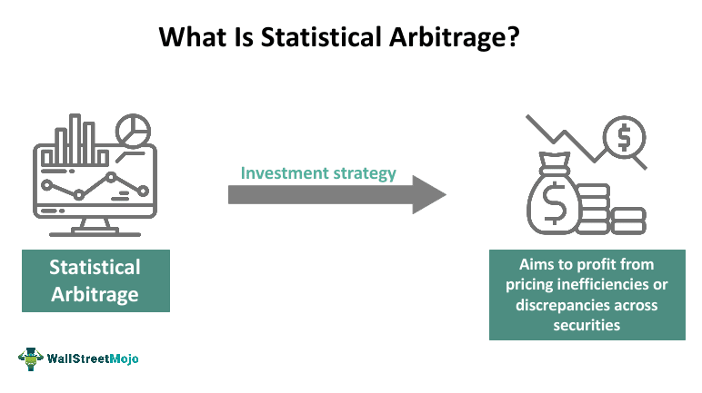

## Table of Contents

## What is statistical arbitrage?

Statistical arbitrage, often called Stat Arb, is a trading strategy that uses math and statistics to find and take advantage of price differences in the market. Traders use computers and complex models to look at a lot of data, like stock prices and trading volumes. They try to find patterns that show when a stock's price might go up or down compared to another stock or the market as a whole. Once they spot these patterns, they buy the stock they think will go up and sell the one they think will go down, hoping to make a profit from the difference in prices.

This strategy relies heavily on the idea that prices will eventually return to their average over time. For example, if two stocks usually move together but suddenly one goes up and the other stays the same, a statistical arbitrage trader might buy the stock that stayed the same, expecting it to catch up. The key to success in statistical arbitrage is having fast and accurate data, as well as good math models. It's a bit like betting, but with a lot of math and technology to help make better guesses about what will happen next in the market.

## How does statistical arbitrage differ from traditional arbitrage?

Statistical arbitrage and traditional arbitrage both aim to make money from price differences, but they do it in different ways. Traditional arbitrage is simpler and looks for clear price differences that exist at the same time in different places or markets. For example, if a stock is cheaper on one exchange than another, a trader can buy it on the cheaper exchange and sell it on the more expensive one, making a profit from the difference. This kind of arbitrage doesn't need a lot of math or predictions; it's about spotting and acting on clear price gaps quickly.

On the other hand, statistical [arbitrage](/wiki/arbitrage) uses math and data to find less obvious opportunities. It's based on the idea that prices will eventually return to their average, so it looks for patterns and relationships between different stocks or markets. Traders use computers and complex models to analyze a lot of data and make predictions about future price movements. They might buy and sell stocks based on these predictions, hoping to profit from the expected changes in prices. This method requires a lot of data, fast computers, and good math skills, making it more complex than traditional arbitrage.

## What are the basic principles behind statistical arbitrage?

Statistical arbitrage works on the idea that over time, prices will go back to what's normal for them. Traders look at a lot of data about stocks, like how much they're traded and how their prices move compared to other stocks. They use math to find patterns that show when a stock might be priced differently than usual. If they see a stock that's usually similar to another one but suddenly isn't, they might buy the cheaper one and sell the more expensive one, expecting the prices to even out soon.

To do this, traders need fast computers and good math models. They use these tools to quickly look at a lot of information and make guesses about what will happen next in the market. It's a bit like betting, but with a lot of math to help make better guesses. The key is to be fast and accurate because the opportunities they're looking for can disappear quickly.

## What types of financial instruments are commonly used in statistical arbitrage?

Statistical arbitrage often uses stocks as the main financial instruments. Traders look at how different stocks move compared to each other. For example, they might see that two companies in the same industry usually have similar stock prices, but if one suddenly becomes cheaper, they might buy it and sell the other, expecting the prices to go back to normal soon. They use a lot of data and math to find these opportunities quickly.

Besides stocks, [statistical arbitrage](/wiki/statistical-arbitrage) can also use other instruments like futures, options, and exchange-traded funds (ETFs). Futures and options are contracts that let traders bet on where prices will go in the future. ETFs are like baskets of stocks that traders can buy and sell easily. By looking at how these instruments move together, traders can spot patterns and make trades to profit from the expected changes in prices.

## What are the key statistical tools and models used in statistical arbitrage?

Statistical arbitrage relies on a variety of statistical tools and models to find trading opportunities. One common tool is correlation analysis, which helps traders see how different stocks move together. If two stocks usually move in the same way but suddenly don't, traders might see a chance to make money. Another important tool is mean reversion, which is the idea that prices will eventually go back to their average. Traders use this to guess when a stock's price might go up or down compared to others.

Regression models are also widely used in statistical arbitrage. These models help traders predict future price movements based on past data. For example, a trader might use a regression model to see how stock prices react to changes in trading [volume](/wiki/volume-trading-strategy) or other market factors. Machine learning is another powerful tool that's becoming more popular. It can look at huge amounts of data and find patterns that might be too hard for humans to spot. By using these tools and models, traders can make better guesses about where prices are headed and find opportunities to make a profit.

## How do you identify pairs or portfolios for statistical arbitrage?

To find pairs or portfolios for statistical arbitrage, traders look at how different stocks or financial instruments move together over time. They use a lot of data to see which stocks usually go up and down together. If two stocks from the same industry, like two car companies, tend to have similar price movements, they might be a good pair for statistical arbitrage. Traders use math tools like correlation analysis to figure this out. They want to find stocks that are closely related so they can predict when one might be priced differently than usual compared to the other.

Once traders find a pair or a group of stocks that move together, they watch for times when the prices don't match up like they usually do. For example, if one stock in the pair suddenly becomes cheaper than the other, the trader might buy the cheaper one and sell the more expensive one. They do this because they believe the prices will go back to normal soon, and they can make a profit from the difference. To make these decisions, traders use models like mean reversion and regression to predict when the prices might change. This way, they can spot opportunities quickly and take action before the prices even out again.

## What are the common strategies employed in statistical arbitrage?

One common strategy in statistical arbitrage is called pairs trading. This is where traders find two stocks that usually move together, like two car companies. If one stock suddenly becomes cheaper than the other, the trader might buy the cheaper one and sell the more expensive one. They do this because they think the prices will go back to normal soon, and they can make money from the difference. This strategy relies on the idea of mean reversion, which means prices will eventually go back to their average.

Another strategy is called multi-[factor](/wiki/factor-investing) models. Here, traders look at many different factors that might affect stock prices, like how much a stock is traded or how the overall market is doing. They use math models to predict how these factors will change stock prices in the future. By looking at a lot of data and using computers to do the math quickly, traders can spot patterns and make trades to profit from expected price changes. This strategy needs a lot of data and fast computers to work well.

A third strategy involves using machine learning. Traders feed a lot of data into computer programs that can learn from it and find patterns that are hard for people to see. These programs can then predict how stock prices might move based on what they've learned. By using machine learning, traders can make more accurate guesses about the market and find new opportunities for statistical arbitrage. This strategy is becoming more popular as computers get better at handling big amounts of data.

## How do you manage risk in statistical arbitrage?

Managing risk in statistical arbitrage is important because the market can be unpredictable. Traders use something called stop-loss orders to help with this. A stop-loss order is like a safety net; it tells the computer to sell a stock if its price drops too much. This way, traders can limit how much money they might lose on a bad trade. They also spread their money around by not putting it all in one stock or one trade. This is called diversification, and it helps because if one trade goes wrong, the others might still be okay.

Another way to manage risk is by keeping an eye on how much the market moves around, which is called volatility. If the market starts to move a lot more than usual, traders might decide to trade less or not at all until things calm down. They also use math models to figure out how much risk they're taking on with each trade. By understanding the risks better, they can make smarter choices about when to trade and how much money to put into each trade. This helps them stay safe while still trying to make money from the small price differences they're looking for.

## What are the challenges and limitations of implementing statistical arbitrage?

Implementing statistical arbitrage can be tough because it relies a lot on having fast and accurate data. If the data is slow or wrong, traders might miss good opportunities or make bad trades. It also needs powerful computers and smart math models to look at a lot of information quickly. If these tools aren't good enough, the strategy might not work well. Another challenge is that the market can be unpredictable, and sometimes the patterns that traders are looking for don't happen. This can lead to losses if they're not careful.

There are also limits to how much statistical arbitrage can help. It works best in markets that are stable and have a lot of trading going on. If the market is too wild or there aren't enough trades, it's harder to find the small price differences that traders need. Also, because a lot of people use this strategy now, it can be harder to find good opportunities. Everyone is looking for the same patterns, so the chances to make money can disappear quickly. Traders need to keep coming up with new ideas and better models to stay ahead.

## How has technology and high-frequency trading impacted statistical arbitrage?

Technology and high-frequency trading have changed statistical arbitrage a lot. With fast computers and better math models, traders can look at a ton of data very quickly. This means they can find small price differences and trade on them before anyone else does. High-frequency trading, where computers make trades in just a few seconds, has made this even faster. Traders can now take advantage of tiny price changes that last for just a moment, making more trades and possibly more money.

But there are challenges too. Because everyone is using these fast computers and smart models, the good opportunities for statistical arbitrage can disappear really fast. It's like a race where everyone is trying to be the first to spot and act on the same patterns. Also, the market can be unpredictable, and sometimes the patterns that traders are looking for don't happen. This means traders need to keep coming up with new ideas and better models to stay ahead in the game.

## What advanced techniques can enhance the performance of statistical arbitrage strategies?

One advanced technique to make statistical arbitrage strategies better is using machine learning. Machine learning is when computers learn from a lot of data to find patterns that are hard for people to see. Traders can use these computers to predict how stock prices might move in the future based on what they've learned. This can help them spot new opportunities for making money that they might have missed before. By using machine learning, traders can make more accurate guesses about the market and find better ways to trade.

Another technique is using more complex math models, like multi-factor models. These models look at many different things that can affect stock prices, like how much a stock is traded or how the overall market is doing. By understanding all these factors, traders can make better predictions about where prices are headed. They can use this information to find small price differences and trade on them quickly. These advanced models need a lot of data and fast computers, but they can help traders make smarter choices and possibly make more money.

## How can one evaluate the performance and success of statistical arbitrage strategies?

To see if a statistical arbitrage strategy is working well, traders look at things like how much money they're making and how much risk they're taking. They use something called the Sharpe ratio to figure this out. The Sharpe ratio compares the money made to the risk taken. A higher Sharpe ratio means the strategy is doing a good job of making money without taking too much risk. Traders also look at how often they're making money, which is called the win rate. If they're making money on most of their trades, that's a good sign that the strategy is working.

Another way to check the success of a statistical arbitrage strategy is by looking at how well it does over time. Traders want to see if the strategy keeps making money, even when the market changes. They might use something called backtesting, where they use old data to see how the strategy would have done in the past. If the strategy made money in the past, it might be a good sign that it will work well in the future. But traders also need to keep an eye on how the market is doing now, because what worked before might not work as well if things change.

## Question: Does Statistical Arbitrage Still Work?

The viability of statistical arbitrage has been questioned as past strategies become less effective over time. This phenomenon, often referred to as the "alpha decay," results from a combination of factors such as increased market efficiency, advancements in trading technology, and the widespread adoption of similar strategies, which collectively reduce profit margins. Despite this, new strategies continually emerge, taking advantage of both traditional and [alternative data](/wiki/best-alternative-data) sources, as well as evolving market conditions.

Modern statistical arbitrage extends beyond conventional securities to encompass cryptocurrencies, commodities, and emerging markets, where inefficiencies can be more pronounced due to less [liquidity](/wiki/liquidity-risk-premium) and maturity. For example, [algorithmic trading](/wiki/algorithmic-trading) strategies that incorporate sentiment analysis from social media or news articles can uncover non-traditional arbitrage opportunities, demonstrating the strategy's adaptability.

The core of statistical arbitrage remains grounded in exploiting fundamental economic relationships such as mean reversion and co-integration amongst related assets. These relationships are often expressed through models like the Ornstein-Uhlenbeck process, used for modeling mean-reverting time series, or the Johansen test for cointegration, which assesses the likelihood of a stable, long-term equilibrium relationship between multiple time series.

$$
dX_t = \theta (\mu - X_t) dt + \sigma dW_t
$$

In this equation, $dX_t$ represents the change in the time series value, $\theta$ is the rate of mean reversion, $\mu$ is the long-term mean, $\sigma$ is the [volatility](/wiki/volatility-trading-strategies), and $dW_t$ is a Wiener process representing random shocks.

Continuous innovation in statistical models and [machine learning](/wiki/machine-learning) considerably aids in reviving statistical arbitrage's effectiveness. Developments in machine learning facilitate the extraction of complex relationships in large datasets that were previously unattainable through traditional statistical methods. Techniques such as supervised learning, [reinforcement learning](/wiki/reinforcement-learning), and neural networks enhance the predictive capability of arbitrage models.

For instance, Python's powerful libraries like TensorFlow and scikit-learn offer tools to build complex machine learning models. A simple linear regression model for predicting potential arbitrage opportunities might look like this:

```python
import numpy as np
from sklearn.linear_model import LinearRegression

# Example data
X = np.array([[1, 2], [2, 4], [3, 6], [4, 8]])
y = np.array([5, 7, 9, 11])

# Create and fit the model
model = LinearRegression()
model.fit(X, y)

# Predict potential outcomes
predictions = model.predict(np.array([[5, 10]]))
print(predictions)
```

This example illustrates the application of machine learning for statistical arbitrage, showcasing how evolving techniques contribute to uncovering and exploiting market inefficiencies. Through systematic refinement and adaptation, statistical arbitrage remains a dynamic and viable strategy within modern finance, employing advanced analytical tools to navigate an ever-changing landscape.

## What are Statistical Arbitrage Analysis Techniques?

Analysts rely on an array of statistical and mathematical models to identify market inefficiencies within statistical arbitrage. These models help predict price movements, uncover relationships between assets, and guide trading decisions by employing quantitative analysis. 

Time Series Analysis is a pivotal technique involving the study of data points indexed in time order. It focuses on trends, seasonal patterns, and cyclical behavior inherent in asset prices. By employing models such as ARIMA (AutoRegressive Integrated Moving Average), analysts can forecast future prices based on historical data. The ARIMA model is represented as ARIMA(p, d, q), where 'p' is the order of the autoregressive part, 'd' is the degree of differencing, and 'q' is the order of the moving average part. 

Principal Component Analysis (PCA) is used to reduce the dimensionality of large datasets while preserving as much variance as possible. This technique simplifies complex datasets by transforming them into principal components, which are orthogonal and uncorrelated. PCA assists in identifying the underlying structure of data, making it useful for risk management and factor analysis in statistical arbitrage.

Autoregression models focus on the relationship between a variable and its lagged values, offering insights into its serial correlation. These models are important in predicting future values of a time series by examining its past behavior. The Autoregressive model of order p, denoted as AR(p), is expressed as:

$$
X_t = c + \phi_1 X_{t-1} + \phi_2 X_{t-2} + \cdots + \phi_p X_{t-p} + \epsilon_t
$$

where $X_t$ is the value of the variable at time t, $c$ is a constant, $\phi$ represents the model parameters, and $\epsilon_t$ is white noise.

Volatility Modeling is crucial for assessing risk and potential return. Techniques such as GARCH (Generalized Autoregressive Conditional Heteroskedasticity) are employed to understand and predict the volatility clustering characteristic of financial markets. The GARCH model helps in estimating dynamic variance, which is essential for pricing derivatives and risk management.

These methodologies are complemented by computational tools like Python, R, and Matlab. Python, with libraries like NumPy, pandas, and statsmodels, provides robust frameworks for data manipulation, model creation, and [backtesting](/wiki/backtesting). For instance, implementing an ARIMA model in Python can be done using the following code snippet:

```python
import pandas as pd
from statsmodels.tsa.arima.model import ARIMA

# Load dataset
data = pd.read_csv('financial_data.csv')
series = data['price']

# Fit the ARIMA model
model = ARIMA(series, order=(5, 1, 0))
model_fit = model.fit()

# Make predictions
forecast = model_fit.forecast(steps=10)
print(forecast)
```

Understanding the underlying statistical concepts of these techniques is crucial for effective application and risk management. They enable analysts to build reliable models that can adapt to rapidly changing market conditions, ensuring that statistical arbitrage remains a viable investment strategy.

## References & Further Reading

[1]: Avellaneda, M., & Lee, J. H. (2010). ["Statistical Arbitrage in the U.S. Equities Market."](https://papers.ssrn.com/sol3/papers.cfm?abstract_id=1153505) SSRN Electronic Journal.

[2]: Vidyamurthy, G. (2004). ["Pairs Trading: Quantitative Methods and Analysis."](https://archive.org/details/pairstradingquan0000vidy) John Wiley & Sons.

[3]: Focardi, S. M., & Fabozzi, F. J. (2004). ["The Mathematics of Financial Modeling and Investment Management."](https://archive.org/details/mathematicsoffin0000foca) Wiley.

[4]: Cutler, D. M., Poterba, J. M., & Summers, L. H. (1989). ["What Moves Stock Prices?"](https://www.nber.org/papers/w2538) Journal of Portfolio Management.

[5]: Geman, H., & Yor, M. (1996). ["Pricing and Hedging Double-Barrier Options: A Probabilistic Approach."](https://actuaries.org/AFIR/Colloquia/Nuernberg/Geman_Yor.pdf) Review of Financial Studies.