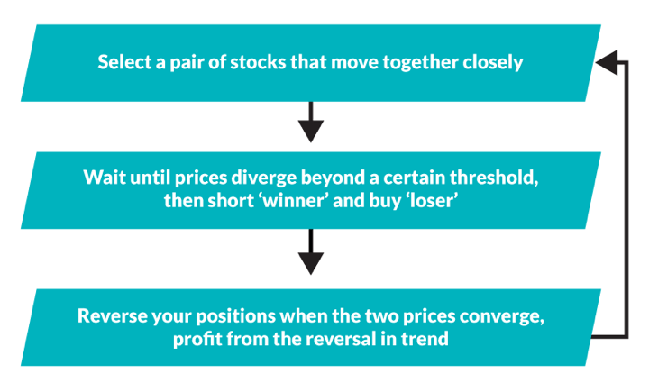

Statistical arbitrage trading is an algorithmic strategy utilized to identify and exploit pricing inefficiencies across markets. Functioning at the intersection of finance and technology, this form of trading is primarily driven by quantitative models that analyze the relationships between prices of correlated securities. By recognizing and capitalizing on temporary discrepancies in these relationships, traders can seize opportunities for profit with relatively low risk.

The core of statistical arbitrage lies in the principle of mean reversion, where prices of related assets are expected to revert to a long-term average over time. Traders engage in buying undervalued assets and simultaneously selling overvalued ones, anticipating that prices will eventually converge. This predictive approach relies heavily on robust statistical and mathematical models, which are designed to process vast amounts of data efficiently.



A critical feature of statistical arbitrage is its adaptability to various market conditions. With an array of strategies available, traders can select those best suited to their risk tolerance and market outlook. These strategies encompass pure arbitrage, triangular arbitrage, pair trading, and more specialized forms such as risk and convertible arbitrage. Each offers unique advantages and potential drawbacks, influenced by factors like market volatility and trading costs.

In the fast-paced world of trading, technology and automation play pivotal roles in executing statistical arbitrage strategies effectively. Advanced algorithms and high-frequency trading systems enable practitioners to act on fleeting opportunities that manual trading cannot capture. As such, the development of cutting-edge technology and real-time data processing remains integral to maintaining a competitive edge in this arena.

As we explore further in this article, statistical arbitrage is not only a key component of modern algorithmic trading but also an evolving discipline shaped by continuous technological advancements and market innovations. Its applications extend beyond traditional financial markets, encompassing emerging domains like cryptocurrencies, posing both challenges and opportunities for traders globally. The omnipresence of automated systems and AI in trading underscores the dynamic nature of statistical arbitrage and its ongoing evolution.

## Table of Contents

## Understanding Statistical Arbitrage

Statistical [arbitrage](/wiki/arbitrage) is a trading strategy that capitalizes on price discrepancies between related assets. By leveraging quantitative models, this approach seeks to exploit inefficiencies in the pricing of correlated securities. These inconsistencies may arise due to temporary market dynamics or imbalances, which statistical arbitrageurs aim to capture for profit.

The methodology often involves simultaneously buying undervalued assets and selling overvalued ones, anticipating that the prices will eventually converge. This convergence generates a profit when the discrepancy between the purchase and sale price narrows. To effectively identify and act on these opportunities, [statistical arbitrage](/wiki/statistical-arbitrage) strategies depend on sophisticated algorithms and large datasets.

Quantitative models, pivotal to statistical arbitrage, analyze historical price data and correlations between securities to predict future price movements. Methods such as mean reversion—where prices are expected to return to a mean level—or co-integration models, which assess the relationship between two or more time series, are commonly employed. These models are often fueled by vast amounts of data, necessitating robust computational power for analysis.

For instance, if the price of stock A historically moves in tandem with stock B, a divergence in their prices might indicate an arbitrage opportunity. The algorithm can calculate the Z-score, which measures the number of standard deviations a data point is from the mean, to determine the strength of the divergence. A Z-score exceeding a certain threshold could trigger a trading signal.

Moreover, statistical arbitrageurs frequently employ [machine learning](/wiki/machine-learning) techniques to enhance their models. This includes using regression analysis, neural networks, or support vector machines to improve prediction accuracy. Python, with its rich ecosystem of libraries such as NumPy, pandas, and scikit-learn, is a popular programming language for implementing these strategies.

Understanding the intricate behavior of asset prices and the statistical relationship between them is crucial for the success of statistical arbitrage. It requires not only quantitative acumen but also technological infrastructure to swiftly execute trades in response to identified opportunities.

## Role in Algorithmic Trading

Statistical arbitrage plays a critical role in [algorithmic trading](/wiki/algorithmic-trading) by capitalizing on rapid technological advancements to conduct trades at high speeds. This approach leverages sophisticated algorithms that analyze market data efficiently, enabling traders to capture transient price discrepancies that may arise from market inefficiencies. The ability of these algorithms to process vast amounts of data in real-time and make swift trading decisions is vital for successful statistical arbitrage.

Trading platforms and brokers with low latency and fast execution speeds are paramount for executing arbitrage strategies effectively. Low latency ensures that trades are executed as close to real-time as possible, reducing the risk of price changes from the moment the algorithm identifies an opportunity to when the trade is executed. This precision in execution is a key determinant in the profitability of arbitrage strategies, as even minor delays can negate potential gains.

Machine learning and [artificial intelligence](/wiki/ai-artificial-intelligence) increasingly shape the development of arbitrage models. These technologies enhance the predictive accuracy of models by extracting patterns from historical data to forecast price movements. For instance, machine learning techniques can be used to refine the selection of asset pairs, improve the timing of entry and [exit](/wiki/exit-strategy) points, and dynamically adjust to changing market conditions. As a result, the incorporation of AI into statistical arbitrage models leads to more robust trading strategies that can adapt to evolving markets.

Overall, the integration of statistical arbitrage within algorithmic trading harnesses cutting-edge technology to seize fleeting opportunities, contributing to the efficiency and effectiveness of modern financial markets.

## Types of Arbitrage Strategies

Statistical arbitrage involves various strategies that exploit opportunities stemming from pricing inefficiencies within the financial markets. These strategies differ in complexity and application, catering to different trading environments and financial instruments.

**Pure Arbitrage** is the most straightforward of all arbitrage strategies. It involves simultaneously buying and selling the exact same asset in different markets to profit from a price discrepancy. For example, if a stock is trading at $100 on one exchange and $101 on another, an arbitrageur might purchase the stock at the lower price and sell it at the higher price. Ideally, this process incurs minimal risk, assuming price discrepancies are greater than transaction costs.

**Triangular Arbitrage** is primarily used in foreign exchange markets. It leverages three different currency pairs to exploit exchange rate inefficiencies. For instance, suppose we have three currencies: USD, EUR, and GBP. If the exchange rates are such that indirectly converting USD to GBP through EUR results in a different value than direct USD to GBP conversion, there exists a triangular arbitrage opportunity. Mathematically, if $\text{USD/EUR} \times \text{EUR/GBP} \neq \text{USD/GBP}$, a trader can execute transactions across these pairs to lock in a profit.

**Pair Trading** is a statistical arbitrage strategy that involves identifying two correlated assets and monitoring their price movements to detect any divergence. A trader will buy the undervalued asset and sell the overvalued one, anticipating that prices will converge. This strategy relies on statistical measures such as the Pearson correlation coefficient and concepts like cointegration to identify suitable pairs.

In addition to these, other strategies play a significant role in statistical arbitrage, such as:

- **Risk Arbitrage** (or Merger Arbitrage) involves taking positions in the stocks of two merging companies. The trader usually buys the stock of the company being acquired and sells the stock of the acquirer, betting on the successful completion of the merger.

- **Futures Arbitrage** leverages price differences between a commodity’s futures contract and its spot price. Traders purchase the undervalued contract and sell the overvalued one to profit from their convergence over time.

- **Convertible Arbitrage** targets convertible securities—bonds or preferred shares that a holder can convert into a predetermined number of shares. The strategy involves purchasing the convertible security and shorting a proportionate number of shares of the underlying stock, taking advantage of the mispricing between the two.

These arbitrage strategies, with their roots in statistical analysis and market theory, are used by traders to harness low-risk profits while contributing to market efficiency by correcting price discrepancies. However, successful execution depends heavily on advanced technology and precise, real-time data analysis.

## Advantages and Risks

Arbitrage strategies in trading are particularly appealing due to their market-neutral characteristics. A market-neutral strategy involves holding both long and short positions in related securities, aiming for the profits derived from price discrepancies rather than overall market direction. This approach often results in a lower risk profile, making it an attractive choice for traders seeking stability in volatile markets.

Arbitrage plays a critical role in enhancing market efficiency. By exploiting price discrepancies, traders facilitate the alignment of prices across markets. This corrective action ensures that asset prices reflect their intrinsic values, thereby contributing to a more accurately priced market. For example, if Stock A is underpriced in one market compared to another, arbitrageurs can buy in the cheaper market and sell in the more expensive one, narrowing the price gap over time.

Despite its advantages, arbitrage trading is not without its risks. One significant challenge is the quick correction of markets. Financial markets are increasingly efficient, often rectifying price discrepancies within seconds. This rapid adjustment can render arbitrage opportunities fleeting, necessitating swift execution, which is not always feasible.

Trading fees are another consideration that can impact the profitability of arbitrage strategies. Even slight discrepancies in asset pricing can be overshadowed by transaction costs, particularly for retail traders who may not have access to lower institutional rates. Therefore, precise calculation of potential earnings, accounting for all fees and transaction costs, is crucial to ensure profitability.

Technical failures and latency issues also pose significant risks. In high-frequency trading, where decisions and executions must occur in milliseconds, any delay can result in missed opportunities or even financial losses. Systemic issues, such as network downtime or software glitches, can further exacerbate these risks, potentially leading to substantial setbacks for traders who are heavily reliant on technology.

In summary, while arbitrage strategies offer lower risk through market neutrality and contribute to market efficiency, they require meticulous consideration of execution speed, trading costs, and technological reliability. Managing these elements effectively is key to successful arbitrage trading.

## Technological Impact

Advanced modeling and automation are fundamental to the success of statistical arbitrage, particularly given the necessity to identify and exploit market inefficiencies rapidly. This is where high-frequency trading ([HFT](/wiki/high-frequency-trading-strategies)) plays a significant role. HFT involves executing a large number of trades at extremely fast speeds, often within milliseconds, to capitalize on price discrepancies that may exist only momentarily. The success of statistical arbitrage in this context heavily relies on the firm's technological infrastructure, including the efficiency of algorithms and the computational power available.

One of the essential aspects of these technologies is the ability to process and analyze large datasets swiftly. Quantitative models used in statistical arbitrage evaluate correlations and price movements of assets. They require substantial computational resources to handle complex calculations and simulations. For example, implementing a simple linear regression model in Python to predict asset prices might look like this:

```python
import numpy as np
from sklearn.linear_model import LinearRegression

# Example data: historical prices of two correlated assets
X = np.array([[10], [20], [30], [40], [50]])  # Prices of asset 1
y = np.array([15, 25, 35, 45, 55])            # Prices of asset 2

# Create and train the model
model = LinearRegression()
model.fit(X, y)

# Predict the price of asset 2 given a new price of asset 1
predicted_price = model.predict(np.array([[60]]))
print(f"Predicted Price of Asset 2: {predicted_price}")
```

The speed of execution and processing power are critical factors in the successful deployment of such models, ensuring that predictions and subsequent trades occur faster than the competitors who might be targeting the same arbitrage opportunities.

Moreover, low latency in the trading infrastructure is crucial. Latency refers to the time delay between data input into a system and the desired outcome. In arbitrage, fractions of a second can make the difference between profit and loss. To minimize latency, firms often place their servers in close proximity to exchange servers (a practice known as co-location), use direct market access (DMA), and optimize network and software processing.

The integration of machine learning and artificial intelligence into statistical arbitrage strategies further highlights the technological impact. These technologies enhance the adaptability of trading models, allowing them to adjust to new market conditions without manual intervention. Machine learning algorithms can improve model accuracy by identifying new patterns and correlations in real-time, enhancing profit potential while reducing risks.

In conclusion, the continuous evolution of technology will likely bring further refinements to statistical arbitrage, allowing traders to capture arbitrage opportunities more efficiently and with greater precision.

## Case Studies and Real-world Applications

Statistical arbitrage plays an essential role in financial markets by exploiting minute price differences across various platforms and asset classes. Here, we explore its applications in [forex](/wiki/forex-system), equity markets, and the burgeoning [cryptocurrency](/wiki/cryptocurrency) sector.

### Examples in Forex and Equity Markets

**Direct Arbitrage in Forex**

Direct arbitrage in the foreign exchange (forex) market involves a straightforward approach: buying a currency pair at a lower price on one exchange and selling it at a higher price on another. For instance, consider a EUR/USD pair priced at 1.1800 on Exchange A and 1.1805 on Exchange B. A trader could purchase euros from Exchange A and sell them on Exchange B for an immediate profit of 0.0005 per euro. Although the profit margin is slim, the high [volume](/wiki/volume-trading-strategy) of forex trading allows these small discrepancies to yield substantial returns when exploited effectively.

**Triangular Arbitrage**

Triangular arbitrage in the forex market exploits discrepancies between three currencies. This involves executing three currency trades simultaneously to benefit from market imperfections in exchange rates. For example, if the exchange rates between USD/EUR, EUR/GBP, and GBP/USD are inconsistent, a trader can exploit this by converting USD to EUR, then EUR to GBP, and finally GBP back to USD, making a profit from the rate discrepancies.

**Statistical Arbitrage in Equity Markets**

In equity markets, statistical arbitrage typically centers around patterns and statistical correlations between related stocks or indices. Institutions often deploy [pair trading](/wiki/pair-trading) strategies, where a historically correlated pair of stocks are selected. When one stock is perceived as undervalued relative to the other, it is bought while the perceived overvalued stock is sold short. Profits are made if prices converge to historical norms. For example, if Coca-Cola and PepsiCo have historically moved in tandem, a deviation could signal a buying opportunity for the underperforming stock and a selling opportunity for the outperforming one, assuming they will revert to their historical price relationship.

### Financial Institutions and Hedge Funds

Large financial institutions and hedge funds are significant players in statistical arbitrage. They often deploy highly sophisticated algorithms to execute trades at a scale that individual investors cannot match. For example, Renaissance Technologies, a renowned [hedge fund](/wiki/hedge-fund-trading-strategies), has successfully employed proprietary algorithms to identify and exploit arbitrage opportunities across various asset classes. Such institutions rely heavily on data analysis and quantitative models, often employing teams of data scientists and quantitative analysts to refine their strategies continuously.

### Impact on Cryptocurrency Markets

The cryptocurrency market, with its decentralized nature and multitude of exchanges, provides fertile ground for arbitrage opportunities. Due to differences in [liquidity](/wiki/liquidity-risk-premium) and trading volume, price discrepancies can occur frequently between exchanges. This is particularly evident in historical cases, such as the price of Bitcoin fluctuating noticeably between exchanges like Binance and Coinbase.

Furthermore, decentralized exchanges (DEXs) have introduced unique arbitrage scenarios. Unlike centralized exchanges that involve entrusted third parties to facilitate trades, DEXs operate on smart contracts where traders can interact directly with cryptocurrency markets. This direct market access can lead to lower transaction fees and reduced latency, both crucial for successful arbitrage. The highly volatile nature of cryptocurrencies, combined with the nuances of blockchain technology, continues to present new challenges and opportunities for statistical arbitrageurs.

In conclusion, as financial markets continue to evolve, the principles of statistical arbitrage remain integral, requiring constant adaptation to technological advances and market shifts. Whether in traditional forex and equity settings or the dynamic realm of cryptocurrencies, arbitrage strategies continue to provide avenues for strategic and profit-driven opportunities.

## Conclusion and Future Prospects

Statistical arbitrage remains a crucial element in modern trading, capitalizing on the constant ebb and flow of market dynamics. Central to its success is the relentless advancement of technology, which will continue to redefine how these strategies are implemented. With enhancements in computing power and algorithmic sophistication, traders can anticipate more precise and rapid execution of trades. Innovations like machine learning and artificial intelligence further propel the efficacy of statistical arbitrage by enabling more accurate predictions and optimized trading decisions.

As algorithmic trading becomes more prevalent, ethical and regulatory considerations are expected to play an increasingly significant role. Regulators worldwide are scrutinizing the implications of automated trading systems, ensuring that market integrity is preserved. The potential for market manipulation or systemic risk prompts the need for robust oversight mechanisms. Traders and institutions must adapt to evolving regulatory environments, ensuring compliance while maximizing the benefits of automated strategies.

Emerging markets present promising opportunities for the application of statistical arbitrage. As these markets mature, they introduce new inefficiencies and price discrepancies that can be exploited. Additionally, the continuous evolution of trading platforms, including the surge in decentralized exchanges, expands the landscape for arbitrage activities. These platforms can offer unique arbitrage possibilities, particularly in the cryptocurrency sector, where [volatility](/wiki/volatility-trading-strategies) and pricing differences are more pronounced.

In conclusion, statistical arbitrage is poised to remain an integral strategy in algorithmic trading. The interplay of technology, regulation, and market development will shape its future, providing both challenges and opportunities for practitioners aiming to harness its potential.

## FAQ

### FAQ

**Is arbitrage trading legal?**

Yes, arbitrage trading is legal in most financial markets globally. It involves taking advantage of price discrepancies in different markets, which is a legitimate trading strategy. However, traders must adhere to the regulations and laws governing the financial markets they operate in. The legality can sometimes depend on the specific method of execution and the jurisdiction.

**Can you lose money with arbitrage?**

While arbitrage is generally considered low-risk due to its market-neutral approach, there is still potential for financial loss. Risks include sudden market corrections that eliminate the arbitrage opportunity before execution, trading fees eroding profits, technical failures, and latency issues that can result in missed or incorrect trades. Additionally, unforeseen events or incorrect model assumptions can also lead to losses.

**Which broker is best for arbitrage trading?**

The best broker for arbitrage trading is one that offers low latency, fast execution speeds, and competitive trading fees. Brokers should provide robust technological infrastructure and access to multiple markets. Traders should evaluate brokers based on the specific arbitrage strategy they plan to employ and consider factors such as customer service, platform reliability, and regulatory compliance.

**What is the best arbitrage platform?**

The best arbitrage platform is characterized by its advanced technological capabilities, including real-time data analysis, high-speed order execution, and comprehensive market access. Popular platforms often integrate algorithmic trading features and offer APIs for custom strategy development. Platforms that support high-frequency trading (HFT) and provide advanced modeling and machine learning tools are particularly advantageous for statistical arbitrage. Users should evaluate platforms based on their specific needs, including support for the assets or markets they are interested in.

## References & Further Reading

[1]: Bergstra, J., Bardenet, R., Bengio, Y., & Kégl, B. (2011). ["Algorithms for Hyper-Parameter Optimization."](https://papers.nips.cc/paper/4443-algorithms-for-hyper-parameter-optimization) Advances in Neural Information Processing Systems 24.

[2]: ["Advances in Financial Machine Learning"](https://www.amazon.com/Advances-Financial-Machine-Learning-Marcos/dp/1119482089) by Marcos Lopez de Prado

[3]: ["Evidence-Based Technical Analysis: Applying the Scientific Method and Statistical Inference to Trading Signals"](https://www.amazon.com/Evidence-Based-Technical-Analysis-Scientific-Statistical/dp/0470008741) by David Aronson

[4]: ["Machine Learning for Algorithmic Trading"](https://github.com/stefan-jansen/machine-learning-for-trading) by Stefan Jansen

[5]: ["Quantitative Trading: How to Build Your Own Algorithmic Trading Business"](https://books.google.com/books/about/Quantitative_Trading.html?id=j70yEAAAQBAJ) by Ernest P. Chan