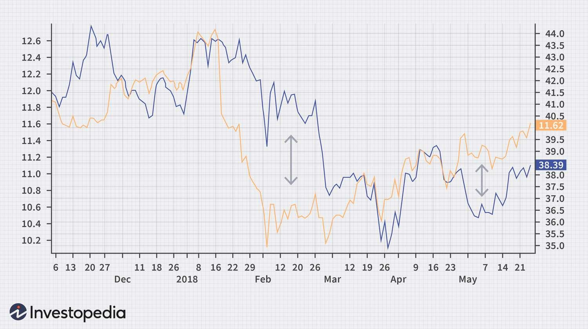

## Table of Contents

## What is statistical arbitrage?

Statistical arbitrage, often called stat arb, is a type of trading strategy that uses math and statistics to find and take advantage of price differences in the market. Traders use computers and special programs to look at lots of data and find patterns. They then buy and sell things like stocks or other financial products based on these patterns, hoping to make a profit from small price changes.

The main idea behind statistical arbitrage is that prices of similar things should move together over time. If they don't, there might be a chance to make money. For example, if two companies in the same industry usually have similar stock prices but suddenly one becomes cheaper, a trader might buy the cheaper one and sell the more expensive one, expecting their prices to come back together. This strategy relies on quick and accurate data analysis, and it's often used by big investment firms with advanced technology.

## How does statistical arbitrage differ from traditional arbitrage?

Statistical arbitrage and traditional arbitrage both aim to make money from price differences, but they do it in different ways. Traditional arbitrage is simpler and more straightforward. It involves buying something in one place where it's cheaper and selling it in another place where it's more expensive at the same time. For example, if a product costs $100 in one store and $110 in another, you could buy it for $100 and sell it for $110, making a quick profit of $10. This type of arbitrage doesn't need a lot of data or complex math; it just needs you to spot the price difference and act quickly.

On the other hand, statistical arbitrage is more complex and uses math and statistics to find opportunities. Instead of looking at simple price differences, it looks at patterns and relationships between different things, like stocks. For example, if two companies usually have similar stock prices but one suddenly becomes cheaper, a statistical arbitrage trader might buy the cheaper one and sell the more expensive one, expecting their prices to come back together. This strategy needs a lot of data analysis and often uses computers to find these patterns quickly. It's riskier because it relies on the assumption that the prices will return to their usual relationship, which might not always happen.

## What are the basic principles behind statistical arbitrage?

Statistical arbitrage is all about using math and numbers to find good times to buy and sell things like stocks. The main idea is that prices of similar things should move together over time. If they don't, there might be a chance to make money. For example, if two companies in the same industry usually have similar stock prices but one suddenly gets cheaper, a trader might buy the cheaper one and sell the more expensive one. They do this hoping that the prices will come back together soon, and they can make a profit from the difference.

To make this work, traders use computers and special programs to look at a lot of data quickly. They look for patterns and relationships between different stocks or other financial products. This strategy needs a lot of data and fast computers because the opportunities to make money can be small and don't last long. It's a bit riskier than traditional arbitrage because it relies on the prices coming back together, which might not always happen. But if done right, it can lead to profits from small price changes.

## What types of financial instruments are commonly used in statistical arbitrage?

In statistical arbitrage, traders often use stocks as their main financial instruments. They look at the prices of different stocks, especially those in the same industry or sector, to find small differences they can take advantage of. For example, if two tech companies usually have similar stock prices but one suddenly becomes cheaper, a trader might buy the cheaper one and sell the more expensive one, expecting their prices to come back together.

Besides stocks, traders also use other financial instruments like exchange-traded funds (ETFs), futures, and options. ETFs are like baskets of stocks that track an index or sector, making them useful for finding patterns across a group of companies. Futures and options are contracts that let traders bet on where prices will go in the future, which can be helpful for making quick moves based on statistical models. All these instruments help traders find and use small price differences to make profits.

## How do you identify pairs or portfolios for statistical arbitrage?

To identify pairs or portfolios for statistical arbitrage, traders look at how closely related different stocks or financial instruments are. They use math to find out if two stocks usually move together in price. For example, if two companies in the same industry tend to have similar stock prices most of the time, those two stocks might be a good pair for statistical arbitrage. Traders use a lot of historical data to see how these stocks have moved in the past and use special formulas to figure out how closely linked they are.

Once a pair or a group of stocks is chosen, traders keep watching their prices to see if they start to move differently. If one stock in the pair suddenly gets cheaper while the other stays the same, that might be a chance to buy the cheaper one and sell the more expensive one. The idea is that the prices will eventually come back to their usual relationship, and the trader can make a profit from the difference. This all relies on having good data and fast computers to spot these opportunities quickly.

## What statistical tools and models are used in statistical arbitrage?

In statistical arbitrage, traders use a bunch of math tools and models to find good times to buy and sell. One common tool is called cointegration, which helps figure out if two stocks move together over time. Traders use this to pick pairs of stocks that usually have similar prices. Another tool is the mean reversion model, which looks at how prices tend to go back to their average over time. If a stock's price moves away from its average, traders might bet on it coming back, hoping to make a profit.

Traders also use something called the z-score to see how far away a stock's price is from its usual pattern. If the z-score is high or low, it might be a good time to trade. Another important model is the Kalman filter, which helps update predictions as new data comes in. This is useful because markets change all the time, and traders need to keep their models up to date. All these tools help traders find small price differences and make quick decisions to make money.

## What is the role of mean reversion in statistical arbitrage strategies?

Mean reversion is a big part of statistical arbitrage strategies. It's the idea that prices of stocks or other financial things will go back to their average over time. Traders use this idea to find good times to buy and sell. For example, if a stock's price goes way up or down from its usual level, a trader might think it will come back to where it was before. They could buy the stock if it's too low or sell it if it's too high, hoping to make money when the price goes back to normal.

To use mean reversion in statistical arbitrage, traders look at a lot of past data to see how prices have moved. They use special math formulas to figure out what the average price should be and how far away the current price is from that average. If the price is far away, it might be a good time to trade. This strategy needs fast computers and good data to work well, because the chances to make money can be small and don't last long.

## How can one measure the risk and performance of a statistical arbitrage strategy?

To measure the risk and performance of a statistical arbitrage strategy, traders look at a few key things. One important measure is the Sharpe ratio, which shows how much return you get for the risk you take. A higher Sharpe ratio means the strategy is doing well compared to the risk involved. Another thing traders look at is the drawdown, which is how much money you could lose at the worst time. A smaller drawdown means the strategy is less risky. Traders also use something called the Sortino ratio, which is like the Sharpe ratio but only looks at bad risk, or the risk of losing money.

Besides these measures, traders also keep an eye on how often the strategy makes money and how big those profits are. They look at the win rate, which is the percentage of trades that make money, and the average profit per trade. If the win rate is high and the profits are good, the strategy is doing well. But if the win rate is low or the profits are small, it might be too risky. Traders use all these measures together to get a full picture of how their statistical arbitrage strategy is working and how much risk they are taking.

## What are the common challenges and pitfalls in implementing statistical arbitrage?

Implementing statistical arbitrage can be tricky because it relies a lot on math and computers. One big challenge is getting good data. You need a lot of accurate and up-to-date information to find the small price differences that can make you money. If your data is wrong or slow, you might miss good chances or make bad trades. Another problem is that markets change all the time. What worked yesterday might not work today, so you have to keep updating your models and strategies. This can be hard and time-consuming.

Another pitfall is that statistical arbitrage often involves making a lot of small trades. This means you need to pay for each trade, and those costs can add up. If the price differences you're trying to take advantage of are too small, you might not make enough money to cover your costs. Plus, there's always the risk that the prices won't go back to where you expect them to. If you bet on two stocks coming back together but they don't, you could lose money. So, even though statistical arbitrage can be profitable, it's not easy and comes with its own set of challenges.

## How has technology and data science impacted statistical arbitrage?

Technology and data science have made a big difference in statistical arbitrage. With fast computers and lots of data, traders can now look at huge amounts of information quickly. This helps them find small price differences that they can use to make money. Before, traders had to do a lot of this work by hand, which was slow and could miss opportunities. Now, with computers doing the math and finding patterns, statistical arbitrage can be done much faster and more accurately.

Data science has also brought new ways to analyze data and make better predictions. Traders use special math models and tools to understand how prices move and find good times to buy and sell. These models can be updated all the time with new data, so they stay useful even as the market changes. This means traders can make smarter decisions and take advantage of more opportunities. Overall, technology and data science have made statistical arbitrage more effective and easier to do.

## Can you explain a case study where statistical arbitrage was successfully applied?

A good example of successful statistical arbitrage happened with a big investment firm called Renaissance Technologies. They used a strategy called the Medallion Fund, which is famous for making a lot of money using math and computers. The fund's traders looked at tons of data to find small differences in stock prices. They used special formulas and models to figure out which stocks to buy and sell. Because they had fast computers and good data, they could make trades quickly and take advantage of these small price changes. Over the years, the Medallion Fund made huge profits, showing how well statistical arbitrage can work when done right.

Another case study involves a company called Two Sigma, which also uses statistical arbitrage to make money. They look at lots of different data, not just stock prices, to find patterns and make trades. For example, they might look at weather data, social media posts, or even satellite images to see how these things affect stock prices. By using all this information, Two Sigma can find good times to buy and sell stocks. Their success shows that using a wide range of data and smart math can help make statistical arbitrage even more effective.

## What are the future trends and developments expected in statistical arbitrage?

In the future, statistical arbitrage is likely to get even better because of new technology and more data. Computers are getting faster and can handle more information, which means traders can look at even more data to find small price differences. They might use things like artificial intelligence and machine learning to make their models smarter. These tools can learn from past data and get better over time, helping traders make better predictions and find more opportunities to make money. Also, as more data becomes available from places like social media or satellite images, traders can use this information to understand how different things affect stock prices.

Another trend is that statistical arbitrage might become more popular with smaller traders, not just big firms. With better tools and easier access to data, more people might start using these strategies. This could make the market more competitive, but it also means more people can try to make money from small price changes. However, as more people use statistical arbitrage, the opportunities might get smaller and harder to find. Traders will need to keep updating their strategies and using the latest technology to stay ahead.

## References & Further Reading

[1]: Engle, R. F., & Granger, C. W. (1987). [Co-integration and error correction: representation, estimation, and testing](https://www.jstor.org/stable/1913236?typeAccessWorkflow=login). *Econometrica: Journal of the Econometric Society*, 251-276.

[2]: Bollinger, J. (2001). [*Bollinger on Bollinger Bands*](https://www.amazon.com/Bollinger-Bands-John/dp/0071373683). McGraw Hill Professional.

[3]: Uhlenbeck, G. E., & Ornstein, L. S. (1930). [On the Theory of the Brownian Motion](https://doi.org/10.1103/PhysRev.36.823). Physical Review, 36(5), 823–841.