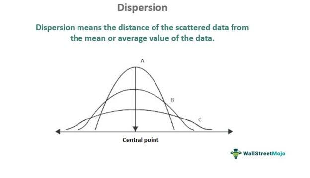

Algorithmic trading, commonly known as algo trading, is a method of executing trades using pre-programmed algorithms that account for various market variables. This sophisticated trading approach relies heavily on statistical measures to inform trading decisions and manage investment risks. Critical to this process are the concepts of data variability and statistical dispersion, which provide insight into the stability and predictability of financial markets.

Data variability refers to how much data points in a given dataset diverge from the average or mean value. It allows traders to assess the consistency of an asset's performance over time. In the context of financial markets, understanding variability is essential for identifying trends and anticipating future price movements.



Statistical dispersion, on the other hand, includes measures that quantify the spread of data points. Some of the key statistical metrics used in this realm include range, variance, and standard deviation. These tools are used to evaluate the volatility and risk associated with different financial instruments. For instance, standard deviation measures how much an asset's returns deviate from its average return, offering a numerical representation of market volatility.

In this article, we will explore important statistical concepts such as alpha, beta, volatility, and standard deviation to elucidate their crucial roles in managing investment risks. Alpha represents the performance of an investment relative to a market index, signifying active return, while beta measures an asset's volatility compared to the broader market, aiding in understanding relative risk. Volatility itself is a measure of the fluctuation in asset prices over time, often perceived as an indicator of risk. By thoroughly understanding these elements, traders can better optimize their strategies to enhance profitability.

By focusing on the analysis of data variability and statistical dispersion, traders and financial analysts can fine-tune their trading algorithms to respond effectively to market signals. This allows for improved decision-making processes and risk assessment, ultimately leading to optimized trading performance and potentially higher returns.

## Table of Contents

## Understanding Data Variability and Statistical Dispersion

Data variability refers to the degree to which individual data points in a dataset differ from a central value, commonly the mean. This concept is pivotal in understanding the dynamics of financial markets, where prices fluctuate due to numerous influencing factors. Statistical dispersion quantifies this variability and encompasses several key metrics, including range, variance, and standard deviation.

The **range** is the simplest measure of [dispersion](/wiki/dispersion-trading) and is calculated as the difference between the maximum and minimum values in a dataset. Although it provides a quick sense of variability, it is sensitive to extreme values in the dataset.

**Variance** provides a more detailed measure, calculated as the average of the squared differences from the mean. Its formula is:
$$
\sigma^2 = \frac{1}{N}\sum_{i=1}^{N}(x_i - \mu)^2
$$
where $\sigma^2$ is the variance, $N$ is the number of observations, $x_i$ are the individual data points, and $\mu$ is the mean of the data.

The **standard deviation** is the square root of the variance and presents the average amount of variability in the dataset in the same units as the data itself:
$$
\sigma = \sqrt{\sigma^2}
$$
This measure is widely used in finance to assess market [volatility](/wiki/volatility-trading-strategies). It indicates how much asset prices deviate from their average value, thus serving as a critical risk indicator.

In financial contexts, these measures are vital for assessing the volatility and associated risk of financial instruments. High variability indicates a greater risk, which might suggest potential higher returns, but also signifies a larger possible loss. Investors use these metrics to gauge the stability of an asset and to decide on investment timing and asset allocation.

Understanding the spread and variability of data is essential for predicting market movements and managing investment portfolios. By analyzing these metrics, traders can develop strategies to optimize portfolio performance and minimize risk exposure. These statistical measures are utilized to assess the historical risk profile of assets, enabling traders to make informed predictions about future price movements. This knowledge caters to better portfolio diversification, balanced risk management, and strategic decision-making, crucial for optimizing investments.

## Key Concepts and Measures

Volatility is a key measure in financial markets, representing the degree to which the price of an asset fluctuates over time. This metric is crucial for investors and traders, as it often serves as an indicator of risk. High volatility suggests a greater potential for price changes, which can lead to significant gains or losses. The calculation of volatility typically involves statistical methods to quantify the extent of price deviations from an average. 

Standard deviation is a fundamental concept in [statistics](/wiki/bayesian-statistics) that measures the amount of variation or dispersion in a set of values. In the context of financial markets, it is commonly used to gauge market volatility. The standard deviation is calculated as the square root of variance and provides insights into how much the returns of an asset deviate from its expected value. The formula for standard deviation ($\sigma$) is:

$$
\sigma = \sqrt{\frac{1}{N} \sum_{i=1}^{N} (x_i - \bar{x})^2}
$$

where $N$ is the number of observations, $x_i$ are individual data points, and $\bar{x}$ is the mean of the data set.

Beta is a measure that compares the volatility of an asset to that of the broader market, represented by a benchmark index such as the S&P 500. It is used to understand the relative risk associated with an investment. A beta greater than one indicates that the asset is more volatile than the market, whereas a beta less than one signifies less volatility. The beta coefficient is calculated using regression analysis and can be expressed as:

$$
\beta = \frac{\text{Cov}(R_a, R_m)}{\text{Var}(R_m)}
$$

where $\text{Cov}(R_a, R_m)$ is the covariance between the asset's returns and the market's returns, and $\text{Var}(R_m)$ is the variance of the market's returns.

Alpha represents the performance of an investment relative to a benchmark index, indicating the active return generated by a portfolio manager. It is a measure of an investment's ability to outperform the market index, with a positive alpha suggesting better-than-expected returns and a negative alpha indicating underperformance. Alpha can be derived as the difference between the actual return of the investment and its expected return, based on its beta:

$$
\alpha = R_a - [R_f + \beta (R_m - R_f)]
$$

where $R_a$ is the actual return of the asset, $R_f$ is the risk-free rate, and $R_m$ is the return of the market.

These key concepts and measures—volatility, standard deviation, beta, and alpha—are integral to the analysis and management of investment portfolios, providing insights that enhance decision-making and risk assessment in [algorithmic trading](/wiki/algorithmic-trading).

## Algorithmic Trading and Statistical Measures

Algorithmic trading integrates statistical measures to automate and optimize financial decision-making. At the core, these measures help in determining entry and [exit](/wiki/exit-strategy) points, managing risk, and enhancing the strategic approach of trading models. Among the critical statistical metrics used are volatility and beta, which serve as indicators of risk and market performance.

**Volatility** is a measure of how much the price of an asset fluctuates over time and is fundamental in algorithmic trading. It indicates the risk level associated with an asset and helps in forecasting potential movements in price. A common method to calculate volatility is through the standard deviation of historical price data. Mathematically, this can be defined as:

$$
\sigma = \sqrt{\frac{\sum (X_i - \mu)^2}{N}}
$$

where $\sigma$ is the standard deviation, $X_i$ represents each data point, $\mu$ is the mean of the dataset, and $N$ is the number of data points.

**Beta** measures an asset’s volatility in relation to the overall market, indicating the asset's relative risk compared to the market benchmark. A beta greater than one suggests the asset is more volatile than the market, while a beta lesser than one indicates less volatility. Beta is utilized to gauge how much an asset’s price is expected to change with market shifts and is crucial for assessing systematic risk in algorithmic trading.

Dispersion analysis, another crucial aspect, helps in predicting market movements by assessing the spread of asset returns. This analysis is essential for algorithms to dynamically adjust trading strategies in real-time, aligning with market conditions. By assessing the distribution of past returns, algorithms can infer future price movements and volatility.

Incorporation of statistical dispersion in trading models enhances risk management by providing insights into the potential range of returns an asset might experience. It allows for strategic optimization by balancing risk and reward, ensuring that trading strategies are robust under varying market conditions. Furthermore, tools like moving averages and Bollinger Bands can be applied to monitor and act on volatility trends actively.

By using metrics such as volatility, beta, and statistical dispersion, algorithmic trading models can make data-driven decisions. These measures enable traders to capitalize on market inefficiencies, optimizing their strategies to improve trading performance and manage risks effectively.

## Practical Applications in Trading

Portfolio Diversification: Employing statistical measures in portfolio diversification aims to balance risk and return across various assets. Diversification involves spreading investments across a range of assets to reduce the overall risk. Statistical metrics such as variance and covariance are critical in this process. Variance measures the degree of spread in the returns of a single asset, while covariance assesses the degree to which two assets move in relation to each other. By analyzing these metrics, traders can construct a diversified portfolio where asset movements offset each other, reducing the overall portfolio volatility.

Risk Management: Variability metrics are fundamental in establishing risk limits and implementing protective measures. Standard deviation, a common measure of variability, helps traders understand the expected range of investment returns. By setting thresholds based on these metrics, traders can design stop-loss strategies to minimize losses. This approach also enables asset managers to monitor and adjust portfolios as market conditions change, ensuring they remain within acceptable risk parameters.

Scenario Analysis: Scenario analysis involves evaluating possible outcomes under various market conditions using dispersion metrics. This technique allows traders to model different scenarios and their potential impact on a portfolio, taking into account the distribution of asset returns. For instance, using Monte Carlo simulations, traders can simulate thousands of potential scenarios based on historical data to predict future performance. This analysis is beneficial for stress testing portfolios against extreme events and developing contingency strategies.

Algorithmic Strategies: Developing automated trading systems relies heavily on historical volatility and data variability. Algorithms can process vast amounts of historical price data to identify patterns and trends. By programming these systems to react to changes in volatility and other dispersion metrics, traders can automate buy and sell decisions. For example, an algorithm might be designed to execute trades if the volatility of a security exceeds a specific threshold, indicating a potential price movement. Here's a simple Python example using moving averages:

```python
import numpy as np
import pandas as pd

# Load historical data
data = pd.read_csv('historical_prices.csv')
data['Moving_Average'] = data['Close'].rolling(window=10).mean()

# Trading signal: Buy when price crosses above moving average, sell when below
data['Signal'] = 0
data['Signal'][1:] = np.where(data['Close'][1:] > data['Moving_Average'][1:], 1, -1)

# Calculate returns based on trading signals
data['Returns'] = data['Signal'].shift(1) * data['Close'].pct_change()
```

In summary, employing statistical measures such as variance, standard deviation, and scenario modeling in trading enhances decision-making processes, enabling traders to manage risks effectively and optimize trading strategies. By integrating these concepts into algorithmic systems, traders can achieve more consistent and profitable outcomes.

## Tools and Techniques for Measuring Variability

### Tools and Techniques for Measuring Variability

Measuring variability is essential for understanding financial market dynamics and making informed trading decisions. Several tools and techniques are widely used to aid traders in quantifying market volatility and making strategic decisions.

**Moving Averages** are utilized to smooth out price data, helping traders identify trends by filtering out the "noise" of random price fluctuations. A moving average can be calculated by averaging the prices over a specified period. Traders often use formulas like the simple moving average (SMA) or the exponential moving average (EMA) to analyze trends. The SMA is computed by:

$$
\text{SMA}_n = \frac{\sum_{i=1}^{n} \text{Price}_i}{n}
$$

where $n$ is the number of periods in the average.

**Bollinger Bands** serve as a volatility indicator, depicting the degree of variation around a moving average. Developed by John Bollinger, this tool consists of three lines: the middle band (SMA), and the upper and lower bands which are typically two standard deviations $\sigma$ away from the SMA. Bollinger Bands help traders identify overbought or oversold conditions by showing when prices are at extreme variants compared to the average price range.

$$
\text{Upper Band} = \text{SMA} + k \times \sigma
$$
$$
\text{Lower Band} = \text{SMA} - k \times \sigma
$$

Here, $k$ is typically 2, representing two standard deviations.

**Average True Range (ATR)** quantifies market volatility by examining the average range within a set period. ATR does not indicate price direction but measures the degree of price variability. It's especially useful in setting stop-loss orders and assessing trading risk. The ATR for a period $n$ is calculated as follows:

$$
\text{ATR}_n = \frac{\sum_{i=1}^{n} \text{TR}_i}{n}
$$

where True Range (TR) is the greatest of the following: 
- current high minus current low,
- absolute value of current high minus previous close,
- absolute value of current low minus previous close.

**Monte Carlo Simulations** provide a probabilistic analysis of potential investment outcomes based on historical data variability. By generating multiple simulated price paths based on statistical properties of asset returns, such as mean and standard deviation, traders can evaluate potential scenarios and risks. A typical Monte Carlo simulation model involves:

```python
import numpy as np

# Define parameters
n_simulations = 1000
time_horizon = 252  # One trading year

# Historical mean and standard deviation
historical_mean = 0.001  # daily return
historical_stddev = 0.02  # daily volatility

simulated_paths = np.zeros(n_simulations)

# Run simulations
for sim in range(n_simulations):
    daily_returns = np.random.normal(historical_mean, historical_stddev, time_horizon)
    simulated_paths[sim] = np.prod(1 + daily_returns) - 1

# Analyzing results
expected_return = np.mean(simulated_paths)
variance = np.var(simulated_paths)
```

This Python script illustrates a basic Monte Carlo simulation to project future performance while accounting for price fluctuation randomness over a year.

In summary, using these sophisticated tools and techniques, traders and analysts can obtain a clearer picture of the short-term and long-term trends and volatility of financial markets, enabling them to execute better-informed trading strategies.

## Conclusion

Incorporating data variability and statistical dispersion into algorithmic trading significantly enhances decision-making and risk assessment. These concepts enable traders to develop strategies that are both robust and adaptable to market fluctuations. By continuously monitoring and analyzing metrics like standard deviation and volatility, traders can optimize their performance and reduce potential risks associated with market dynamics.

Data variability, encapsulated by measures such as standard deviation and variance, provides insights into the extent of price fluctuations of financial assets. Statistical dispersion metrics like beta and alpha help assess the relative risk and performance of investments, guiding traders in their strategic considerations. For instance, understanding volatility allows traders to gauge the risk and adjust their algorithms to react promptly to market movements.

Adopting statistical measures in algorithmic trading not only refines decision-making processes but also contributes to strategic optimization. Algorithms can be programmed to analyze and respond to real-time data variability, enabling the automation of complex trading strategies that adjust to changes in market conditions. This involves leveraging historical data and variability metrics to anticipate future market trends, thus enhancing the predictive accuracy of trading models.

Continuous analysis of data through advanced tools like Bollinger Bands, Average True Range, and Monte Carlo Simulations further aids in scenario analysis and risk management. These techniques provide a comprehensive understanding of market behavior, allowing traders to implement protective measures and set risk limits effectively.

In summary, by integrating statistical dispersion into trading models, algorithmic trading can achieve refined strategic outcomes, ensuring robust risk management and improved performance. The dynamic nature of financial markets necessitates a sophisticated understanding of variability and dispersion metrics, empowering traders to navigate complexities with greater precision and foresight.

## References & Further Reading

[1]: ["Advances in Financial Machine Learning"](https://www.amazon.com/Advances-Financial-Machine-Learning-Marcos/dp/1119482089) by Marcos Lopez de Prado

[2]: ["Evidence-Based Technical Analysis: Applying the Scientific Method and Statistical Inference to Trading Signals"](https://www.amazon.com/Evidence-Based-Technical-Analysis-Scientific-Statistical/dp/0470008741) by David Aronson

[3]: ["Machine Learning for Algorithmic Trading"](https://github.com/PacktPublishing/Machine-Learning-for-Algorithmic-Trading-Second-Edition) by Stefan Jansen

[4]: ["Quantitative Trading: How to Build Your Own Algorithmic Trading Business"](https://www.amazon.com/Quantitative-Trading-Build-Algorithmic-Business/dp/1119800064) by Ernest P. Chan

[5]: Grant, D. (2015). ["Portfolio Risk Analysis."](https://www.jstor.org/stable/j.ctt7sm49) Wiley Trading Series.