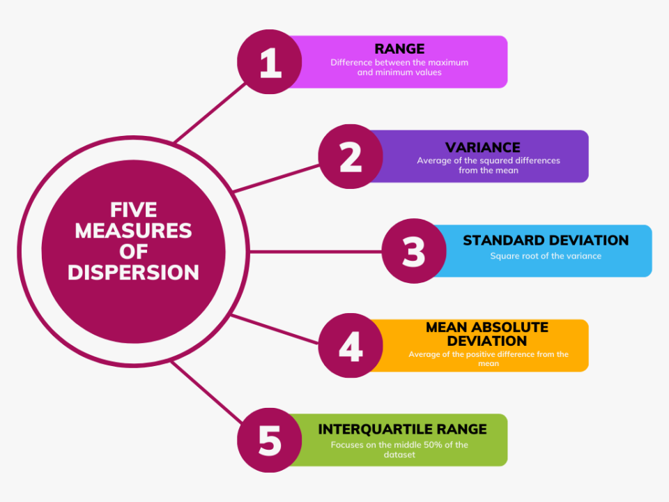

## Table of Contents

## What is statistical dispersion and why is it important?

Statistical dispersion is a way to measure how spread out a set of data is. It tells us how much the numbers in a group differ from each other. Common ways to measure dispersion include the range, which is the difference between the highest and lowest numbers, the variance, which shows how much the numbers vary from the average, and the standard deviation, which is the square root of the variance.

Understanding statistical dispersion is important because it helps us see how reliable our data is. If the dispersion is small, it means the data points are close to each other, so we can be more confident in our conclusions. On the other hand, if the dispersion is large, it means the data is more spread out, and we need to be careful about making generalizations. This is useful in many fields, like science, business, and education, where knowing how spread out data is can help make better decisions.

## Can you explain the difference between measures of central tendency and measures of dispersion?

Measures of central tendency and measures of dispersion are two important ways to understand data. Measures of central tendency, like the mean, median, and mode, tell us about the center or the most typical value of a set of data. For example, if you want to know the average height of a group of people, you would use a measure of central tendency like the mean. These measures give us a single number that represents the whole group, helping us see what is "normal" or "average" in the data.

On the other hand, measures of [dispersion](/wiki/dispersion-trading), like the range, variance, and standard deviation, tell us how spread out the data is. They show how much the numbers in the data set differ from each other and from the central value. For instance, if you want to know how much the heights of people in a group vary, you would use a measure of dispersion. These measures help us understand the variability or consistency in the data, which is important for knowing how reliable our central tendency measures are.

In summary, while measures of central tendency give us a snapshot of the typical value in a data set, measures of dispersion tell us about the spread of the data. Both are crucial for a complete understanding of data, as they provide different but complementary information.

## What are the most common measures of dispersion used in statistics?

The most common measures of dispersion used in statistics are the range, variance, and standard deviation. The range is the simplest measure of dispersion and is calculated by subtracting the smallest value in a data set from the largest value. It gives a quick idea of how spread out the data is but can be influenced a lot by extreme values.

Variance is another important measure of dispersion. It calculates the average of the squared differences between each data point and the mean of the data set. This measure helps us understand how much the data points deviate from the mean. Variance is useful but can be hard to interpret directly because it's in squared units.

Standard deviation is the most widely used measure of dispersion and is the square root of the variance. It brings the measure back to the original units of the data, making it easier to understand and compare. Standard deviation tells us, on average, how far each data point is from the mean, giving a clear picture of the data's spread.

## How do you calculate the range of a dataset?

To calculate the range of a dataset, you need to find the difference between the highest and lowest numbers in the set. Start by looking at all the numbers in your data. Find the biggest number and the smallest number. Once you have these two numbers, subtract the smallest number from the biggest number. The result is the range.

For example, if your dataset is the numbers 3, 7, 12, 15, and 20, the highest number is 20 and the lowest number is 3. To find the range, you subtract 3 from 20. So, 20 - 3 = 17. The range of this dataset is 17. This tells you how spread out the numbers are from the smallest to the largest.

## What is the interquartile range and how is it used to understand data spread?

The interquartile range, or IQR, is a way to measure how spread out the middle half of a dataset is. It's different from the range because it only looks at the numbers between the first and third quartiles. To find the IQR, you first need to put all the numbers in order from smallest to biggest. Then, you find the first quartile (Q1), which is the median of the lower half of the data, and the third quartile (Q3), which is the median of the upper half. The IQR is the difference between Q3 and Q1.

The IQR is useful because it helps us understand the spread of the data without being affected by extreme values, or outliers, that can skew the range. By focusing on the middle 50% of the data, the IQR gives a clearer picture of where most of the data points fall. This makes it a good tool for comparing the spread of different datasets or for identifying the typical range of values in a dataset.

## Can you describe the process of calculating the variance and standard deviation?

To calculate the variance, start by finding the mean of your dataset. The mean is the average of all the numbers. Next, for each number in your dataset, subtract the mean and then square the result. This gives you the squared difference from the mean for each number. Now, add up all these squared differences. Finally, divide this total by the number of items in your dataset if it's a population, or by the number of items minus one if it's a sample. The result is the variance. It tells you how spread out the numbers are from the mean, but because it's in squared units, it can be hard to understand directly.

To find the standard deviation, take the variance you just calculated and find its square root. The standard deviation is in the same units as your original data, which makes it easier to understand and use. It tells you, on average, how far each number in your dataset is from the mean. If the standard deviation is small, it means the numbers are close to the mean, and if it's large, it means the numbers are spread out more. Standard deviation is a very common way to describe how spread out data is, and it's used in many fields like science, finance, and education.

## How does the coefficient of variation help in comparing the dispersion of different datasets?

The coefficient of variation (CV) is a helpful tool that lets us compare how spread out different datasets are, even if they are measured in different units. It's a simple number that we get by dividing the standard deviation of a dataset by its mean, and then multiplying by 100 to turn it into a percentage. This way, we can see the spread of data as a fraction of the average value. For example, if one dataset has a CV of 10% and another has a CV of 20%, we can say the second dataset is more spread out compared to its average, even if they're measured in different units like dollars or kilograms.

Using the coefficient of variation is great because it helps us understand and compare the variability of different datasets in a fair way. Let's say you want to compare the performance of two investments, one in dollars and the other in euros. The CV lets you see which investment has more risk relative to its average return, no matter what currency it's in. This makes it easier to make decisions or draw conclusions when you're looking at different kinds of data, because you're comparing apples to apples, not apples to oranges.

## What are the applications of statistical dispersion in fields like finance and quality control?

In finance, statistical dispersion is really important for understanding and managing risk. Investors and financial analysts use measures like standard deviation and the coefficient of variation to see how much the returns of an investment might change. If an investment has a high standard deviation, it means its returns can be very different from the average, which makes it riskier. This helps people decide if they want to invest in something that might give them big gains but also big losses, or if they'd rather have something more stable. By looking at dispersion, financial experts can also compare different investments and figure out which ones might be a good fit for their goals and how much risk they're willing to take.

In quality control, statistical dispersion helps companies make sure their products are consistent and meet the standards they set. For example, if a factory makes car tires, they want all the tires to be about the same size and quality. By using measures like the range or standard deviation, quality control teams can check how much the sizes of the tires vary from the average. If the dispersion is small, it means the tires are very similar, which is good. But if the dispersion is large, it means there's a lot of variation, and they might need to fix their production process. This helps companies keep their products reliable and customers happy, because people expect the things they buy to be consistent and work well.

## How can outliers affect measures of dispersion and what methods can be used to mitigate their impact?

Outliers are numbers that are very different from the rest of the data. They can have a big effect on measures of dispersion like the range, variance, and standard deviation. The range is the difference between the highest and lowest numbers, so if there's an outlier, it can make the range much bigger than it would be without it. Variance and standard deviation measure how spread out the numbers are from the average, and outliers can pull these measures up a lot because they're so far from the average. This can make it look like the data is more spread out than it really is, which can be confusing when trying to understand the data.

To deal with outliers, there are a few methods you can use. One way is to use the interquartile range (IQR), which looks at the middle 50% of the data and isn't affected by outliers as much. You can also try to figure out if the outliers are mistakes or if they're real but unusual data points. If they're mistakes, you can remove them or fix them. If they're real, you might want to keep them but use a different measure of dispersion that's not as sensitive to outliers, like the median absolute deviation. Another method is to use a trimmed mean or trimmed standard deviation, where you remove a certain percentage of the highest and lowest values before calculating the measures. This can help give a better idea of the spread of the data without the outliers messing it up too much.

## What advanced techniques exist for analyzing dispersion in multivariate data?

When you're dealing with data that has more than one variable, like height and weight together, you need special ways to look at how spread out the data is. One common technique is called Principal Component Analysis (PCA). PCA helps you see the main ways the data is spread out by turning the original variables into new ones called principal components. These components show you the directions in which the data varies the most. This is helpful because it can make it easier to understand how different variables are related and how they change together.

Another technique is called Multidimensional Scaling (MDS). MDS helps you see how similar or different different data points are from each other in a way that you can picture. It puts the data points in a space so that the distances between them show how much they differ. This can be really useful for seeing patterns in the data and understanding how spread out it is in more than one direction. Both PCA and MDS help you get a better picture of how your data is spread out when you're looking at more than one thing at a time.

## How do you interpret the results of a statistical dispersion analysis in research?

When you do a statistical dispersion analysis in research, you're trying to see how spread out your data is. If the dispersion is small, it means your data points are close to each other. This can make you feel more confident about your results because it shows that the numbers are pretty consistent. For example, if you're studying the heights of students in a class and the dispersion is small, it means most students are about the same height. On the other hand, if the dispersion is large, it means your data points are more spread out. This might make you less sure about your findings because it shows there's a lot of variety in your data. If you're looking at test scores and the dispersion is big, it means some students did really well while others didn't, which could affect how you understand the average score.

Interpreting dispersion is also about understanding what it means for your research question. If you're looking at how much people's salaries vary in a company, a high dispersion might tell you that there's a big difference between the highest and lowest earners. This could be important for understanding issues like income inequality. In another case, if you're studying the effectiveness of a new medicine and the dispersion of the results is small, it means the medicine works about the same for most people, which is good news. But if the dispersion is large, it might mean the medicine works well for some people but not for others, which could affect how you recommend it. By looking at the dispersion, you can get a better idea of the reliability and the implications of your data for your research.

## What are the current trends and future directions in the study of statistical dispersion?

The study of statistical dispersion is evolving with new trends and technologies. One big trend is the use of [machine learning](/wiki/machine-learning) and [artificial intelligence](/wiki/ai-artificial-intelligence) to better understand and measure dispersion in large and complex datasets. These tools can find patterns and relationships in data that are hard for people to see. Another trend is the focus on real-time data analysis. This means looking at data as it comes in, which is important in fields like finance and healthcare where things can change quickly. Researchers are also paying more attention to how to handle outliers and extreme values, using new methods to make sure these don't mess up the results too much.

Looking to the future, the study of statistical dispersion will likely keep growing with the rise of big data and the Internet of Things (IoT). As more devices and sensors collect data all the time, we'll need even better ways to understand how spread out that data is. This could mean developing new measures of dispersion that work well with lots of different kinds of data at once. Also, there will be more focus on making these analyses easier to understand and use for people who aren't experts in statistics. This way, more people can use the insights from dispersion analysis to make better decisions in their work and lives.

## What are the key concepts and measures?

Volatility is a key measure in financial markets, representing the degree to which the price of an asset fluctuates over time. This metric is crucial for investors and traders, as it often serves as an indicator of risk. High [volatility](/wiki/volatility-trading-strategies) suggests a greater potential for price changes, which can lead to significant gains or losses. The calculation of volatility typically involves statistical methods to quantify the extent of price deviations from an average. 

Standard deviation is a fundamental concept in [statistics](/wiki/bayesian-statistics) that measures the amount of variation or dispersion in a set of values. In the context of financial markets, it is commonly used to gauge market volatility. The standard deviation is calculated as the square root of variance and provides insights into how much the returns of an asset deviate from its expected value. The formula for standard deviation ($\sigma$) is:

$$
\sigma = \sqrt{\frac{1}{N} \sum_{i=1}^{N} (x_i - \bar{x})^2}
$$

where $N$ is the number of observations, $x_i$ are individual data points, and $\bar{x}$ is the mean of the data set.

Beta is a measure that compares the volatility of an asset to that of the broader market, represented by a benchmark index such as the S&P 500. It is used to understand the relative risk associated with an investment. A beta greater than one indicates that the asset is more volatile than the market, whereas a beta less than one signifies less volatility. The beta coefficient is calculated using regression analysis and can be expressed as:

$$
\beta = \frac{\text{Cov}(R_a, R_m)}{\text{Var}(R_m)}
$$

where $\text{Cov}(R_a, R_m)$ is the covariance between the asset's returns and the market's returns, and $\text{Var}(R_m)$ is the variance of the market's returns.

Alpha represents the performance of an investment relative to a benchmark index, indicating the active return generated by a portfolio manager. It is a measure of an investment's ability to outperform the market index, with a positive alpha suggesting better-than-expected returns and a negative alpha indicating underperformance. Alpha can be derived as the difference between the actual return of the investment and its expected return, based on its beta:

$$
\alpha = R_a - [R_f + \beta (R_m - R_f)]
$$

where $R_a$ is the actual return of the asset, $R_f$ is the risk-free rate, and $R_m$ is the return of the market.

These key concepts and measures—volatility, standard deviation, beta, and alpha—are integral to the analysis and management of investment portfolios, providing insights that enhance decision-making and risk assessment in [algorithmic trading](/wiki/algorithmic-trading).

## What is the relationship between Algorithmic Trading and Statistical Measures?

Algorithmic trading integrates statistical measures to automate and optimize financial decision-making. At the core, these measures help in determining entry and [exit](/wiki/exit-strategy) points, managing risk, and enhancing the strategic approach of trading models. Among the critical statistical metrics used are volatility and beta, which serve as indicators of risk and market performance.

**Volatility** is a measure of how much the price of an asset fluctuates over time and is fundamental in algorithmic trading. It indicates the risk level associated with an asset and helps in forecasting potential movements in price. A common method to calculate volatility is through the standard deviation of historical price data. Mathematically, this can be defined as:

$$
\sigma = \sqrt{\frac{\sum (X_i - \mu)^2}{N}}
$$

where $\sigma$ is the standard deviation, $X_i$ represents each data point, $\mu$ is the mean of the dataset, and $N$ is the number of data points.

**Beta** measures an asset’s volatility in relation to the overall market, indicating the asset's relative risk compared to the market benchmark. A beta greater than one suggests the asset is more volatile than the market, while a beta lesser than one indicates less volatility. Beta is utilized to gauge how much an asset’s price is expected to change with market shifts and is crucial for assessing systematic risk in algorithmic trading.

Dispersion analysis, another crucial aspect, helps in predicting market movements by assessing the spread of asset returns. This analysis is essential for algorithms to dynamically adjust trading strategies in real-time, aligning with market conditions. By assessing the distribution of past returns, algorithms can infer future price movements and volatility.

Incorporation of statistical dispersion in trading models enhances risk management by providing insights into the potential range of returns an asset might experience. It allows for strategic optimization by balancing risk and reward, ensuring that trading strategies are robust under varying market conditions. Furthermore, tools like moving averages and Bollinger Bands can be applied to monitor and act on volatility trends actively.

By using metrics such as volatility, beta, and statistical dispersion, algorithmic trading models can make data-driven decisions. These measures enable traders to capitalize on market inefficiencies, optimizing their strategies to improve trading performance and manage risks effectively.

## What are the tools and techniques for measuring variability?

### Tools and Techniques for Measuring Variability

Measuring variability is essential for understanding financial market dynamics and making informed trading decisions. Several tools and techniques are widely used to aid traders in quantifying market volatility and making strategic decisions.

**Moving Averages** are utilized to smooth out price data, helping traders identify trends by filtering out the "noise" of random price fluctuations. A moving average can be calculated by averaging the prices over a specified period. Traders often use formulas like the simple moving average (SMA) or the exponential moving average (EMA) to analyze trends. The SMA is computed by:

$$
\text{SMA}_n = \frac{\sum_{i=1}^{n} \text{Price}_i}{n}
$$

where $n$ is the number of periods in the average.

**Bollinger Bands** serve as a volatility indicator, depicting the degree of variation around a moving average. Developed by John Bollinger, this tool consists of three lines: the middle band (SMA), and the upper and lower bands which are typically two standard deviations $\sigma$ away from the SMA. Bollinger Bands help traders identify overbought or oversold conditions by showing when prices are at extreme variants compared to the average price range.

$$
\text{Upper Band} = \text{SMA} + k \times \sigma
$$
$$
\text{Lower Band} = \text{SMA} - k \times \sigma
$$

Here, $k$ is typically 2, representing two standard deviations.

**Average True Range (ATR)** quantifies market volatility by examining the average range within a set period. ATR does not indicate price direction but measures the degree of price variability. It's especially useful in setting stop-loss orders and assessing trading risk. The ATR for a period $n$ is calculated as follows:

$$
\text{ATR}_n = \frac{\sum_{i=1}^{n} \text{TR}_i}{n}
$$

where True Range (TR) is the greatest of the following: 
- current high minus current low,
- absolute value of current high minus previous close,
- absolute value of current low minus previous close.

**Monte Carlo Simulations** provide a probabilistic analysis of potential investment outcomes based on historical data variability. By generating multiple simulated price paths based on statistical properties of asset returns, such as mean and standard deviation, traders can evaluate potential scenarios and risks. A typical Monte Carlo simulation model involves:

```python
import numpy as np

# Define parameters
n_simulations = 1000
time_horizon = 252  # One trading year

# Historical mean and standard deviation
historical_mean = 0.001  # daily return
historical_stddev = 0.02  # daily volatility

simulated_paths = np.zeros(n_simulations)

# Run simulations
for sim in range(n_simulations):
    daily_returns = np.random.normal(historical_mean, historical_stddev, time_horizon)
    simulated_paths[sim] = np.prod(1 + daily_returns) - 1

# Analyzing results
expected_return = np.mean(simulated_paths)
variance = np.var(simulated_paths)
```

This Python script illustrates a basic Monte Carlo simulation to project future performance while accounting for price fluctuation randomness over a year.

In summary, using these sophisticated tools and techniques, traders and analysts can obtain a clearer picture of the short-term and long-term trends and volatility of financial markets, enabling them to execute better-informed trading strategies.

## References & Further Reading

[1]: ["Advances in Financial Machine Learning"](https://www.amazon.com/Advances-Financial-Machine-Learning-Marcos/dp/1119482089) by Marcos Lopez de Prado

[2]: ["Evidence-Based Technical Analysis: Applying the Scientific Method and Statistical Inference to Trading Signals"](https://www.amazon.com/Evidence-Based-Technical-Analysis-Scientific-Statistical/dp/0470008741) by David Aronson

[3]: ["Machine Learning for Algorithmic Trading"](https://github.com/PacktPublishing/Machine-Learning-for-Algorithmic-Trading-Second-Edition) by Stefan Jansen

[4]: ["Quantitative Trading: How to Build Your Own Algorithmic Trading Business"](https://www.amazon.com/Quantitative-Trading-Build-Algorithmic-Business/dp/1119800064) by Ernest P. Chan

[5]: Grant, D. (2015). ["Portfolio Risk Analysis."](https://www.jstor.org/stable/j.ctt7sm49) Wiley Trading Series.