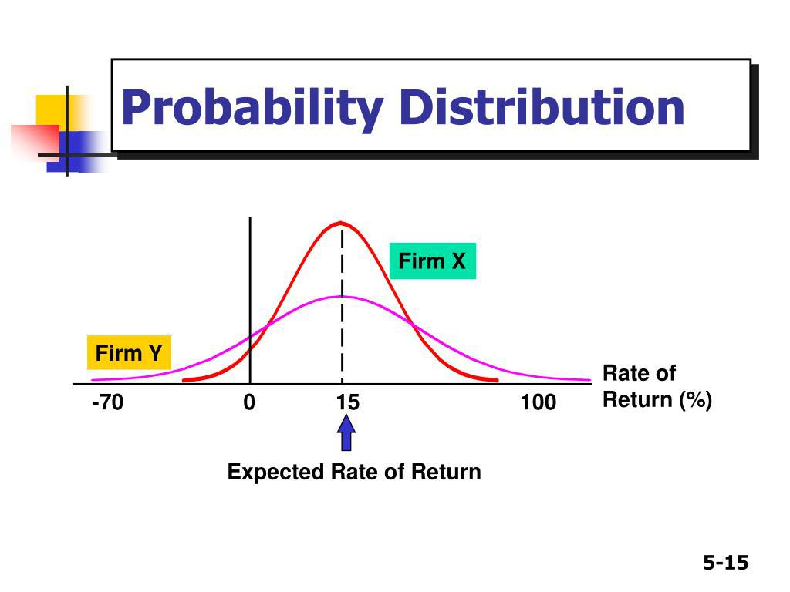

Algorithmic trading has transformed the financial industry by systematically leveraging computer algorithms to execute trades at high speeds and volumes. At the heart of these algorithms is the robust use of statistical methods, particularly the analysis of statistical distributions of returns. Understanding these distributions is crucial as they form the backbone of predictive models that guide trading decisions and strategies.

In algorithmic trading, the statistical distribution of returns refers to the way historical price changes are spread over time. This understanding helps traders anticipate the potential movements of asset prices. Several statistical distributions are pivotal in this context, each offering unique characteristics that aid in the modeling of asset returns. This article examines several of these key distributions and their applications in algorithmic trading. 

We discuss the normal distribution, often depicted by its characteristic bell curve, which is extensively used due to its simplicity and the central limit theorem's implication. However, when modeling financial asset returns, alternative distributions such as the log-normal and Student's t-distribution often provide a better fit. The log-normal distribution is particularly useful for modeling asset prices, as it adheres to the principle that prices cannot be negative and can demonstrate exponential growth. Meanwhile, the Student's t-distribution is favored for its heavier tails, capable of capturing the extreme events and volatility inherent in financial markets.

The characteristics, benefits, and limitations of these distributions play a fundamental role in formulating effective trading strategies. A sound comprehension of these aspects is essential for quantitative analysts who strive to optimize portfolios and manage risks within the ever-evolving financial markets.

By exploring these statistical distributions, readers will gain valuable insights into their applications in algorithmic trading, enhancing their ability to develop sophisticated trading strategies. Such knowledge is crucial for navigating the complexities of modern financial markets, where the ability to predict and react promptly to changes can significantly influence trading success.

## Table of Contents

## Understanding Probability Distributions in Trading

Probability distributions are essential for statistical analysis in trading algorithms, as they describe the range of possible outcomes and their associated probabilities. In analyzing and predicting financial asset behavior, different distributions serve various purposes in modeling asset returns and prices.

The normal distribution is one of the most frequently used in financial modeling. It is depicted by its bell-shaped curve, symmetrically centered around the mean. This distribution is typically applied to model stock returns due to the assumption that financial markets are efficient and returns are independent and identically distributed. A normal distribution is fully characterized by its mean (μ) and standard deviation (σ), providing a structured approach to predict average and [volatility](/wiki/volatility-trading-strategies) in asset returns. The probability density function (PDF) for a normal distribution is expressed as:

$$
f(x|\mu,\sigma^2) = \frac{1}{\sqrt{2\pi\sigma^2}} e^{-\frac{(x-\mu)^2}{2\sigma^2}}
$$

However, stock prices, as opposed to stock returns, are often better modeled by the log-normal distribution. This is due to its positive skew, which makes it more appropriate for representing the fact that stock prices cannot fall below zero and can experience exponential growth. The log-normal distribution is derived from the exponential of a normally distributed variable. In practical terms, if the natural logarithm of a variable (such as stock price) is normally distributed, then the variable itself follows a log-normal distribution.

In scenarios where extreme events are more prevalent, such as financial crises, the Student’s t-distribution becomes more applicable. It offers a more robust model for financial returns because of its heavier tails compared to the normal distribution. This allows for a greater likelihood of extreme deviations from the mean, which is characteristic of financial markets during turbulent periods. The additional parameter, degrees of freedom (ν), allows the t-distribution to control the tail heaviness, making it particularly useful in risk management contexts. Its probability density function is given by:

$$
f(x|\nu) = \frac{\Gamma\left(\frac{\nu+1}{2}\right)}{\sqrt{\nu\pi} \, \Gamma\left(\frac{\nu}{2}\right)} \left(1 + \frac{x^2}{\nu}\right)^{-\frac{\nu+1}{2}}
$$

Understanding these distributions is critical for traders because they inform predictive modeling and decision-making processes. By selecting the appropriate distribution model, traders can enhance the reliability of their algorithms and improve their predictions related to price movements and the likelihood of various financial outcomes. Whether through the normal distribution's familiar framework, the adaptable nature of the log-normal distribution, or the more nuanced approach of the Student’s t-distribution, each model provides valuable insights that contribute to optimizing trading strategies and assessing financial risk.

## Applications of Statistical Distributions in Algo Trading

Statistical distributions play a pivotal role in [algorithmic trading](/wiki/algorithmic-trading) by serving as foundational tools for risk management and strategic execution. A primary application is in estimating Value at Risk (VaR) and Conditional Value at Risk (CVaR), which are key metrics used by traders to quantify potential losses in their portfolios under normal market conditions.

VaR estimates the maximum loss over a given time frame with a specified confidence level. For instance, if a portfolio has a daily VaR of $1 million at a 95% confidence level, it implies there is only a 5% chance that the portfolio will lose more than $1 million in a day. The normal distribution is often utilized to calculate VaR due to its simplicity and widespread implementation. However, when accounting for heavy-tailed events, alternative distributions such as the Student's t-distribution are preferred, providing a more comprehensive risk assessment.

CVaR, also known as Expected Shortfall, offers a more insightful metric by assessing the average loss that occurs beyond the VaR threshold, thus taking tail risk into account. It is defined mathematically as:

$$

\text{CVaR}_\alpha(X) = \mathbb{E}[X | X \leq \text{VaR}_\alpha(X)]
$$

where $\alpha$ is the confidence level, $X$ represents the potential loss, and $\text{VaR}_\alpha(X)$ denotes the VaR at the confidence level $\alpha$.

Option pricing models such as Black-Scholes employ the normal distribution to derive closed-form solutions for option prices. The Black-Scholes formula is expressed as:

$$

C = S_0 N(d_1) - Xe^{-rT} N(d_2)
$$

where $C$ is the option price, $S_0$ is the current stock price, $X$ is the strike price, $r$ is the risk-free rate, $T$ is the time to expiration, $N$ denotes the cumulative distribution function of the standard normal distribution, and:

$$

d_1 = \frac{\ln(S_0/X) + (r + \sigma^2/2)T}{\sigma \sqrt{T}}
$$

$$

d_2 = d_1 - \sigma \sqrt{T}
$$

In [quantitative trading](/wiki/quantitative-trading) strategies, statistical distributions enhance statistical [arbitrage](/wiki/arbitrage) and pairs trading. Statistical arbitrage involves profiting from pricing inefficiencies between related financial instruments. By modeling asset returns with appropriate distributions, traders can detect mispricings and capitalize on mean-reversion opportunities. For example, pairs trading strategies involve identifying two correlated stocks and initiating simultaneous long and short positions when their price divergence exceeds a certain threshold, anticipating a reversion to the mean. Accurate modeling with statistical distributions ensures that traders can better anticipate returns and volatility, improving execution and profitability.

Understanding these applications underscores the importance of statistical distributions in optimizing trading performance. Mastery of these tools allows traders to efficiently manage risk, make informed pricing decisions, and execute strategies that leverage the underlying statistical properties of financial markets, thereby enhancing their overall trading outcomes.

## Challenges and Considerations

While many models in algorithmic trading lean towards the assumption that returns follow a normal distribution, this presumption can be misleading, particularly during periods of extreme market fluctuations. The normal distribution, identified by its symmetric bell curve, tends to underestimate the likelihood of tail events, leading to potential underestimation of risk. 

Alternative statistical distributions, such as the Student's t-distribution, offer a superior representation of financial returns during adverse market conditions. The Student's t-distribution is characterized by heavier tails compared to the normal distribution, allowing it to account for the higher probability of extreme events. This makes it more suitable for modeling returns when markets experience significant volatility. For instance, if $X_t$ represents returns distributed according to a Student's t-distribution, the probability density function is given by:

$$
f(x) = \frac{\Gamma((\nu+1)/2)}{\sqrt{\nu\pi} \Gamma(\nu/2)} \left(1 + \frac{x^2}{\nu}\right)^{-(\nu+1)/2}
$$

where $\nu$ represents the degrees of freedom. A smaller $\nu$ accentuates the thickness of the tails, indicating a higher probability of extreme events.

Choosing the correct statistical distribution for modeling is crucial as it directly influences risk assessment and strategy development. Employing an inappropriate distribution can lead to inaccurate estimations of metrics like Value at Risk (VaR) or Conditional Value at Risk (CVaR), adversely impacting trading strategies. For example, a trading strategy that fails to account for the occurrence of extreme market movements might face unexpected losses.

A comprehensive grasp of each distribution’s limitations is essential for preparing robust trading algorithms. Traders need to evaluate the characteristics of various distributions and select those that align best with the observed market dynamics and asset behaviors. This discernment provides the foundation for developing algorithms resilient in the face of market anomalies, ensuring stable and effective performance across varying market conditions.

## Conclusion

Statistical distributions of returns provide traders with a critical toolkit for analyzing and predicting market behaviors. By understanding the characteristics of these distributions, traders can develop more effective trading strategies. As financial markets become more intricate, the importance of mastering statistical methods in algorithmic trading cannot be overstated. Knowledge of statistical distributions enhances a trader's ability to manage risk and capitalize on market opportunities.

A profound comprehension of statistical distributions allows traders to model asset returns more accurately, taking into account the nuances of market volatility. By leveraging distributions such as the normal, log-normal, and Student's t-distribution, traders gain valuable insights into potential market movements. For instance, while the normal distribution provides a foundational model, the log-normal distribution accommodates the reality of exponential price movements, and the Student's t-distribution accounts for extreme events with heavier tails, offering a more realistic picture during market turbulence.

Moreover, traders who skillfully apply these distributions in their strategies are better prepared to assess risk and optimize their portfolios. For example, understanding the correct statistical distribution is crucial in estimating metrics like Value at Risk (VaR) and Conditional Value at Risk (CVaR). These measures rely on accurate distribution assumptions to predict potential losses in adverse market conditions effectively.

The complexity of today's financial markets demands that traders are well-versed in statistical methodologies. As algorithmic trading evolves, the ability to apply the appropriate statistical tools becomes a decisive [factor](/wiki/factor-investing) in achieving trading success. Equipped with the knowledge of proper distribution applications, traders can navigate market volatility with confidence, turning unpredictable market dynamics into opportunities. Thus, the continual learning and application of statistical distributions remain pivotal for traders aiming to thrive in the competitive landscape of algorithmic trading.

## References & Further Reading

[1]: Cont, R. (2001). ["Empirical properties of asset returns: Stylized facts and statistical issues."](http://rama.cont.perso.math.cnrs.fr/pdf/empirical.pdf) Quantitative Finance, 1(2), 223-236.

[2]: Taleb, N. N. (2007). ["The Black Swan: The Impact of the Highly Improbable"](https://archive.org/details/10.1.1.695.4305). Random House.

[3]: Embrechts, P., Klüppelberg, C., & Mikosch, T. (1997). ["Modelling Extremal Events: For Insurance and Finance"](https://link.springer.com/book/10.1007/978-3-642-33483-2). Springer Science & Business Media.

[4]: Jorion, P. (2007). ["Value at Risk: The New Benchmark for Managing Financial Risk"](https://link.springer.com/article/10.1007/s11408-007-0057-3) (3rd ed.). McGraw Hill.

[5]: Hull, J. C. (2014). ["Options, Futures, and Other Derivatives"](https://elibrary.pearson.de/book/99.150005/9781292410623) (9th ed.). Pearson.