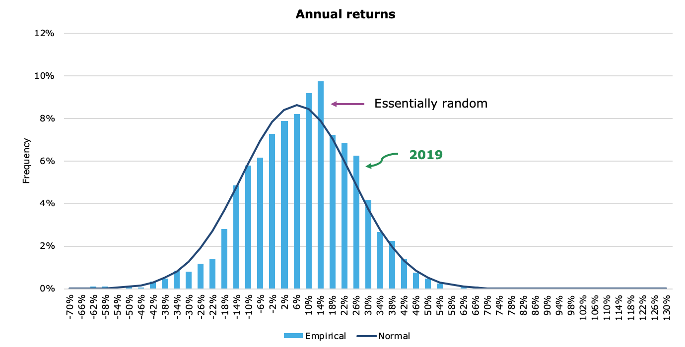

## Table of Contents

## What is a statistical distribution of returns?

A statistical distribution of returns shows how the returns of an investment, like a stock or a bond, are spread out over time. It helps us understand how likely it is to get different levels of returns. Imagine you're looking at a chart that shows how much money you could make or lose from an investment. The chart would show that some returns happen more often than others, and some might be really rare.

This distribution can be shown with different shapes, like a bell curve, which is common for things like stock market returns. The bell curve, or normal distribution, has most of the returns clustered around the middle, with fewer returns on the extremes. This means that most of the time, the returns will be close to the average, but sometimes you might see very high or very low returns. Understanding this distribution helps investors know what to expect and how much risk they are taking.

## Why is understanding the distribution of returns important for investors?

Understanding the distribution of returns is really important for investors because it helps them know what they might get from their investments. It's like looking at a weather forecast for money. If you know that most of the time the returns will be around a certain number, you can plan better. You can see if the investment is likely to grow your money or if it might lose value. This helps you decide if the investment is worth the risk.

Also, knowing the distribution of returns can show how risky an investment is. If the returns are all over the place, with some very high and some very low, that means the investment is riskier. But if the returns are mostly steady and close to the average, the investment is less risky. This information helps investors choose investments that match how much risk they are okay with and what they hope to achieve with their money.

## What is the difference between discrete and continuous return distributions?

Discrete return distributions are like counting specific outcomes. Imagine you're rolling a die. You can only get certain numbers, like 1, 2, 3, 4, 5, or 6. In investments, a discrete return distribution might show you the chances of getting exact returns, like a 5% gain or a 2% loss. These returns are separate and distinct, and you can list them out clearly.

Continuous return distributions are more like measuring something that can be any number within a range. Think of it like measuring the height of a person. It could be any number, not just whole numbers. In investments, a continuous return distribution might show you the chances of getting any return within a range, like anything from -10% to +10%. These returns can be any value within the range, not just specific numbers, and they are often shown with smooth curves on a graph.

## How can the normal distribution be applied to returns in finance?

The normal distribution, often called the bell curve, is a common way to look at how investment returns might behave. In finance, people use it to guess what might happen to their money. Imagine you're looking at a chart that shows how much your investment could go up or down. The middle of the bell curve shows the average return, and most of the time, your returns will be close to this middle part. This helps investors understand that while they might not always get the exact average return, they're likely to be somewhere near it.

The normal distribution also helps investors figure out how risky an investment is. The wider the bell curve, the more spread out the returns are, which means the investment is riskier. A narrow bell curve means the returns are more predictable and less risky. By looking at this distribution, investors can decide if they're okay with the chance of big wins or losses, or if they'd rather have something more steady. This way, they can choose investments that match what they want and how much risk they can handle.

## What are the characteristics of a log-normal distribution and how does it apply to financial returns?

A log-normal distribution is a bit different from a normal distribution. It's used when you're looking at things that can't be less than zero, like prices or the value of investments. In a log-normal distribution, if you take the log (or logarithm) of the values, they would look like a normal distribution. This means that while the normal distribution is symmetric, the log-normal distribution is skewed to the right. It has a long tail on the right side, which means there's a chance of really high values, but not as much chance of really low ones.

In finance, the log-normal distribution is often used to model stock prices and returns. This is because stock prices can't be negative, and they tend to grow over time, which fits well with the shape of a log-normal distribution. When you look at the returns of a stock, they might follow a log-normal distribution, especially over longer periods. This helps investors understand that while they might usually see moderate returns, there's also a chance of big gains. It's important for them to know this because it can affect how they plan their investments and manage risk.

## What is skewness in the context of return distributions and why does it matter?

Skewness in the context of return distributions shows if the returns are more spread out on one side than the other. Imagine a bell curve, which is usually balanced. If the returns are skewed, it means the bell curve is leaning to one side. Positive skewness means there are more chances of big gains, but also some smaller losses. Negative skewness means there are more chances of big losses, but also some smaller gains.

Skewness matters because it helps investors understand the risks they are taking. If an investment has positive skewness, it means there's a chance for big wins, which might be exciting but also risky. On the other hand, if an investment has negative skewness, it means there's a higher chance of big losses, which might make investors more cautious. Knowing the skewness helps investors pick investments that match their comfort with risk and their goals for their money.

## How does kurtosis affect the analysis of return distributions?

Kurtosis tells us about the tails of a return distribution, which are the parts that show the chances of really big gains or losses. If a distribution has high kurtosis, it means there are more chances of extreme returns, both good and bad. This is called a "leptokurtic" distribution. On the other hand, if a distribution has low kurtosis, it means the chances of extreme returns are smaller, and this is called a "platykurtic" distribution. A normal distribution has a kurtosis value of 3, and it's called "mesokurtic."

Understanding kurtosis is important for investors because it helps them know how risky an investment might be. If an investment has high kurtosis, it means there's a bigger chance of big surprises, which could be good or bad. This might make investors think twice about putting their money into it if they don't like surprises. On the other hand, if an investment has low kurtosis, it means the returns are more predictable, which might be more comfortable for some investors. Knowing the kurtosis helps investors pick investments that match how much risk they are okay with.

## What are fat tails in return distributions and what implications do they have for risk management?

Fat tails in return distributions mean that there's a bigger chance of really big gains or losses than what you'd expect from a normal distribution. Imagine a bell curve where the ends, or tails, are thicker than usual. This means that extreme events, like a stock price going way up or way down, happen more often than you might think. In finance, this is important because it shows that the market can be more unpredictable than we sometimes believe.

For risk management, fat tails are a big deal. They tell us that we need to be ready for big surprises, even if they don't happen often. This means that investors and financial managers should plan for the worst-case scenarios and not just the average ones. They might need to set aside more money as a safety net or use different strategies to protect their investments from big losses. Understanding fat tails helps everyone in finance be more prepared and make smarter decisions about how to handle risk.

## How can the use of empirical distribution functions improve the modeling of returns?

Using empirical distribution functions can make modeling returns better because they show what actually happened in the past. Instead of guessing how returns might behave with a perfect bell curve or other shapes, empirical distribution functions use real data to show how returns were spread out. This means they can capture things like fat tails or skewness that might not show up in simpler models. By looking at the real data, investors can get a clearer picture of what might happen to their money.

This way of modeling is really helpful for risk management. Since empirical distribution functions use actual past returns, they can help investors see the chances of big wins or losses more accurately. This helps them plan better for different scenarios and make smarter choices about how much risk to take. By understanding the real ups and downs of returns, investors can build safer and more effective investment strategies.

## What role do non-parametric methods play in analyzing return distributions?

Non-parametric methods are really helpful when you want to look at return distributions without making a lot of guesses about how they should behave. These methods don't assume that the returns will follow a certain shape, like a bell curve. Instead, they use the actual data to show what's happening. This is great because real returns can be messy and don't always fit into neat shapes. By using non-parametric methods, you can see the true spread of returns, including any surprises like big gains or losses that might not show up in simpler models.

These methods are important for understanding risk better. Since they don't force the data into a specific shape, they can show you things like fat tails or skewness that are important for managing risk. This means you can see how likely it is to have big changes in your investments, both good and bad. Knowing this helps you make better plans for your money, so you can be ready for whatever might happen and choose investments that match how much risk you're okay with.

## How can copulas be used to model the dependence structure of multivariate return distributions?

Copulas are a special tool that helps us understand how different investments move together. Imagine you have two stocks, and you want to know if when one goes up, the other tends to go up too, or if they move in opposite ways. Copulas let us look at this relationship without worrying about the individual returns of each stock. They focus on the connection between the returns, helping us see if the stocks are closely linked or if they move independently.

This is really useful for investors because it helps them understand the risks of their whole portfolio. If they know how their investments are related, they can make better decisions about which stocks to buy or sell. For example, if two stocks tend to go down together, that's riskier than if they move in opposite ways. By using copulas, investors can build a mix of investments that balances risk and reward, making their money safer and more likely to grow.

## What advanced techniques exist for modeling extreme events in return distributions, such as EVT (Extreme Value Theory)?

Extreme Value Theory (EVT) is a special way to look at the biggest wins or losses in investments. It helps us understand what might happen during really unusual times, like a big stock market crash or a huge jump in prices. EVT focuses on the tails of the return distribution, the parts that show the chances of these extreme events. By studying these tails, we can guess how bad the worst-case scenarios might be and how often they might happen. This is important because it helps investors and financial managers plan for the big surprises that can shake up their money.

One way EVT is used is through something called the Peaks Over Threshold (POT) method. This method looks at all the returns that are above a certain high level or below a certain low level. By focusing on these extreme returns, we can get a better idea of how risky an investment really is. Another technique is the Block Maxima approach, which looks at the highest or lowest return in set periods of time, like every month or year. Both of these methods help us understand the risks better so we can make smarter choices about our investments and be ready for the big ups and downs.

## What is the understanding of probability distributions in trading?

Probability distributions are essential for statistical analysis in trading algorithms, as they describe the range of possible outcomes and their associated probabilities. In analyzing and predicting financial asset behavior, different distributions serve various purposes in modeling asset returns and prices.

The normal distribution is one of the most frequently used in financial modeling. It is depicted by its bell-shaped curve, symmetrically centered around the mean. This distribution is typically applied to model stock returns due to the assumption that financial markets are efficient and returns are independent and identically distributed. A normal distribution is fully characterized by its mean (μ) and standard deviation (σ), providing a structured approach to predict average and [volatility](/wiki/volatility-trading-strategies) in asset returns. The probability density function (PDF) for a normal distribution is expressed as:

$$
f(x|\mu,\sigma^2) = \frac{1}{\sqrt{2\pi\sigma^2}} e^{-\frac{(x-\mu)^2}{2\sigma^2}}
$$

However, stock prices, as opposed to stock returns, are often better modeled by the log-normal distribution. This is due to its positive skew, which makes it more appropriate for representing the fact that stock prices cannot fall below zero and can experience exponential growth. The log-normal distribution is derived from the exponential of a normally distributed variable. In practical terms, if the natural logarithm of a variable (such as stock price) is normally distributed, then the variable itself follows a log-normal distribution.

In scenarios where extreme events are more prevalent, such as financial crises, the Student’s t-distribution becomes more applicable. It offers a more robust model for financial returns because of its heavier tails compared to the normal distribution. This allows for a greater likelihood of extreme deviations from the mean, which is characteristic of financial markets during turbulent periods. The additional parameter, degrees of freedom (ν), allows the t-distribution to control the tail heaviness, making it particularly useful in risk management contexts. Its probability density function is given by:

$$
f(x|\nu) = \frac{\Gamma\left(\frac{\nu+1}{2}\right)}{\sqrt{\nu\pi} \, \Gamma\left(\frac{\nu}{2}\right)} \left(1 + \frac{x^2}{\nu}\right)^{-\frac{\nu+1}{2}}
$$

Understanding these distributions is critical for traders because they inform predictive modeling and decision-making processes. By selecting the appropriate distribution model, traders can enhance the reliability of their algorithms and improve their predictions related to price movements and the likelihood of various financial outcomes. Whether through the normal distribution's familiar framework, the adaptable nature of the log-normal distribution, or the more nuanced approach of the Student’s t-distribution, each model provides valuable insights that contribute to optimizing trading strategies and assessing financial risk.

## What are the applications of statistical distributions in algo trading?

Statistical distributions play a pivotal role in [algorithmic trading](/wiki/algorithmic-trading) by serving as foundational tools for risk management and strategic execution. A primary application is in estimating Value at Risk (VaR) and Conditional Value at Risk (CVaR), which are key metrics used by traders to quantify potential losses in their portfolios under normal market conditions.

VaR estimates the maximum loss over a given time frame with a specified confidence level. For instance, if a portfolio has a daily VaR of $1 million at a 95% confidence level, it implies there is only a 5% chance that the portfolio will lose more than $1 million in a day. The normal distribution is often utilized to calculate VaR due to its simplicity and widespread implementation. However, when accounting for heavy-tailed events, alternative distributions such as the Student's t-distribution are preferred, providing a more comprehensive risk assessment.

CVaR, also known as Expected Shortfall, offers a more insightful metric by assessing the average loss that occurs beyond the VaR threshold, thus taking tail risk into account. It is defined mathematically as:

$$

\text{CVaR}_\alpha(X) = \mathbb{E}[X | X \leq \text{VaR}_\alpha(X)]
$$

where $\alpha$ is the confidence level, $X$ represents the potential loss, and $\text{VaR}_\alpha(X)$ denotes the VaR at the confidence level $\alpha$.

Option pricing models such as Black-Scholes employ the normal distribution to derive closed-form solutions for option prices. The Black-Scholes formula is expressed as:

$$

C = S_0 N(d_1) - Xe^{-rT} N(d_2)
$$

where $C$ is the option price, $S_0$ is the current stock price, $X$ is the strike price, $r$ is the risk-free rate, $T$ is the time to expiration, $N$ denotes the cumulative distribution function of the standard normal distribution, and:

$$

d_1 = \frac{\ln(S_0/X) + (r + \sigma^2/2)T}{\sigma \sqrt{T}}
$$

$$

d_2 = d_1 - \sigma \sqrt{T}
$$

In [quantitative trading](/wiki/quantitative-trading) strategies, statistical distributions enhance statistical [arbitrage](/wiki/arbitrage) and pairs trading. Statistical arbitrage involves profiting from pricing inefficiencies between related financial instruments. By modeling asset returns with appropriate distributions, traders can detect mispricings and capitalize on mean-reversion opportunities. For example, pairs trading strategies involve identifying two correlated stocks and initiating simultaneous long and short positions when their price divergence exceeds a certain threshold, anticipating a reversion to the mean. Accurate modeling with statistical distributions ensures that traders can better anticipate returns and volatility, improving execution and profitability.

Understanding these applications underscores the importance of statistical distributions in optimizing trading performance. Mastery of these tools allows traders to efficiently manage risk, make informed pricing decisions, and execute strategies that leverage the underlying statistical properties of financial markets, thereby enhancing their overall trading outcomes.

## What are the challenges and considerations?

While many models in algorithmic trading lean towards the assumption that returns follow a normal distribution, this presumption can be misleading, particularly during periods of extreme market fluctuations. The normal distribution, identified by its symmetric bell curve, tends to underestimate the likelihood of tail events, leading to potential underestimation of risk. 

Alternative statistical distributions, such as the Student's t-distribution, offer a superior representation of financial returns during adverse market conditions. The Student's t-distribution is characterized by heavier tails compared to the normal distribution, allowing it to account for the higher probability of extreme events. This makes it more suitable for modeling returns when markets experience significant volatility. For instance, if $X_t$ represents returns distributed according to a Student's t-distribution, the probability density function is given by:

$$
f(x) = \frac{\Gamma((\nu+1)/2)}{\sqrt{\nu\pi} \Gamma(\nu/2)} \left(1 + \frac{x^2}{\nu}\right)^{-(\nu+1)/2}
$$

where $\nu$ represents the degrees of freedom. A smaller $\nu$ accentuates the thickness of the tails, indicating a higher probability of extreme events.

Choosing the correct statistical distribution for modeling is crucial as it directly influences risk assessment and strategy development. Employing an inappropriate distribution can lead to inaccurate estimations of metrics like Value at Risk (VaR) or Conditional Value at Risk (CVaR), adversely impacting trading strategies. For example, a trading strategy that fails to account for the occurrence of extreme market movements might face unexpected losses.

A comprehensive grasp of each distribution’s limitations is essential for preparing robust trading algorithms. Traders need to evaluate the characteristics of various distributions and select those that align best with the observed market dynamics and asset behaviors. This discernment provides the foundation for developing algorithms resilient in the face of market anomalies, ensuring stable and effective performance across varying market conditions.

## References & Further Reading

[1]: Cont, R. (2001). ["Empirical properties of asset returns: Stylized facts and statistical issues."](http://rama.cont.perso.math.cnrs.fr/pdf/empirical.pdf) Quantitative Finance, 1(2), 223-236.

[2]: Taleb, N. N. (2007). ["The Black Swan: The Impact of the Highly Improbable"](https://archive.org/details/10.1.1.695.4305). Random House.

[3]: Embrechts, P., Klüppelberg, C., & Mikosch, T. (1997). ["Modelling Extremal Events: For Insurance and Finance"](https://link.springer.com/book/10.1007/978-3-642-33483-2). Springer Science & Business Media.

[4]: Jorion, P. (2007). ["Value at Risk: The New Benchmark for Managing Financial Risk"](https://link.springer.com/article/10.1007/s11408-007-0057-3) (3rd ed.). McGraw Hill.

[5]: Hull, J. C. (2014). ["Options, Futures, and Other Derivatives"](https://elibrary.pearson.de/book/99.150005/9781292410623) (9th ed.). Pearson.