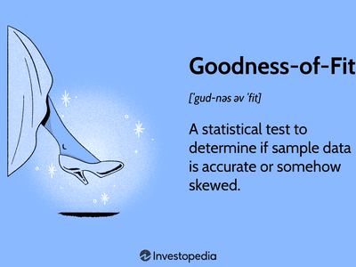

## Table of Contents

## What is statistical goodness of fit?

Statistical goodness of fit is a way to check how well a model or a distribution fits the data we have. Imagine you have a bunch of data, and you want to see if it matches a certain pattern or model. Goodness of fit tests help you figure out if the model you chose is a good match for your data or if it's not quite right.

For example, if you're trying to see if the heights of people in a group follow a normal distribution, you can use a goodness of fit test. This test will tell you if the normal distribution is a good fit for the heights or if another type of distribution might be better. It's like trying on different hats to see which one fits the best. If the test shows a good fit, it means your model is likely a good representation of the data. If not, you might need to try a different model.

## Why is goodness of fit important in statistics?

Goodness of fit is important in statistics because it helps us check if the model we are using to understand our data is the right one. When we collect data, we often want to use a model to explain it. But if the model doesn't fit well, our explanations and predictions might be wrong. By using goodness of fit tests, we can see if our model matches the data closely enough to be useful. This is crucial because it makes sure that the conclusions we draw from our data are reliable and trustworthy.

For example, if we are studying the test scores of students and we think they follow a normal distribution, a goodness of fit test can tell us if this assumption is correct. If the test shows that the normal distribution doesn't fit well, we might need to use a different model, like a skewed distribution. This helps us avoid making mistakes in our analysis and ensures that any decisions or predictions we make based on the data are as accurate as possible. In short, goodness of fit tests help us to use the best possible model for our data, leading to better understanding and more reliable results.

## What are the common types of goodness of fit tests?

There are several common types of goodness of fit tests that people use to check how well a model fits their data. One popular test is the Chi-Square Goodness of Fit Test. This test is often used when you have data that you can count, like the number of people who prefer different types of ice cream. The Chi-Square test compares the observed counts in your data to the counts you would expect if your model was a perfect fit. If the difference between these counts is small, it means your model fits well. If the difference is big, it means your model might not be the best choice.

Another common test is the Kolmogorov-Smirnov Test. This test is good for checking if your data follows a continuous distribution, like a normal distribution. It looks at how the data is spread out and compares it to what you would expect from the model. If the difference between the actual data and the model is small, the test suggests that the model fits well. If the difference is big, it means the model might not be the right one for your data.

The Anderson-Darling Test is also used a lot, especially for checking if data follows a normal distribution. Like the Kolmogorov-Smirnov Test, it looks at how the data is spread out, but it puts more focus on the tails of the distribution. This means it can be better at spotting problems in the extreme values of your data. If the test shows a small difference between the data and the model, it means the model fits well. If the difference is big, you might need to look for a different model to use.

## How does a chi-square test for goodness of fit work?

A chi-square test for goodness of fit helps you see if the data you have matches the model you're using. Imagine you have data about how many people like different ice cream flavors, and you want to know if it matches what you expected. To do the test, you first count how many people actually picked each flavor. Then, you figure out how many people you would expect to pick each flavor if your model was perfect. You compare these two sets of numbers to see if they are close or far apart.

To figure out if the difference between what you observed and what you expected is big or small, you use a special formula. This formula gives you a number called the chi-square statistic. If this number is small, it means your model fits the data pretty well. If the number is big, it means your model might not be the best fit. To decide if the number is big or small, you look at something called a p-value. If the p-value is small (usually less than 0.05), it means the difference between your data and the model is too big, so you might need to find a different model. If the p-value is big, it means your model fits the data well enough.

## What is the difference between a goodness of fit test and a test of independence?

A goodness of fit test and a test of independence are both types of statistical tests, but they check different things. A goodness of fit test is used to see if the data you have matches a certain model or pattern. For example, if you want to know if the number of people who like different ice cream flavors follows a specific distribution, you would use a goodness of fit test. It compares the actual counts of your data to what you would expect if the model was perfect, and tells you if the model fits well or not.

On the other hand, a test of independence is used to see if two different things are related or not. For example, if you want to know if the type of ice cream people like is related to their age, you would use a test of independence. This test looks at the data to see if the choices people make are independent of another [factor](/wiki/factor-investing), like age. It helps you understand if there's a connection between the two things you're looking at, or if they are separate.

In simple terms, a goodness of fit test checks if your data fits a specific model, while a test of independence checks if two things are connected. Both tests are important in [statistics](/wiki/bayesian-statistics), but they answer different questions about your data.

## How do you interpret the results of a goodness of fit test?

When you do a goodness of fit test, you get a number called the chi-square statistic and a p-value. The chi-square statistic tells you how different your actual data is from what you would expect if your model was perfect. If this number is small, it means your data fits the model pretty well. But if it's big, it means your data doesn't match the model as well as you thought. The p-value helps you decide if the difference is big enough to matter. If the p-value is small (usually less than 0.05), it means the difference between your data and the model is too big, so you might need to try a different model. If the p-value is big, it means your model fits the data well enough.

So, when you look at the results of a goodness of fit test, you're really looking at these two things: the chi-square statistic and the p-value. If the p-value is small, you say the data doesn't fit the model, and you might need to find a better one. If the p-value is big, you say the data fits the model okay, and you can keep using it. It's like trying on a hat to see if it fits your head. If it's too tight or too loose, you'll know you need a different size. If it fits just right, you can keep wearing it.

## What are the assumptions underlying goodness of fit tests?

Goodness of fit tests, like the Chi-Square test, have some assumptions that you need to keep in mind. One big assumption is that your data is collected randomly. This means you didn't pick your data in a way that could make it biased or unfair. Another assumption is that the data points you're looking at are independent of each other. This means the outcome of one data point doesn't affect the outcome of another. For example, if you're counting how many people like different ice cream flavors, one person's choice shouldn't influence another person's choice.

Another important assumption for the Chi-Square test is that the expected frequencies in each category should be big enough. Usually, this means each category should have at least 5 expected counts. If some categories have very few expected counts, the test might not work well. Also, for some other goodness of fit tests like the Kolmogorov-Smirnov test, you need to assume that your data comes from a continuous distribution if you're checking for a fit to a continuous model. These assumptions help make sure the test gives you reliable results about how well your model fits your data.

## Can you explain the Kolmogorov-Smirnov test and its application in goodness of fit?

The Kolmogorov-Smirnov test, often called the K-S test, is a way to check if your data fits a certain pattern or model. It's really good for looking at data that can have any value, like heights or temperatures, which we call continuous data. The test works by comparing your actual data to what you would expect if your model was perfect. It looks at how different these two things are and gives you a number to show this difference. If the number is small, it means your data fits the model well. If it's big, it means your data doesn't match the model as well as you thought.

To use the K-S test, you first need to figure out what the perfect model would look like for your data. Then, you compare this perfect model to your actual data. The test looks at the biggest difference between the two and uses this to calculate a p-value. If the p-value is small (usually less than 0.05), it means the difference between your data and the model is too big, so you might need to try a different model. If the p-value is big, it means your model fits the data well enough. The K-S test is really helpful because it can tell you if your data follows a specific pattern, like a normal distribution, which is important for making good predictions and understanding your data better.

## How do you choose the appropriate goodness of fit test for your data?

Choosing the right goodness of fit test depends on the type of data you have and what you want to check. If your data is made up of counts or categories, like the number of people who prefer different types of ice cream, the Chi-Square test is a good choice. This test works well when you're comparing your actual data to what you would expect if your model was perfect. You just need to make sure that the expected counts in each category are big enough, usually at least 5. If your data is continuous, like heights or temperatures, and you want to see if it follows a specific pattern, like a normal distribution, the Kolmogorov-Smirnov test or the Anderson-Darling test might be better. These tests look at how your data is spread out and compare it to the model.

Another thing to think about is the specific question you're trying to answer. If you're checking if your data fits a particular model, like a normal distribution, the Kolmogorov-Smirnov or Anderson-Darling test can help. But if you're looking at more than one variable and want to see if they are related, like if ice cream preference is related to age, a test of independence, like the Chi-Square test, would be more appropriate. It's also important to check if your data meets the assumptions of the test you choose. For example, the data should be collected randomly and the observations should be independent. By thinking about your data and your question, you can pick the right test to see if your model fits well.

## What are the limitations of goodness of fit tests?

Goodness of fit tests are really helpful for checking if your data matches a certain model, but they have some limitations. One big limitation is that these tests can be sensitive to the size of your data. If you have a lot of data, even small differences between your data and the model can make the test say the model doesn't fit well, even if the model is pretty good. On the other hand, if you don't have much data, the test might say the model fits well even if it doesn't, because there isn't enough information to see the differences clearly.

Another limitation is that goodness of fit tests only tell you if the model fits well or not, but they don't tell you which model is the best one to use. If your test says the model doesn't fit, you might need to try different models to see which one works better. Also, these tests have assumptions that need to be met, like the data being collected randomly and being independent. If these assumptions aren't true, the test results might not be reliable. So, while goodness of fit tests are useful, you need to be careful about how you use them and what they can and can't tell you about your data.

## How can goodness of fit tests be used in regression analysis?

In regression analysis, goodness of fit tests help you see how well your regression model fits the data. Imagine you're trying to predict how much ice cream people will buy based on the temperature. You make a model that says as the temperature goes up, people buy more ice cream. A goodness of fit test can tell you if this model matches the actual data you collected. It looks at how close the predictions from your model are to the real numbers. If the test says the model fits well, it means your model is a good way to predict ice cream sales based on temperature.

But goodness of fit tests in regression analysis have some limits. They can be affected by how much data you have. If you have a lot of data, even a small difference between your model and the real data might make the test say the model doesn't fit well. If you don't have much data, the test might say the model fits well even if it's not that great. Also, these tests don't tell you which model is the best one to use. They just tell you if the model you're using fits the data or not. So, you might need to try different models and use other ways to see which one works the best for your data.

## What advanced techniques exist for assessing goodness of fit in complex models?

When you have a complex model, like one with many variables or a non-linear relationship, you might need advanced techniques to check how well it fits your data. One way to do this is by using cross-validation. This means you split your data into different parts, use some parts to build your model, and then see how well the model predicts the other parts. If your model can predict well on all parts of the data, it's a good sign that it fits well. Another technique is called bootstrapping, where you make lots of new sets of data by randomly [picking](/wiki/asset-class-picking) from your original data, and then you see how well your model fits each new set. This helps you see if your model is stable and reliable across different samples of your data.

Another advanced method is to use information criteria like Akaike Information Criterion (AIC) or Bayesian Information Criterion (BIC). These help you compare different models to see which one fits your data better. They do this by balancing how well the model fits the data with how simple the model is. A simpler model that fits the data almost as well as a more complex one might be better because it's easier to understand and use. You can also use graphical methods like Q-Q plots or residual plots to see how well your model fits the data. These plots show you if the differences between your model's predictions and the actual data follow a certain pattern, which can help you see if your model needs to be changed or improved.

## What is Understanding Goodness-of-Fit?

Goodness-of-fit is a crucial statistical concept that assesses how well a model's predicted values align with the actual observed data. It is a foundational element in statistical modeling, used to verify if the model adequately captures the underlying data structure. Several tests are commonly employed to quantify goodness-of-fit, each suited to different types of data and assumptions.

The Chi-square goodness-of-fit test is one of the most well-known tests, particularly effective when dealing with categorical data. This test quantifies the discrepancy between the observed and expected frequencies, allowing researchers to determine whether deviations are due to chance. The test statistic is calculated as:

$$

\chi^2 = \sum \frac{(O_i - E_i)^2}{E_i} 
$$

where $O_i$ is the observed frequency, and $E_i$ is the expected frequency.

Another powerful test is the Kolmogorov-Smirnov (K-S) test, suitable for continuous data. The K-S test measures the maximum difference between the empirical distribution function of the sample and the cumulative distribution function of the reference distribution. This non-parametric test is advantageous due to its simplicity and lack of requirement for data to be binned.

Additional goodness-of-fit tests include the Anderson-Darling test, which enhances the K-S test's sensitivity in the tails of the distribution, and the Shapiro-Wilk test, mainly used for testing normality in small sample sizes.

The application of goodness-of-fit tests within financial markets is particularly pertinent. In [algorithmic trading](/wiki/algorithmic-trading), these tests are fundamental for validating and fine-tuning predictive trading models. Goodness-of-fit ensures that the algorithm outputs align well with historical market data, a critical step in affirming that the model captures essential market dynamics. 

To illustrate, a trading model might predict asset prices or returns. By applying a chi-square test to the categorical outcomes or a K-S test to the continuous distribution of returns, analysts can verify how well the model's predictions conform to actual market behavior. This validation step is critical not only for understanding the efficacy of a trading strategy but also for managing risks associated with model assumptions and market [volatility](/wiki/volatility-trading-strategies).

In summary, goodness-of-fit tests are indispensable in the development and validation of trading models. They provide the statistical basis to measure a model’s accuracy in replicating real-world data, thus guiding the selection and refinement of models used in financial decision-making.

## What are the statistical methods for assessing goodness-of-fit in algorithmic trading?

Statistical methods for goodness-of-fit testing are integral to the development of trading algorithms due to the model's need to accurately represent market data. Goodness-of-fit tests assess how well a model approximates a dataset, which is crucial for ensuring that the trading algorithms generate reliable predictions and decisions.

One fundamental test is the chi-square test, which evaluates whether observed market data frequencies differ significantly from those expected under a specific model. The chi-square statistic is calculated as:

$$
\chi^2 = \sum \frac{(O_i - E_i)^2}{E_i}
$$

where $O_i$ are the observed frequencies and $E_i$ are the expected frequencies. In algorithmic trading, chi-square tests might be used to verify the distributional assumptions about asset returns or to test hypotheses concerning categorical market events.

Another critical test is the Kolmogorov-Smirnov (K-S) test, a non-parametric method used for comparing a sample with a reference probability distribution or comparing two samples. This test evaluates the maximum distance between the empirical distribution function of the sample and the cumulative distribution function of the reference distribution. Its application in trading often revolves around ensuring that the model's assumptions about return distributions are consistent with historical data.

In establishing the fit of a trading model to market data, rigorous model validation techniques are necessary. Model validation involves several approaches, such as split-sample testing, cross-validation, and bootstrapping, each offering different advantages in evaluating the reliability of a model's predictions. Validation ensures that the model generalizes beyond the samples used in the fitting process and is adaptable to unseen market conditions.

Application-wise, statistical tests like chi-square and K-S are also invaluable in evaluating the assumptions about trading datasets and their distributions. For example, a chi-square test might ascertain whether the volatilities in a dataset follow a specific pattern, while a K-S test could be used to confirm that asset returns adhere to a specified distribution.

Python offers accessible avenues for these tests with libraries such as `scipy` for statistical tests and `statsmodels` for model evaluation. A Python snippet for performing a chi-square test may look as follows:

```python
from scipy.stats import chisquare

observed_data = [90, 60, 104, 95]
expected_data = [80, 70, 90, 110]

# Calculate chi-square statistic
chi2_stat, p_val = chisquare(f_obs=observed_data, f_exp=expected_data)

print(f"Chi-square statistic: {chi2_stat}, p-value: {p_val}")
```

Employing these methods aids in recognizing potential biases or misrepresentations of market data, leading to more robust and consistently performing trading models. When algorithmic models are validated properly with these statistical tests, the risk of erroneous trades and the impact of market anomalies can be significantly reduced.

## What are Data Fitting Techniques in Algorithmic Trading?

Data fitting techniques play a critical role in algorithmic trading by allowing traders to create predictive models that can analyze and anticipate movements in financial markets. These techniques involve the use of historical market data to establish mathematical models that represent complex market behaviors. By fitting a model to historical data, traders can discern potential patterns and forecast trends, thereby making informed trading decisions.

One fundamental approach to data fitting in algorithmic trading is the use of linear models. Linear regression is a classic example, where the relationship between variables is expressed as a linear equation. This technique is particularly useful when the assumption of linearity between input features and the target variable holds. Linear models can be described by the equation:

$$
y = \beta_0 + \beta_1x_1 + \beta_2x_2 + \ldots + \beta_nx_n + \epsilon
$$

where $y$ is the dependent variable, $x_1, x_2, \ldots, x_n$ are independent variables, $\beta_0, \beta_1, \ldots, \beta_n$ are coefficients, and $\epsilon$ is the error term.

However, financial markets are often characterized by their nonlinear and erratic behavior. Nonlinear models, such as polynomial regression, decision trees, or support vector machines, are more suited to capture the intricate relationships in such volatile environments. A polynomial regression, extending the linear model, includes interaction or higher-order terms, which can be expressed as:

$$
y = \beta_0 + \beta_1x + \beta_2x^2 + \beta_3x^3 + \ldots + \beta_kx^k + \epsilon
$$

Additionally, [machine learning](/wiki/machine-learning) techniques, like neural networks and ensemble methods, are increasingly used for data fitting in algorithmic trading. These methods can model complex patterns through [deep learning](/wiki/deep-learning) architectures, which learn high-dimensional representations of data. A basic [neural network](/wiki/neural-network) model fits the data by minimizing the loss function:

$$
L(\theta) = \frac{1}{m} \sum_{i=1}^{m} (h_\theta(x^{(i)}) - y^{(i)})^2
$$

where $h_\theta(x)$ is the hypothesis function defined by the network, $y^{(i)}$ is the actual output, and $m$ is the number of training examples. 

Python libraries such as NumPy, SciPy, and scikit-learn, as well as frameworks like TensorFlow and PyTorch, provide powerful tools for implementing these models. Here's an example of a simple linear regression model using Python's scikit-learn library:

```python
from sklearn.linear_model import LinearRegression
import numpy as np

# Example data
X = np.array([[1, 2], [2, 3], [3, 4], [4, 5]])
y = np.array([6, 8, 10, 12])

# Create and train the model
model = LinearRegression()
model.fit(X, y)

# Predicting
predictions = model.predict(X)
print(predictions)
```

While linear models can be easier to implement and interpret, nonlinear models offer flexibility and capacity to model complex data distributions. Traders must evaluate the effectiveness of these models against their ability to handle market data volatility, ensuring that the chosen model not only fits historical data well but also generalizes to new, unseen data for future predictions.

## What is the Role of Goodness-of-Fit in Model Selection and Risk Management?

Goodness-of-fit measures play a critical role in model selection and risk management within algorithmic trading by providing a quantitative basis for evaluating how well a particular model aligns with observed market data. These metrics allow traders to compare multiple models and select the one that offers the best performance based on historical data fit. A sound goodness-of-fit measure considers the trade-off between model complexity and predictive accuracy, mitigating the risk of overfitting—a scenario where a model fits the training data too closely but fails to generalize to new data.

One common approach to implementing goodness-of-fit in model selection is through the use of metrics such as the Akaike Information Criterion (AIC) or the Bayesian Information Criterion (BIC). These criteria help in assessing the relative quality of statistical models for a given dataset by balancing the model fit while penalizing for additional parameters. The formula for AIC is:

$$
\text{AIC} = 2k - 2\ln(L)
$$

where $k$ is the number of parameters in the model and $L$ is the likelihood of the model. A lower AIC value indicates a better fit relative to other models.

In terms of risk management, understanding a model's behavior through goodness-of-fit can aid in identifying potential vulnerabilities and stability issues. By examining how a model performs across different market conditions, traders can gauge its robustness and adaptability. This understanding empowers traders to make informed decisions about when a model's predictions might be unreliable, thereby implementing risk mitigation strategies effectively.

For instance, consider a scenario in which a trading algorithm is applied to a specific financial instrument. By employing a goodness-of-fit test, such as the chi-square test, traders can assess how well the algorithm's predictions match actual market movements. A chi-square test statistic is calculated as follows:

$$
\chi^2 = \sum \frac{(O_i - E_i)^2}{E_i}
$$

where $O_i$ denotes the observed frequency, and $E_i$ denotes the expected frequency based on the model's predictions. A low chi-square statistic suggests a good fit between the model and the market data, whereas a high statistic indicates potential discrepancies.

Additionally, goodness-of-fit measures are instrumental in stress testing trading models. By simulating a wide range of market conditions and evaluating the model's fit, traders can identify scenarios where the model may fail and subsequently devise reactive measures to address such risks.

In practice, software tools and programming languages like Python or R are commonly used to compute these statistical tests. Python libraries such as `statsmodels` and `scipy` provide efficient implementations for conducting a variety of goodness-of-fit tests, enabling traders to automate model validation processes and integrate them into their algorithmic trading systems.

Overall, leveraging goodness-of-fit evaluations facilitates optimal model selection, promoting the construction of strong, reliable trading systems. These well-calibrated models are crucial for minimizing risk and navigating the uncertainties inherent in financial markets efficiently.

## References & Further Reading

[1]: Bergstra, J., Bardenet, R., Bengio, Y., & Kégl, B. (2011). ["Algorithms for Hyper-Parameter Optimization."](https://papers.nips.cc/paper/4443-algorithms-for-hyper-parameter-optimization) Advances in Neural Information Processing Systems 24.

[2]: ["Advances in Financial Machine Learning"](https://www.amazon.com/Advances-Financial-Machine-Learning-Marcos/dp/1119482089) by Marcos Lopez de Prado

[3]: ["Evidence-Based Technical Analysis: Applying the Scientific Method and Statistical Inference to Trading Signals"](https://www.amazon.com/Evidence-Based-Technical-Analysis-Scientific-Statistical/dp/0470008741) by David Aronson

[4]: ["Machine Learning for Algorithmic Trading"](https://github.com/stefan-jansen/machine-learning-for-trading) by Stefan Jansen

[5]: ["Quantitative Trading: How to Build Your Own Algorithmic Trading Business"](https://www.amazon.com/Quantitative-Trading-Build-Algorithmic-Business/dp/1119800064) by Ernest P. Chan