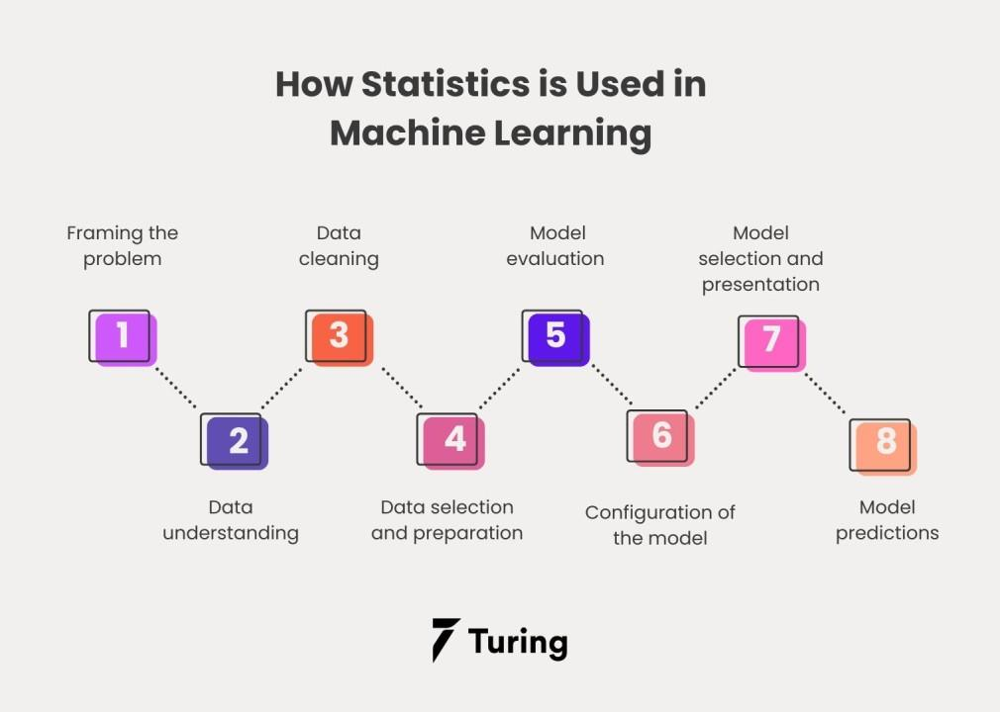

## Table of Contents

## What is statistical inference in the context of machine learning?

Statistical inference in machine learning is about making educated guesses or predictions about a larger group of data based on a smaller sample. Imagine you want to know the average height of all adults in a city, but measuring everyone is too hard. Instead, you measure a small group and use that information to estimate the average height for the whole city. This process involves using probability and statistics to make these predictions as accurate as possible.

In machine learning, statistical inference helps in building models that can learn from data and make predictions. For example, if you're trying to predict whether it will rain tomorrow, you might use past weather data to train a model. The model uses statistical methods to infer patterns and relationships in the data, allowing it to make a prediction about future rain. This is crucial because it allows machines to make decisions and predictions even when they don't have all the information, making them more useful in real-world scenarios.

## How does statistical inference differ from descriptive statistics?

Descriptive statistics is like taking a snapshot of your data. It's about summarizing and describing the main features of a dataset, such as the average, the spread, or the most common values. For example, if you're looking at the test scores of a class, descriptive statistics would tell you the average score, the highest and lowest scores, and maybe how spread out the scores are. It's all about describing what you see in the data you have.

Statistical inference, on the other hand, is about making guesses or predictions beyond the data you have. It uses the information from a sample to make statements about a larger population. For instance, if you want to know the average height of all adults in a city but can only measure a small group, statistical inference helps you estimate the average height for the whole city. It involves using probability and statistical methods to make these predictions as accurate as possible, allowing you to draw conclusions about things you haven't directly measured.

## What are the two main types of statistical inference used in machine learning?

The first main type of statistical inference used in machine learning is called "frequentist inference." This approach relies on the idea of repeating an experiment many times. It uses data from a sample to make predictions about a population, and it often involves calculating probabilities based on how often something happens. For example, if you flip a coin 100 times and it lands on heads 60 times, a frequentist might estimate the probability of heads as 0.6. This type of inference often uses concepts like confidence intervals and p-values to help make decisions.

The second main type is "Bayesian inference." This approach treats probability as a measure of belief or uncertainty. It starts with a prior belief about something and updates that belief as new data comes in. Imagine you have a belief about how likely it is to rain tomorrow based on past weather, but then you get a new weather report. Bayesian inference helps you update your belief with this new information. It uses something called Bayes' theorem, which can be written as $$ P(A|B) = \frac{P(B|A) \cdot P(A)}{P(B)} $$, where \( P(A|B) \) is the probability of event A given that event B has occurred. This method is very useful in machine learning because it can handle uncertainty and update predictions as more data becomes available.

## Can you explain the concept of point estimation and how it is used in machine learning?

Point estimation is a way to make a single, best guess about something based on data you have. Imagine you want to know the average height of all adults in a city, but you can only measure a small group. You use the average height of that small group as your best guess for the whole city's average height. This best guess is called a point estimate. In machine learning, point estimation is used to predict things like the value of a house or the probability of an event happening. For example, if you're building a model to predict house prices, you might use the average price of similar houses in your dataset as a point estimate for a new house's price.

In machine learning, point estimation helps simplify complex predictions. Instead of dealing with a range of possible outcomes, you get one clear number to work with. This makes it easier to make decisions or take actions based on the model's predictions. For instance, if you're using a model to decide whether to approve a loan, a point estimate of the applicant's credit score can help you make a quick decision. While point estimates are useful, they come with some uncertainty because they're based on a sample, not the whole population. To understand this uncertainty, you might also look at something called a confidence interval, which gives you a range of values that are likely to include the true value.

## What is interval estimation and why is it important in machine learning models?

Interval estimation gives you a range of values that you think might include the true value you're trying to guess. Imagine you're trying to figure out the average height of all adults in a city, but you can only measure a small group. Instead of just guessing one number (like with point estimation), interval estimation gives you a range, say between 5 feet 6 inches and 5 feet 8 inches. This range is called a confidence interval, and it helps you understand how sure you can be about your guess. In machine learning, this is important because it shows you how much you can trust your predictions.

For example, if you're using a model to predict house prices, a point estimate might tell you a house is worth $300,000. But with interval estimation, you might get a range like $280,000 to $320,000. This range tells you that while $300,000 is your best guess, the true price could be anywhere from $280,000 to $320,000. This helps decision-makers understand the uncertainty in the model's predictions. In machine learning, knowing this uncertainty can help you make better decisions, like whether to buy a house or approve a loan, because you can see the range of possible outcomes, not just one number.

## How do confidence intervals help in understanding the reliability of an estimate in machine learning?

Confidence intervals help you understand how reliable an estimate is in machine learning by giving you a range of values where the true value is likely to fall. Imagine you're trying to guess the average height of all adults in a city. You measure a small group and find their average height is 5 feet 7 inches. But you know this is just a guess based on a sample, so you use a confidence interval to say that you're 95% sure the true average height for the whole city is between 5 feet 6 inches and 5 feet 8 inches. This range tells you how much you can trust your guess. If the range is small, you can be more confident that your estimate is close to the true value. If it's large, there's more uncertainty.

In machine learning, confidence intervals are especially useful when making predictions. For example, if you're using a model to predict the price of a house, the model might give you a point estimate of $300,000. But with a confidence interval, you might find that you're 95% confident the true price is between $280,000 and $320,000. This range helps you see how much uncertainty there is in your prediction. It's important because it allows you to make better decisions. For instance, if you're deciding whether to buy a house, knowing the range of possible prices helps you understand the risk involved. So, confidence intervals give you a clearer picture of how reliable your machine learning model's predictions are.

## What role does the central limit theorem play in statistical inference for machine learning?

The central limit theorem is a key idea in statistics that helps make sense of data in machine learning. It says that if you take many samples from a population and look at their averages, those averages will follow a normal distribution, even if the original data doesn't. This is super helpful because it lets us use normal distribution math to make guesses about things we don't know, even when we're working with data that's all over the place. For example, if you're trying to predict how much people will spend on a website, you can take samples of spending data and use the central limit theorem to understand the average spending better.

In machine learning, the central limit theorem is important for making predictions and understanding how reliable those predictions are. When you build a model, you often use a sample of data to train it. The central limit theorem helps you figure out how good your sample is at representing the whole population. It lets you use things like confidence intervals to say how sure you are about your predictions. For instance, if you're predicting house prices, the central limit theorem helps you understand how the average price from your sample relates to the true average price for all houses. This makes your machine learning models more trustworthy and useful in real life.

## How can hypothesis testing be applied to validate machine learning models?

Hypothesis testing is a way to check if your machine learning model is doing a good job. Imagine you have a model that predicts whether it will rain tomorrow. You can set up a hypothesis test to see if your model's predictions are better than just guessing. You start with a null hypothesis, which says that your model is no better than random guessing. Then, you collect data and use statistics to see if you can reject this null hypothesis. If you can, it means your model is probably better than random guessing. For example, you might use a t-test to compare the accuracy of your model's predictions to what you would expect from random guesses.

In machine learning, hypothesis testing helps you understand if your model is really learning from the data or if it's just getting lucky. Let's say you're trying to predict house prices. You can test if adding a new feature to your model, like the number of bedrooms, makes your predictions better. You set up a null hypothesis that says adding this feature doesn't help. Then, you use data to see if you can reject this hypothesis. If you can, it means the new feature probably does make your model better. This way, hypothesis testing helps you make sure your machine learning model is reliable and useful.

## What are the common pitfalls to avoid when using statistical inference in machine learning projects?

One common pitfall when using statistical inference in machine learning projects is overfitting. This happens when your model learns the training data too well, including the noise and random fluctuations, instead of just the underlying patterns. As a result, the model might perform great on the training data but poorly on new, unseen data. To avoid overfitting, you can use techniques like cross-validation, where you split your data into different parts and test your model on each part to see how well it generalizes. Another pitfall is ignoring the assumptions of the statistical tests you're using. For example, many tests assume that your data follows a normal distribution. If it doesn't, your results might be misleading. Always check these assumptions and use the right tests for your data.

Another issue to watch out for is the misuse of p-values. A p-value tells you how likely it is to get your results by chance if the null hypothesis is true. But it's often misunderstood as the probability that the null hypothesis is true, which is not the case. Misinterpreting p-values can lead to wrong conclusions about your model's performance. Additionally, be cautious about multiple testing. If you run many statistical tests, the chance of finding a significant result by chance increases. This can lead to false positives. To mitigate this, you can use techniques like the Bonferroni correction, which adjusts the significance level to account for multiple tests. Keeping these pitfalls in mind can help you use statistical inference more effectively in your machine learning projects.

## How does the choice of statistical model affect the inference drawn from machine learning data?

The choice of statistical model can greatly affect the inferences you draw from your machine learning data. Different models make different assumptions about the data, like whether it's normally distributed or if the relationships between variables are linear. For example, if you choose a linear regression model but your data actually has a non-linear relationship, your model might give you misleading results. It might tell you that there's no relationship between two variables when there actually is one, just not a linear one. So, picking the right model is important to make sure your predictions and conclusions are accurate.

Another way the choice of model affects inference is through the complexity of the model. Simpler models, like linear regression, are easier to understand and interpret, but they might not capture all the patterns in your data. More complex models, like neural networks, can capture more detailed patterns, but they can be harder to interpret and might overfit the data. Overfitting happens when the model learns the noise in the training data instead of the true underlying patterns. This can lead to poor performance when you use the model on new data. So, you need to balance the complexity of your model with its ability to generalize to new data, which directly impacts the reliability of your inferences.

## Can you discuss advanced techniques like Bayesian inference and their applications in machine learning?

Bayesian inference is a powerful technique in machine learning that helps update our beliefs about something as we get new data. Imagine you're trying to guess the probability of it raining tomorrow. You start with a guess based on past weather, which is called your prior belief. When new weather data comes in, like a forecast from the weather service, you use Bayes' theorem to update your guess. Bayes' theorem can be written as $$ P(A|B) = \frac{P(B|A) \cdot P(A)}{P(B)} $$, where \( P(A|B) \) is the probability of event A given that event B has occurred. This method is really useful because it lets you keep learning and adjusting your predictions as you get more information. In machine learning, this means your models can get better over time, making them more accurate and useful.

One cool application of Bayesian inference in machine learning is in spam filtering. When you're trying to figure out if an email is spam, you start with some initial beliefs about what makes an email spammy, like certain words or phrases. As you get more emails and label them as spam or not spam, you can update your beliefs using Bayesian methods. This helps the spam filter learn from its mistakes and get better at sorting emails. Another use is in recommendation systems, like those used by Netflix or Amazon. These systems start with some guesses about what you might like based on what other people with similar tastes enjoy. As you watch more movies or buy more products, the system updates its guesses using Bayesian inference, making its recommendations more personalized and accurate over time.

## How do you handle multiple testing corrections in machine learning to avoid false discoveries?

When you do many statistical tests at once in machine learning, you might find things that seem important but are really just random chance. This is called a false discovery. To avoid this, you can use something called multiple testing corrections. One popular way is the Bonferroni correction. It makes the threshold for calling something important stricter by dividing the usual threshold (like 0.05 for a 95% confidence level) by the number of tests you're doing. So if you're doing 10 tests, you'd use a threshold of 0.05 divided by 10, which is 0.005. This makes it harder for random results to seem important, but it also makes it harder to find things that really are important.

Another method for handling multiple testing is the False Discovery Rate (FDR) approach. This method lets you control the expected proportion of false discoveries among all the discoveries you make. Instead of making each test super strict like the Bonferroni correction, the FDR method balances finding true discoveries with avoiding false ones. It uses a formula to adjust the p-values of your tests, and you can set a level, like 5%, to say how many false discoveries you're okay with. This way, you can still find important patterns in your data without being overwhelmed by random noise.