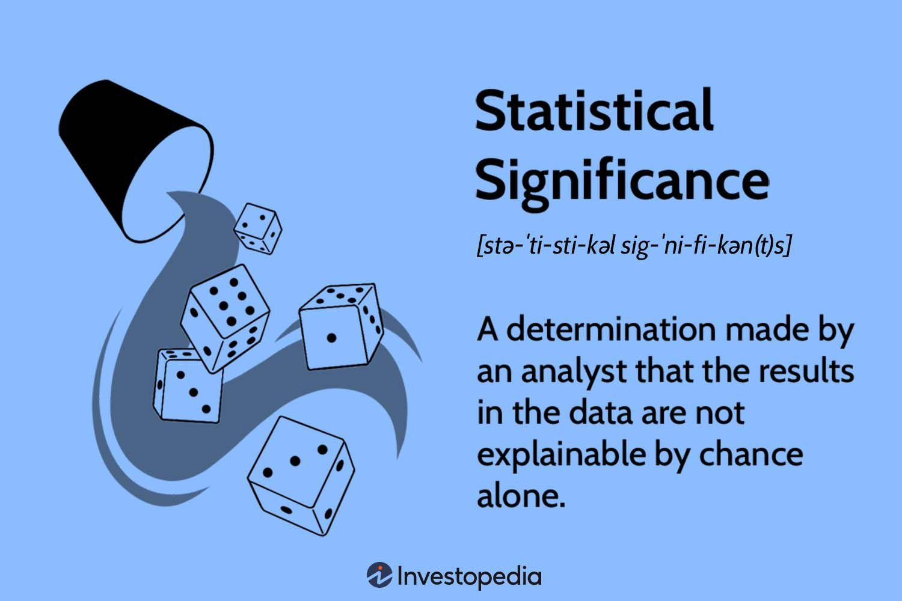

## Table of Contents

## What is statistical significance?

Statistical significance is a way to figure out if the results of a study or experiment are real or just happened by chance. Imagine you flip a coin 10 times and it lands on heads 7 times. You might wonder if the coin is fair or if you just got lucky. Statistical significance helps answer that question by using math to see if the results are likely to happen randomly or if something else is going on.

In research, scientists use statistical tests to check if their findings are significant. They do this by setting a threshold, called a p-value, which tells them how likely it is that their results happened by chance. If the p-value is very small, usually less than 0.05, they say the results are statistically significant. This means they are pretty sure that their findings are not just a fluke, but it's important to remember that statistical significance doesn't mean the results are important or useful in real life, just that they are unlikely to be due to random chance.

## Why is statistical significance important in research?

Statistical significance is important in research because it helps researchers figure out if their findings are real or just happened by chance. Imagine you're testing a new medicine and it seems to work better than the old one. You want to know if this is because the new medicine is actually better, or if it's just random luck. By using statistical tests, researchers can see if their results are strong enough to say that the new medicine really does work better. This helps them make decisions based on solid evidence, not just guesses.

Another reason statistical significance is important is that it helps other people trust the research. When scientists publish their work, they need to show that their results are not just flukes. If they can prove their findings are statistically significant, other scientists and the public are more likely to believe and use their research. This is really important for things like medical treatments, where people's health and lives are on the line. So, statistical significance is a key part of making sure research is reliable and useful.

## How is statistical significance calculated?

Statistical significance is calculated using special math formulas called statistical tests. These tests help researchers figure out if the differences they see in their data are big enough to not be just random chance. One common way to do this is by calculating something called a p-value. The p-value tells you how likely it is that your results happened by chance. If the p-value is small, usually less than 0.05, it means the results are unlikely to be due to random chance, and we say they are statistically significant.

To calculate a p-value, researchers first collect data and then use a statistical test that fits their study. For example, if they're comparing the average scores of two groups, they might use a t-test. The t-test takes the data from both groups, calculates the difference between their averages, and then compares this difference to what you would expect by chance. If the difference is big enough, the p-value will be small, showing that the results are statistically significant. This process helps researchers decide if their findings are real or just a fluke.

## What is the difference between statistical significance and practical significance?

Statistical significance is about whether the results of a study are likely to have happened by chance or not. Researchers use math to check this. They look at the data and see if the differences they found are big enough to say they're not just random. If the math shows the results are unlikely to be a fluke, they call it statistically significant. This helps researchers feel more sure that what they found is real and not just a lucky accident.

Practical significance, on the other hand, is about whether those results matter in real life. Just because something is statistically significant doesn't mean it's important or useful in the real world. For example, a new medicine might make a tiny bit of difference that's statistically significant, but it might not be enough to actually help people feel better. So, practical significance looks at the size of the effect and asks, "Is this big enough to make a real difference?"

Both types of significance are important. Statistical significance helps researchers trust their findings, while practical significance helps them understand if those findings are worth using in real life. Together, they make sure that research is both reliable and useful.

## What is a p-value and how does it relate to statistical significance?

A p-value is a number that tells you how likely it is that the results of your study happened by chance. Imagine you're flipping a coin and it lands on heads 9 out of 10 times. You might wonder if the coin is fair or if you just got lucky. The p-value helps answer that question by giving you a probability. If the p-value is very small, it means the results are unlikely to be just a fluke.

The p-value is closely related to statistical significance. When researchers do a study, they use the p-value to see if their findings are statistically significant. They set a threshold, often 0.05, which means there's less than a 5% chance the results happened by chance. If the p-value is smaller than this threshold, they say the results are statistically significant. This helps them feel more confident that what they found is real and not just a random occurrence.

## What are common misconceptions about statistical significance?

One common misconception about statistical significance is that it means the results are important or useful in real life. Just because a study shows a statistically significant result doesn't mean the effect is big enough to matter. For example, a medicine might show a tiny improvement that's statistically significant, but it might not be enough to really help people feel better. So, it's important to look at both statistical significance and practical significance to see if the findings are truly meaningful.

Another misconception is that a statistically significant result means the study is perfect or that there's no room for error. Statistical significance just tells us that the results are unlikely to be due to chance, but it doesn't mean the study was done perfectly. There can still be mistakes, biases, or other problems that affect the results. Researchers need to be careful and consider all parts of their study, not just the p-value, to make sure their findings are reliable.

Lastly, some people think that if a result isn't statistically significant, it means there's no effect at all. This isn't true. Sometimes, a study might not find a statistically significant result because it's too small or not designed well enough to detect the effect. It doesn't mean the effect isn't there; it just means the study didn't find it. So, it's important to look at the whole picture and not just rely on one number.

## How do you choose the right statistical test for significance?

Choosing the right statistical test for significance depends on the type of data you have and the question you're trying to answer. First, you need to know if your data is categorical (like yes/no answers) or numerical (like scores or measurements). If you're comparing two groups and your data is numerical, you might use a t-test. If your data is categorical, you might use a chi-square test. The type of data and the design of your study, like whether you're looking at one group or comparing multiple groups, will help you pick the right test.

Next, think about what you want to find out. Are you looking to see if there's a difference between groups, or are you trying to see if there's a relationship between two variables? For differences, tests like t-tests or ANOVA are common. For relationships, you might use correlation or regression analysis. It's also important to check if your data meets the assumptions of the test you're thinking about using. For example, some tests assume your data is normally distributed. If it's not, you might need a different test. Talking to a statistician or using a statistics guide can help you make the right choice.

## What is the role of sample size in determining statistical significance?

Sample size plays a big role in figuring out if your study results are statistically significant. When you have a bigger sample size, you can be more sure that the results you see are real and not just a fluke. This is because larger samples give you a better picture of the whole group you're studying. Imagine you're trying to guess what color of candy people like best. If you ask just 10 people, your guess might be off because you haven't talked to enough folks. But if you ask 1000 people, your guess is more likely to be right because you've got a lot more data.

On the other hand, smaller sample sizes can make it harder to find statistically significant results, even if there's a real effect. This is because small samples might not capture the full range of differences or relationships in the whole group. For example, if you're testing a new medicine and you only test it on a few people, you might miss out on seeing if it really works because you don't have enough data. So, choosing the right sample size is key to making sure your study can show if the results are statistically significant or not.

## How can statistical significance be misused or misinterpreted in data analysis?

Statistical significance can be misused or misinterpreted in data analysis in several ways. One common mistake is thinking that a statistically significant result means the effect is big or important in real life. Just because a study shows a small difference that's statistically significant doesn't mean it matters much in the real world. For example, a new diet might show a tiny weight loss that's statistically significant, but it might not be enough to really help people get healthier. So, it's important to look at both statistical significance and how big the effect is to see if it's really useful.

Another way statistical significance can be misused is by focusing too much on the p-value and ignoring other parts of the study. People might think that if the p-value is less than 0.05, the study is perfect and there's no room for error. But the p-value just tells us if the results are unlikely to be due to chance, not if the study was done well. There can still be mistakes, biases, or other problems that affect the results. So, it's important to look at the whole study, not just one number, to make sure the findings are reliable.

Lastly, some might misinterpret a result that isn't statistically significant as meaning there's no effect at all. This isn't true. Sometimes, a study might not find a statistically significant result because it's too small or not designed well enough to detect the effect. It doesn't mean the effect isn't there; it just means the study didn't find it. So, it's important to consider the whole picture and not just rely on one number when looking at data.

## What advanced techniques can be used to assess statistical significance in complex datasets?

When dealing with complex datasets, researchers often turn to advanced techniques like bootstrapping and permutation tests to assess statistical significance. Bootstrapping is a way to estimate the accuracy of your results by taking many samples from your data and seeing how much the results change. It's like taking lots of small guesses to see if your big guess is reliable. This is especially helpful when you have a small sample size or when your data doesn't fit the usual rules for other tests. Permutation tests, on the other hand, work by shuffling your data many times to see if the pattern you found is special or just a random thing. They're great for when you can't assume things like normal distribution, which many simpler tests need.

Another powerful technique is using machine learning algorithms to assess significance, especially in big datasets with lots of variables. Techniques like random forests or neural networks can help find patterns and relationships that might be hard to see with simpler methods. These methods can also help deal with complex interactions between variables, which can be tough to handle with traditional statistical tests. By using these advanced techniques, researchers can get a better understanding of their data and be more sure about their findings, even when the data is messy or hard to work with.

## How does the concept of statistical power relate to significance testing?

Statistical power is about how likely your study is to find a real effect if there is one. Imagine you're looking for a lost toy in a dark room. The more light you have, the better your chances of finding it. In the same way, the more power your study has, the better your chances of spotting a real difference or effect. Power depends on things like how big your sample is, how big the effect you're looking for is, and how strict you are about calling something significant. If your study has low power, you might miss real effects, which is called a Type II error. So, making sure your study has enough power is important for getting good results.

Statistical power is closely linked to significance testing because both are about making sure your study can find what it's looking for. When you do a significance test, you're checking if the results you see are likely to be real or just by chance. The p-value from the test tells you how likely it is that your results happened randomly. But if your study doesn't have enough power, even a real effect might not show up as statistically significant. That's why researchers think about power when they're planning their study. They want to make sure they have a good chance of finding real effects and not missing them, which helps make their significance tests more reliable.

## What are the latest developments in the field of statistical significance testing?

In recent years, there have been some big changes in how researchers think about statistical significance testing. One important change is moving away from the strict cutoff of p-values, like the 0.05 threshold, to a more flexible approach. Scientists now understand that p-values are just one piece of the puzzle and should be looked at along with other things like effect size and confidence intervals. This helps give a fuller picture of the results and stops people from relying too much on one number. Another big development is the use of Bayesian statistics, which looks at how likely something is based on what we already know. This method can be more helpful for complex data and gives a different way to think about the results.

Another development is the increased use of simulation-based methods like bootstrapping and permutation tests. These techniques are great for dealing with data that doesn't fit the usual rules, like when it's not normally distributed. They help researchers check their findings in a more detailed way and are becoming more common in fields like biology and social sciences. Also, there's a growing focus on improving how we do research, with ideas like pre-registering studies and using open data to make sure results are reliable and can be checked by others. These changes are all about making sure that when we say something is statistically significant, we can really trust it.

## What are some examples of P-Value application in trading?

In algorithmic trading, p-values are crucial for evaluating the effectiveness of trading strategies. This section examines how p-values are applied in practice, focusing on their role in statistical hypothesis testing to assess trading strategies' performance against market benchmarks. 

Let's consider a hypothetical trading scenario. Suppose a trader has developed a new algorithm that predicts stock movements and wants to evaluate its performance using historical market data. The objective is to determine if the observed returns from the strategy are significantly different from what could be expected due to random chance, as measured against a benchmark, such as the S&P 500 index.

### Hypothetical Scenario

The trader backtests the strategy over a specified period and calculates the strategy's average return. The null hypothesis ($H_0$) is that the average return of the trading strategy is equal to the benchmark's average return. The alternative hypothesis ($H_1$) is that the average return of the trading strategy is significantly different from the benchmark's average return.

#### Steps in Hypothesis Testing using P-Values

1. **Calculate the Test Statistic**: 
   First, determine a suitable test statistic to compare the strategy's returns to the benchmark. A commonly used test is the independent t-test:
$$
   t = \frac{\bar{x} - \mu_0}{s/\sqrt{n}}

$$

   - $\bar{x}$ is the sample mean of the strategy's returns.
   - $\mu_0$ is the mean return of the benchmark.
   - $s$ is the standard deviation of the strategy's returns.
   - $n$ is the number of trading periods.

2. **Calculate the P-Value**:
   Using the calculated t-statistic, determine the p-value using the t-distribution. The p-value indicates the probability of observing a test statistic as extreme as, or more extreme than, the observed value under the null hypothesis.

   Here is a Python code snippet to perform this calculation:

   ```python
   from scipy import stats
   import numpy as np

   # Sample data
   strategy_returns = np.array([...])  # Array of returns from the strategy
   benchmark_mean = ...  # Benchmark average return

   # Calculate sample statistics
   sample_mean = np.mean(strategy_returns)
   sample_std = np.std(strategy_returns, ddof=1)
   n = len(strategy_returns)

   # Calculate t-statistic
   t_statistic = (sample_mean - benchmark_mean) / (sample_std / np.sqrt(n))

   # Calculate p-value
   p_value = stats.t.sf(np.abs(t_statistic), df=n-1) * 2  # Two-tailed test
   print("P-Value:", p_value)
   ```

3. **Interpret the P-Value**:
   The p-value informs the trader if there is enough evidence to reject the null hypothesis. A commonly used threshold is 0.05. If the p-value is less than 0.05, it suggests that the trading strategy's performance is significantly different from the benchmark, leading to the rejection of the null hypothesis.

In this scenario, successfully utilizing p-values helps determine whether the trading strategy offers a statistically significant advantage over simply following the benchmark. Interpretation of these results guides traders in decision-making—supporting the confidence that the observed performance is not merely a product of random chance but due to the strategy's effectiveness. 

Thus, p-values serve as a critical tool in the statistical validation of trading strategies, enabling traders to discern between genuine predictive power and random noise in the data.

## References & Further Reading

For readers seeking a deeper understanding of hypothesis testing and statistical analysis in trading, the following resources are highly recommended:

1. **"Quantitative Trading: How to Build Your Own Algorithmic Trading Business" by Ernie Chan**  
   Ernie Chan offers a practical guide to [quantitative trading](/wiki/quantitative-trading) strategies, detailing the process of building and implementing trading algorithms. This book is useful for traders who want to understand the application of statistical methods in developing trading systems.

2. **"Algorithmic Trading: Winning Strategies and Their Rationale" by Ernie Chan**  
   A follow-up to his first book, Chan presents additional advanced strategies in algorithmic trading, emphasizing robustness and statistical validation. Readers gain insight into the statistical techniques used to ensure trading strategies are grounded in sound quantitative analysis.

3. **"Statistics and Machine Learning in Finance: Methods and Core Concepts" by Svetlozar T. Rachev, Christian Menn, and Frank J. Fabozzi**  
   This text integrates statistical methods with [machine learning](/wiki/machine-learning) techniques to offer a comprehensive framework for financial data analysis. The book covers a range of topics applicable to trading, including hypothesis testing and predictive modeling.

4. **"Introduction to Statistical Learning" by Gareth James, Daniela Witten, Trevor Hastie, and Robert Tibshirani**  
   Ideal for beginners, this book provides an overview of key statistical learning concepts, including hypothesis testing and model validation, with applications in finance and trading.

5. **Online Courses and Lectures**  
   Platforms like Coursera, edX, and MIT OpenCourseWare offer courses on quantitative finance and statistical analysis. These courses are valuable for interactive learning and provide practical examples of applying hypothesis testing to trading strategies.

6. **Research Papers and Journals**  
   Journals such as "The Journal of Finance" and "Quantitative Finance" publish cutting-edge research related to statistical methods and their application to trading strategies. These papers are essential for staying updated with the latest developments.

7. **Python Resources and Libraries**  
   For those inclined towards practical application, exploring Python libraries such as NumPy, SciPy, and pandas is invaluable. These libraries provide functions for statistical analysis and hypothesis testing, enhanced by the extensive documentation and community support available online.

By engaging with these resources, traders and researchers can deepen their knowledge of the statistical foundations crucial to algorithmic trading and develop more effective trading strategies based on empirical evidence.

