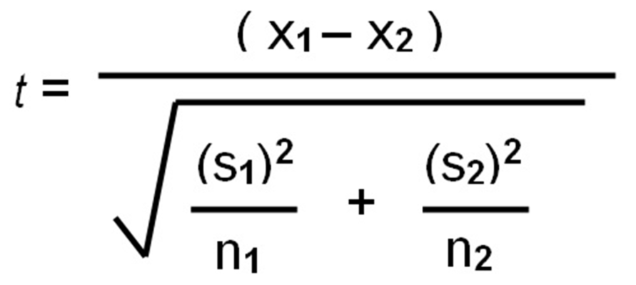

## Table of Contents

## What is statistical significance?

Statistical significance is a way to figure out if the results of a study or experiment are due to chance or if they show a real effect. Imagine you are testing a new medicine and you find that it works better than an old medicine. You want to know if this difference is because the new medicine is actually better or if it could just be a random fluke. Statistical significance helps you decide this by using math to see how likely it is that your results happened by chance.

To determine statistical significance, researchers use something called a p-value. The p-value is a number that tells you the probability that your results are due to random chance. If the p-value is very small (usually less than 0.05), it means that it's unlikely your results are just a coincidence, and you can say your results are statistically significant. This doesn't mean the results are important or big, just that they are probably not due to chance. It's a helpful tool in science to make sure the conclusions drawn from data are trustworthy.

## Why is statistical significance important in research?

Statistical significance is really important in research because it helps researchers know if their findings are real or just by chance. When scientists do experiments or surveys, they collect a lot of data. They want to make sure that any patterns or results they see are because of what they were studying, not just random luck. By using statistical significance, they can say with more confidence that their results are meaningful and not something that happened by accident.

For example, if a researcher is testing a new way to teach math and finds that students do better with this new method, they need to check if this improvement is statistically significant. If it is, they can be pretty sure that the new teaching method really makes a difference, not just that they got lucky with the group of students they tested. This helps other people trust the research and maybe even use the new method in schools. Without checking for statistical significance, we might end up believing in things that aren't really true, which can lead to wasting time and resources on ideas that don't work.

## How does statistical significance differ from practical significance?

Statistical significance and practical significance are two different things that researchers look at when they study data. Statistical significance tells you if the results of a study are likely to be true and not just by chance. It uses math to see how likely it is that the results happened randomly. If the results are statistically significant, it means they probably show a real effect. But this doesn't tell you if the effect is big or important in real life.

Practical significance, on the other hand, is about whether the results matter in the real world. Even if a result is statistically significant, it might not make a big difference in everyday life. For example, a new medicine might show a tiny improvement over an old one, and this improvement could be statistically significant. But if the improvement is so small that it doesn't really help patients feel better, then it's not practically significant. So, researchers need to look at both types of significance to understand if their findings are both real and useful.

In short, statistical significance is about the math and the likelihood that results are not due to chance, while practical significance is about the real-world impact and importance of those results. Both are important, but they tell us different things about the data we collect.

## What is a p-value and how is it used to determine statistical significance?

A p-value is a number that helps researchers decide if their results are real or just by chance. It tells you how likely it is that the results of a study happened randomly. Imagine you are flipping a coin and it comes up heads 10 times in a row. That's pretty surprising, right? The p-value would tell you how likely it is that this happened by chance. If the p-value is small, it means it's not very likely that your results are just a fluke.

To determine statistical significance, researchers compare the p-value to a number they pick ahead of time, usually 0.05. If the p-value is smaller than this number, they say the results are statistically significant. This means they can be pretty sure that what they found is real and not just random luck. For example, if a new medicine helps people more than an old one, and the p-value is less than 0.05, researchers would say the new medicine really does work better. It's like a way to check if the results are trustworthy before making big decisions based on them.

## What is the null hypothesis and how does it relate to statistical significance?

The null hypothesis is a starting point in research that says there is no real effect or difference between what you're studying. It's like saying, "Nothing special is happening here; any results we see are just by chance." For example, if you're testing a new medicine, the null hypothesis would be that the new medicine works the same as the old one, and any difference you see is just random luck.

Statistical significance comes into play when you want to test if the null hypothesis is true or not. Researchers use data to calculate a p-value, which tells them how likely it is that the results happened by chance. If the p-value is small enough (usually less than 0.05), they can reject the null hypothesis. This means they have enough evidence to say that something real is happening, and it's not just random chance. So, statistical significance helps decide if you should believe that the null hypothesis is wrong and that your results show a real effect.

## What are the common thresholds for determining statistical significance?

The most common threshold for determining statistical significance is a p-value of 0.05. This means that if the p-value from your study is less than 0.05, you can say your results are statistically significant. It's like saying there's less than a 5% chance that your results happened just by luck. Scientists chose this number because it's a good balance between being strict enough to trust the results and not so strict that you miss real effects.

Sometimes, researchers use other thresholds too. For example, a p-value of 0.01 is used when they want to be even more sure that the results are not due to chance. This means there's less than a 1% chance that the results are random. On the other hand, in some fields like social sciences, a p-value of 0.10 might be used if they want to be a bit less strict and catch more possible effects, even if they're not as certain. The choice of threshold depends on how sure the researchers want to be and what's normal in their field of study.

## How do you calculate a p-value for a given dataset?

Calculating a p-value involves using statistical tests that depend on the type of data and the question you're trying to answer. For example, if you're comparing the average scores of two groups, you might use a t-test. First, you gather your data and calculate the difference between the groups. Then, you use the t-test formula to find out how big this difference is compared to what you would expect by chance. The t-test gives you a t-statistic, which you then use to find the p-value. You can look up the t-statistic in a t-distribution table or use a computer program to find the p-value directly.

The p-value tells you the probability of getting results as extreme as yours if the null hypothesis were true. If the p-value is small, it means it's unlikely that your results happened by chance, and you might reject the null hypothesis. For example, if you're using the common threshold of 0.05, and your p-value is less than 0.05, you say your results are statistically significant. Different statistical tests like chi-square tests for categorical data or ANOVA for comparing multiple groups have their own ways of calculating p-values, but the idea is the same: they all help you figure out how likely your results are due to random chance.

## What are the different statistical tests used to assess significance, and when should each be used?

There are several statistical tests used to assess significance, and the choice of test depends on the type of data and the research question. The t-test is used when you want to compare the means of two groups, like comparing the average test scores of students taught by two different methods. If your data is normally distributed and you're looking at means, the t-test is a good choice. Another common test is the chi-square test, which is used for categorical data, like checking if there's a relationship between gender and preference for a certain type of food. The chi-square test helps you see if the observed frequencies in your data are different from what you would expect by chance. For comparing more than two groups, like comparing test scores across three different teaching methods, you might use an ANOVA (Analysis of Variance). ANOVA helps you figure out if there are any significant differences among the group means.

There are also tests for different situations. The Mann-Whitney U test is used when your data isn't normally distributed and you want to compare two groups, like comparing the time it takes for two different groups to complete a task. If you're looking at the relationship between two continuous variables, like the correlation between hours of study and exam scores, you might use a Pearson correlation test. For non-normally distributed continuous data, the Spearman correlation test is a better choice. Lastly, regression analysis is used when you want to see how one or more variables affect another variable, like how diet and exercise affect weight loss. Each of these tests helps you figure out if the patterns you see in your data are statistically significant, meaning they're likely not due to random chance.

## How does sample size affect the calculation of statistical significance?

Sample size plays a big role in figuring out if something is statistically significant. When you have a bigger sample size, your results are more reliable because you have more data to work with. It's like having more puzzle pieces to see the whole picture. With a larger sample, even small differences between groups can be found to be statistically significant because the p-value, which measures the chance of your results happening by luck, gets smaller as the sample size grows. This means you're more likely to catch real effects that might be missed with a smaller sample.

However, a larger sample size isn't always the answer. If your sample is too small, you might miss real effects because the p-value might not be small enough to show statistical significance, even if there's a real difference. On the other hand, with a very large sample, even tiny differences that aren't important in real life can seem statistically significant. So, it's important to think about both the size of your sample and what the results mean in the real world, not just whether they're statistically significant.

## What are Type I and Type II errors, and how do they impact the interpretation of statistical significance?

Type I and Type II errors are mistakes that can happen when you're trying to figure out if something is statistically significant. A Type I error happens when you think you've found a real effect, but it's actually just by chance. This is like saying a new medicine works better when it really doesn't. You're supposed to keep this mistake small by setting a strict p-value, like 0.05, but sometimes it still happens. When you see a result as statistically significant, there's still a small chance it's a Type I error, so you need to be careful.

A Type II error is the opposite. It happens when you miss a real effect because you think it's just random chance. This is like saying a new medicine doesn't work when it actually does. This kind of mistake can happen if your sample size is too small or if you're not looking closely enough. To avoid Type II errors, you can use a bigger sample or look for smaller differences, but you have to balance this with the risk of Type I errors. Both types of errors can make it hard to trust your results, so it's important to understand them when you're interpreting whether something is statistically significant.

## How can confidence intervals be used alongside p-values to better understand statistical significance?

Confidence intervals and p-values both help us understand if the results of a study are real or just by chance. A confidence interval is like a range of numbers that likely includes the true effect you're studying. If you're testing a new medicine, the confidence interval tells you the range of improvement you can expect. If this range doesn't include zero, it suggests that the medicine has a real effect, which is similar to what a p-value less than 0.05 would tell you. So, a confidence interval can give you more information than just a p-value because it shows you the size of the effect, not just whether it's statistically significant.

Using both confidence intervals and p-values together gives you a fuller picture. The p-value tells you how likely it is that your results happened by chance, but it doesn't tell you how big the effect is. The confidence interval fills in this gap by showing you the range of possible effects. If the confidence interval is narrow and doesn't include zero, you can be pretty sure the effect is real and also get an idea of how big it is. This helps you understand not just if something is statistically significant, but also if it's important in the real world.

## What advanced techniques exist for handling multiple comparisons in statistical testing?

When you do a lot of statistical tests at the same time, like comparing many groups or looking at different outcomes, you might run into a problem called multiple comparisons. This means you're more likely to find something that looks important just by chance, even if it's not real. To fix this, scientists use special techniques. One common way is the Bonferroni correction, which makes it harder for results to be called statistically significant by adjusting the p-value threshold. If you're doing 10 tests, for example, you might need a p-value smaller than 0.005 instead of 0.05 to say something is significant. This helps lower the chance of making a mistake and saying something is real when it's not.

Another technique is the False Discovery Rate (FDR) method, which is a bit less strict than the Bonferroni correction. Instead of trying to avoid all mistakes, FDR focuses on keeping the number of false positives low while still finding real effects. It does this by setting a rate, like 5%, for how many of the significant results might be wrong. This is useful when you're doing a lot of tests and you want to balance finding real effects with not making too many mistakes. Both of these methods help scientists make better sense of their data when they're doing lots of tests at once.

## How do you calculate statistical significance?

The calculation of statistical significance is a critical process in evaluating whether an observed effect in data is likely due to random chance or a definitive [factor](/wiki/factor-investing). Central to this process is the concept of the p-value, a statistical measure calculated through various tests to assess the probability of observing an effect at least as extreme as the one measured, assuming the null hypothesis is true.

A p-value is considered significant if it falls below a predetermined threshold level, commonly set at 0.05. This threshold implies that there is less than a 5% likelihood that the observed results are due to random variation alone. For instance, a p-value of 0.03 would suggest strong evidence against the null hypothesis, leading to the rejection of the hypothesis that the results are due to chance.

In practical applications, numerous tools and software facilitate the computation of p-values. Microsoft Excel, for example, provides built-in functions such as T.TEST, CHISQ.TEST, and ANOVA, which users can employ to perform statistical significance tests directly on their datasets. Additionally, more advanced statistical software and programming languages like Python offer a range of libraries, including SciPy and StatsModels, that enable more complex analyses and computations.

Pivotal to accurate calculation is the comprehensive consideration of factors such as sample size, error margin, and the representativeness of the sample. A larger sample size generally increases the reliability of results by reducing the margin of error and enhancing the power of the statistical test. Ensuring that the sample is representative prevents biases that may skew results, leading to erroneous conclusions.

The formula for calculating a p-value in a simple z-test, for example, involves determining the z-score, which quantifies the number of standard deviations a data point is from the mean. The z-score can be calculated using:

$$
z = \frac{\bar{x} - \mu}{\frac{\sigma}{\sqrt{n}}}
$$

where $\bar{x}$ is the sample mean, $\mu$ is the population mean, $\sigma$ is the standard deviation, and $n$ is the sample size. The p-value can then be derived from the z-score using standard statistical tables or software functions.

By accurately calculating statistical significance, traders and analysts can make data-driven decisions that better inform their strategies, reducing the likelihood of erroneous conclusions based on random noise rather than substantive market trends.

## What are the types of statistical significance tests?

In the assessment of statistical significance, a variety of tests are employed, each designed to suit specific data characteristics and research objectives. These tests help determine if observed differences or relationships in data are likely to be genuine or merely the result of random variations.

### Common Statistical Tests

1. **T-Test**: Used primarily to compare the means of two groups, the t-test is applicable when the data follows a normal distribution and the sample size is relatively small. It assesses whether the differences in the sample means are significant enough to suggest that they reflect distinct population means. For example, in evaluating an algorithm's profitability before and after a parameter change, a t-test can determine if the change has statistically affected the average returns.

   The t-test formula is:
$$
   t = \frac{\bar{x}_1 - \bar{x}_2}{\sqrt{\frac{s_1^2}{n_1} + \frac{s_2^2}{n_2}}}

$$
   where $\bar{x}_1$ and $\bar{x}_2$ are the sample means, $s_1^2$ and $s_2^2$ are the variances, and $n_1$ and $n_2$ are the sample sizes.

2. **Chi-Square Test**: This test is quintessential for categorical data, checking the association between variables. It evaluates whether the observed frequencies in a contingency table match expected frequencies if no association exists. In trading, it might be used to analyze the independence of a trading signal's success across different market conditions.

   The chi-square statistic is calculated as:
$$
   \chi^2 = \sum \frac{(O_i - E_i)^2}{E_i}

$$
   where $O_i$ is the observed frequency and $E_i$ is the expected frequency.

3. **ANOVA (Analysis of Variance)**: ANOVA is used when comparing the means of three or more groups, determining if at least one of the group means differs significantly. It is suitable for scenarios where multiple algorithm configurations are tested, and the objective is to identify if performance varies significantly among settings.

   The F-statistic, central to ANOVA, is computed as:
$$
   F = \frac{\text{Variance between groups}}{\text{Variance within groups}}

$$

### Application in Algorithmic Trading

Algorithmic trading often requires the evaluation of strategies concerning their average returns, variability, and how these distributions appear over time or different market regimes. Selecting the appropriate statistical test in these analyses is paramount. For instance, a t-test might be employed to assess if a strategy's returns are significantly different before and after a market event, while ANOVA might be used to compare performance across multiple trading strategies simultaneously.

Choosing the right statistical test is critical. It ensures that conclusions drawn reflect true market dynamics rather than artifacts of the chosen methodology. Mismatches between the test type and data characteristics can lead to misleading results, impacting trading decisions and strategies' validity. Hence, understanding the context and nature of the data is essential for selecting the test that provides the most meaningful insights.

## What is the role of statistical significance in algorithmic trading?

Algorithmic trading relies heavily on statistical significance to differentiate effective strategies from those that merely capitalize on random market fluctuations. Essential techniques in assessing statistical significance include the use of z-scores, which help measure how much a trading strategy's performance deviates from the expected mean. The z-score is calculated using the formula:

$$
z = \frac{X - \mu}{\sigma}
$$

where $X$ is the value of the strategy's returns, $\mu$ is the mean of the dataset, and $\sigma$ is the standard deviation. A high absolute value of a z-score indicates that a strategy's performance is unlikely due to random chance, implying a statistically significant result.

The core of significance assessments in trading also includes concepts like the 68-95-99.7 rule, normal distribution, and standard deviations. This rule, also known as the empirical rule, states that in a normal distribution:

- About 68% of observations fall within one standard deviation ($\sigma$) of the mean.
- Roughly 95% fall within two standard deviations ($2\sigma$).
- Approximately 99.7% lie within three standard deviations ($3\sigma$).

This rule helps traders understand the likelihood of extreme outcomes given a normally distributed set of returns.

Backtesting is another critical component of assessing statistical significance in algorithmic trading. It involves simulating a strategy using historical data to see how it would have performed. By conducting backtests across a significant number of trades, traders can gain confidence in their findings. This process helps minimize the impact of randomness by highlighting consistent patterns or results over time. A well-executed backtest that shows statistically significant results can suggest that the strategy is sound and not simply a product of chance occurrences. However, care must be taken to avoid overfitting—a scenario where a model is too closely tailored to historical data and performs poorly in live markets.

## References & Further Reading

[1]: Bergstra, J., Bardenet, R., Bengio, Y., & Kégl, B. (2011). ["Algorithms for Hyper-Parameter Optimization."](https://papers.nips.cc/paper/4443-algorithms-for-hyper-parameter-optimization) Advances in Neural Information Processing Systems 24.

[2]: ["Advances in Financial Machine Learning"](https://www.amazon.com/Advances-Financial-Machine-Learning-Marcos/dp/1119482089) by Marcos Lopez de Prado

[3]: ["Evidence-Based Technical Analysis: Applying the Scientific Method and Statistical Inference to Trading Signals"](https://www.amazon.com/Evidence-Based-Technical-Analysis-Scientific-Statistical/dp/0470008741) by David Aronson

[4]: ["Machine Learning for Algorithmic Trading"](https://github.com/stefan-jansen/machine-learning-for-trading) by Stefan Jansen

[5]: ["Quantitative Trading: How to Build Your Own Algorithmic Trading Business"](https://www.amazon.com/Quantitative-Trading-Build-Algorithmic-Business/dp/1119800064) by Ernest P. Chan