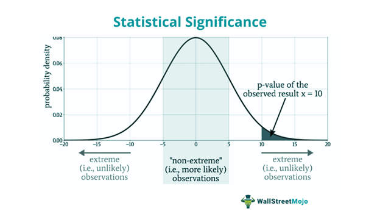

## Table of Contents

## What is statistics and why is it important?

Statistics is a branch of mathematics that deals with collecting, organizing, analyzing, interpreting, and presenting data. It helps us understand and make sense of large amounts of information by using numbers and facts. For example, statistics can tell us the average height of people in a country or how many people like a certain type of food.

Statistics is important because it helps us make better decisions in many areas of life. In healthcare, doctors use statistics to understand the effectiveness of treatments and to predict health outcomes. In business, companies use statistics to understand customer behavior and to make decisions about products and services. By using statistics, we can make more informed choices and solve problems more effectively.

## What are the main branches of statistics?

The main branches of statistics are descriptive statistics and inferential statistics. Descriptive statistics is about organizing and summarizing data in a way that makes it easy to understand. It uses things like averages, charts, and graphs to show what the data looks like. For example, if you want to know the average age of students in a school, descriptive statistics would help you find that out.

Inferential statistics goes a step further. It uses the data from a small group, called a sample, to make guesses or predictions about a larger group, called a population. For example, if you survey a small number of people about their favorite type of music, inferential statistics can help you guess what the whole city might like. This branch of statistics is important because it helps us make decisions even when we can't study everyone.

Both branches are important and work together. Descriptive statistics gives us a clear picture of the data we have, while inferential statistics helps us use that data to understand bigger questions. Together, they make statistics a powerful tool for understanding the world around us.

## How do descriptive statistics differ from inferential statistics?

Descriptive statistics is all about taking the data you have and making it easy to understand. It uses things like averages, charts, and graphs to show what the data looks like. For example, if you want to know how tall students in a class are on average, descriptive statistics would help you figure that out. It's like taking a big pile of numbers and turning it into something simple that anyone can see and understand.

Inferential statistics, on the other hand, is about making guesses or predictions based on the data you have. It uses a smaller group of data, called a sample, to say something about a bigger group, called a population. For example, if you survey a few people about their favorite ice cream flavor, inferential statistics can help you guess what the whole town might like. It's like using a little bit of information to make smart guesses about a lot more.

Both types of statistics are important and they work together. Descriptive statistics helps you see what your data is saying clearly, while inferential statistics helps you use that data to answer bigger questions. Together, they make statistics a powerful tool for understanding and making decisions about the world around us.

## What are common measures of central tendency and how are they calculated?

Common measures of central tendency are the mean, median, and mode. The mean is what most people call the average. To find the mean, you add up all the numbers in your data set and then divide by how many numbers there are. For example, if you have test scores of 80, 85, and 90, you add them up to get 255, and then divide by 3 to get a mean of 85. The median is the middle number when you line up all your numbers from smallest to biggest. If you have an odd number of values, it's easy to find the middle one. If you have an even number, you take the average of the two middle numbers. For example, with the numbers 10, 20, 30, 40, the median is 25, which is the average of 20 and 30. The mode is the number that shows up the most in your data set. If you have the numbers 1, 2, 2, 3, 4, the mode is 2 because it appears more often than the other numbers.

These measures help us understand where the center of our data is. The mean gives us a good overall average, but it can be affected a lot by very high or very low numbers, which we call outliers. The median is better when you have outliers because it doesn't change as much when those extreme numbers are in your data. The mode is useful when you want to know which value is most common, which can be helpful in things like figuring out what size of shoes to stock in a store. Each measure has its own use, and choosing the right one depends on what you're trying to learn from your data.

## What are measures of variability and why are they important?

Measures of variability tell us how spread out or different the numbers in a set of data are. They help us understand if the data is all bunched together or if it's spread out a lot. Common measures of variability include the range, which is the difference between the highest and lowest numbers; the variance, which looks at how far each number is from the average; and the standard deviation, which is the square root of the variance and tells us how much the numbers vary from the average in the same units as the data.

These measures are important because they give us more information about the data than just knowing the average. For example, if you know the average test score in a class is 80, that's good, but it doesn't tell you if everyone got around 80 or if some got 100 and others got 60. Knowing the variability helps us understand how consistent or diverse the data is, which can be crucial for making decisions or predictions. In healthcare, for instance, knowing the variability in patient recovery times can help doctors better plan treatments and resources.

## How does probability relate to statistics?

Probability is like the building block of statistics. It helps us understand the chances of something happening. When we use statistics, we often want to know how likely it is that our results are true for a bigger group, not just the small group we studied. Probability helps us figure that out. For example, if we flip a coin, probability tells us there's a 50% chance it will land on heads. In statistics, if we survey a small group of people, probability helps us guess how likely it is that the whole population feels the same way.

Probability also helps us understand uncertainty in statistics. When we collect data, we can never be 100% sure about our conclusions. Probability gives us a way to measure that uncertainty. It's like saying, "We're pretty sure our results are right, but there's a small chance they could be wrong." This is really important in fields like medicine, where doctors use probability to understand how likely a treatment is to work for different patients. By understanding probability, we can make better decisions and predictions based on the data we have.

## What is a sampling distribution and why is it important in statistics?

A sampling distribution is like a special kind of chart that shows us what happens when we take many samples from a big group and look at the results. Imagine you want to know the average height of all the students in a big school. You can't measure everyone, so you take a smaller group, or a sample, and measure their heights. If you do this many times, you'll get lots of different averages. The sampling distribution is a way to see all those averages together and understand how they spread out.

This is really important in statistics because it helps us make good guesses about the whole group, even if we only look at a small part of it. When we know how the averages from our samples are spread out, we can figure out how confident we should be in our guesses. For example, if the averages from different samples are usually pretty close together, we can be pretty sure our guess about the whole school's average height is right. But if the averages are all over the place, we need to be more careful because our guess might not be as good. So, the sampling distribution helps us understand how reliable our data is and make better decisions.

## What is hypothesis testing and how is it conducted?

Hypothesis testing is a way to check if something we believe is true or not, using data. Imagine you think a new medicine helps people sleep better. You want to test this idea, called a hypothesis, to see if it's really true. In hypothesis testing, you start with two ideas: the null hypothesis, which says the medicine doesn't help, and the alternative hypothesis, which says it does. You then collect data from people who take the medicine and those who don't, and compare the results to see if the medicine makes a difference.

To conduct hypothesis testing, you follow a few steps. First, you collect your data carefully, making sure it's good and fair. Then, you use statistics to figure out if the difference you see between the groups is big enough to say the medicine works. You do this by calculating something called a p-value, which tells you how likely it is that the difference happened by chance. If the p-value is small, it means the difference is probably real, and you can say the medicine helps people sleep better. If it's not, you stick with the null hypothesis and say the medicine doesn't make a difference. This way, you can make smart decisions based on the evidence you have.

## How do confidence intervals work and what do they tell us?

A confidence interval is a way to show how sure we are about a number we found from data. Imagine you want to know the average height of all the students in a big school. You can't measure everyone, so you take a smaller group, or a sample, and find their average height. A confidence interval gives you a range of numbers around that average that you can be pretty sure includes the real average height of all the students. For example, if your sample average is 65 inches, a 95% confidence interval might be from 63 to 67 inches. This means you're 95% sure the true average height of all the students is somewhere between 63 and 67 inches.

Confidence intervals are really helpful because they show us how much we can trust our data. The wider the interval, the less sure we are about the exact number. If the interval is narrow, like from 64 to 66 inches, we can be more confident that the real average is close to what we found. This is important in many fields, like medicine, where doctors use confidence intervals to understand how well a treatment works. It helps them make better decisions by showing not just the average result, but also how much that result might change if they looked at more people.

## What are the assumptions underlying common statistical tests like t-tests and ANOVA?

Common statistical tests like t-tests and ANOVA have some important assumptions that need to be true for the results to be reliable. For t-tests, which compare the means of two groups, one big assumption is that the data in each group is normally distributed. This means the data should look like a bell curve if you draw it on a graph. Another assumption is that the variances, or how spread out the data is, are the same in both groups. This is called the assumption of homogeneity of variance. If these assumptions aren't met, the t-test might not give you the right answer.

ANOVA, which stands for Analysis of Variance and compares means across more than two groups, also assumes that the data in each group is normally distributed. Like the t-test, it assumes that the variances are the same across all the groups being compared. Additionally, ANOVA assumes that the observations are independent, meaning that the result for one person or thing doesn't affect the result for another. If these assumptions are not met, the results of the ANOVA might not be trustworthy, and you might need to use a different kind of test or adjust your data.

Checking these assumptions is really important before you do a t-test or ANOVA. If the assumptions are not met, you might need to transform your data or use a different kind of test that doesn't need those assumptions. This helps make sure your results are as accurate and reliable as possible.

## How can statistical software enhance the analysis of data?

Statistical software makes it easier and faster to analyze data. It can do things like calculating averages, finding out how spread out the data is, and making charts and graphs with just a few clicks. This saves a lot of time compared to doing everything by hand. Plus, it helps avoid mistakes that can happen when you're working with a lot of numbers. For example, if you want to know the average height of students in a school, the software can quickly do the math and show you the result. It can also help you see if your data follows the rules needed for certain tests, like making sure it's normally distributed.

Using statistical software also lets you do more advanced things that might be hard to do on your own. It can run tests like t-tests and ANOVA to see if there are real differences between groups, and it can help you understand how likely those differences are to be true. The software can also create confidence intervals, which show how sure you can be about your results. This is really helpful in fields like medicine or business, where understanding the data well can lead to better decisions. By using statistical software, you can get a clearer picture of your data and make smarter choices based on what you find.

## What are advanced statistical techniques like regression analysis and their applications?

Regression analysis is a fancy way of figuring out how different things are connected. Imagine you want to know if studying more hours helps you get better grades. Regression analysis can help you see if there's a link between the hours you study and the grades you get. It does this by making a line or curve that shows how one thing, like study time, affects another thing, like grades. There are different kinds of regression, like simple linear regression, which looks at just two things, and multiple regression, which can look at many things at once. For example, you could use multiple regression to see how study time, sleep, and eating habits all affect your grades together.

These advanced techniques are used in a lot of places. In business, companies use regression analysis to understand things like how price changes affect how much people buy, or how advertising impacts sales. In healthcare, doctors might use it to see how different treatments affect patient recovery times. By understanding these connections, people can make better decisions. For example, a company might decide to lower prices if regression analysis shows it will lead to more sales. Or a doctor might choose a certain treatment if it's shown to help patients get better faster. Regression analysis helps us see patterns in data that we might not notice otherwise, making it a powerful tool for understanding and improving the world around us.

## What is Understanding Statistics?

Statistics is a branch of mathematics that focuses on the processes of collecting, analyzing, interpreting, and presenting data. It provides a systematic framework to make sense of data by employing a diverse array of methodologies. Statistics is pivotal in numerous applications, as it enables the derivation of meaningful patterns and insights from often complex datasets.

The primary goal of statistics is to derive properties about an entire population by analyzing a representative sample. This is facilitated through statistical inference, which allows researchers to make educated conclusions about a larger population based on the analysis of sample data. This process involves estimating unknown population parameters and testing hypotheses.

Key components of statistics include:

1. **Descriptive Statistics**: This component involves summarizing and organizing data to make it easily interpretable. Descriptive statistics use measures such as mean, median, and mode for central tendency, and standard deviation and variance for variability. Graphical tools such as histograms, pie charts, and box plots also provide visual summaries of the data.

2. **Inferential Statistics**: This component extends beyond describing data to making inferences and predictions. Inferential statistics involve determining relations and drawing conclusions about population parameters based on sample data. Techniques include hypothesis testing, confidence intervals, and regression analysis. For instance, a hypothesis test might evaluate whether a new drug significantly affects patient outcomes compared to a standard treatment. 

3. **Statistical Data Understanding**: This involves comprehending the underlying structure of data and the patterns it reveals. It encompasses techniques for identifying trends, recognizing outliers, and understanding relationships among variables. Robust data understanding often employs visualizations and exploratory data analysis methods to interpret the data contextually before applying more formal statistical models.

In the context of analysis and modeling, statistical methods employ mathematical formulas rooted in probability theories. For example, the formula for a sample mean $\bar{x}$ is:

$$
\bar{x} = \frac{1}{n}\sum_{i=1}^{n} x_i
$$

where $x_i$ represents each data point in the sample and $n$ is the sample size. Such formulas are fundamental for both descriptive measures and inferential analysis.

Python, a versatile programming language, is extensively used for statistical computations. Libraries such as NumPy, pandas, and SciPy provide tools for statistical analysis. A simple example in Python to compute mean and standard deviation of a dataset would be:

```python
import numpy as np

data = [87, 76, 94, 88, 90, 78, 85]
mean = np.mean(data)
std_dev = np.std(data)

print(f"Mean: {mean}, Standard Deviation: {std_dev}")
```

Understanding these statistical components is essential for deriving insights from data and making informed decisions based on data analysis.

## What are the types of statistics?

Statistics can be categorized into two primary types: descriptive and inferential [statistics](/wiki/bayesian-statistics). Each type serves a distinct purpose in the analysis, interpretation, and presentation of data.

### Descriptive Statistics

Descriptive statistics aim to summarize and organize data in a manner that is informative and straightforward. This type typically involves calculations of central tendency and measures of variability.

1. **Mean**: Represents the average value of a dataset, calculated by dividing the sum of all data points by the number of points. In mathematical terms, for a dataset $X$ comprising values $x_1, x_2, \ldots, x_n$, the mean $\bar{x}$ is given by:
$$
   \bar{x} = \frac{1}{n} \sum_{i=1}^{n} x_i

$$

2. **Median**: The middle value when data points are arranged in ascending order. If the number of observations ($n$) is odd, the median is the middle number; if $n$ is even, it is the average of the two middle numbers.

3. **Mode**: Identifies the most frequently occurring value within a dataset. A dataset may have one mode, more than one mode, or no mode at all if all values occur with the same frequency.

Additionally, descriptive statistics use graphical representations to visualize data trends and patterns, such as histograms, bar charts, and box plots, which can highlight distributions and outliers effectively.

### Inferential Statistics

Inferential statistics involve making predictions or drawing conclusions about a population based on a sample. This branch of statistics is supported by various methods that enable researchers to estimate population parameters, test hypotheses, and model relationships between variables.

1. **Hypothesis Testing**: It assesses assumptions through p-values and confidence intervals. Common tests include t-tests, chi-square tests, and ANOVA.

2. **Regression Analysis**: It evaluates the relationship between dependent and independent variables. Linear regression, for example, estimates the line that best fits the data, minimizing the sum of squared differences between observed and predicted values.

3. **Confidence Intervals**: These intervals provide a range of values within which the population parameter is expected to lie, offering a measure for the reliability of an estimate.

Inferential statistics rely heavily on sampling techniques to ensure that the sample accurately represents the population.

### Sampling Techniques

Sampling techniques are vital for collecting representative data efficiently and include several methods:

- **Simple Random Sampling**: Every member of the population has an equal chance of being selected. This randomness ensures that the sample is unbiased.

- **Stratified Sampling**: The population is divided into distinct strata, or groups, and samples are drawn from each group. This technique ensures that subgroups are adequately represented.

- **Cluster Sampling**: Involves dividing the population into clusters and then randomly selecting entire clusters. It is cost-effective and convenient, although it may introduce bias if clusters are not representative of the population.

Each method has unique advantages and considerations influenced by the nature and purpose of the study. Proper sampling techniques enhance the validity of inferential statistics, ensuring accurate and reliable conclusions.

## What is the importance of statistics?

Statistics play a crucial role in driving decision-making processes within various sectors, including finance, healthcare, and business. Leveraging quantitative data to guide decisions enables organizations to move beyond intuition, allowing for more accurate and reliable conclusions. The application of statistics ensures decisions are based on empirical evidence rather than conjecture.

One of the primary advantages of using statistics is the facilitation of data-driven decisions and informed predictions. In finance, for example, statistical analyses help derive future price predictions and assess portfolio risks, informing investment strategies. Techniques, such as time series analysis, are employed to model and forecast financial data over time. In such cases, the Autoregressive Integrated Moving Average (ARIMA) model is a popular choice due to its ability to capture various statistical properties of time series data:

$$
ARIMA(p, d, q)
$$

Here, $p$ refers to the number of lag observations included in the model, $d$ represents the number of times that the raw observations are differenced, and $q$ indicates the size of the moving average window. This model aids in making predictions based on past observations, a staple in financial analysis.

Another essential contribution of statistics is the evaluation of trends, hypothesizing testing, and insight derivation from complex data sets. Within healthcare, statistical methods are vital in clinical trials to determine the efficacy of new treatments. Hypothesis testing, such as using a t-test or chi-square test, allows researchers to make statistical inferences about their data. For instance, a researcher might use:

$$
t = \frac{\bar{X} - \mu}{\frac{s}{\sqrt{n}}}
$$

Where $\bar{X}$ is the sample mean, $\mu$ is the population mean, $s$ is the sample standard deviation, and $n$ is the sample size. Such formulas aid in determining whether there is a statistically significant difference between groups.

In business, statistical methods offer insights into consumer behavior, optimizing marketing strategies and operational efficiencies. Regression analysis, for example, helps in understanding relationships between different business metrics and can guide strategic planning by identifying key performance indicators.

Overall, statistics provide a structured approach to analyzing data, facilitating informed decision-making. By utilizing statistical techniques, organizations can identify significant patterns, make reliable predictions, and gain deep insights into diverse data sets, eventually leading to more effective strategies and outcomes.

## References & Further Reading

[1]: Bergstra, J., Bardenet, R., Bengio, Y., & Kégl, B. (2011). ["Algorithms for Hyper-Parameter Optimization."](https://papers.nips.cc/paper/4443-algorithms-for-hyper-parameter-optimization) Advances in Neural Information Processing Systems 24.

[2]: ["Advances in Financial Machine Learning"](https://www.amazon.com/Advances-Financial-Machine-Learning-Marcos/dp/1119482089) by Marcos Lopez de Prado

[3]: ["Evidence-Based Technical Analysis: Applying the Scientific Method and Statistical Inference to Trading Signals"](https://www.amazon.com/Evidence-Based-Technical-Analysis-Scientific-Statistical/dp/0470008741) by David Aronson

[4]: ["Machine Learning for Algorithmic Trading"](https://github.com/PacktPublishing/Machine-Learning-for-Algorithmic-Trading-Second-Edition) by Stefan Jansen

[5]: ["Quantitative Trading: How to Build Your Own Algorithmic Trading Business"](https://www.amazon.com/Quantitative-Trading-Build-Algorithmic-Business/dp/1119800064) by Ernest P. Chan