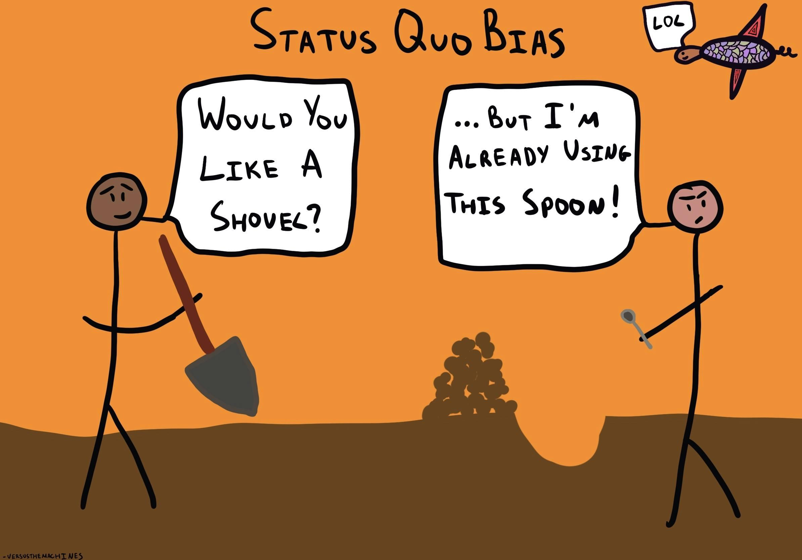

Status quo bias, a cognitive preference for maintaining existing conditions, significantly influences algorithmic trading. In this context, algorithmic trading refers to the use of computer systems to automate and execute trading strategies based on pre-defined criteria. Traders often exhibit status quo bias by over-relying on familiar algorithms or resisting adjustments to their trading strategies despite market changes. Understanding how this bias manifests in algorithmic trading can illuminate its impact on financial decision-making and trading outcomes.

Cognitive biases, generalized errors in thinking that affect decisions and judgments, play a critical role in shaping trading strategies. These biases can lead traders to favor certain decisions, not because they offer favorable outcomes, but because they align with ingrained preferences or heuristics. Status quo bias, in particular, may cause traders to remain committed to outdated strategies or algorithms, thus potentially jeopardizing their financial performance. This bias can lead to a preference for maintaining the current state of a portfolio, avoiding the potential complexities and perceived risks of change.



Recognizing and addressing status quo bias is crucial for improving trading outcomes. Traders who identify and mitigate this bias can adapt more effectively to market volatility and evolving investment landscapes. By understanding the cognitive underpinnings of their decision-making processes, traders strive for increased flexibility and responsiveness, leading to more efficient and profitable trading strategies. Ultimately, acknowledging the impact of status quo bias and integrating strategies to counteract its effects can optimize the management and performance of trading portfolios.

## Table of Contents

## Defining Status Quo Bias in Algorithmic Trading

Status quo bias is a cognitive preference for maintaining existing conditions rather than changing them. This bias manifests in [algorithmic trading](/wiki/algorithmic-trading) when traders exhibit a propensity to stick with their current strategies, assets, or portfolio allocations, even in the face of new information that suggests a change might be beneficial. This reluctance to change can lead to suboptimal trading performance and missed opportunities for gains.

The concept of status quo bias was first introduced by Samuelson and Zeckhauser in 1988, who conducted experiments demonstrating individuals' tendency to favor the current state of affairs over an alternative option. In their studies, participants often preferred options that represented the status quo, even when all choices were presented neutrally without highlighting any existing default. This research laid the groundwork for understanding how status quo bias can influence decision-making processes, including financial and trading decisions [1].

In trading environments, status quo bias is characterized by several distinct features. First, traders may display a disproportionate attachment to previously chosen investments or strategies, which they perceive as safer or requiring less cognitive effort compared to alternatives. This can manifest in the continued investment in familiar stocks or assets, even when these may no longer align with optimal risk-reward ratios.

Additionally, status quo bias in trading is often reinforced by the default options embedded in trading platforms. These defaults can subtly encourage traders to follow pre-specified investment paths rather than exploring new configurations. For example, an algorithmic trading platform might offer pre-set portfolio allocations or suggest commonly traded assets as defaults, leading users to perceive these options as implicitly endorsed choices.

Furthermore, loss aversion, another well-documented cognitive bias, interacts with status quo bias by exaggerating the potential negatives of deviating from the current state. Traders are often more sensitive to losses than equivalent gains, making them more likely to stick with their existing strategies to avoid realizing a loss, even if a change could result in long-term benefits.

Understanding these characteristics of status quo bias and how they emerge in algorithmic trading is vital for developing strategies to mitigate its effects. Traders and algorithm developers need to be aware of the subtle forces that promote inertia and work to counteract them through deliberate, data-driven decision-making and frequent reevaluations of current strategies.

References:
[1] Samuelson, W., & Zeckhauser, R. (1988). Status Quo Bias in Decision Making. Journal of Risk and Uncertainty, 1(1), 7-59.

## Impact of Status Quo Bias on Trading Decisions

Status quo bias significantly impacts trading decisions by fostering a tendency among traders to resist changes in their trading strategies. This cognitive bias leads individuals to prefer maintaining their current [course](/wiki/best-algorithmic-trading-courses) of action, even in the face of new evidence suggesting that alternative strategies could yield better outcomes. In algorithmic trading, which relies heavily on data-driven decision-making, status quo bias can prevent the adoption of innovative approaches and adaptability in rapidly changing market environments.

One primary way status quo bias manifests in trading is through the default options provided by trading platforms. These platforms often set default parameters or strategies, which traders accept without question. For example, a platform might offer a default asset allocation or pre-selected technical indicators that users employ without modification. Accepting these defaults can lead to suboptimal outcomes, as traders might miss out on customized strategies better suited to their individual goals or market conditions. The perception of default settings as recommended or safer options can reinforce the status quo, limiting the exploration of more personalized and potentially lucrative trading tactics.

Loss aversion further strengthens status quo bias in trading decisions. Loss aversion, a concept introduced by Kahneman and Tversky in prospect theory, describes the tendency of individuals to prefer avoiding losses rather than acquiring equivalent gains. This aversion to loss can lead traders to stick with their existing strategies or positions, even when performance is lackluster, due to a fear of changing and realizing losses. The psychological discomfort associated with acknowledging a poor decision or a suboptimal strategy can thus act as a barrier to adopting new, possibly more profitable strategies.

In quantitative terms, the impact of loss aversion on decision-making can be represented by a utility function that is steeper for losses than gains, often modeled as:

$$
U(x) = \begin{cases} 
x^\alpha & \text{if } x \geq 0 \\
-\lambda(-x)^\alpha & \text{if } x < 0 
\end{cases}
$$

where $\lambda > 1$ reflects loss aversion, indicating that the pain of losing is stronger than the pleasure of an equivalent gain, and $\alpha$ captures the diminishing sensitivity to changes in wealth.

Overall, status quo bias and loss aversion together create a formidable resistance to change in trading strategies. Understanding and mitigating these biases is crucial for traders and algorithmic strategists seeking to optimize their decision-making processes and enhance their trading outcomes. By recognizing the influence of default settings and addressing loss aversion, traders can develop more adaptable and resilient strategies tailored to the complexities of modern financial markets.

## Real-world Examples of Status Quo Bias in Trading

Status quo bias often leads traders to cling to underperforming stocks, a behavior observable in numerous case studies. For example, during economic downturns, many traders persist in holding stocks with diminishing returns, fueled by a reluctance to deviate from familiar investments or admit losses. This adherence may arise from an emotional attachment to past choices or the misconception that conditions might revert to prior profitable states. Academic research highlights this bias as traders are less likely to alter their portfolios despite clear indicators of better opportunities elsewhere, a behavior which ultimately impacts long-term performance (Samuelson & Zeckhauser, 1988).

Resistance to new investment instruments, such as cryptocurrencies, underscores status quo bias in the trading environment. Traditional investors often exhibit hesitancy towards integrating these assets into their portfolios despite their rising prominence. Factors contributing to this resistance include perceived risk associated with cryptocurrencies' volatile nature and lack of historical data to establish familiarity. Furthermore, regulatory uncertainties and technological complexities further deter traders, reinforcing their preference for conventional instruments. This bias delays the adoption of potentially lucrative opportunities, as seen during the rapid valuation increases of cryptocurrencies like Bitcoin.

Familiarity heavily influences trading decisions, contributing to status quo bias. Traders tend to favor well-known stocks or those with which they have past experience. This preference arises from a cognitive comfort derived from what is known as the "familiarity heuristic," whereby individuals are more confident dealing with familiar entities even if better alternatives exist. Familiar companies, industries, or asset types receive disproportionate investment attention, potentially leading to suboptimal portfolio diversification. Consequently, traders might miss out on higher returns offered by less familiar but better-performing stocks.

In conclusion, status quo bias significantly affects trading practices, leading to extended holding periods of underperforming stocks, resistance to novel financial instruments, and a preference for familiar options. Understanding and counteracting this bias can enable traders to make more rational and rewarding investment decisions.

## Overcoming Status Quo Bias in Algorithmic Trading

To effectively combat status quo bias in algorithmic trading, it is essential to adopt strategies that promote diversity and data-driven decision-making. Diversification, a fundamental principle in portfolio management, serves as a practical approach to mitigating this cognitive bias. By spreading investments across various asset classes, sectors, or geographies, traders can avoid excessive risk exposure tied to a limited set of assets, thereby reducing the reliance on maintaining current investment conditions. For instance, employing the formula for calculating the variance of a portfolio's returns can aid in evaluating the benefits of diversification:

$$
\sigma^2_p = \sum_{i=1}^{n} w_i^2 \sigma_i^2 + \sum_{i=1}^{n} \sum_{j \neq i}^{n} w_i w_j \sigma_i \sigma_j \rho_{ij}
$$

where $\sigma^2_p$ is the portfolio variance, $w_i$ and $w_j$ are the asset weights, $\sigma_i^2$ is the variance of asset $i$, and $\rho_{ij}$ is the correlation between assets $i$ and $j$. A diversified portfolio typically exhibits a lower variance, reflecting a reduction in risk through diversification.

Additionally, leveraging data analytics is crucial for making informed decisions in algorithmic trading. By analyzing historical data and employing predictive algorithms, traders can identify emerging trends and patterns that may previously have gone unnoticed due to status quo bias. Machine learning models, such as decision trees or neural networks, can process large volumes of data to highlight insights that challenge the established norms, thereby aiding in the adoption of new, potentially profitable trading strategies.

Here is a simple example using Python to illustrate how to employ data analytics for diversification:

```python
import pandas as pd
from sklearn.linear_model import LinearRegression

# Load historical market data as a dataframe
market_data = pd.read_csv('market_data.csv')

# Select features and target
features = market_data[['feature1', 'feature2', 'feature3']]
target = market_data['target']

# Initialize and train the model
model = LinearRegression().fit(features, target)

# Predict future trends
predictions = model.predict(features)

# Analyze predictions for diversification
diversified_assets = [asset for asset, prediction in zip(market_data['asset'], predictions) if prediction > threshold]
```

The recommendations for challenging existing trends and assumptions involve critical examination of current trading strategies and biases. Traders should regularly review and question the assumptions underlying their algorithms. Incorporating stress testing and scenario analysis can help in understanding how new market conditions might affect trading outcomes, reinforcing a culture of adaptability and innovation.

In conclusion, overcoming status quo bias in algorithmic trading requires a multi-faceted approach, incorporating diversification, data-driven strategies, and a willingness to challenge existing assumptions. By employing these techniques, traders can improve their decision-making processes and enhance the overall performance of their trading activities.

## Psychological and Behavioral Insights

Cognitive biases significantly affect trading psychology. These biases are systematic patterns of deviation from norm or rationality in judgment, which can lead investors and traders to make illogical or unprofitable decisions. Among the myriad cognitive biases, the mere exposure effect is particularly influential in trading choices.

The mere exposure effect refers to a psychological phenomenon where individuals tend to develop a preference for things merely because they are familiar with them. In the context of trading, this can result in a bias toward familiar stocks or financial instruments, irrespective of their performance or underlying value. For example, a trader might repeatedly invest in certain blue-chip stocks because they are well-known or frequently covered in media, even if these stocks do not necessarily offer the best potential returns. This bias towards familiarity can lead to suboptimal portfolio diversification and missed opportunities in unfamiliar, yet potentially lucrative, investments.

Cognitive biases, including the mere exposure effect, can impact overall trading performance. They can lead to both overconfidence in familiar investment choices and underconfidence in lesser-known options, thus skewing the risk assessment and decision-making processes. These biases can also contribute to excessive trading, under-diversification, and poor timing in buying and selling securities. Understanding and mitigating these biases is crucial for traders striving for optimal decision-making and performance.

Strategies to reduce the influence of cognitive biases include engaging in reflective practice, seeking diverse opinions, and relying on data-driven insights. By becoming aware of these biases and actively challenging their influence, traders can improve their decision-making processes, leading to potentially enhanced trading outcomes.

## The Role of Education and Training

Education and training play a crucial role in enhancing trader awareness about cognitive biases, such as the status quo bias, particularly in the context of algorithmic trading. Workshops and seminars serve as effective platforms for disseminating knowledge about these biases. These educational sessions facilitate discussions and interactions, providing traders with a better understanding of how biases can distort decision-making. By exploring case studies, traders can see concrete examples of status quo bias and other cognitive biases affecting trading outcomes, leading to heightened awareness and an improved ability to manage these biases in practice.

Simulation and practice within a controlled environment offer another significant benefit. For traders, particularly those utilizing algorithmic strategies, simulated trading environments function as risk-free spaces where they can test and refine their strategies without financial consequences. This practice enhances traders' ability to recognize and counteract cognitive biases by allowing them to observe how these biases manifest in trading decisions. By recreating real-world trading conditions, simulations enable traders to experiment with different scenarios, promoting an adaptive learning process that encourages them to shift from default behaviors prompted by biases like the status quo bias.

Long-term learning strategies are essential for minimizing cognitive biases over time. These strategies often involve continuous education and professional development through a combination of self-directed learning, mentorships, and community engagement within trading networks. By establishing feedback loops and emphasizing reflective practice, traders are incentivized to periodically reassess their strategies and decisions, fostering a mindset oriented toward growth and openness to change. Such initiatives not only enhance traders' abilities to identify and manage cognitive biases but also contribute to more resilient and adaptive trading strategies, ultimately improving trading performance.

## Implications for Portfolio Management

Regular rebalancing of a portfolio is critical in combating status quo bias, which is the tendency to prefer existing conditions over change. In the context of portfolio management, this bias can prevent investors from adjusting their asset allocations in response to market changes or new financial goals. Rebalancing involves periodically realigning the weightings of the assets in a portfolio to maintain the desired level of asset allocation.

### The Importance of Regular Rebalancing

Rebalancing is essential to maintain the risk-return profile of a portfolio. Over time, the performance of different assets can cause the original allocation to drift, potentially increasing risk or altering investment objectives. For example, if equities outperform bonds, an investor’s portfolio could become more equity-heavy, exposing them to higher [volatility](/wiki/volatility-trading-strategies) than initially intended. By systematically rebalancing, investors can ensure that their investment strategy remains aligned with their risk tolerance and financial goals.

Mathematically, this process can be expressed as the adjustment of weights $w_i$ of assets to match target weights $t_i$:

$$
w_i = \frac{w_i \cdot V}{\sum_{j=1}^n w_j \cdot V} = t_i
$$

where $V$ is the total portfolio value, $n$ is the number of assets, and the weights $w_i$ are adjusted so that the sum of all weights equals one.

### Strategies for Reviewing and Updating Investment Strategies

To effectively counteract status quo bias, investors must develop systematic strategies for reviewing and updating their investments. One approach is to set predefined intervals—such as quarterly or annually—at which the portfolio is assessed and adjusted. Automation of this process through algorithmic solutions can further remove emotional biases, employing software that automatically rebalances when allocations drift beyond set thresholds.

Investors can use data analytics to assess market conditions and forecast potential changes that might necessitate strategic adjustments. This proactive approach allows for more informed decision-making, reducing the likelihood of inertia-driven suboptimal allocations.

Python can be a valuable tool in this process. For instance, automating a rebalancing strategy can be implemented using Python code as follows:

```python
def rebalance_portfolio(current_values, target_weights):
    total_value = sum(current_values)
    ideal_values = [total_value * weight for weight in target_weights]
    adjustments = [ideal - current for ideal, current in zip(ideal_values, current_values)]
    return adjustments

current_values = [10000, 5000, 2000]  # e.g., equities, bonds, cash
target_weights = [0.5, 0.3, 0.2]
adjustments_needed = rebalance_portfolio(current_values, target_weights)
```

### Long-term Benefits of Addressing Status Quo Bias in Portfolio Management

Addressing status quo bias through regular rebalancing and strategic review offers significant long-term benefits. It can enhance portfolio performance by ensuring that investment allocations are continuously optimized, thus potentially increasing returns while minimizing unnecessary risks. By maintaining a disciplined approach, investors are less likely to succumb to emotional decision-making or market fads that can negatively impact financial outcomes.

Moreover, actively managing and challenging existing investment strategies cultivate a more resilient and adaptable investment mindset. This adaptability is crucial in navigating varying market conditions and achieving long-term financial goals. By overcoming status quo bias, investors are better positioned to capitalize on emerging opportunities and mitigate risks, ultimately facilitating sustained wealth accumulation.

## Summary

This article has explored the concept of status quo bias within the context of algorithmic trading, underscoring its significant impact on trading decisions and strategies. Status quo bias refers to the preference for the existing state of affairs and can lead traders to resist necessary changes in their strategies, often resulting in suboptimal investment choices. This bias is further compounded by cognitive phenomena such as loss aversion, where the fear of potential losses prevents traders from altering their established methods.

Real-world examples illustrated how traders may adhere to underperforming investments or hesitate to embrace new financial instruments like cryptocurrencies. Such behaviors highlight the powerful role of familiarity and comfort in trading decisions, often at the expense of rational analysis or market opportunities.

Overcoming the challenges posed by status quo bias is crucial for improving trading outcomes. Techniques like diversification and the employment of data analytics facilitate more informed decision-making. Encouraging a mindset that questions existing trends and assumptions can also help mitigate the inertia caused by this bias.

Moreover, the psychological underpinnings of trading have been discussed, emphasizing the relationship between cognitive biases and trading performance. The introduction of educational initiatives, such as workshops and interactive training sessions, was noted as beneficial in enhancing trader awareness and reducing cognitive biases over time.

In portfolio management, regular rebalancing strategies can counteract the effects of status quo bias. By actively reviewing and updating investment strategies, traders can ensure better alignment with market conditions and long-term goals.

In conclusion, recognizing and addressing status quo bias is essential for traders seeking to enhance their performance and strategic agility. Through continuous self-assessment and adaptation of strategies, traders can better navigate the complexities of financial markets and capitalize on potential opportunities. This proactive approach not only improves individual trading outcomes but also contributes to more effective portfolio management in the competitive trading environment.

## Frequently Asked Questions

**Clarifying the Concept of Status Quo Bias in Trading:**

Status quo bias refers to a preference for maintaining the current state of affairs, rather than making changes. In trading, this bias manifests when traders prefer to hold existing investments rather than adjust their portfolios, even when evidence suggests that other choices could yield better returns. This tendency can lead to suboptimal investment decisions and missed opportunities in the market. Understanding and recognizing this bias is crucial for effective decision-making in trading. 

**Understanding the Role of Loss Aversion in Trading Choices:**

Loss aversion is a cognitive bias that causes individuals to prefer avoiding losses over acquiring equivalent gains. This bias can significantly influence trading decisions by making traders overly cautious and more likely to cling to their current investments to avoid potential losses. For example, a trader might hold onto a declining stock due to the fear of realizing a loss, rather than selling it and reallocating resources to a more promising opportunity. In mathematical terms, if the perceived utility of a gain is $x$, the perceived disutility of a loss of equal magnitude might be represented as $2x$ or more, highlighting the asymmetry in decision-making.

**Examples and Strategies to Mitigate the Impact of Biases:**

To mitigate the impact of status quo bias and loss aversion in trading, traders can employ several strategies:

1. **Diversification:**
   By spreading investments across various asset classes, traders can reduce risk and lessen the emotional attachment to any single asset, helping combat both status quo bias and loss aversion.

2. **Data-Driven Decision Making:**
   Utilizing robust data analytics can provide objective insights into market trends, helping traders make informed decisions rather than relying on emotional or biased judgments.

3. **Regular Review and Rebalancing:**
   Establishing a routine schedule for portfolio review and rebalancing can help traders objectively assess their holdings and make necessary adjustments, ensuring alignment with their investment goals.

4. **Simulations and Backtesting:**
   Engaging in market simulations and [backtesting](/wiki/backtesting) trading strategies against historical data can improve traders' confidence in making changes, thereby reducing the reliance on biased decision-making.

5. **Educational Workshops:**
   Participating in workshops and seminars can raise traders' awareness of cognitive biases and equip them with the tools needed to counteract these biases effectively. 

By incorporating these strategies, traders can enhance their ability to make rational, objective trading decisions, ultimately improving their portfolio performance.

## References & Further Reading

[1]: Samuelson, W., & Zeckhauser, R. (1988). ["Status Quo Bias in Decision Making."](https://scholar.harvard.edu/rzeckhauser/publications/status-quo-bias-decision-making) Journal of Risk and Uncertainty, 1(1), 7-59.

[2]: Kahneman, D., & Tversky, A. (1979). ["Prospect Theory: An Analysis of Decision under Risk."](http://web.mit.edu/curhan/www/docs/Articles/15341_Readings/Behavioral_Decision_Theory/Kahneman_Tversky_1979_Prospect_theory.pdf) Econometrica, 47(2), 263-291.

[3]: Barberis, N., & Thaler, R. (2003). ["A Survey of Behavioral Finance."](https://www.nber.org/papers/w9222) Handbook of the Economics of Finance.

[4]: Thaler, R. H., & Sunstein, C. R. (2008). ["Nudge: Improving Decisions About Health, Wealth, and Happiness."](https://www.researchgate.net/publication/257178709_Nudge_Improving_Decisions_About_Health_Wealth_and_Happiness_RH_Thaler_CR_Sunstein_Yale_University_Press_New_Haven_2008_293_pp) Penguin Books.

[5]: Kahneman, D. (2011). ["Thinking, Fast and Slow."](https://link.springer.com/article/10.1007/s00362-013-0533-y) Farrar, Straus and Giroux.