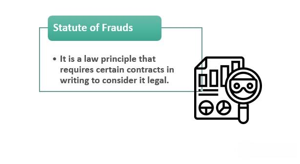

The Statute of Frauds is a fundamental principle in contract law designed to ensure certain types of agreements are legally binding only when documented in writing. This legal doctrine was originally enacted to protect parties from fraudulent claims and misunderstandings that may arise from oral agreements. It mandates written evidence for specific contracts, such as those related to the sale of land and agreements that, by their terms, cannot be performed within one year. This requirement is intended to provide clear evidence of the contract's terms and the parties' intentions, ultimately reducing litigation and enhancing the enforceability of agreements.

The importance of the Statute of Frauds cannot be overstated for individuals and businesses as they navigate legal agreements. Having a thorough understanding of its requirements and the contracts it covers—from substantial sales transactions to long-term commitments—enables parties to engage in business with greater confidence and security. Equally important are the exceptions to this statute, which allow for flexibility in certain circumstances and prevent unjust results that a strict adherence to the written requirement might cause.



This article will examine the detailed aspects of the Statute of Frauds, the scenarios where legal exceptions apply, and its relevance in modern applications such as algorithmic trading. In these complex and fast-paced environments, understanding how traditional legal doctrines intersect with digital and automated contracting processes is crucial for contemporary legal and financial professionals.

## Table of Contents

## What is the Statute of Frauds?

The Statute of Frauds plays a fundamental role in contract law by requiring certain types of contracts to be in writing to be legally enforceable. Its primary aim is to prevent fraudulent claims and misunderstandings by providing clear evidence of the agreed terms between parties. This statute becomes pertinent to various types of agreements, including those related to the sale of land, contracts that cannot be performed within a year, and sales of goods that exceed a specific monetary value, often set at $500 under the Uniform Commercial Code (UCC).

The statute serves both evidentiary and cautionary purposes. Evidently, it ensures that there is tangible proof of the agreement, minimizing the likelihood of disputes arising from differing interpretations of oral agreements. Additionally, the requirement for a written record adds a level of seriousness and deliberation, prompting parties to thoroughly consider the implications and details of their commitments before finalizing them in writing.

Originating as a common law principle, the Statute of Frauds has been modified and incorporated into the legal frameworks of various jurisdictions. Each state may have its version or interpretation, which underscores the statute's adaptable nature in addressing the diverse needs and legal expectations of different regions. This adaptability is essential as it enables the statute to address changing circumstances and the evolving landscape of contracts and commerce.

Overall, the Statute of Frauds is a crucial mechanism for promoting transparency, reducing fraud, and ensuring that serious agreements are upheld within the legal system.

## Historical Context and Evolution

The Statute of Frauds was established by the English Parliament in 1677 as a legislative response to issues of fraud and perjury that plagued contractual agreements. This statute mandated that certain types of contracts be written down and signed to be legally enforceable, setting a precedent that addressed the unreliability inherent in oral agreements at the time. Prior to its enactment, many disputes arose due to the lack of concrete evidence to prove the existence or terms of oral contracts, leading to frequent legal conflicts and fraudulent practices.

As commerce and societal interactions grew more complex, the necessity for a written record to prevent misunderstandings and deceit became apparent. The introduction of the Statute of Frauds significantly improved the legal landscape by reducing the number of fraudulent claims that could be made based solely on verbal agreements. By requiring written documentation, it brought about a higher degree of transparency and accountability, helping to mitigate the risk of perjury—a common problem when parties relied on inconsistent or fabricated testimonies.

The importance of this legal innovation was soon recognized beyond English borders. The principles laid down by the Statute of Frauds were later adopted into U.S. law, where they continue to serve a vital role in modern contract law. In the United States, individual states have typically codified their versions of the Statute of Frauds, adapting the original tenets to align with local judicial interpretations and requirements. This adoption aimed to provide unequivocal evidence for contractual obligations and thereby reduce litigation by clarifying the expectations and commitments established within contracts.

The evolution of the Statute of Frauds illustrates the historical drive to curtail discrepancies and deceit in contractual dealings, enhancing trustworthiness and legal protection in transactions. The shift towards written contracts helped define clear evidentiary standards and provided a more substantial legal framework to address the complexities and disputes arising from contractual obligations.

## Contracts Typically Covered by the Statute

Contracts that fall under the Statute of Frauds are typically characterized by their importance and potential for disputes, thus necessitating a written form to ensure legality and enforceability. Among these, land sales contracts are some of the most notable. Given the significant value and crucial implications associated with the transfer of real property, such agreements must be documented formally to be considered valid.

Marriage-related promises also require written agreements under the Statute of Frauds. These include prenuptial contracts and promises made in consideration of marriage, which are subject to unique legal conditions. Such requirements ensure that both parties have a mutual understanding of the terms, reducing the possibility of future disputes.

Agreements that cannot be performed within one year are included under the statute. This stipulation addresses concerns where an oral contract's duration could lead to misunderstanding or intentional misrepresentation over time. By mandating these contracts be in writing, it minimizes the risks of such complications.

The sale of goods exceeding a value of $500 is another type of contract necessitating adherence to the Statute of Frauds. The Uniform Commercial Code (UCC), adopted across most U.S. states, reinforces this requirement. Section 2-201 of the UCC specifies that contracts for the sale of goods priced at $500 or more must be evidenced by a written statement to be enforceable. This helps uphold the principle that significant transactions should offer transparent and reliable documentation.

Lastly, suretyship agreements, where a third party assures to fulfill an obligation of another if they default, also fall under the statute. The requirement here is crucial for protecting both the creditor and the surety, providing a clear contractual framework.

The statute plays a pivotal role in defining the legal landscape for these contracts, ensuring that they are crafted with transparency and that parties are adequately informed about their obligations and rights.

## Legal Requirements for Compliance

To ensure compliance with the Statute of Frauds, a contract must meet specific legal requirements. Foremost among these is the necessity for the agreement to be in written form and signed by both parties involved. This written requirement serves to provide clear, tangible evidence of the contract's existence and terms, significantly reducing the potential for misunderstandings or disputes.

The written document must explicitly detail the contract terms, encompassing elements such as mutual assent, consideration, and the capacity to contract. Mutual assent refers to the agreement between parties on the contract terms, indicating a "meeting of the minds." Consideration involves something of value being exchanged between the parties, which is essential for contract validity. Capacity to contract pertains to the parties' legal ability to enter into the agreement, ensuring they are of sound mind and legal age.

Any discrepancies or errors in the documentation can jeopardize the contract's enforceability under the statute. For instance, if significant terms are omitted or misstated, it might lead to the document being rendered void. This requirement underscores the importance of precision and clarity in drafting written agreements. Failure to comply with these stipulations can result in the contract being deemed unenforceable in a court of law. Courts often scrutinize the documentation for thoroughness and accuracy, looking for clear articulation of obligations and rights as a measure of the contract's validity under the statute.

## Exceptions to the Statute of Frauds

The Statute of Frauds mandates that certain agreements must be in writing to be legally enforceable. However, there are significant exceptions to this requirement that acknowledge the realities of contractual agreements and prevent unjust outcomes. One key exception is partial performance. When one party has taken significant steps in executing the contract, such as delivering payment or services, courts may enforce the agreement despite the absence of a written document. This exception particularly applies in cases where the actions taken unequivocally demonstrate the existence and terms of the contract.

Another important exception is promissory estoppel. This legal doctrine can hold an agreement enforceable if one party relied on a promise to their detriment, resulting in significant loss if the promise is not honored. For instance, if one party invests resources or alters their position based on an oral contract, the courts may enforce the agreement to prevent injustice, even though a written contract is absent.

Specially manufactured goods represent a tangible exception as well. If goods have been custom-made for a buyer and cannot easily be sold to others, the courts may enforce the agreement without a written contract. This reflects the understanding that the unique nature of the goods itself provides enough evidence of the contract's existence.

Additionally, when financial commitments have been fulfilled, such as through completed payments, the necessity for a written agreement is often waived. This acknowledgment underscores the principle that actions demonstrating mutual consent can override the formal requirement for written proof.

Courts judiciously apply these exceptions to avoid rigid outcomes that strictly adhering to the Statute of Frauds might produce. These exceptions ensure the legal system remains flexible and responsive to real-world contractual dynamics, emphasizing fairness and preventing unjust enrichment due to technicalities.

## Implications for Algorithmic Trading

Algorithmic trading, characterized by the use of computer algorithms to execute trades at high speeds, presents unique challenges when it comes to contractual agreements under the Statute of Frauds. Given the rapid nature of these transactions, parties often rely on digital communications and electronic records, rather than traditional written contracts. As such, understanding the application of the Statute of Frauds to these digital contracts is crucial for traders and developers to mitigate potential disputes and ensure enforceability.

The Statute of Frauds requires certain contracts, including many that occur in [algorithmic trading](/wiki/algorithmic-trading) environments, to be in writing. However, digital contracts complicate this requirement, as the agreements are frequently made through electronic means. Fortunately, exceptions such as electronic signatures and records are generally satisfied under modern adaptations of the statute. The Uniform Electronic Transactions Act (UETA) and the federal Electronic Signatures in Global and National Commerce Act (E-SIGN Act) affirm that electronic signatures and electronic contracts are legally binding if the parties to a contract intend to conduct transactions electronically.

Algorithmic trading systems often rely on APIs for communication with exchanges and brokerages, which can raise issues about the authenticity and verification of contractual agreements executed through these channels. Developers and traders must ensure these API interactions are secure and compliant with statutory requirements. The following Python example demonstrates how a digital signature can be implemented when executing a trade to ensure compliance:

```python
import hmac
import hashlib

def generate_signature(secret_key, message):
    # Create a signature using a secret key and the message
    return hmac.new(secret_key.encode(), message.encode(), hashlib.sha256).hexdigest()

# Example data
secret_key = "my_secret_key"
message = "order: buy 100 shares of XYZ"

# Generate the digital signature
signature = generate_signature(secret_key, message)

# Attach signature to the trade order
trade_order = {
    "message": message,
    "signature": signature
}
```

This code ensures that any automated order includes a verification step, complying with the statute's intent by providing a secure and verifiable digital signature that mimics the function of a handwritten signature.

Additionally, algorithmic platforms must be wary of issues related to interpretation of terms and conditions that may be programmed into their trading algorithms. Clear documentation and robust logging of terms acted upon by algorithms can provide necessary evidence should any dispute arise.

In summary, while algorithmic trading presents complexities under the Statute of Frauds, exceptions like electronic signatures and electronic records ensure digital contracts are enforceable. Developers and traders must remain vigilant in their contract documentation and verification processes to satisfy legal standards and minimize the risk of disputes.

## Conclusion

The Statute of Frauds remains a crucial element of contract law, playing an important role in safeguarding parties from fraudulent claims while ensuring clarity and enforceability in business transactions. By mandating written agreements for certain contracts, the statute serves both as a deterrent to deceitful practices and as a means of reducing ambiguity in legal obligations.

Legal exceptions to the Statute of Frauds, such as partial performance and promissory estoppel, offer essential flexibility. These exceptions are instrumental in ensuring that the statute does not overly constrain legal processes or produce unjust outcomes. This adaptability is particularly significant in an era where business interactions are increasingly dynamic and complex.

As technology advances, particularly with the rise of algorithmic trading, understanding how the Statute of Frauds applies to digital and automated agreements becomes ever more pertinent. Algorithmic trading involves rapid and often automated transactions, requiring stakeholders to be cognizant of how electronic communications and digital signatures can meet the statute's requirements. The legal framework supporting such innovations must evolve to effectively encompass these modern practices without losing the foundational protections the statute provides. Consequently, awareness and adherence to both traditional legal doctrines and their modern adaptations are imperative for traders and developers operating within this digital landscape.

## References & Further Reading

[1]: Shaw, M. L. D. (2011). ["The Statute of Frauds in the Digital Age."](https://www.shb.com/-/media/files/news/2014/thestatuteoffraudsinthedigitalage.pdf) Indiana Law Journal.

[2]: Epstein, D. G., Markell, B. H., & Ponoroff, L. (2011). ["Making and Doing Deals: Contracts in Context"](https://books.google.com/books/about/Making_and_Doing_Deals.html?id=TLI8AQAAIAAJ). West Academic Publishing.

[3]: Lopez de Prado, M. (2018). ["Advances in Financial Machine Learning."](https://www.amazon.com/Advances-Financial-Machine-Learning-Marcos/dp/1119482089) Wiley.

[4]: Williston, S., & Lord, R. A. (2003). ["A Treatise on the Law of Contracts."](https://archive.org/details/lawofcontracts05willuoft) Hein.

[5]: ["Uniform Commercial Code (UCC) – Article 2: Sales"](https://www.law.cornell.edu/ucc/2) as published on the Legal Information Institute by Cornell Law School.