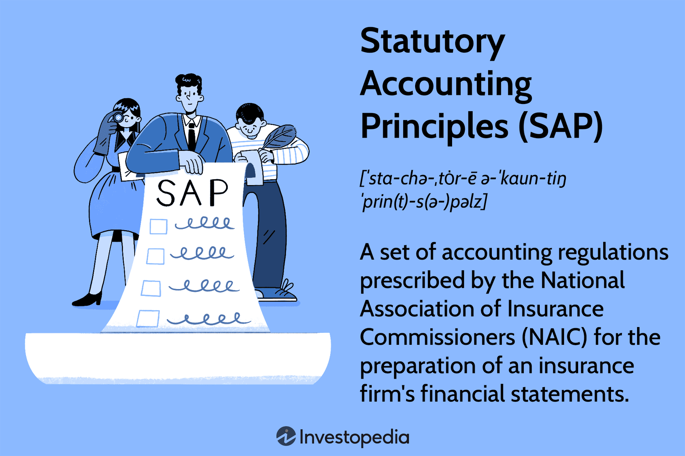

## Table of Contents

## What are Statutory Accounting Principles (SAP)?

Statutory Accounting Principles (SAP) are a set of accounting rules that insurance companies must follow. These rules are set by the National Association of Insurance Commissioners (NAIC) in the United States. The main goal of SAP is to make sure that insurance companies have enough money to pay their policyholders. This is different from Generally Accepted Accounting Principles (GAAP), which businesses usually follow. SAP focuses more on being conservative and protecting the people who have insurance policies.

SAP helps insurance regulators keep an eye on the financial health of insurance companies. By using SAP, regulators can see if an insurance company is strong enough to meet its future obligations. For example, SAP might require insurance companies to report their assets and liabilities in a way that shows the worst possible outcome. This conservative approach helps make sure that insurance companies do not take too many risks and can still pay claims even if things go wrong.

## How do Statutory Accounting Principles differ from Generally Accepted Accounting Principles (GAAP)?

Statutory Accounting Principles (SAP) and Generally Accepted Accounting Principles (GAAP) are two different sets of rules that companies follow to report their finances. SAP is used by insurance companies and is set by the National Association of Insurance Commissioners (NAIC). The main goal of SAP is to make sure insurance companies can pay their policyholders. SAP is more conservative and focuses on protecting the people who have insurance policies. On the other hand, GAAP is used by most other businesses and is set by the Financial Accounting Standards Board (FASB). GAAP aims to give a clear picture of a company's financial health to investors and other stakeholders.

The key difference between SAP and GAAP is their focus. SAP is all about being safe and making sure insurance companies have enough money to cover future claims. This means SAP might require insurance companies to report their assets and liabilities in a way that shows the worst possible outcome. For example, SAP might not let insurance companies count certain types of investments as assets if they are too risky. GAAP, however, is more about showing the true financial position of a company. GAAP allows companies to use a wider range of accounting methods and might let them count more types of assets. This can make a company's financial situation look better but also comes with more risk.

## Who sets the Statutory Accounting Principles?

The National Association of Insurance Commissioners (NAIC) sets the Statutory Accounting Principles (SAP). The NAIC is a group made up of insurance regulators from different states in the United States. They work together to make sure that insurance companies follow rules that keep them financially strong and able to pay their policyholders.

SAP is important because it helps insurance regulators watch over insurance companies. By using SAP, regulators can make sure that these companies are not taking too many risks and have enough money to meet their future obligations. This focus on safety and protection for policyholders is what makes SAP different from other accounting rules.

## Why are Statutory Accounting Principles important for insurance companies?

Statutory Accounting Principles (SAP) are really important for insurance companies because they help make sure these companies can pay the people who have insurance policies. SAP is set by a group called the National Association of Insurance Commissioners (NAIC). They make rules that insurance companies have to follow to show they are financially strong. This is important because if an insurance company doesn't have enough money, it might not be able to pay for things like car accidents or health problems when people need help.

SAP is different from other accounting rules because it focuses on being safe and protecting policyholders. It makes insurance companies report their money in a way that shows the worst possible situation. This means insurance companies can't take big risks with their money. By following SAP, insurance companies can show that they are ready for any problems that might come up. This helps people trust that their insurance will be there when they need it.

## What are the key objectives of SAP?

The main goal of Statutory Accounting Principles (SAP) is to make sure that insurance companies have enough money to pay their policyholders. SAP is set up by the National Association of Insurance Commissioners (NAIC). They want to make sure that insurance companies are safe and can handle any problems that might come up. This is important because if an insurance company doesn't have enough money, it might not be able to help people when they need it, like after a car accident or a health problem.

SAP focuses on being very careful and protecting the people who have insurance. It makes insurance companies report their money in a way that shows the worst possible situation. This means insurance companies can't take big risks with their money. By following SAP, insurance companies can show that they are ready for any problems that might come up. This helps people trust that their insurance will be there when they need it.

## Can you explain the concept of conservatism in SAP?

Conservatism in Statutory Accounting Principles (SAP) means being very careful with how insurance companies report their money. It's all about making sure that insurance companies don't take big risks and always have enough money to pay their policyholders. SAP rules make insurance companies show their money in a way that expects the worst possible situation. This means they can't count on money that might not come in or that could be risky.

This conservative approach is important because it helps protect the people who have insurance. If an insurance company is too risky with its money, it might not be able to pay claims when people need help. By being conservative, SAP helps make sure that insurance companies are always ready for any problems that might come up. This way, people can trust that their insurance will be there when they need it.

## How does SAP handle the valuation of assets and liabilities?

Statutory Accounting Principles (SAP) handle the valuation of assets and liabilities in a very careful way. SAP wants to make sure that insurance companies always have enough money to pay their policyholders. So, when it comes to valuing assets, SAP is very conservative. This means insurance companies can only count assets that are safe and likely to keep their value. For example, if an insurance company owns a building, SAP might make them value it at a lower price than what they could sell it for, just to be safe.

When it comes to liabilities, SAP also takes a conservative approach. Liabilities are the money that insurance companies owe to people who have insurance policies. SAP makes insurance companies report these liabilities in a way that expects the worst possible situation. This means they have to be ready to pay out more money than they might actually need to. By doing this, SAP helps make sure that insurance companies are always prepared and can pay their policyholders even if things go wrong.

## What are some common SAP practices specific to the insurance industry?

Statutory Accounting Principles (SAP) have some special practices that insurance companies follow. One common practice is how they value their investments. SAP makes insurance companies be very careful and only count investments that are safe and likely to keep their value. For example, if an insurance company owns stocks, SAP might make them value these stocks at a lower price than what they could sell them for, just to be safe. This helps make sure the insurance company always has enough money to pay its policyholders.

Another practice is how insurance companies report their liabilities. Liabilities are the money that insurance companies owe to people who have insurance policies. SAP makes them report these liabilities in a way that expects the worst possible situation. This means they have to be ready to pay out more money than they might actually need to. By doing this, SAP helps make sure that insurance companies are always prepared and can pay their policyholders even if things go wrong.

These practices are important because they help keep insurance companies financially strong. By being conservative with how they value assets and report liabilities, SAP helps protect the people who have insurance. This way, people can trust that their insurance will be there when they need it, like after a car accident or a health problem.

## How do Statutory Accounting Principles impact financial reporting for insurers?

Statutory Accounting Principles (SAP) have a big impact on how insurance companies report their money. SAP makes insurance companies be very careful and conservative when they show their financial situation. This means they can only count money that is safe and likely to keep its value. For example, if an insurance company owns a building, SAP might make them value it at a lower price than what they could sell it for. This helps make sure the insurance company always has enough money to pay its policyholders, which is really important.

Another way SAP impacts financial reporting is how it makes insurance companies report their liabilities. Liabilities are the money that insurance companies owe to people who have insurance policies. SAP makes them report these liabilities in a way that expects the worst possible situation. This means they have to be ready to pay out more money than they might actually need to. By doing this, SAP helps make sure that insurance companies are always prepared and can pay their policyholders even if things go wrong. This focus on being safe and protecting policyholders is what makes SAP different from other accounting rules.

## What are the major differences in revenue recognition between SAP and GAAP?

Statutory Accounting Principles (SAP) and Generally Accepted Accounting Principles (GAAP) have different ways of recognizing revenue, which is the money a company earns. SAP is used by insurance companies and focuses on being very careful and making sure they can pay their policyholders. So, SAP might not let insurance companies count some types of money as revenue until they are sure they will get it. For example, if an insurance company gets money for a policy, SAP might make them wait until the policy period is over before they can say it's revenue. This helps make sure the insurance company always has enough money to pay claims.

GAAP, on the other hand, is used by most other businesses and wants to show a clear picture of a company's financial health. GAAP lets companies count money as revenue as soon as they earn it, even if they haven't gotten the money yet. For example, if a company sells something and sends an invoice, they can count that as revenue right away under GAAP. This can make a company's financial situation look better but also comes with more risk. The main difference is that SAP is more about being safe and protecting policyholders, while GAAP is about showing the true financial position of a company.

## How are policy reserves calculated under SAP?

Policy reserves under Statutory Accounting Principles (SAP) are the money that insurance companies set aside to make sure they can pay future claims. SAP makes insurance companies be very careful and conservative when they calculate these reserves. They have to think about the worst possible situation and make sure they have enough money to cover all the claims that might come up. This means they can't take big risks with their money. By doing this, SAP helps make sure that insurance companies are always ready to help people when they need it, like after a car accident or a health problem.

To calculate policy reserves, insurance companies look at things like how likely it is that people will make claims and how much those claims might cost. SAP rules make them use numbers that expect the worst possible outcome. For example, if an insurance company sells a lot of car insurance, they have to set aside enough money to cover all the possible accidents that could happen. This way, even if a lot of people have accidents at the same time, the insurance company will still have enough money to pay everyone. By being careful with how they calculate policy reserves, SAP helps protect the people who have insurance and makes sure the insurance company stays strong financially.

## What are the recent updates or changes to Statutory Accounting Principles?

Recently, the National Association of Insurance Commissioners (NAIC) made some changes to Statutory Accounting Principles (SAP). One big change is about how insurance companies report their money from investments. Now, they have to be even more careful and can't count some types of investments as money they have until they are sure they will get it. This helps make sure insurance companies are safe and can always pay people who have insurance policies.

Another update is about how insurance companies set aside money for future claims, which is called policy reserves. The new rules make them think about even more things that could go wrong and set aside more money to be ready for those problems. This helps make sure that insurance companies are always prepared to help people when they need it, like after a car accident or a health problem. By making these changes, the NAIC wants to keep insurance companies strong and protect the people who have insurance.

## References & Further Reading

[1]: ["Accounting Practices and Principles"](https://www.investopedia.com/terms/a/accounting-principles.asp) by the National Association of Insurance Commissioners (NAIC)

[2]: ["Statutory Accounting Principles"](https://content.naic.org/insurance-topics/statutory-accounting-principles) by the National Association of Insurance Commissioners (NAIC)

[3]: ["Advances in Financial Machine Learning"](https://www.amazon.com/Advances-Financial-Machine-Learning-Marcos/dp/1119482089) by Marcos Lopez de Prado

[4]: ["Quantitative Trading: How to Build Your Own Algorithmic Trading Business"](https://www.amazon.com/Quantitative-Trading-Build-Algorithmic-Business/dp/1119800064) by Ernest P. Chan

[5]: ["Fundamentals of Statutory Accounting"](https://www.iriscarbon.com/understanding-statutory-accounting-principles-a-comprehensive-guide/) by The Institutes

[6]: Solvency II Directive. Retrieved from [European Union Law](https://eur-lex.europa.eu/eli/dir/2009/138/oj/eng) 

[7]: Klein, R. W. (1995). "Insurance Regulation in Transition." Journal of Risk and Insurance, 62(3), 363-404. 

[8]: Barth, M. M., & Eckles, D. L. (2009). "An Empirical Investigation of the Effect of Growth Options on the Insolvency Risk of Insurers." Journal of Risk and Insurance, 76(4), 795-823.