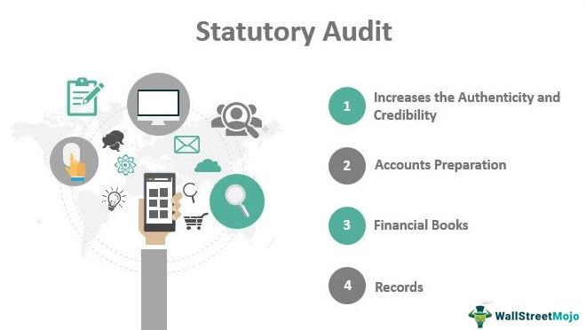

## Table of Contents

## What is a statutory audit?

A statutory audit is a legal requirement for certain companies to have their financial statements checked by an independent auditor. This process makes sure that the financial reports are correct and follow the law. Governments set rules about which companies need to do this, usually bigger ones or those in special industries.

The main goal of a statutory audit is to give confidence to shareholders, investors, and the public that the company's financial information is trustworthy. The auditor looks at the company's records, checks if they match the financial statements, and then writes a report. This report tells if the financial statements give a true and fair view of the company's finances.

## Why is a statutory audit necessary?

A statutory audit is necessary because it helps make sure that a company's financial statements are correct and honest. When a company has to show its financial health to shareholders, investors, or the public, an audit by an independent person adds trust. This is important because it stops the company from lying about its money situation. It also helps catch any mistakes or fraud that might happen by accident or on purpose.

Governments make rules about which companies need to have a statutory audit. Usually, these are bigger companies or ones in special industries that have a big impact on the economy. By making sure these companies are checked regularly, the government can protect the economy and the people who invest in these companies. This way, everyone can feel more confident that the financial information they see is true and fair.

## Who can perform a statutory audit?

A statutory audit can only be done by a qualified person called an auditor. This person has to be a member of a recognized professional body, like a chartered accountant. They need to know a lot about accounting and auditing rules. The government sets rules about who can be an auditor, so not just anyone can do it.

The auditor has to be independent, which means they can't work for the company they are auditing. This is important because it makes sure they can give an honest opinion about the company's financial statements. If the auditor finds something wrong, they have to report it. This helps keep the company honest and protects people who invest in the company.

## What are the key objectives of a statutory audit?

The main goal of a statutory audit is to check if a company's financial statements are correct and fair. This means the auditor looks at all the numbers and records to make sure they match what the company says in its reports. By doing this, the audit helps to find any mistakes or fraud that might be hiding in the financial statements. It's like a big check-up to make sure the company's financial health is as good as it claims.

Another important objective is to build trust with shareholders, investors, and the public. When an independent auditor says the financial statements are okay, people feel more confident about the company. This trust is important because it helps people decide if they want to invest in the company or do business with it. Governments want this trust to be strong, so they make rules that say which companies need to have a statutory audit.

Overall, a statutory audit helps keep companies honest and protects the economy. By making sure big companies or those in special industries are checked regularly, the government can stop financial problems from spreading. This way, everyone can feel safer about the money they put into these companies.

## What are the different types of statutory audits?

There are different types of statutory audits that companies might need to do. One common type is the financial statement audit. This is when an auditor checks a company's financial statements to make sure they are correct and follow the rules. This type of audit is important for big companies or those in special industries, like banks or insurance companies, because it helps keep their financial information honest and trustworthy.

Another type of statutory audit is a compliance audit. This audit checks if a company is following the laws and regulations that apply to it. For example, a company might need to follow rules about how it handles the environment or how it treats its workers. The auditor looks at the company's records and practices to make sure they meet these rules.

There's also a special type of audit called a performance audit. This one looks at how well a company is doing its job, especially if it's a government or public sector organization. The auditor checks if the company is using its money and resources in the best way possible. This helps make sure public money is spent wisely and that the organization is doing what it's supposed to do.

## How does a statutory audit differ from an internal audit?

A statutory audit and an internal audit are two different things. A statutory audit is required by law and done by an independent person called an auditor. The main goal is to check if the company's financial statements are correct and fair. This audit is important for big companies or those in special industries because it builds trust with shareholders, investors, and the public. The auditor looks at the company's records, checks everything, and then writes a report saying if the financial statements are okay.

An internal audit, on the other hand, is done by people who work inside the company. It's not required by law, but companies do it to keep an eye on their own work. The main goal is to find ways to make the company better, like improving how things are done or spotting risks before they become big problems. Internal auditors look at many parts of the company, not just the financial statements. They give advice to the company's managers to help make things run smoother and safer.

Both types of audits help make sure the company is doing well, but they do it in different ways. A statutory audit focuses on making sure the financial information is honest and correct for the outside world. An internal audit focuses on making the company better from the inside, helping it run more efficiently and safely.

## What are the legal requirements for conducting a statutory audit?

The legal requirements for conducting a statutory audit depend on the country, but there are some common rules. Companies that have to do a statutory audit are usually the bigger ones or those in special industries, like banks or insurance companies. The government decides which companies need to do this to make sure they follow the rules and keep their financial information honest. An important rule is that the audit must be done by a qualified person called an auditor. This person has to be a member of a recognized professional body, like a chartered accountant, and they need to know a lot about accounting and auditing rules.

Another big rule is that the auditor has to be independent. This means they can't work for the company they are auditing. Being independent is important because it helps the auditor give an honest opinion about the company's financial statements. The auditor looks at all the company's records and checks if they match the financial statements. After the audit, the auditor writes a report that says if the financial statements are correct and fair. If they find something wrong, they have to report it. This helps keep the company honest and protects people who invest in the company.

## What is the process involved in conducting a statutory audit?

The process of conducting a statutory audit starts with planning. The auditor talks to the company to understand its business and the risks it faces. They make a plan for how to check the financial statements. This plan includes deciding which parts of the company's records to look at closely. The auditor then collects evidence by looking at documents, talking to people in the company, and using other ways to check the numbers. They compare what they find with the financial statements to see if everything matches up.

After gathering all the evidence, the auditor starts the testing phase. They check if the company followed the accounting rules and if the financial statements are correct. This might involve looking at samples of transactions, checking if the company's controls are working, and making sure everything adds up. If the auditor finds any problems or mistakes, they talk to the company about it. They might need to do more checks to make sure they understand everything.

Once the testing is done, the auditor writes a report. This report says if the financial statements give a true and fair view of the company's finances. If everything looks good, the auditor gives an opinion that the financial statements are okay. But if there are big problems, the auditor might give a different opinion, like a qualified opinion or even say the statements are not right. The report is shared with the company's management, shareholders, and sometimes the public, depending on the rules. This helps everyone trust that the company's financial information is honest.

## How do statutory audits benefit stakeholders?

Statutory audits help stakeholders by making sure a company's financial statements are correct and honest. When an independent auditor checks the numbers and says they are right, it gives shareholders, investors, and the public more trust in the company. This trust is important because it helps people feel safe about putting their money into the company. If the financial statements are wrong, it could lead to big problems, like losing money or making bad decisions. By having an audit, stakeholders can be more sure that the company is telling the truth about its money situation.

Another way statutory audits help is by finding mistakes or fraud. Sometimes, even by accident, the numbers in the financial statements might not be right. Other times, someone might try to hide money problems on purpose. The auditor looks at everything carefully to catch these issues. If they find something wrong, they report it. This helps stop small problems from becoming big ones and protects the company and its stakeholders. Overall, statutory audits make the financial world safer and more honest for everyone involved.

## What are the common challenges faced during a statutory audit?

One common challenge during a statutory audit is getting all the information needed. Sometimes, the company's records might be messy or hard to understand. The auditor needs to look at a lot of documents and talk to people in the company to check the numbers. If the company doesn't keep good records, it can take a long time to find everything and make sure it's right. Another challenge is dealing with tight deadlines. Companies have to finish their audits by certain dates, and if there are a lot of problems to fix, it can be hard to get everything done on time.

Another issue is making sure the auditor stays independent. The auditor can't work for the company they are checking, but sometimes it's hard to avoid getting too close. If the auditor starts to like the company too much, they might not see problems as clearly. This can make the audit less honest. Also, understanding and following all the rules can be tough. There are a lot of laws and accounting standards that the auditor needs to know. If they miss something, it can cause big problems for the company and the stakeholders who trust the audit report.

## How has technology impacted the statutory audit process?

Technology has made a big difference in how statutory audits are done. Now, auditors can use special software to look at a company's financial records faster and easier. This software can find mistakes or strange things in the numbers quickly. Auditors can also use computers to do more checks on the data, which helps them be more sure that the financial statements are right. Using technology also helps auditors work together better, even if they are in different places. They can share information and talk about what they find without having to be in the same room.

Another way technology helps is by making it easier to keep records. Companies can use systems that keep all their financial information in one place, so it's easier for auditors to find what they need. This can save a lot of time and make the audit go faster. But, there are also new challenges because of technology. Auditors need to know how to use these new tools and make sure the company's computer systems are safe. If the systems are not safe, someone could change the numbers and make the audit wrong. So, while technology makes some things easier, it also means auditors have to learn new skills and be careful about new risks.

## What advanced techniques can auditors use to enhance the effectiveness of statutory audits?

Auditors can use data analytics to make statutory audits better. This means they use computers to look at a lot of numbers quickly. They can find patterns or strange things that might be hard to see just by looking at the records by hand. This helps them check more of the company's information and find mistakes or fraud faster. Also, auditors can use something called continuous auditing. This means they keep checking the company's numbers all the time, not just at the end of the year. This can help catch problems early and make the audit more up-to-date.

Another advanced technique is using [artificial intelligence](/wiki/ai-artificial-intelligence) (AI) and [machine learning](/wiki/machine-learning). These tools can learn from the data and get better at finding what's normal and what's not. This can help auditors focus on the parts of the company that might have big problems. Also, auditors can use blockchain technology to check the company's records. Blockchain keeps a safe record of all transactions, so it's harder for someone to change the numbers. By using these new tools, auditors can do a better job of making sure the company's financial statements are honest and correct.

## References & Further Reading

[1]: Hauser, R. (2006). ["Financial Statement Fraud: Motives, Methods, Cases and Detection."](https://books.google.com/books/about/Financial_Statement_Fraud_Motives_Method.html?id=L_M67eWgX-sC) Atlantic Economic Journal.

[2]: Tarantino, A., & Cernauskas, D. (2009). ["Risk Management in Finance: Six Sigma and Other Next-Generation Techniques"](https://onlinelibrary.wiley.com/doi/book/10.1002/9781119197812). John Wiley & Sons.

[3]: Grover, R., & DeFonzo, G. (1999). ["Understanding Forensic Audits: The New Examination Method"](https://pmc.ncbi.nlm.nih.gov/articles/PMC8993032/). Managerial Auditing Journal.

[4]: Hull, J. (2017). ["Risk Management and Financial Institutions"](https://books.google.com/books/about/Risk_Management_and_Financial_Institutio.html?id=1J1QDwAAQBAJ). John Wiley & Sons.

[5]: Vasarhelyi, M. A., Alles, M. G., & Kogan, A. (2004). ["Principles of Analytic Monitoring"](https://www.semanticscholar.org/paper/Principles-of-Analytic-Monitoring-for-Continuous-Vasarhelyi-Alles/e9f283f52aea0626fcb67d93bc4584832a0b1fb6). Journal of Emerging Technologies in Accounting.

[6]: Amir, E., & Lev, B. (1996). ["Value-relevance of Nonfinancial Information: The Wireless Communications Industry"](https://www.sciencedirect.com/science/article/pii/S0165410196004302). Journal of Accounting and Economics.