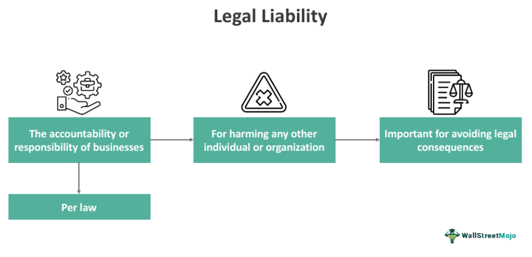

Algorithmic trading, often referred to as algo trading, represents a transformative innovation in financial markets. It facilitates the execution of trades with unprecedented speed and precision, primarily through the use of complex algorithms and automated systems. This efficiency allows traders to capitalize on market opportunities within fractions of a second, something manual trading cannot achieve.

Despite these advancements, rapid technological progress in financial markets brings significant legal and regulatory challenges, particularly concerning liability. As algorithms make autonomous trading decisions, questions of accountability arise: Who is liable when errors occur? What are the statutory liabilities involved? And which regulatory bodies are responsible for oversight?



This article aims to explore these pressing statutory liability issues related to algorithmic trading. We will examine real-world scenarios where errors have resulted in significant legal implications, providing a comprehensive overview of the types of statutory liabilities traders could face. Furthermore, the regulatory framework governing algorithmic trading will be scrutinized, identifying key regulators and the laws in place to mitigate risks associated with automated trading activities.

Understanding these nuances is not just academic; it is practical and essential for algo trading participants. By identifying potential liabilities and understanding the regulatory landscape, traders can implement strategies to mitigate risks, ensuring adherence to compliance standards. This proactive approach is crucial for maintaining market integrity and protecting against the financial and reputational damage that can arise from non-compliance.

In summary, as algorithmic trading continues its trajectory of growth and complexity, comprehending the associated legal and regulatory challenges is vital. For those engaged in or considering this dynamic approach to trading, fostering knowledge and implementing robust risk management strategies is indispensable in navigating the challenges of statutory liability effectively.

## Table of Contents

## What is Statutory Liability in Algorithmic Trading?

Statutory liability in algorithmic trading encompasses the legal obligations and responsibilities that individuals or entities must adhere to by law. This concept is pivotal in the financial sector, particularly when errors or non-compliance arise from automated trading systems. 

In [algorithmic trading](/wiki/algorithmic-trading), statutory liability often emerges due to breaches of financial regulations or legal mandates. The automated nature of these systems can lead to rapid and significant market impacts if errors occur. Consequently, traders and firms can be held liable for these inadvertent faults. These liabilities may arise from faulty algorithms, inadequate risk management, or a failure to comply with applicable regulations governing market activities.

At the core, statutory liability seeks to ensure accountability by setting minimum standards of behavior for algorithmic traders. It is crucial for these entities to ensure their trading algorithms are thoroughly tested and comply with the necessary legal standards. For instance, an improperly coded algorithm that triggers a flash crash could lead to severe legal and financial repercussions for the trading firm responsible.

Moreover, statutory liability extends beyond coding errors. It also covers situations where there may be omissions in risk control implementation or monitoring. Algorithmic traders have a legal obligation to implement robust risk management frameworks to minimize potential liabilities. This includes installing pre-trade and post-trade risk checks, model validation, and system compliance audits.

Compliance with financial regulations is a fundamental aspect of managing statutory liabilities. Agencies such as the Commodity Futures Trading Commission (CFTC) and the Securities and Exchange Commission (SEC) mandate that algorithmic traders adhere to specific regulations. These regulations include maintaining records of trading activities, implementing risk controls, and reporting significant market incidents.

In conclusion, statutory liability holds algorithmic traders accountable for their automated actions, emphasizing the importance of rigorous testing, effective risk management, and regulatory compliance. Traders must remain vigilant and proactive in adapting their systems to meet evolving legal requirements, thereby mitigating the risks associated with algorithmic trading.

## Legal Examples and Case Studies

Algorithmic trading has witnessed several incidents that highlight the complexities surrounding statutory liability. These cases often involve market manipulation, erroneous trades, and regulatory breaches, leading to significant legal consequences for the individuals and firms involved.

### Knight Capital Group Incident (2012)

One of the most well-known cases of erroneous trades in algorithmic trading involved Knight Capital Group in August 2012. A software error resulted in the company executing a large number of unintended stock trades, leading to a loss of approximately $440 million in less than an hour. This incident underscores the potential for immense financial and reputational damage due to faulty algorithms. The aftermath led to discussions on the necessity for robust risk management frameworks and system checks to prevent such occurrences. Although Knight Capital was not subject to statutory penalties directly, the financial damage forced it to accept a buyout from Getco, illustrating the severe repercussions firms can face.

### Navinder Sarao and the Flash Crash (2010)

Navinder Singh Sarao became a notable example of market manipulation in algorithmic trading. Sarao used an algorithm to engage in “spoofing,” creating false market activity by placing large orders with no intention of executing them, contributing to the 2010 Flash Crash which temporarily erased nearly $1 trillion in market value. Sarao was charged by the U.S. Commodity Futures Trading Commission (CFTC) and faced several counts of fraud and market manipulation. He pleaded guilty and was sentenced to one year of home incarceration. This case highlights the legal accountability of individual traders and the critical nature of compliance with anti-manipulation regulations.

### Barclays and Credit Suisse Dark Pools (2016)

In 2016, Barclays and Credit Suisse were fined a combined $154.3 million by the U.S. Securities and Exchange Commission (SEC) and the New York Attorney General for misrepresentations related to their dark pools, which are private trading venues that facilitate algorithmic trading. The fines were levied for failing to disclose the manner in which their dark pools operated and providing accuracy of information to investors. This case emphasizes the importance of transparency and compliance with regulatory requirements in algorithmic trading activities.

### Key Takeaways

These cases underscore several critical takeaways for algorithmic trading participants:

1. **Robust Risk Management**: Implementing comprehensive risk management practices is crucial to prevent errors and mitigate potential losses.

2. **Compliance and Transparency**: Ensuring adherence to regulatory requirements and maintaining transparency with clients and regulators are essential for legal protection.

3. **Regulatory Vigilance**: Traders and firms must be aware of the evolving regulatory landscape and proactively adjust their practices to comply.

4. **Technology and Training**: Regular software testing and staff training on compliance and risk management can significantly reduce the likelihood of legal issues.

The legal outcomes in these cases illustrate the potential consequences of failing to manage statutory liability effectively, underscoring the importance of compliance and risk management in maintaining the integrity and stability of financial markets.

## Regulatory Framework for Algorithmic Trading

Algorithmic trading, characterized by the use of complex algorithms for making trading decisions, necessitates a robust regulatory framework to ensure market integrity and protect participants. Several key regulatory agencies across the globe oversee these activities, including the U.S. Commodity Futures Trading Commission (CFTC), Securities and Exchange Commission (SEC), and the Office of the Comptroller of the Currency (OCC). These bodies have implemented various rules and guidelines to govern algorithmic trading activities.

### Key Regulatory Agencies

1. **U.S. Commodity Futures Trading Commission (CFTC):** The CFTC regulates futures and options markets in the United States. It aims to prevent systemic risk and protect market participants against fraud and abusive practices. The CFTC has proposed regulations like the Regulation Automated Trading (Reg AT), which seeks to implement pre-trade risk and compliance checks for firms engaged in algorithmic trading.

2. **Securities and Exchange Commission (SEC):** The SEC oversees securities markets in the United States. The agency has implemented the Market Access Rule (Rule 15c3-5), requiring broker-dealers to put in place risk management controls and supervisory procedures to manage the financial and regulatory risks associated with market access, often used in high-frequency trading. This includes pre-trade controls to prevent erroneous trades that could disrupt the market.

3. **Office of the Comptroller of the Currency (OCC):** Although primarily focused on banking regulations, the OCC plays a role in overseeing algorithmic trading as it relates to the activities of national banks and federal savings associations. The OCC provides guidance on managing risks associated with financial and trading models used by banks.

### Important Regulations

- **Market Access Rule (Rule 15c3-5):** This SEC rule mandates that broker-dealers implement mechanisms for preventing erroneous orders and ensuring compliance before trades reach the market. It emphasizes the need for robust pre-trade risk management controls and monitoring processes.

- **Regulation Automated Trading (Reg AT):** Proposed by the CFTC, Reg AT intends to establish a comprehensive framework for the registration and regulation of market participants engaged in algorithmic trading. It focuses on ensuring that adequate risk controls, testing, and compliance measures are in place before trading algorithms are deployed in live markets.

### Compliance Requirements

Algorithmic traders must adhere to a range of compliance requirements, including:

- **Registration:** Firms must register with appropriate regulatory bodies like the CFTC or SEC, depending on their trading activities and the markets they participate in.
- **Reporting Obligations:** Traders need to maintain transparency through regular reporting of their trading activities, significant trading losses, and market disruptions.
- **Risk Management Controls:** Implementing pre- and post-trade risk controls is critical to identifying and mitigating potential issues early. This includes continuous monitoring and adjusting of the trading algorithms as necessary.

### Governance and Risk Mitigation

Strong governance is fundamental to ensuring compliance and mitigating risks in algorithmic trading. Firms should establish dedicated oversight committees to monitor algorithmic trading activities. This involves:

- **Developing a Robust Risk Management Framework:** A framework should include detailed policies and procedures for risk identification, assessment, and mitigation.
- **Regular Audits and Reviews:** Periodic internal and external audits can help ensure adherence to regulatory standards and the effectiveness of risk management practices.
- **Training and Education:** Continuous education for staff involved in algorithmic trading is essential to staying updated with regulatory changes and maintaining compliance.

In summary, the regulatory framework for algorithmic trading involves multiple governing bodies and a set of comprehensive rules designed to ensure market stability and participant safety. Algorithmic traders must prioritize compliance and risk management to operate effectively within this complex regulatory landscape.

## Managing Risk and Liability

In managing risk and liability in algorithmic trading, it is paramount to implement comprehensive strategies that encompass both pre-trade and post-trade risk controls. These controls are designed to mitigate the legal and operational risks that algorithmic traders face due to the fast-paced and automated nature of this trading environment.

Pre-trade risk controls involve measures such as establishing risk limits for trade orders before execution, thereby preventing unintended market impacts or violations of trading rules. Algorithms can be coded to reject orders that exceed specified risk parameters, helping to avert potential financial and regulatory repercussions. For example, a Python snippet for a basic pre-trade risk control might look like this:

```python
def check_order_risk(order_value, max_risk_limit):
    if order_value > max_risk_limit:
        return False, "Order exceeds risk limit"
    return True, "Order within risk limit"
```

Post-trade risk controls focus on monitoring executed trades to ensure compliance with regulatory standards and internal policies. This includes trade reconciliation processes and real-time surveillance to detect and address any anomalies swiftly.

The role of system safeguards in mitigating potential liabilities cannot be overstated. Stress testing and disaster recovery plans are critical components. Stress testing evaluates how trading systems react to extreme but plausible market conditions, identifying vulnerabilities that could lead to significant losses or disruptions. Meanwhile, disaster recovery plans ensure that systems can quickly recover from failures, minimizing downtime and potential losses.

Model risk management is vital in ensuring the reliability of trading algorithms. This involves validating and back-testing algorithms to verify their performance under various market scenarios. Anomalies in model performance can lead to substantial financial and reputational damage; hence rigorous model risk assessments are essential.

Establishing effective governance structures is crucial in overseeing algorithmic trading activities. These structures should include clearly defined roles and responsibilities, with oversight committees tasked with continuously evaluating the effectiveness of risk management strategies and ensuring compliance with regulatory requirements. Regular audits and independent reviews of trading systems and strategies contribute to robust governance, thereby reducing the likelihood of operational failures and legal liabilities.

By implementing these strategies, algorithmic traders can better manage legal risks and enhance the reliability and integrity of their trading operations.

## Conclusion

Algorithmic trading presents a unique set of legal and regulatory challenges concerning statutory liability. As trading algorithms become more complex, the potential for accidental breaches of market regulations and the likelihood of significant financial losses increase. Therefore, it is imperative for algorithmic traders to adhere strictly to compliance requirements and implement comprehensive risk management practices. These practices not only safeguard against potential legal issues but also contribute to the operational efficiency and financial integrity of trading operations.

One of the key legal challenges is ensuring compliance with the varying regulations imposed by different jurisdictions. Traders must be aware of the specific rules enacted by regulatory bodies such as the Commodity Futures Trading Commission (CFTC), the Securities and Exchange Commission (SEC), and their counterparts in other countries. These regulations encompass a wide range of requirements, including registration, reporting, and risk controls, which traders must strictly follow to avoid penalties and legal disputes.

To navigate the complex legal framework effectively, algorithmic traders should adopt a proactive approach to risk management. This includes deploying advanced technological tools for monitoring and controlling trading activities, conducting regular audits of trading algorithms, and establishing robust governance structures to oversee compliance efforts. Additionally, stress testing and disaster recovery planning should be integral parts of the risk management strategy to mitigate potential liabilities stemming from algorithmic failures.

Another recommendation for traders is to pursue continuous education and training programs to stay informed about the latest legal developments and technological advancements in the field. Engaging with legal experts and compliance professionals can provide valuable insights and guidance on navigating legal challenges. Collaboration with these experts can also help identify potential legal risks early and develop strategies to address them effectively.

In conclusion, algorithmic traders must prioritize compliance and robust risk management to reduce liability risks. By staying informed, leveraging advanced risk management techniques, and seeking expert advice, traders can efficiently navigate the complex legal landscape and ensure their operations are both legally compliant and financially sound.

## References & Further Reading

[1]: Kearns, M., Kulesza, A., & Nevmyvaka, Y. (2010). ["Empirical Limitations of Algorithmic Trading in Financial Markets."](https://core.ac.uk/download/pdf/76383171.pdf) Science and Technology Review.

[2]: Aldridge, I. (2013). ["High-Frequency Trading: A Practical Guide to Algorithmic Strategies and Trading Systems."](https://www.amazon.com/High-Frequency-Trading-Practical-Algorithmic-Strategies/dp/1118343506) Wiley.

[3]: Narang, R. (2013). ["Inside the Black Box: A Simple Guide to Quantitative and High-Frequency Trading."](https://onlinelibrary.wiley.com/doi/book/10.1002/9781118662717) Wiley.

[4]: Van Vliet, B. (2018). ["Financial Risk Management and Modeling: A Broad Perspective."](https://scholar.google.com/citations?user=p68dvE8AAAAJ&hl=en) Routledge.

[5]: U.S. Commodity Futures Trading Commission (CFTC). ["Regulation Automated Trading (Reg AT)."](https://www.cftc.gov/PressRoom/PressReleases/7283-15)