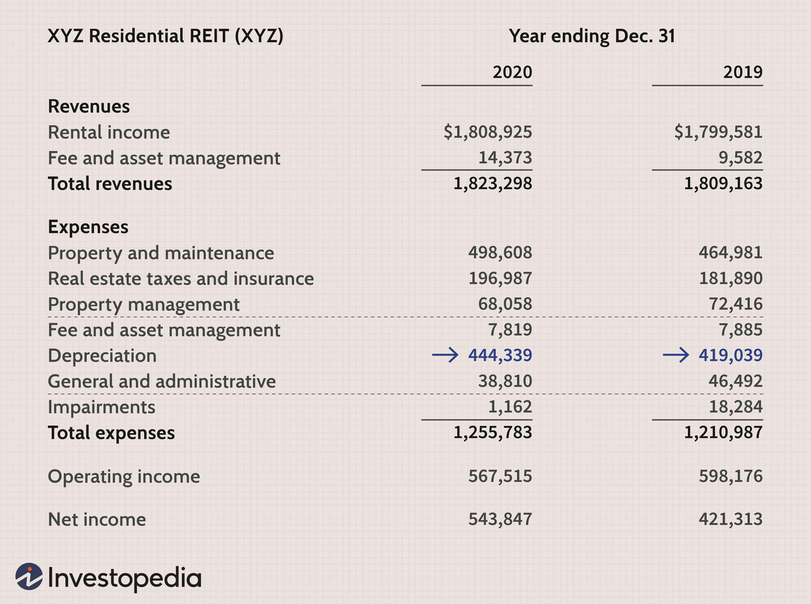

Securing a reliable retirement income represents a cornerstone for achieving a stress-free and fulfilling retirement. As individuals enter their post-working years, ensuring that they have adequate financial resources becomes a priority to maintain their standard of living and cover unforeseen expenses. One of the most effective ways to accomplish this is through strategic investment planning, which provides opportunities to generate income outside of traditional employment.

Real estate stands out among various investment options due to its potential to offer a dependable and sustainable income stream. Investing in real estate can provide numerous benefits, such as property appreciation and rental income, which may help cushion retirees against economic fluctuations. Additionally, specific locations offer more profitable returns, requiring prospective investors to select areas with promising growth and demand.

The advancements in technology have revolutionized investment strategies, with algorithmic trading emerging as a powerful tool to optimize investment outcomes. This technology enables investors to make more informed and timely decisions, enhancing their ability to maximize profits while minimizing risks. By employing algorithms to analyze market trends and predict future movements, individuals can effectively buy and sell assets at opportune moments.

This article aims to guide retirees through various strategies designed to maximize retirement income via real estate investments in lucrative locations. Through the strategic selection of investment areas and the incorporation of technological solutions, retirees can leverage available resources to build a robust financial future. By prioritizing informed decision-making processes and adopting innovative strategies, investors can not only secure but also enhance their retirement income, paving the way for a prosperous and secure retirement.

## Table of Contents

## The Importance of Retirement Income Planning

Planning for retirement income is increasingly vital in today's financial landscape, where individuals encounter extended life spans and climbing living expenses. According to the World Health Organization, global average life expectancy has seen a significant rise, with people living longer than ever before [1]. This extended lifespan necessitates a larger reserve of financial resources to ensure a comfortable lifestyle during the retirement years.

To achieve financial security in retirement, it's crucial to rely on multiple income sources. Pensions traditionally play a central role in providing a steady income stream. However, these are often supplemented by personal savings and investments to meet the rising costs of living. Investing wisely can bridge the gap between pension income and retirement spending needs.

Real estate investments are frequently chosen by retirees due to their dual benefits of potential appreciation and rental income. Over the long term, real estate often increases in value, contributing to the overall wealth of the investor. Additionally, rental properties provide regular income, an attractive feature for those seeking to maintain financial stability. Reference data from the Federal Reserve underscore real estate historically providing competitive returns compared to other asset classes [2].

Diversification remains a key strategy in retirement planning. By creating a diversified investment portfolio, retirees can spread risk and enhance the potential for stable returns. This diversification might include a blend of stocks, bonds, real estate, and other investment vehicles. A well-balanced mix can protect against market [volatility](/wiki/volatility-trading-strategies) and economic downturns while ensuring a more predictable income stream.

In conclusion, prudent retirement income planning, through a combination of pensions, savings, and diversified investments, helps safeguard financial security. By leveraging tools such as real estate investments, retirees can navigate the challenges of increased life expectancy and rising living costs.

---

[1] World Health Organization. "Life Expectancy and Healthy Life Expectancy." https://www.who.int/data/gho/indicator-metadata-registry/imr-details/3130

[2] Federal Reserve. "The Impact of Real Estate on Investment Portfolios." https://www.federalreserve.gov/econresdata/24455

## Why Real Estate is a Preferred Investment for Retirees

Real estate is frequently chosen by retirees for investment due to its tangible nature and potential for both income generation and value growth. Unlike stocks or bonds, real estate investments represent physical assets that can appreciate over time. This appreciation is influenced by factors such as location, demand, and economic conditions. Moreover, owning property offers retirees the dual advantage of enjoying regular rental income while benefiting from potential increases in the property's market value.

Rental properties are particularly appealing for retirees aiming to ensure financial stability. By providing a consistent income stream, these properties can alleviate the financial uncertainties often associated with retirement. The stability of rental income is typically more predictable than returns from some other investments, making it a safer option for individuals who may be risk-averse or depend on a fixed income.

Real estate investments also come with notable tax advantages and leverage opportunities. Tax benefits include deductions on mortgage interest, property depreciation, and operational costs, all of which can significantly lower taxable income. Additionally, the use of leverage, or borrowing capital to finance investment properties, can amplify returns. Retirees can purchase properties with less upfront capital, enhancing their wealth-building potential when property values appreciate or when they receive rental income exceeding the total financing costs.

When evaluating the historical performance of real estate relative to other investment types, its resilience and long-term profitability stand out. Historically, real estate has shown less volatility compared to the stock market. Investments in property have not only provided returns in the form of appreciation but also presented a safer harbor during economic downturns. While equities may offer higher returns, they are also subject to greater fluctuations, making real estate a less volatile option for investors prioritizing stability.

Overall, the combination of potential appreciation, regular rental income, tax advantages, and historical performance solidifies real estate's position as a preferred investment vehicle for retirees seeking stable and fruitful returns.

## Identifying Prime Investment Locations

Location plays a critical role in maximizing returns on real estate investments, as certain areas exhibit higher growth potential. Identifying prime investment locations requires analyzing various factors, including current market trends, economic growth, population dynamics, employment opportunities, and infrastructure development.

Current market trends highlight several top locations for real estate investment, which include both emerging markets and established hotspots. Emerging markets often present unique opportunities due to rapid industrialization and urbanization, which can lead to increased property values and rental demand. For instance, Southeast Asia has shown substantial growth in real estate investment potential due to its burgeoning middle class and increasing urban population. Established hotspots, such as major metropolitan areas in the United States and Western Europe, also continue to provide reliable investment opportunities due to their robust economies and well-developed infrastructure.

When selecting an investment location, economic growth is a primary consideration. Areas experiencing significant GDP growth often see enhanced property value appreciation as increased economic activity attracts more businesses and residents. For example, cities with expanding technology sectors, like Austin, Texas, and Berlin, Germany, have reported substantial increases in property values and rental rates.

Population trends are another critical [factor](/wiki/factor-investing) influencing location choices. Regions with growing populations, especially younger demographics, typically demand more housing, driving both rental and purchase markets. Additionally, areas with increasing immigration or a high influx of internal migrants can create sustained demand for residential real estate. This is evident in cities such as Toronto, Canada, where immigration has been a significant growth driver for the housing market.

Employment opportunities also significantly influence real estate investment decisions. Areas with diversified economies and low unemployment rates are more likely to offer stable real estate markets. Areas with burgeoning job markets, particularly in high-demand industries like technology and healthcare, attract professionals seeking housing, thereby boosting property demand.

Infrastructure development is another vital determinant of a location's real estate investment potential. Regions investing in transportation, healthcare, and education infrastructure often see increased property values due to the improved quality of life and accessibility they offer residents. For instance, investments in public transportation networks in cities like Tokyo, Japan, and London, UK, have historically resulted in higher property values and rental rates in well-connected neighborhoods.

Real estate markets with strong rental demand can provide substantial income streams for retirees. In markets with high rental yields, such as parts of the Midwest in the United States or emerging cities in Eastern Europe, retirees can benefit from consistent rental income. Additionally, properties in tourist-heavy destinations or near large universities can offer high occupancy rates and attractive rental returns due to constant demand. Balancing location factors with economic indicators allows investors to identify prime investment areas that align with their financial goals.

## Utilizing Algorithmic Trading for Better Investment Outcomes

Algorithmic trading, widely known for its application in financial markets, employs computer algorithms to automate and optimize investment decisions. This method significantly enhances the efficiency and precision of transactions, making it an invaluable tool for modern investors. By leveraging algorithms, investors can execute trades faster and more accurately, reducing the likelihood of human error and emotional decision-making. The integration of [algorithmic trading](/wiki/algorithmic-trading) with real estate investments presents a novel approach to optimizing buying and selling strategies.

In real estate, applying algorithmic trading involves utilizing data-driven analysis to determine optimal entry and [exit](/wiki/exit-strategy) points for property investments. Algorithms can process vast amounts of data, including market trends, property values, and rental yields, to identify lucrative investment opportunities. By doing so, they can suggest when to buy or sell properties to maximize returns. This approach is particularly beneficial in highly volatile or emerging real estate markets, where swift decisions can lead to considerable gains.

Furthermore, algorithmic trading offers substantial risk management benefits. By continuously monitoring market conditions and asset performance, algorithms can identify potential risks and adjust investment strategies accordingly. They can implement risk mitigation techniques such as stop-loss orders or portfolio rebalancing, securing investments from adverse market movements. This proactive approach helps in aligning investments with predefined risk tolerance levels and financial goals.

Technology is crucial in enhancing decision-making processes and boosting investment returns. Advanced data analytics and [machine learning](/wiki/machine-learning) algorithms can provide predictive insights, enabling investors to make informed decisions. For example, predictive models can forecast property value trends, helping investors anticipate future market dynamics and adjust their strategies preemptively. Additionally, machine learning can refine algorithms over time, improving their accuracy and effectiveness in response to evolving market conditions.

In conclusion, incorporating algorithmic trading into real estate investment strategies offers a robust framework for achieving better investment outcomes. By capitalizing on technology's ability to process and analyze complex data, investors can optimize their strategies, manage risks more effectively, and potentially increase their overall returns. As technology continues to evolve, its role in revolutionizing investment strategies is set to become even more pronounced, providing a competitive edge to those who adopt it.

## Benefits and Challenges of Marrying Real Estate Investment with Algo Trading

Integrating real estate investment with algorithmic trading offers investors a modern approach to optimizing their portfolios. By understanding how to harness the strengths of both these investment vehicles, investors can potentially unlock significant advantages.

One of the primary benefits of combining real estate investment with algorithmic trading is the enhancement of decision-making processes. Algorithmic trading utilizes computer algorithms to analyze large datasets, identify patterns, and make informed investment decisions with speed and precision. This capability allows investors to process complex market data more efficiently than traditional methods, leading to quicker transaction processing that can capitalize on favorable market conditions. The automation of trades also reduces the likelihood of human error, which is prevalent in manual trading processes.

Despite these advantages, there are challenges associated with the integration of algorithmic trading into real estate investment strategies. A key challenge is technological dependency. Investors need to rely on robust and reliable software systems that can handle vast amounts of data and execute trades efficiently. This requires significant investment in technology and infrastructure, as well as expertise in maintaining and updating these systems. Additionally, the accuracy of data used by algorithms is critical, as incorrect or outdated information can lead to poor investment decisions. Investors must ensure the integrity of their data sources to mitigate this risk.

Furthermore, the complexity of building and understanding the algorithms themselves can be daunting. Developing algorithms that accurately reflect market dynamics and investor goals is a technical challenge that requires specialized knowledge in both finance and software development. There is also a risk that algorithms may not adapt quickly to sudden market shifts, potentially leading to suboptimal investment outcomes.

However, with a strategic approach, these challenges can be effectively managed, leading to higher yields and better-informed investment selections. A thorough understanding of the technology, combined with careful monitoring and adjusting of algorithms, can provide investors with a competitive edge. It is essential to blend traditional investment knowledge with modern technological tools to ensure a robust investment strategy that capitalizes on the benefits while addressing the inherent challenges of algo trading in real estate investments.

## Conclusion

Combining real estate investments with algorithmic trading offers retirees a modern and strategic approach to securing retirement income. This methodology not only capitalizes on the potential appreciation and rental income of real estate but also takes advantage of the precision and efficiency provided by algorithmic trading. By selecting strategic investment locations, retirees can enhance their financial security significantly. Prime locations that show robust economic growth, strong rental demand, and infrastructural development are crucial for maximizing returns. Leveraging technology, such as data analytics and algorithmic trading platforms, empowers retirees to make more informed decisions, ensuring sound investment choices.

Diversification remains a cornerstone of effective retirement planning. By blending real estate assets with technology-driven trading strategies, investors can build a more resilient portfolio that mitigates risks associated with market volatility. This dual approach not only bolsters income streams but also reduces reliance on any single investment form, promoting a more balanced financial future.

Encouraging retirees to embrace both traditional investment strategies and innovative technologies is vital for achieving a secure retirement. While real estate provides tangible benefits and potential growth, algorithmic trading enhances decision-making processes, reducing human error and securing timely transactions. This combination fosters a prosperous and stable retirement landscape, adapting to the evolving financial environment. Retirees who adopt this dual strategy are better positioned to navigate their financial futures, ensuring long-term stability and prosperity.

## References & Further Reading

[1]: ["Life Expectancy and Healthy Life Expectancy"](https://www.who.int/data/gho/data/themes/mortality-and-global-health-estimates/ghe-life-expectancy-and-healthy-life-expectancy) by World Health Organization

[2]: ["The Impact of Real Estate on Investment Portfolios"](https://www.morningstar.com/funds/role-real-estate-investments-portfolio) by the Federal Reserve

[3]: Bergstra, J., Bardenet, R., Bengio, Y., & Kégl, B. (2011). ["Algorithms for Hyper-Parameter Optimization."](https://papers.nips.cc/paper/4443-algorithms-for-hyper-parameter-optimization) Advances in Neural Information Processing Systems 24.

[4]: ["Advances in Financial Machine Learning"](https://www.wiley.com/en-us/Advances+in+Financial+Machine+Learning-p-9781119482086) by Marcos Lopez de Prado

[5]: ["Evidence-Based Technical Analysis: Applying the Scientific Method and Statistical Inference to Trading Signals"](https://www.semanticscholar.org/paper/Evidence-Based-Technical-Analysis%3A-Applying-the-and-Aronson/3b33df8737f1772e9e14d66a08c9696f140a2ee1) by David Aronson

[6]: ["Machine Learning for Algorithmic Trading"](https://github.com/PacktPublishing/Machine-Learning-for-Algorithmic-Trading-Second-Edition) by Stefan Jansen

[7]: ["Quantitative Trading: How to Build Your Own Algorithmic Trading Business"](https://books.google.com/books/about/Quantitative_Trading.html?id=j70yEAAAQBAJ) by Ernest P. Chan