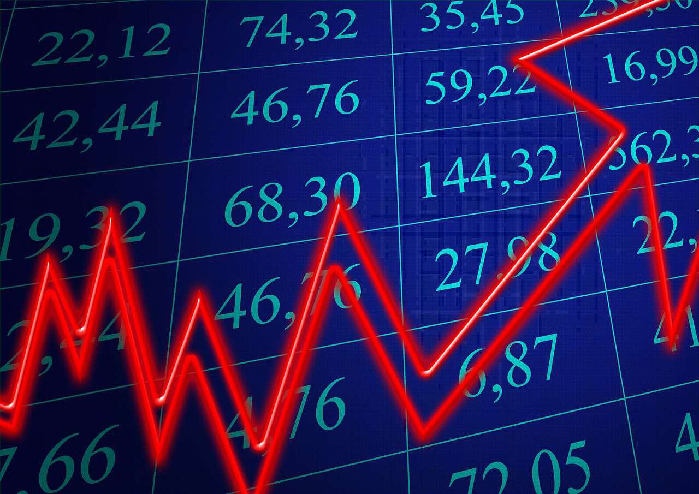

Economic systems fundamentally shape societies around the globe, influencing production, distribution, and consumption within various contexts. As these systems evolve, there is a mounting recognition of the necessity for sustainable practices to preserve ecological health while maintaining economic stability. This growing awareness is prompting a reevaluation of traditional economic models, which have predominantly prioritized growth indicators like Gross Domestic Product (GDP) without adequately considering environmental impacts.

Emerging concepts such as sustainable economics and steady-state economies are gaining attention as viable alternatives that aim to balance economic activity with ecological integrity. Sustainable economics focuses on incorporating environmental considerations into economic decision-making processes, promoting resource efficiency and equitable wealth distribution. The steady-state economy model, on the other hand, seeks an equilibrium between consumption and resource regeneration, prioritizing long-term sustainability over short-term gains.

Additionally, the advent of algorithmic trading represents a significant transformation within financial markets. By employing advanced algorithms to execute trades rapidly and efficiently, these systems exemplify a shift towards more integrated and technologically driven financial operations. While offering potential efficiencies, algorithmic trading also raises questions about equitability and the role of technology in sustainable economic practices.

Understanding how economies can effectively integrate growth with environmental preservation is crucial. By recognizing the limitations of conventional growth metrics, there is an opportunity to advocate for models that support both economic stability and ecological balance. Discussing the implications of algorithmic trading highlights its dual potential to either advance or hinder sustainable economic practices, depending on its application within market structures.

In summary, this article explores the intersection of economic systems and sustainability, emphasizing the need for innovative approaches that respect ecological boundaries. It also considers the role of technological advancements like algorithmic trading, urging a thoughtful application to achieve a more balanced and sustainable economic future. This ongoing dialogue underscores the importance of aligning economic growth with environmental stewardship to ensure the health and well-being of both current and future generations.

## Table of Contents

## Understanding Economic Systems

An economic system is the organizational framework through which a society manages its production, distribution, and consumption of goods and services. Historically, the prevailing systems have been focused on quantifiable growth metrics, such as Gross Domestic Product (GDP), which measures the market value of all final goods and services produced in a country within a given period. This growth-centric model has traditionally been valued for its ability to indicate economic health and progress. However, this model often overlooks the environmental costs and resource limitations inherent in continuous expansion.

Emerging concerns about environmental degradation and finite natural resources necessitate a paradigm shift towards economic sustainability. The traditional growth-oriented economic approach often fails to account for the ecological damage caused by relentless consumption and production. For instance, economic activities might contribute to deforestation, biodiversity loss, and heightened carbon emissions. These consequences highlight the urgent need for integrating ecological considerations into economic planning to ensure long-term viability.

Sustainable economic systems emphasize maintaining ecological balance and achieving economic stability rather than simply pursuing growth. Unlike traditional systems, these alternatives prioritize resource efficiency, minimize environmental impact, and seek equitable distribution of wealth. Sustainable economics is gaining traction as scholars and policymakers recognize the unsustainable trajectory of traditional economic growth.

A key principle differentiating sustainable economics from traditional models is its emphasis on maintaining ecological integrity. This involves implementing practices that do not deplete natural resources faster than they can be replenished, thus ensuring the longevity and resilience of ecosystems. Additionally, sustainable economic systems advocate for a more equitable distribution of resources to reduce disparities and improve overall societal welfare.

The transition towards sustainable economics involves reevaluating core principles that govern economic operations. Concepts like the circular economy, which focuses on reusing and recycling resources to create closed-loop systems, are being explored as viable alternatives to linear, wasteful models. By adopting practices that prioritize sustainability, economies can address contemporary environmental challenges while fostering innovation and economic inclusion.

In conclusion, understanding economic systems through the lens of sustainability involves redefining success beyond mere growth metrics like GDP. It requires a comprehensive assessment of how economic activities impact the environment and society at large. By embracing sustainable alternatives, societies can work towards dynamic systems that balance economic needs with the planet's ecological capacity, ensuring prosperity for future generations.

## Sustainable Economics: A Path Forward

Sustainable economics is a comprehensive approach that emphasizes the integration of environmental considerations into economic systems. This approach seeks to balance economic activity with ecological limits, ensuring that the resources used today are available for future generations. The idea is to promote responsible resource use while enhancing human well-being, aligning economic incentives with environmental stewardship.

One of the fundamental principles of sustainable economics is resource efficiency. This concept involves maximizing the output from a given set of inputs, thereby reducing waste and conserving resources. For example, in energy production, transitioning from fossil fuels to renewable energy sources like wind and solar power can significantly reduce carbon emissions while maintaining economic productivity. According to the International Renewable Energy Agency (IRENA), renewable energy has become increasingly cost-competitive, with the cost of solar photovoltaics dropping by 82% since 2010 [[1](https://www.irena.org/costs)]. This shift not only addresses climate change but also promotes economic stability by reducing dependency on finite resources.

Equitable wealth distribution is another crucial aspect, ensuring that economic benefits are fairly distributed among all members of society. Sustainable economic models advocate for policies that reduce inequality, such as progressive taxation and social welfare programs. These measures aim to mitigate the wealth gap and provide equal opportunities for all individuals. The United Nations' Sustainable Development Goals (SDGs) explicitly include reducing inequality within and among countries as a key objective [[2](https://sdgs.un.org/goals)].

Implementing sustainable economic principles often involves redesigning existing economic models. Traditional models prioritizing Gross Domestic Product (GDP) growth must evolve to consider environmental and social indicators. One such model is the Genuine Progress Indicator (GPI), which adjusts economic activity metrics by accounting for environmental degradation and social factors. By integrating these additional dimensions, the GPI provides a more holistic view of societal progress and well-being.

Furthermore, businesses play a pivotal role in adopting sustainable economic practices. Corporate social responsibility (CSR) initiatives encourage companies to consider the social and environmental impacts of their operations. This might involve reducing waste through circular economy practices, where products are designed for reuse, repair, and recycling, thereby minimizing resource extraction and waste [[3](https://ellenmacarthurfoundation.org/topics/circular-economy-introduction/overview)].

In conclusion, sustainable economics requires a shift from traditional growth-focused models to ones that prioritize ecological balance and social equity. By enhancing resource efficiency and promoting equitable wealth distribution, sustainable economic practices lay the groundwork for a more resilient and fair global economy.

References:
1. International Renewable Energy Agency (IRENA). (n.d.). "Costs". Retrieved from [IRENA website](https://www.irena.org/costs).
2. United Nations. (n.d.). "Sustainable Development Goals". Retrieved from [UN SDGs website](https://sdgs.un.org/goals).
3. Ellen MacArthur Foundation. (n.d.). "Circular economy introduction". Retrieved from [Ellen MacArthur Foundation website](https://ellenmacarthurfoundation.org/topics/circular-economy-introduction/overview).

## The Steady-State Economy Model

A steady-state economy focuses on achieving a balance between economic activities and ecological sustainability, recognizing the earth's finite resources and ecological limits. This model diverges from traditional economic growth paradigms by prioritizing environmental health and resource equity over continuous expansion. Central to the steady-state economy is the idea that infinite growth is not feasible on a planet with limited resources, a notion popularized by ecological economist Herman Daly.

**Key Features of a Steady-State Economy**

A steady-state economy aims to maintain stable or mildly fluctuating levels of economic activity. This involves regulating throughput—the flow of materials and energy that sustains the economy—such that it remains within the earth’s ecological capacity. The following outlines the primary characteristics that differentiate a steady-state economy from traditional growth-centric models:

1. **Stable Population and Consumption Levels**: A steady-state economy encourages maintaining a balance between birth and death rates as well as an equilibrium in consumption habits. This stability in population and consumption is essential to limit the ecological footprint and manage the depletion of natural resources. 

2. **Equitable Resource Distribution**: While traditional economies often result in significant wealth disparities, a steady-state economy promotes equitable distribution of resources. This focus on equity helps reduce poverty and improve living standards sustainably without over-reliance on economic growth as a solution to social inequities.

3. **Resource Efficiency and Technological Innovation**: The model advocates for maximizing resource efficiency and implementing technologies that reduce waste and enhance sustainability. This includes investing in renewable energy sources and fostering innovations that support circular economies where waste is minimized, and materials are reused.

4. **Monetary and Fiscal Policies Aligned with Ecological Goals**: In contrast to conventional fiscal policies that prioritize GDP growth, a steady-state economy employs policies that align with ecological targets. This could involve taxing resource use rather than income, and using the revenue to support sustainable practices and social equity.

**Differences from Traditional Economic Models**

Unlike traditional economic models that prioritize GDP growth as the primary indicator of economic health, a steady-state economy decouples economic success from growth metrics. It focuses on qualitative development—such as improvements in education, healthcare, and environmental quality—over quantitative expansion. By doing so, it challenges the conventional paradigm that associates progress with increased consumption and production.

**Potential Benefits of a Steady-State Economy**

Adopting a steady-state economic model offers several benefits:

- **Environmental Preservation**: By keeping resource use within ecological limits, a steady-state economy supports the conservation of biodiversity and mitigates climate change impacts.

- **Resilience Against Economic and Ecological Shocks**: With its focus on stability, this model can enhance the economy's resilience to both financial crises and environmental disruptions.

- **Social Well-being**: By prioritizing equitable distribution of resources, a steady-state economy can improve overall social welfare and reduce inequalities.

In conclusion, a steady-state economy represents a fundamental shift from the growth-driven objectives of traditional economic models towards a sustainable, equitable, and environmentally-conscious approach. Its implementation, while challenging, offers a viable pathway to a future that respects both human needs and planetary boundaries.

## Algorithmic Trading in Modern Economics

Algorithmic trading, a prominent innovation in financial markets, leverages sophisticated algorithms and computer systems to automate and execute trading decisions. This technology fundamentally alters how trades are conducted, offering increased speed and efficiency. At its core, [algorithmic trading](/wiki/algorithmic-trading) employs predefined rules and algorithms that consider factors such as timing, price, and [volume](/wiki/volume-trading-strategy) to execute large volumes of trades far more swiftly than a human trader could manage.

One of the primary benefits of algorithmic trading is the ability to capitalize on market opportunities within milliseconds, a capability that is particularly beneficial in high-frequency trading ([HFT](/wiki/high-frequency-trading-strategies)). This increased efficiency leads to improved [liquidity](/wiki/liquidity-risk-premium) in the markets, narrower spreads, and reduced transaction costs. However, it also presents significant challenges for market equitability. The accessibility and sophistication of algorithmic tools can create disparities between large, technologically advanced traders and smaller market participants, potentially exacerbating inequalities in market access and influence.

Moreover, algorithmic trading raises concerns regarding market stability. Events such as the "Flash Crash" of May 6, 2010, where the Dow Jones Industrial Average plummeted nearly 1,000 points within minutes, illustrate how the rapid execution of algorithmic trades can trigger cascading effects in financial markets. These incidents underline the importance of robust regulatory frameworks to monitor and manage the activities of algorithmic traders, ensuring they do not undermine market integrity.

In terms of sustainability, algorithmic trading poses both opportunities and challenges. On one hand, the efficiency gains from automated trading systems can contribute to a reduction in the overall resource consumption associated with trading activities, aligning with sustainable economic practices. On the other hand, the competitive edge sought through these systems often leads to technological arms races, where financial firms continually invest in data centers and computational power, potentially increasing their carbon footprints.

The role of algorithmic trading in promoting sustainable economic practices largely hinges on how these systems are integrated and regulated. If leveraged responsibly, they can support economic stability by enhancing market efficiency and liquidity. Nonetheless, careful consideration of their environmental impact and the implementation of appropriate regulatory measures are essential to ensure these technological advancements contribute positively to the broader goals of sustainable economics. These measures could include promoting transparency in algorithmic strategies, implementing safeguards to mitigate systemic risks, and encouraging financial institutions to optimize the energy efficiency of their trading infrastructure.

## Balancing Growth with Environmental Integrity

Balancing economic growth with environmental integrity is both a challenge and a necessity in contemporary economic discourse. Economic expansion, when guided by sustainable principles, can coexist with ecological preservation. This synergy is indispensable in pursuing a future where human needs are met without depleting natural resources or causing irreversible environmental harm.

Economic systems that prioritize sustainability employ strategies that consider long-term ecological health. Sustainable economics is characterized by responsible resource management, emissions reductions, and the promotion of renewable energies. By focusing on innovations that align with these priorities, economies can evolve in a manner that supports growth while maintaining environmental integrity. For instance, the transition from fossil fuels to renewable energy sources not only reduces carbon footprints but also stimulates new markets and job creation in green technology sectors.

Technology plays a pivotal role in this transition. One example is algorithmic trading, which, through advanced computational techniques, optimizes the execution of financial transactions. These algorithms can be designed to support sustainable practices by prioritizing investments in environmentally responsible companies or projects. By incorporating environmental, social, and governance ([ESG](/wiki/esg-investing)) criteria into trading algorithms, financial institutions can guide capital towards more sustainable ventures. This alignment of economic incentives with ecological goals not only enhances market efficiency but also encourages businesses to adopt sustainable practices.

The integration of sustainable economics with technology like algorithmic trading requires collaboration between policymakers, financial institutions, and technology developers. Policymakers can incentivize sustainable investments through regulations and tax benefits, creating a framework that encourages companies and investors to prioritize sustainability. Financial institutions can harness this framework by developing innovative financial products that appeal to environmentally conscious investors.

The successful balance of growth with environmental integrity requires a shift in perspective from short-term profit maximization to long-term sustainability. This change necessitates widespread cooperation and a commitment to continuous innovation. As economies adapt to sustainable practices, they must ensure that growth benefits are equitably distributed across society, reflecting a genuine balance of ecological preservation and human prosperity.

## Challenges and Opportunities for Implementation

Transitioning toward sustainable economic models and incorporating algorithmic trading are met with several challenges that need careful consideration. Policy resistance is a significant hurdle, as existing regulations are often designed to support traditional economic activities and not the innovative practices emphasized in sustainable models. For instance, current economic policies might prioritize short-term growth indicators, such as GDP, over long-term ecological and economic stability. This inertia in established systems can make it difficult to implement new models like a steady-state economy, which requires a paradigm shift away from perpetual growth to sustainable equilibrium.

Another challenge is the vested interest of powerful stakeholders who benefit from the status quo. Industries reliant on resource exploitation might resist changes due to potential short-term losses, despite the long-term benefits of sustainable practices. Moreover, algorithmic trading introduces complexities around market regulation and equitable access. Ensuring that these advanced trading technologies do not exacerbate market inequalities or lead to destabilizing speculative behaviors requires robust oversight and adaptability within financial regulatory frameworks.

Despite these challenges, there are also significant opportunities presented by the transition to sustainable economic models and the integration of algorithmic trading. This shift can drive innovation, creating new industries and job opportunities in sectors focused on sustainable technologies and services. For instance, the rise of green technologies and renewable energy resources can spur economic activity while reducing the ecological footprint. Moreover, algorithmic trading, if integrated with sustainability criteria, can lead to more efficient markets that internalize ecological costs, promoting investments in sustainable ventures.

Global cooperation represents another opportunity, as sustainability challenges do not recognize national boundaries. By aligning policies and practices internationally, countries can support each other in achieving sustainable economic goals. Initiatives like the Paris Agreement exemplify how collaborative frameworks can foster environmental and economic sustainability.

Success stories can be seen in regions like Denmark, which has successfully implemented wind energy technologies to transition towards a more sustainable economy, creating numerous jobs in the process. Similarly, Sweden's incorporation of sustainability metrics into national accounting systems offers a model for other nations aiming to [factor](/wiki/factor-investing) ecological impacts into economic planning.

In the financial sector, certain exchanges globally are beginning to integrate sustainability assessments into their trading algorithms, making strides towards a more conscientious financial environment. These examples underline that while challenges exist, the opportunities for transforming economic systems to align with sustainability are vast and achievable with concerted effort and innovation.

## Conclusion

Sustainable economics, steady-state economies, and algorithmic trading each embody a fundamental evolution in our understanding of economic growth and stability. The transition from traditional growth-centric models to those acknowledging ecological limits underscores a critical recognition: infinite growth on a finite planet is an unsustainable path. As these economic paradigms shift, integrating sustainable practices necessitates a comprehensive approach that respects ecological boundaries while embracing technological advancements.

Achieving a globally sustainable economy requires prioritizing ecological resilience alongside economic prosperity. This involves implementing economic models that harmonize environmental and human needs, fostering a balance that does not compromise future generations' ability to meet their own needs. Steady-state economies advocate for such equilibrium, focusing on resource efficiency and equitable wealth distribution rather than incessant expansion. The challenge lies in redefining success, moving away from traditional metrics like GDP towards indicators that account for ecological health and social well-being.

Algorithmic trading, characterized by the reliance on advanced algorithms and high-speed data processing, provides innovative pathways to implement these principles in financial markets. While it offers efficiencies, such as reduced transaction costs and increased liquidity, its role in promoting sustainable economic practices hinges on ethical and equitable integration. Harnessing the power of algorithms responsibly can potentially align financial operations with sustainability goals, ensuring that technological progress does not exacerbate social inequalities or environmental degradation.

To navigate the complexities of merging sustainable economics, steady-state principles, and algorithmic trading, ongoing dialogue and innovation are essential. Policymakers, economists, technologists, and environmentalists must collaborate to develop frameworks that facilitate this integration. This multidisciplinary effort should focus on creating policies that incentivize sustainable practices, investing in technologies that enhance economic and environmental efficiencies, and educating stakeholders about the benefits of a sustainable economic model.

In conclusion, the transformation towards a sustainable global economy is a multifaceted journey requiring concerted efforts across sectors. By respecting ecological limits and leveraging technology responsibly, the vision of an economically stable and environmentally balanced future becomes attainable. Continued exploration and adaptation are required to ensure that the integration of these concepts fosters enduring economic health and environmental sustainability.

## References & Further Reading

[1]: Daly, H.E. (1991). ["Steady-State Economics: Second Edition With New Essays."](https://www.jstor.org/stable/469394) Island Press.

[2]: Jackson, T. (2009). ["Prosperity Without Growth: Economics for a Finite Planet."](https://www.taylorfrancis.com/books/mono/10.4324/9781849774338/prosperity-without-growth-tim-jackson) Routledge.

[3]: Barkawi, A., & Monkelbaan, J. (2019). ["Sustainability in financial markets: Taking stock and looking ahead."](https://www.researchgate.net/publication/325768377_Governance_for_the_Sustainable_Development_Goals_Exploring_an_Integrative_Framework_of_Theories_Tools_and_Competencies) International Institute for Sustainable Development.

[4]: Gjerstad, S., & Phillips, C. (2014). ["Rethinking Macroeconomics."](https://www.researchgate.net/publication/287713261_Rethinking_Housing_Bubbles_The_Role_of_Household_and_Bank_Balance_Sheets_in_Modeling_Economic_Cycles_Steven_D_Gjerstad_Vernon_L_Smith_Cambridge_University_Press_2014_308_pp_Hardcover_ISBN_978-0-521-19) Oxford University Press.

[5]: Stiglitz, J. E., Sen, A., & Fitoussi, J. P. (2010). ["Mismeasuring Our Lives: Why GDP Doesn't Add Up."](https://www.wcfia.harvard.edu/publications/mismeasuring-our-lives-why-gdp-doesnt-add) The New Press.

[6]: Mishkin, F. S., & Eakins, S. G. (2015). ["Financial Markets and Institutions."](https://books.google.com/books/about/Financial_Markets_and_Institutions_Globa.html?id=PPJFDwAAQBAJ) Pearson.

[7]: Ellen MacArthur Foundation. ["Circular Economy Introduction."](https://ellenmacarthurfoundation.org/topics/circular-economy-introduction/overview?gad_source=1) Ellen MacArthur Foundation. 

[8]: International Renewable Energy Agency (IRENA). ["Costs."](https://www.irena.org/Publications/2023/Aug/Renewable-power-generation-costs-in-2022) IRENA. 

[9]: United Nations. ["Sustainable Development Goals."](https://sdgs.un.org/goals) UN SDGs. 