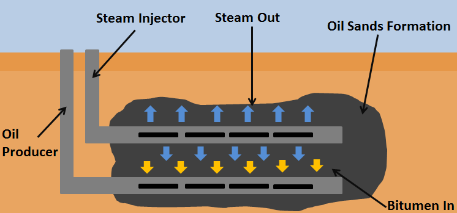

## Table of Contents

## What is Steam-Assisted Gravity Drainage (SAGD)?

Steam-Assisted Gravity Drainage, or SAGD, is a method used to get oil out of the ground, especially from heavy oil or bitumen deposits. It involves drilling two horizontal wells into the ground, one above the other. The top well is used to inject steam into the oil sands. The heat from the steam makes the thick oil less thick, so it can flow more easily.

Once the oil is less thick, it starts to flow down by gravity to the lower well. The lower well then collects the oil and brings it up to the surface. This method is very useful because it can recover a lot of the oil that is hard to get out using other methods. It's commonly used in places like Canada, where there are big deposits of oil sands.

## How does SAGD work to extract heavy oil?

Steam-Assisted Gravity Drainage, or SAGD, is a way to get heavy oil out of the ground. It uses two wells that are drilled horizontally into the oil sands. One well is placed above the other. The top well is used to send steam down into the ground. The steam heats up the heavy oil, making it less thick and more like liquid.

Once the oil is heated and becomes less thick, it starts to flow downwards because of gravity. The oil flows down to the lower well, which is placed right underneath the top well. The lower well then collects the oil and brings it up to the surface. This method is good because it can get a lot of the heavy oil out of the ground that is hard to get with other methods.

## What are the main components of a SAGD system?

A SAGD system has two main parts: the steam injection well and the production well. The steam injection well is drilled horizontally into the oil sands. It sends steam down into the ground to heat up the heavy oil. The heat makes the oil less thick and more like a liquid that can move. The production well is also drilled horizontally but it is placed right below the steam injection well. It collects the oil that has been heated and made less thick by the steam. The oil flows down into the production well because of gravity.

These two wells work together to get the heavy oil out of the ground. The steam injection well heats the oil, and the production well collects it. This system is good because it can get a lot of the heavy oil out of the ground that is hard to get with other methods. It is often used in places like Canada where there are big deposits of oil sands.

## What are the advantages of using SAGD for oil extraction?

SAGD is a good way to get heavy oil out of the ground because it can get a lot of the oil that other methods can't. The steam heats the oil and makes it less thick, so more of it can flow into the production well. This means that SAGD can get more oil out of the ground compared to other methods. This is important because heavy oil and bitumen are hard to get out of the ground, and SAGD helps to make it easier.

Another advantage of SAGD is that it can be used in places where the oil is deep underground. The horizontal wells can reach far into the ground, so SAGD can be used to get oil that is too deep for other methods. This makes SAGD a useful tool for getting oil out of the ground in places like Canada, where there are big deposits of oil sands.

## What are the environmental impacts of SAGD?

SAGD can have some effects on the environment. One big effect is that it uses a lot of water to make the steam that goes into the ground. The water is usually taken from rivers or lakes, which can change the water levels and affect the animals and plants that live there. Also, after the steam is used, it turns into water again and comes back up to the surface with the oil. This water can have chemicals in it that need to be cleaned up before it can be put back into the environment.

Another effect of SAGD is that it uses a lot of energy to heat up the water and make steam. This energy often comes from burning natural gas, which puts greenhouse gases into the air. These gases can make the Earth warmer, which is called climate change. Climate change can cause problems like melting ice, rising sea levels, and more extreme weather. So, while SAGD helps to get more oil out of the ground, it also has some effects on the environment that need to be thought about.

## How does SAGD compare to other methods of oil extraction?

SAGD is different from other ways of getting oil out of the ground because it works well for heavy oil and bitumen. Other methods, like mining or using solvents, might not be as good at getting this kind of oil out. SAGD uses steam to heat the oil and make it flow better, which means it can get more oil out of the ground than other methods. This is important because heavy oil is hard to get, and SAGD helps to make it easier.

But SAGD also has some downsides compared to other methods. It uses a lot of water and energy, which can be bad for the environment. For example, the water used to make steam can affect rivers and lakes, and the energy used often comes from burning natural gas, which puts greenhouse gases into the air. Other methods, like mining, might use less water and energy, but they can also cause more direct harm to the land. So, while SAGD is good at getting heavy oil out of the ground, it's important to think about its effects on the environment too.

## What are the challenges and limitations of implementing SAGD?

SAGD can be hard to use because it needs a lot of water and energy. The water is used to make steam, which is sent into the ground to heat up the heavy oil. This can be a problem because the water often comes from rivers or lakes, and taking too much water can hurt the plants and animals that live there. Also, the steam turns back into water and comes up with the oil, and this water can have chemicals in it that need to be cleaned up before it can be put back into the environment. Cleaning up this water can be expensive and hard to do.

Another challenge with SAGD is that it uses a lot of energy to make the steam. This energy usually comes from burning natural gas, which puts greenhouse gases into the air. These gases can make the Earth warmer, which is called climate change. Climate change can cause problems like melting ice, rising sea levels, and more extreme weather. So, while SAGD is good at getting heavy oil out of the ground, it also has some effects on the environment that need to be thought about.

Lastly, SAGD can be hard to use in some places because the oil might be too deep or the ground might be too hard to drill into. The horizontal wells need to be placed just right, and if the oil is too deep or the ground is too hard, it can be difficult to get the wells in the right place. This can make SAGD more expensive and harder to do in some areas.

## How has SAGD technology evolved over time?

SAGD technology has changed a lot over time to make it better at getting heavy oil out of the ground. When it first started, people used simple ways to drill the wells and make the steam. But now, they use new tools and ways to drill the wells more easily and quickly. They also use better ways to make the steam, like using less water and energy. These changes help to make SAGD work better and be less bad for the environment.

One big change in SAGD technology is using new ways to control the steam and the oil. People now use computers and special sensors to watch the steam and the oil as it moves through the ground. This helps them to use the right amount of steam and get more oil out. They also use new ways to clean up the water that comes back up with the oil, so it can be put back into the environment without hurting it. These changes have made SAGD a better way to get heavy oil out of the ground, but there are still things to work on to make it even better.

## What are the economic considerations of using SAGD?

Using SAGD to get heavy oil out of the ground can be good for the economy because it can get a lot of oil that other ways can't. This means more oil can be sold, which can make more money for the companies and the people who work for them. It can also help to create jobs in places where the oil is being taken out of the ground, like in Canada where there are big oil sands. More jobs can help the local economy grow and give people more money to spend.

But SAGD can also be expensive to use. It needs a lot of water and energy to make the steam, and these things can cost a lot of money. The water and energy can also be hard to get in some places, which can make SAGD even more expensive. There is also the cost of cleaning up the water that comes back up with the oil, which can be hard and expensive to do. So, while SAGD can help to get more oil out of the ground and make more money, it also has some costs that need to be thought about.

## Can you explain the role of steam chambers in SAGD?

Steam chambers are a big part of how SAGD works to get heavy oil out of the ground. In SAGD, steam is sent into the ground through the top well. The steam makes a big space in the ground called a steam chamber. The heat from the steam makes the heavy oil less thick, so it can flow more easily. The steam chamber grows bigger as more steam is sent into the ground, and it helps to heat up more of the oil around it.

As the steam chamber gets bigger, the oil that has been made less thick by the heat starts to flow down to the bottom well because of gravity. The bottom well collects the oil and brings it up to the surface. The steam chamber is important because it helps to heat up a lot of the oil at once, so more oil can be collected. This makes SAGD a good way to get heavy oil out of the ground.

## What research is being conducted to improve SAGD efficiency?

Scientists and engineers are working hard to make SAGD better at getting heavy oil out of the ground. They are trying to find ways to use less water and energy to make the steam. This is important because using less water and energy can help to make SAGD less bad for the environment and cheaper to use. One way they are doing this is by using new tools and computers to watch the steam and the oil as it moves through the ground. This helps them to use just the right amount of steam, so they don't waste any.

Another thing researchers are looking at is how to make the steam chambers work better. They are trying to find ways to make the steam chambers grow faster and heat up more of the oil. This can help to get more oil out of the ground in less time. They are also working on new ways to clean up the water that comes back up with the oil. This is important because it can help to put the water back into the environment without hurting it. All of these things can help to make SAGD a better way to get heavy oil out of the ground.

## How is SAGD being used globally and what are the future prospects?

SAGD is mostly used in Canada, where there are big deposits of oil sands. It's a good way to get heavy oil out of the ground there because it can get a lot of oil that other ways can't. But SAGD is also starting to be used in other places around the world, like in the United States and Venezuela, where there are also heavy oil deposits. These places are looking at SAGD because it can help them to get more oil out of the ground and make more money.

The future of SAGD looks good because people are working hard to make it better. Scientists and engineers are trying to find ways to use less water and energy to make the steam, which can help to make SAGD less bad for the environment and cheaper to use. They are also working on new tools and computers to watch the steam and the oil as it moves through the ground, so they can use just the right amount of steam. All of these things can help to make SAGD a better way to get heavy oil out of the ground in the future.

## References & Further Reading

[1]: Garmeh, G., & Chen, Z. (2010). ["A review of steam-assisted gravity drainage system: Simulation studies."](https://www.sciencedirect.com/science/article/pii/S0920410518303735) Society of Petroleum Engineers.

[2]: Butler, R. M. (1998). ["Steam-Assisted Gravity Drainage: Concept, Development, Performance and Future."](https://onepetro.org/JCPT/article/33/02/44/31947/Steam-Assisted-Gravity-Drainage-Concept) Journal of Canadian Petroleum Technology, 36(07).

[3]: Chavez-Rodriguez, M. F., & Reyes-Labarta, J. A. (2020). ["Current Advances in the Steam-Assisted Gravity Drainage (SAGD) Technology: A Review."](https://www.sciencedirect.com/science/article/abs/pii/S0032386106011037) Energies, 13(4), 893.

[4]: Fabozzi, F. J., Focardi, S. M., & Kolm, P. N. (2010). ["Quantitative Equity Investing: Techniques and Strategies."](https://www.semanticscholar.org/paper/Quantitative-Equity-Investing%3A-Techniques-and-Fabozzi-Focardi/1c49a2a53919f7e65cb96f16691b8ff726fd3cd7) Wiley.

[5]: Vats, T. (2019). ["Algorithmic trading: A method for managing risk and optimizing trading strategies."](https://www.researchgate.net/publication/383201516_Algorithmic_trading_and_machine_learning_Advanced_techniques_for_market_prediction_and_strategy_development) Computational Economics, 54(3), 943-958.